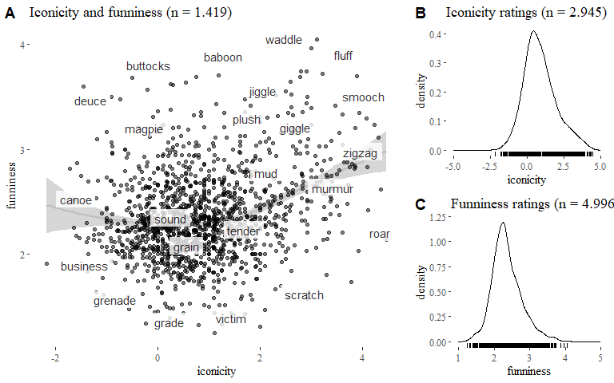

# Playful iconicity
* Mark Dingemanse, Centre for Language Studies, Radboud University (corresponding author)
* Bill D. Thompson, Princeton University

Open data, analyses & supplementary materials for a paper on the relation between funniness and iconicity.

## Script files 

Main analyses:
* [playful_iconicity_paper.md](playful_iconicity_paper.md) : contains all analyses

Subsidiary Python scripts:
* [expand-intersection.py](expand-intersection.py) : expands intersection between norm sets
* [benchmark-prediction.py](benchmark-prediction.py) : benchmarks predictions
* [tag-letter-entropy.py](tag-letter-entropy.py) : computes letter entropy
* [impute-from-monomorphemic.py](impute-from-monomorphemic.py) : imputes norms from just monomorphemic words

## Data files 
* [experimental-and-imputed-norms-for-funniness-iconicity-logletterfreq.csv](data/experimental-and-imputed-norms-for-funniness-iconicity-logletterfreq.csv): main data file
* other files in [data](/data) as referenced in [the main analyses](playful_iconicity_paper.md)

## Used packages
The most crucial packages in our pipeline are `tidyverse`, `stringr`, `ggplot2`, `ppcor`, and `car`; full list is [here](playful_iconicity_paper.md).
