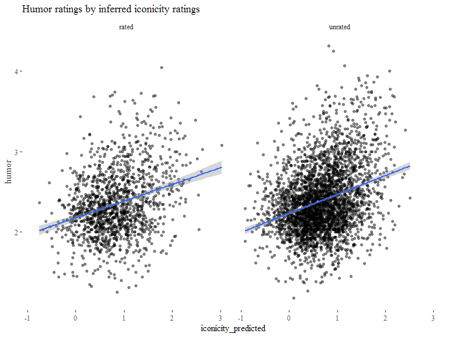

Playful iconicity: relating iconicity and humor ratings for English words
================
Mark Dingemanse
Updated 2017-08-17

People have feelings about the funniness of words. They can express these feelings in terms of word-level ratings. In a recent set of word-level norms, Engelthaler & Hills 2017 claim that these ratings are "not well predicted by existing norms". The highest correlations they find are between humor ~ frequency and humour ~ lexical decision RT.

However, humor ratings do not occur in a vacuum: presumably subjects are using some information when judging how funny a word is. The most directly available information would be the phonological form of the word and the relation it presents between form and meaning. This leads to the prediction that measures that tap into that should correlate with humor ratings. Here we test the prediction that *iconicity ratings will be positively correlated with humor ratings, controlling for frequency.*

The theoretical interest here is that people working on iconic words have long drawn attention to their expressive and playful nature. According to Fortune (1960), ideophones "bring a sense of ease and mirth". Welmers (1973) defines them as "those words which are such fun to use" and Samarin (1970) notes that ideophones "display a great deal of play with sounds". In my own fieldwork, I noted that "Mawu children may tease the white researcher living in their village by imitating his way of walking and by singing a song mocking his red skin (pɛ̃ɛ̃), small eyes (tsiritsiri), and pointy nose (miɔmiɔ) — all ideophones" (Dingemanse 2011:83).

If there is indeed a link between iconicity and the subjective funnyness of words, this solidifies a relationship that has has so far been based mainly on anecdotal observations and studies of relatively small numbers of words.

Outliers (words where ratings disagree most) help to discover other features at play. E.g. 'blonde' is in the top 10 percentile of funny words but only in the 2nd percentile of iconicity ratings. Probably related to a genre of jokes. On the other hand, some onomatopoeia are highly iconic but associated with negative rather than with funny events, e.g. 'crash', 'scratch','roar', 'clash', pointing to the importance of valence and arousal more generally.

Load data
=========

Data sources: \* Perry, Lynn K. et al. “Iconicity in the Speech of Children and Adults.” Developmental Science, n/a-n/a. <doi:10.1111/desc.12572>. \* Engelthaler, Tomas, and Thomas T. Hills. 2017. “Humor Norms for 4,997 English Words.” Behavior Research Methods, July, 1–9. <doi:10.3758/s13428-017-0930-6>.

Combine humor with predicted iconicity ratings from Bill and frequency / POS data from SUBTLEX

Plots
=====

First eyeball data. Iconicity looks a pretty good predictor in addition to frequency, which was the best predictor according to Engelthaler & Hills (2017). Humor shows a positive correlation with iconicity rating, as predicted. The relation is clearest for iconicity ratings &gt;0. My take on this (based on considerations noted elsewhere) is that the negative iconicity ratings do not capture one thing.

    ## 
    ## Call:
    ## lm(formula = humor ~ freq_log + iconicity, data = df)
    ## 
    ## Residuals:
    ##      Min       1Q   Median       3Q      Max 
    ## -1.25741 -0.23478 -0.03009  0.21646  1.43346 
    ## 
    ## Coefficients:
    ##              Estimate Std. Error t value Pr(>|t|)    
    ## (Intercept)  2.808262   0.039394  71.286  < 2e-16 ***
    ## freq_log    -0.078124   0.005454 -14.323  < 2e-16 ***
    ## iconicity    0.072498   0.009140   7.932 4.34e-15 ***
    ## ---
    ## Signif. codes:  0 '***' 0.001 '**' 0.01 '*' 0.05 '.' 0.1 ' ' 1
    ## 
    ## Residual standard error: 0.3748 on 1416 degrees of freedom
    ## Multiple R-squared:  0.1846, Adjusted R-squared:  0.1835 
    ## F-statistic: 160.3 on 2 and 1416 DF,  p-value: < 2.2e-16

Let's residualise out `log_freq` so we get a better look at the humor ~ iconicity relation; and conversely, residualise `iconicity` to look at humor ~ frequency.

(Is this at all helpful?)

    ## 
    ## Call:
    ## lm(formula = humor ~ freq_log + iconicity, data = df)
    ## 
    ## Residuals:
    ##      Min       1Q   Median       3Q      Max 
    ## -1.25741 -0.23478 -0.03009  0.21646  1.43346 
    ## 
    ## Coefficients:
    ##              Estimate Std. Error t value Pr(>|t|)    
    ## (Intercept)  2.808262   0.039394  71.286  < 2e-16 ***
    ## freq_log    -0.078124   0.005454 -14.323  < 2e-16 ***
    ## iconicity    0.072498   0.009140   7.932 4.34e-15 ***
    ## ---
    ## Signif. codes:  0 '***' 0.001 '**' 0.01 '*' 0.05 '.' 0.1 ' ' 1
    ## 
    ## Residual standard error: 0.3748 on 1416 degrees of freedom
    ## Multiple R-squared:  0.1846, Adjusted R-squared:  0.1835 
    ## F-statistic: 160.3 on 2 and 1416 DF,  p-value: < 2.2e-16

Now look at Bill's predicted iconicity ratings. To avoid double-dipping we tease apart words for which the predictions overlap with the ratings (n=1391) and words for which predictions are newly inferred (n=3242) (encoded in `$set`).

Predicted iconicity values correlate with humor ratings even when controlling for frequency. For every point gained in predicted iconicity there's a .21 increase in humor rating.

    ## 
    ## Call:
    ## lm(formula = humor ~ freq_log + iconicity_predicted, data = df_pred)
    ## 
    ## Residuals:
    ##      Min       1Q   Median       3Q      Max 
    ## -1.18031 -0.25035 -0.03078  0.21508  1.93199 
    ## 
    ## Coefficients:
    ##                      Estimate Std. Error t value Pr(>|t|)    
    ## (Intercept)          2.537225   0.020666  122.78   <2e-16 ***
    ## freq_log            -0.130162   0.007588  -17.15   <2e-16 ***
    ## iconicity_predicted  0.212588   0.010150   20.95   <2e-16 ***
    ## ---
    ## Signif. codes:  0 '***' 0.001 '**' 0.01 '*' 0.05 '.' 0.1 ' ' 1
    ## 
    ## Residual standard error: 0.3849 on 4629 degrees of freedom
    ## Multiple R-squared:  0.1409, Adjusted R-squared:  0.1405 
    ## F-statistic: 379.6 on 2 and 4629 DF,  p-value: < 2.2e-16

 And here too we can residualise out `freq_log` to get a better view of the relation:

    ## 
    ## Call:
    ## lm(formula = humor ~ freq_log + iconicity_predicted, data = df_pred)
    ## 
    ## Residuals:
    ##      Min       1Q   Median       3Q      Max 
    ## -1.18031 -0.25035 -0.03078  0.21508  1.93199 
    ## 
    ## Coefficients:
    ##                      Estimate Std. Error t value Pr(>|t|)    
    ## (Intercept)          2.537225   0.020666  122.78   <2e-16 ***
    ## freq_log            -0.130162   0.007588  -17.15   <2e-16 ***
    ## iconicity_predicted  0.212588   0.010150   20.95   <2e-16 ***
    ## ---
    ## Signif. codes:  0 '***' 0.001 '**' 0.01 '*' 0.05 '.' 0.1 ' ' 1
    ## 
    ## Residual standard error: 0.3849 on 4629 degrees of freedom
    ## Multiple R-squared:  0.1409, Adjusted R-squared:  0.1405 
    ## F-statistic: 379.6 on 2 and 4629 DF,  p-value: < 2.2e-16

Stats
=====

LME with orthographic length as a random effect shows that although log frequency is an important predictor of word funnyness, a model including iconicity in addition to log frequency provides a significantly better fit.

    ## Linear mixed model fit by REML ['lmerMod']
    ## Formula: humor ~ freq_log + (1 | len_ortho)
    ##    Data: df
    ## REML criterion at convergence: 1308.37
    ## Random effects:
    ##  Groups    Name        Std.Dev.
    ##  len_ortho (Intercept) 0.05492 
    ##  Residual              0.38068 
    ## Number of obs: 1419, groups:  len_ortho, 9
    ## Fixed Effects:
    ## (Intercept)     freq_log  
    ##     2.92803     -0.08902

    ## Linear mixed model fit by REML ['lmerMod']
    ## Formula: humor ~ freq_log + iconicity + (1 | len_ortho)
    ##    Data: df
    ## REML criterion at convergence: 1258.057
    ## Random effects:
    ##  Groups    Name        Std.Dev.
    ##  len_ortho (Intercept) 0.04231 
    ##  Residual              0.37337 
    ## Number of obs: 1419, groups:  len_ortho, 9
    ## Fixed Effects:
    ## (Intercept)     freq_log    iconicity  
    ##     2.81278     -0.08007      0.07043

    ## Data: df
    ## Models:
    ## m0: humor ~ freq_log + (1 | len_ortho)
    ## m1: humor ~ freq_log + iconicity + (1 | len_ortho)
    ##    Df    AIC    BIC  logLik deviance  Chisq Chi Df Pr(>Chisq)    
    ## m0  4 1302.2 1323.2 -647.08   1294.2                             
    ## m1  5 1245.8 1272.1 -617.92   1235.8 58.315      1  2.233e-14 ***
    ## ---
    ## Signif. codes:  0 '***' 0.001 '**' 0.01 '*' 0.05 '.' 0.1 ' ' 1

Partial correlations show there is 20.6% covariance between humor and iconicity, partialing out log frequency as a mediator. There is -35.7% covariance between humor and frequency, partialing out iconicity as a mediator (the more frequent a word, the less funny). A -9.5% correlation between iconicity and frequency when partialing out humor. (Winter et al. 2017 report a negative correlation between iconicity and frequency.)

    ##    estimate      p.value statistic    n gp  Method
    ## 1 0.2062649 4.335228e-15  7.932275 1419  1 pearson

    ##    estimate      p.value statistic    n gp  Method
    ## 1 -0.355736 1.480235e-43 -14.32319 1419  1 pearson

    ##      estimate      p.value statistic    n gp  Method
    ## 1 -0.09460514 0.0003606165 -3.576009 1419  1 pearson

Words
=====

Which words are rated as highly funny *and* highly iconic? And what are the most differently rated words?

Let's start by plotting the top ranked words:

    ## # A tibble: 20 x 3
    ##       word    humor iconicity
    ##      <chr>    <dbl>     <dbl>
    ##  1  waddle 4.045455  3.100000
    ##  2  tinkle 3.962963  3.000000
    ##  3    oink 3.871795  3.615385
    ##  4  cuckoo 3.743590  2.900000
    ##  5   snort 3.741935  2.785714
    ##  6   fluff 3.724138  3.214286
    ##  7     moo 3.700000  3.882353
    ##  8   yahoo 3.689655  2.769231
    ##  9  jiggle 3.645161  2.583333
    ## 10     coo 3.551724  2.500000
    ## 11  wiggle 3.523810  2.600000
    ## 12   whiff 3.500000  2.916667
    ## 13   yodel 3.441176  2.900000
    ## 14  squawk 3.418605  3.461538
    ## 15 juggler 3.400000  2.600000
    ## 16  giggle 3.391304  3.000000
    ## 17  bubbly 3.352941  2.818182
    ## 18   clunk 3.344828  3.928571
    ## 19 squeeze 3.344828  2.538462
    ## 20  smooch 3.333333  3.600000

Many highly iconic words are also rated as highly funny. The power of iconic words to evoke colourful imagery (as in waddle, tinkle, oink, fluff, jiggle, smooch) likely plays a major role here. The distribution across the senses is remarkable.

At the same time, there are also quite some cases where the two ratings don't add up:

Among funny words not rated as iconic, there are lots of animals (dingo, panda, lobster, giraffe), some taboo words (hoe, penis), and joke-related words like pun and blonde.

    ## # A tibble: 20 x 3
    ##        word    humor   iconicity
    ##       <chr>    <dbl>       <dbl>
    ##  1    dingo 3.682927 -0.50000000
    ##  2      hoe 3.600000 -1.45454545
    ##  3    penis 3.567568 -0.20000000
    ##  4   gander 3.500000 -0.91666667
    ##  5    deuce 3.475000 -0.73333333
    ##  6    hippo 3.366667  0.00000000
    ##  7    chimp 3.307692 -0.09090909
    ##  8 chipmunk 3.230769  0.10000000
    ##  9   turkey 3.214286  0.06666667
    ## 10      pun 3.210526 -0.37500000
    ## 11      bra 3.166667  0.00000000
    ## 12   tongue 3.166667 -1.00000000
    ## 13   blonde 3.121212 -0.16666667
    ## 14  giraffe 3.096774 -1.19047619
    ## 15   magpie 3.066667 -0.91666667
    ## 16   beaver 3.064516  0.20000000
    ## 17     lark 3.025641 -0.90000000
    ## 18  lobster 3.000000 -0.63636364
    ## 19 trombone 3.000000 -0.63636364
    ## 20   walrus 3.000000  0.18181818

Something related to valence and/or arousal plays the most important role in explaining why some highly iconic words are not rated as funny. Negatively valenced words like 'roar', 'crash', 'clash' and 'scream' may be highly iconic but they have no positive or humorous connotations. So the image-evoking potency of iconic words is not necessary nor sufficient to explain iconicity ratings.

    ## # A tibble: 14 x 3
    ##        word    humor iconicity
    ##       <chr>    <dbl>     <dbl>
    ##  1    click 2.135135  4.461538
    ##  2     roar 2.031250  3.923077
    ##  3    crash 1.731707  3.769231
    ##  4  scratch 1.800000  3.285714
    ##  5    swift 2.135135  3.230769
    ##  6 sunshine 2.064516  3.090909
    ##  7      low 1.575758  2.916667
    ##  8    break 2.034483  2.900000
    ##  9    clash 2.086957  2.666667
    ## 10    shoot 1.838710  2.600000
    ## 11 airplane 2.057143  2.545455
    ## 12    dread 1.583333  2.545455
    ## 13     arch 2.026316  2.500000
    ## 14   scream 1.952381  2.500000

References
==========

-   Dingemanse, Mark. 2011. “Ideophones and the Aesthetics of Everyday Language in a West-African Society.” The Senses and Society 6 (1): 77–85. <doi:10.2752/174589311X12893982233830>.
-   Engelthaler, Tomas, and Thomas T. Hills. 2017. “Humor Norms for 4,997 English Words.” Behavior Research Methods, July, 1–9. <doi:10.3758/s13428-017-0930-6>.
-   Fortune, G. 1962. Ideophones in Shona: An Inaugural Lecture Given in the University College of Rhodesia and Nyasaland on 28 April 1961. London / New York: Oxford University Press.
-   Perry, Lynn K. et al. “Iconicity in the Speech of Children and Adults.” Developmental Science, n/a-n/a. <doi:10.1111/desc.12572>.
-   Samarin, William J. 1970. “Inventory and Choice in Expressive Language.” Word 26: 153–69.
-   Welmers, William E. 1973. African Language Structures. Berkeley: University of California Press.
-   Winter, Bodo et al. 2017. “Which Words Are Most Iconic? Iconicity in English Sensory Words.” Interaction Studies.
