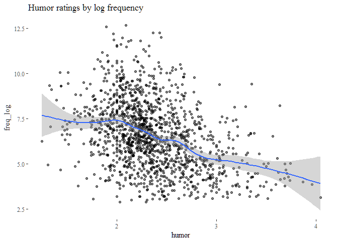
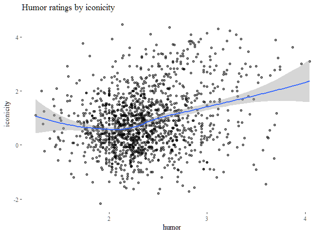
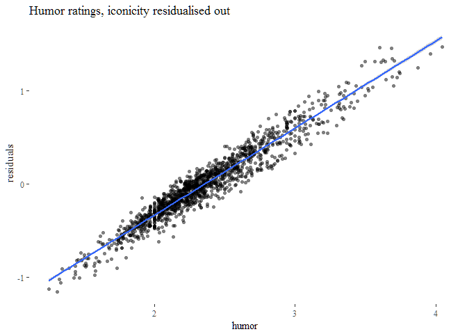
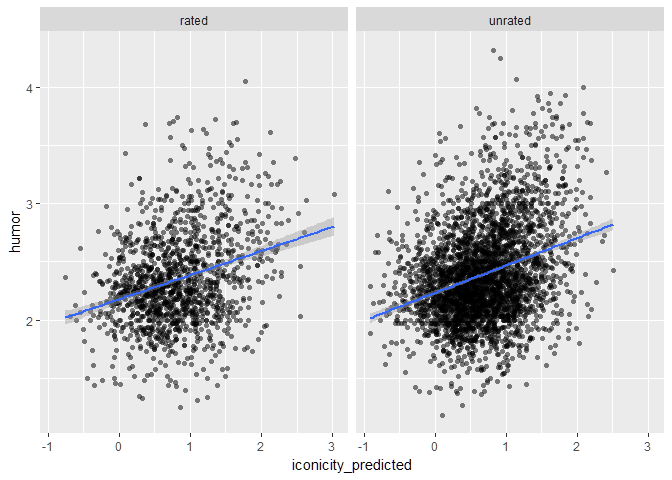
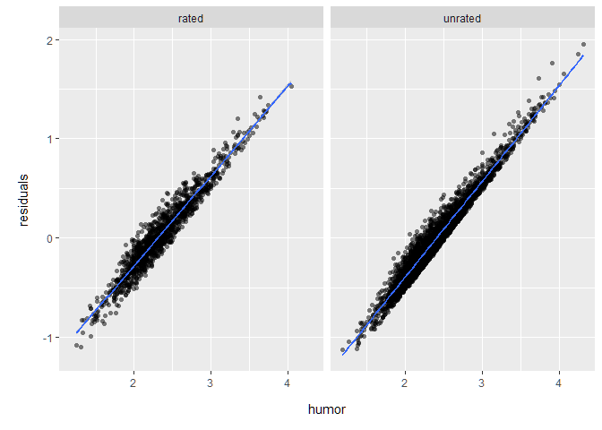

Playful iconicity: relating iconicity and humor ratings for English words
================
Mark Dingemanse
2017-08-17

People have feelings about the funniness of words. They can express these feelings in terms of word-level ratings. In a recent set of word-level norms, Engelthaler & Hills 2017 claim that these ratings are "not well predicted by existing norms". The highest correlations they find are between humor ~ frequency and humour ~ lexical decision RT.

However, humor ratings do not occur in a vacuum: presumably subjects are using some information when judging how funny a word is. The most directly available information would be the phonological form of the word and the relation it presents between form and meaning. This leads to the prediction that measures that tap into that should correlate with humor ratings. Here we test the prediction that *iconicity ratings will be positively correlated with humor ratings, controlling for frequency.*

The theoretical interest here is that people working on iconic words have long drawn attention to their expressive and playful nature. According to Fortune (1960), ideophones "bring a sense of ease and mirth". Welmers (1973) defines them as "those words which are such fun to use" and Samarin (1970) notes that ideophones "display a great deal of play with sounds". In my own fieldwork, I noted that "Mawu children may tease the white researcher living in their village by imitating his way of walking and by singing a song mocking his red skin (pɛ̃ɛ̃), small eyes (tsiritsiri), and pointy nose (miɔmiɔ) — all ideophones" (Dingemanse 2011:83).

If there is indeed a link between iconicity and the subjective funnyness of words, this solidifies a relationship that has has so far been based mainly on anecdotal observations and studies of relatively small numbers of words.

Outliers (words where ratings disagree most) help to discover other features at play. E.g. 'blonde' is in the top 10 percentile of funny words but only in the 2nd percentile of iconicity ratings. Probably related to a genre of jokes. On the other hand, some onomatopoeia are highly iconic but associated with negative rather than with funny events, e.g. 'crash', 'scratch','roar', 'clash', pointing to the importance of valence and arousal more generally.

``` r
# Clear workspace
rm(list=ls())

# check for /in/ and /out/ directories (create them if needed)
add_working_dir <- function(x) { if(file.exists(x)) { cat(x,"dir:",paste0(getwd(),"/",x,"/")) } else { dir.create(paste0(getwd(),"/",x)) 
  cat("subdirectory",x,"created in",getwd()) } }
add_working_dir("in")
```

    ## in dir: D:/Dropbox/Data/R/playful_iconicity/in/

``` r
add_working_dir("out")
```

    ## out dir: D:/Dropbox/Data/R/playful_iconicity/out/

``` r
# Packages and useful functions
list.of.packages <- c("tidyverse","GGally","ggthemes","readxl","lme4","ppcor")
new.packages <- list.of.packages[!(list.of.packages %in% installed.packages()[,"Package"])]
if(length(new.packages)>0) install.packages(new.packages)
lapply(list.of.packages, require, character.only=T)
```

    ## Loading required package: tidyverse

    ## Loading tidyverse: ggplot2
    ## Loading tidyverse: tibble
    ## Loading tidyverse: tidyr
    ## Loading tidyverse: readr
    ## Loading tidyverse: purrr
    ## Loading tidyverse: dplyr

    ## Conflicts with tidy packages ----------------------------------------------

    ## filter(): dplyr, stats
    ## lag():    dplyr, stats

    ## Loading required package: GGally

    ## 
    ## Attaching package: 'GGally'

    ## The following object is masked from 'package:dplyr':
    ## 
    ##     nasa

    ## Loading required package: ggthemes

    ## Loading required package: readxl

    ## Loading required package: lme4

    ## Loading required package: Matrix

    ## 
    ## Attaching package: 'Matrix'

    ## The following object is masked from 'package:tidyr':
    ## 
    ##     expand

    ## Loading required package: ppcor

    ## Loading required package: MASS

    ## 
    ## Attaching package: 'MASS'

    ## The following object is masked from 'package:dplyr':
    ## 
    ##     select

    ## [[1]]
    ## [1] TRUE
    ## 
    ## [[2]]
    ## [1] TRUE
    ## 
    ## [[3]]
    ## [1] TRUE
    ## 
    ## [[4]]
    ## [1] TRUE
    ## 
    ## [[5]]
    ## [1] TRUE
    ## 
    ## [[6]]
    ## [1] TRUE

``` r
rm(list.of.packages,new.packages)

`%notin%` <- function(x,y) !(x %in% y) 
```

Load data
=========

Data sources: \* Perry, Lynn K. et al. “Iconicity in the Speech of Children and Adults.” Developmental Science, n/a-n/a. <doi:10.1111/desc.12572>. \* Engelthaler, Tomas, and Thomas T. Hills. 2017. “Humor Norms for 4,997 English Words.” Behavior Research Methods, July, 1–9. <doi:10.3758/s13428-017-0930-6>.

``` r
iconicity <- read_csv("https://raw.githubusercontent.com/bodowinter/iconicity_acquisition/master/data/iconicity.csv") %>%
  mutate(POS = SUBTLEX_dom_POS) %>%
  plyr::rename(c("Word" = "word","Iconicity"="iconicity","OrthoLength"="len_ortho","SUBTLEX_Rawfreq" = "freq_count"))
```

    ## Parsed with column specification:
    ## cols(
    ##   .default = col_integer(),
    ##   Word = col_character(),
    ##   Iconicity = col_double(),
    ##   ListIdentifier = col_character(),
    ##   KupermanAOA = col_double(),
    ##   SUBTLEX_dom_POS = col_character(),
    ##   SUBTLEX_Percentage_dom_POS = col_character(),
    ##   Conc = col_double()
    ## )

    ## See spec(...) for full column specifications.

``` r
humor <- read_csv("https://raw.githubusercontent.com/tomasengelthaler/HumorNorms/master/humor_dataset.csv") %>%
  plyr::rename(c("mean" = "humor"))
```

    ## Parsed with column specification:
    ## cols(
    ##   word = col_character(),
    ##   mean = col_double(),
    ##   sd = col_double(),
    ##   n = col_integer(),
    ##   mean_M = col_double(),
    ##   sd_M = col_double(),
    ##   n_M = col_integer(),
    ##   mean_F = col_double(),
    ##   sd_F = col_double(),
    ##   n_F = col_integer(),
    ##   mean_young = col_double(),
    ##   sd_young = col_double(),
    ##   n_young = col_integer(),
    ##   mean_old = col_double(),
    ##   sd_old = col_double(),
    ##   n_old = col_integer()
    ## )

``` r
df <- merge(iconicity,humor,by="word") %>%
  drop_na(iconicity,humor,freq_count) %>%
  mutate(freq_log = log(freq_count))

# Combine humor with predicted iconicity ratings from Bill and frequency / POS data from SUBTLEX
p.ico <- read_csv("in/ipennl.csv") %>%
  filter(language=="en") %>%
  dplyr::select(Word,Concreteness,Iconicity_PREDICTED)
```

    ## Parsed with column specification:
    ## cols(
    ##   .default = col_double(),
    ##   Word = col_character(),
    ##   language = col_character()
    ## )
    ## See spec(...) for full column specifications.

``` r
names(p.ico) <- tolower(names(p.ico))

subtlex <- read_excel(path="in/SUBTLEX-US frequency list with PoS and Zipf information.xlsx") %>%
  plyr::rename(c("Word" = "word","FREQcount" = "freq_count","Lg10WF" = "freq_log","Dom_PoS_SUBTLEX" = "POS")) %>%
  dplyr::select(word,freq_log,POS) %>%
  filter(word %in% p.ico$word)

df_pred <- humor %>%
  left_join(p.ico) %>%
  drop_na(humor,iconicity_predicted) %>%
  left_join(df) %>%
  dplyr::select(-POS,-freq_log) %>%
  left_join(subtlex) %>% 
  drop_na(freq_log,POS) %>%
  mutate(set = ifelse(is.na(iconicity),"unrated","rated")) # indicate subsets
```

    ## Joining, by = "word"

    ## Joining, by = c("word", "humor", "sd", "n", "mean_M", "sd_M", "n_M", "mean_F", "sd_F", "n_F", "mean_young", "sd_young", "n_young", "mean_old", "sd_old", "n_old")

    ## Joining, by = "word"

Plots
=====

First eyeball data. Iconicity looks a pretty good predictor in addition to frequency, which was the best predictor according to Engelthaler & Hills (2017). Humor shows a positive correlation with iconicity rating, as predicted. The relation is strongest for iconicity ratings &gt;0, indicating that some anti-iconic words may be moderately more funny (or at least not less funny).

``` r
summary(lm(humor ~ freq_log + iconicity, df))
```

    ## 
    ## Call:
    ## lm(formula = humor ~ freq_log + iconicity, data = df)
    ## 
    ## Residuals:
    ##      Min       1Q   Median       3Q      Max 
    ## -1.25741 -0.23478 -0.03009  0.21646  1.43346 
    ## 
    ## Coefficients:
    ##              Estimate Std. Error t value Pr(>|t|)    
    ## (Intercept)  2.808262   0.039394  71.286  < 2e-16 ***
    ## freq_log    -0.078124   0.005454 -14.323  < 2e-16 ***
    ## iconicity    0.072498   0.009140   7.932 4.34e-15 ***
    ## ---
    ## Signif. codes:  0 '***' 0.001 '**' 0.01 '*' 0.05 '.' 0.1 ' ' 1
    ## 
    ## Residual standard error: 0.3748 on 1416 degrees of freedom
    ## Multiple R-squared:  0.1846, Adjusted R-squared:  0.1835 
    ## F-statistic: 160.3 on 2 and 1416 DF,  p-value: < 2.2e-16

``` r
ggplot(df,aes(humor,freq_log)) +
  theme_tufte() + ggtitle("Humor ratings by log frequency") + 
  geom_point(alpha=0.5) +
  geom_smooth(method="auto")
```

    ## `geom_smooth()` using method = 'gam'



``` r
ggsave(file="out/humor_by_iconicity.png",width=6,height=4)
```

    ## `geom_smooth()` using method = 'gam'

``` r
ggplot(df,aes(humor,iconicity)) +
  theme_tufte() + ggtitle("Humor ratings by iconicity") + 
  geom_point(alpha=0.5) +
  geom_smooth(method="loess")
```



``` r
ggsave(file="out/humor_by_iconicity.png",width=6,height=4)
```

Let's residualise out `log_freq` so we get a better look at the humor ~ iconicity relation; and conversely, residualise `iconicity` to look at humor ~ frequency.

Is that a .07 increase in humor for every +1 in iconicity?

``` r
summary(lm(humor ~ freq_log + iconicity,df))
```

    ## 
    ## Call:
    ## lm(formula = humor ~ freq_log + iconicity, data = df)
    ## 
    ## Residuals:
    ##      Min       1Q   Median       3Q      Max 
    ## -1.25741 -0.23478 -0.03009  0.21646  1.43346 
    ## 
    ## Coefficients:
    ##              Estimate Std. Error t value Pr(>|t|)    
    ## (Intercept)  2.808262   0.039394  71.286  < 2e-16 ***
    ## freq_log    -0.078124   0.005454 -14.323  < 2e-16 ***
    ## iconicity    0.072498   0.009140   7.932 4.34e-15 ***
    ## ---
    ## Signif. codes:  0 '***' 0.001 '**' 0.01 '*' 0.05 '.' 0.1 ' ' 1
    ## 
    ## Residual standard error: 0.3748 on 1416 degrees of freedom
    ## Multiple R-squared:  0.1846, Adjusted R-squared:  0.1835 
    ## F-statistic: 160.3 on 2 and 1416 DF,  p-value: < 2.2e-16

``` r
df$residuals <- residuals(lm(humor ~ freq_log,df))
ggplot(df,aes(humor,residuals)) +
  theme_tufte() + ggtitle("Humor ratings, frequency residualised out") + 
  geom_point(shape=16,alpha=0.5) +
  geom_smooth(method="lm")
```


``` r
ggsave(file="out/humor_residualised_logfreq.png",width=6,height=4)

df$residuals <- residuals(lm(humor ~ iconicity,df))
ggplot(df,aes(humor,residuals)) +
  theme_tufte() + ggtitle("Humor ratings, iconicity residualised out") + 
  geom_point(shape=16,alpha=0.5) +
  geom_smooth(method="lm")
```



``` r
ggsave(file="out/humor_residualised_iconicity.png",width=6,height=4)
```

Now look at Bill's predicted iconicity ratings. To avoid double-dipping we tease apart words for which the predictions overlap with the ratings (n=1391) and words for which predictions are newly inferred (n=3242) (encoded in `$set`).

Predicted iconicity values correlate with humor ratings even when controlling for frequency. For every point gained in predicted iconicity there's a .21 increase in humor rating.

``` r
summary(lm(humor ~ freq_log + iconicity_predicted,df_pred))
```

    ## 
    ## Call:
    ## lm(formula = humor ~ freq_log + iconicity_predicted, data = df_pred)
    ## 
    ## Residuals:
    ##      Min       1Q   Median       3Q      Max 
    ## -1.18031 -0.25035 -0.03078  0.21508  1.93199 
    ## 
    ## Coefficients:
    ##                      Estimate Std. Error t value Pr(>|t|)    
    ## (Intercept)          2.537225   0.020666  122.78   <2e-16 ***
    ## freq_log            -0.130162   0.007588  -17.15   <2e-16 ***
    ## iconicity_predicted  0.212588   0.010150   20.95   <2e-16 ***
    ## ---
    ## Signif. codes:  0 '***' 0.001 '**' 0.01 '*' 0.05 '.' 0.1 ' ' 1
    ## 
    ## Residual standard error: 0.3849 on 4629 degrees of freedom
    ## Multiple R-squared:  0.1409, Adjusted R-squared:  0.1405 
    ## F-statistic: 379.6 on 2 and 4629 DF,  p-value: < 2.2e-16

``` r
ggplot(df_pred,aes(iconicity_predicted,humor)) +
  geom_point(shape=16,alpha=0.5) +
  geom_smooth(method="lm") +
  facet_wrap(~set)
```

 And here too we can residualise out `freq_log` to get a better view of the relation:

``` r
summary(lm(humor ~ freq_log + iconicity_predicted,df_pred))
```

    ## 
    ## Call:
    ## lm(formula = humor ~ freq_log + iconicity_predicted, data = df_pred)
    ## 
    ## Residuals:
    ##      Min       1Q   Median       3Q      Max 
    ## -1.18031 -0.25035 -0.03078  0.21508  1.93199 
    ## 
    ## Coefficients:
    ##                      Estimate Std. Error t value Pr(>|t|)    
    ## (Intercept)          2.537225   0.020666  122.78   <2e-16 ***
    ## freq_log            -0.130162   0.007588  -17.15   <2e-16 ***
    ## iconicity_predicted  0.212588   0.010150   20.95   <2e-16 ***
    ## ---
    ## Signif. codes:  0 '***' 0.001 '**' 0.01 '*' 0.05 '.' 0.1 ' ' 1
    ## 
    ## Residual standard error: 0.3849 on 4629 degrees of freedom
    ## Multiple R-squared:  0.1409, Adjusted R-squared:  0.1405 
    ## F-statistic: 379.6 on 2 and 4629 DF,  p-value: < 2.2e-16

``` r
df_pred$residuals <- residuals(lm(humor ~ freq_log,df_pred))
ggplot(df_pred,aes(humor,residuals)) +
  geom_point(shape=16,alpha=0.5) +
  geom_smooth(method="lm") +
  facet_wrap(~ set)
```



``` r
ggsave(file="out/humor_by_iconicity_predicted_logfreq_residualised.png",width=6,height=4)
```

Stats
=====

LME with orthographic length as a random effect shows that although log frequency is an important predictor of word funnyness, a model including iconicity in addition to log frequency provides a significantly better fit.

``` r
m0 <- lmer(humor ~ freq_log + (1|len_ortho),data=df)
m1 <- lmer(humor ~ freq_log + iconicity + (1|len_ortho),data=df)
m2 <- lmer(humor ~ iconicity + (1|len_ortho),data=df)

m0
```

    ## Linear mixed model fit by REML ['lmerMod']
    ## Formula: humor ~ freq_log + (1 | len_ortho)
    ##    Data: df
    ## REML criterion at convergence: 1308.37
    ## Random effects:
    ##  Groups    Name        Std.Dev.
    ##  len_ortho (Intercept) 0.05492 
    ##  Residual              0.38068 
    ## Number of obs: 1419, groups:  len_ortho, 9
    ## Fixed Effects:
    ## (Intercept)     freq_log  
    ##     2.92803     -0.08902

``` r
m1
```

    ## Linear mixed model fit by REML ['lmerMod']
    ## Formula: humor ~ freq_log + iconicity + (1 | len_ortho)
    ##    Data: df
    ## REML criterion at convergence: 1258.057
    ## Random effects:
    ##  Groups    Name        Std.Dev.
    ##  len_ortho (Intercept) 0.04231 
    ##  Residual              0.37337 
    ## Number of obs: 1419, groups:  len_ortho, 9
    ## Fixed Effects:
    ## (Intercept)     freq_log    iconicity  
    ##     2.81278     -0.08007      0.07043

``` r
anova(m0,m1)
```

    ## refitting model(s) with ML (instead of REML)

    ## Data: df
    ## Models:
    ## m0: humor ~ freq_log + (1 | len_ortho)
    ## m1: humor ~ freq_log + iconicity + (1 | len_ortho)
    ##    Df    AIC    BIC  logLik deviance  Chisq Chi Df Pr(>Chisq)    
    ## m0  4 1302.2 1323.2 -647.08   1294.2                             
    ## m1  5 1245.8 1272.1 -617.92   1235.8 58.315      1  2.233e-14 ***
    ## ---
    ## Signif. codes:  0 '***' 0.001 '**' 0.01 '*' 0.05 '.' 0.1 ' ' 1

Partial correlations show there is 20.6% covariance between humor and iconicity, partialing out log frequency as a mediator. There is -35.7% covariance between humor and frequency, partialing out iconicity as a mediator (the more frequent a word, the less funny). A -9.5% correlation between iconicity and frequency when partialing out humor. (Winter et al. 2017 report a negative correlation between iconicity and frequency.)

``` r
pcor.test(x=df$humor,y=df$iconicity,z=df$freq_log)
```

    ##    estimate      p.value statistic    n gp  Method
    ## 1 0.2062649 4.335228e-15  7.932275 1419  1 pearson

``` r
pcor.test(x=df$humor,y=df$freq_log,z=df$iconicity)
```

    ##    estimate      p.value statistic    n gp  Method
    ## 1 -0.355736 1.480235e-43 -14.32319 1419  1 pearson

``` r
pcor.test(x=df$iconicity,y=df$freq_log,z=df$humor)
```

    ##      estimate      p.value statistic    n gp  Method
    ## 1 -0.09460514 0.0003606165 -3.576009 1419  1 pearson

Words
=====

Which words are rated as highly funny but not iconic, or vice versa? And what are the words rated high on both dimensions?

``` r
df <- df %>% 
  mutate(humor_perc = ntile(humor,10)) %>%
  mutate(iconicity_perc = ntile(iconicity,10))

# rated as funny but not iconic
df %>% 
  filter(humor_perc > 9, iconicity_perc < 4) %>%
  arrange(iconicity) %>%
  dplyr::select(word,humor,humor_perc,iconicity,iconicity_perc)
```

    ##        word    humor humor_perc   iconicity iconicity_perc
    ## 1       hoe 3.600000         10 -1.45454545              1
    ## 2   giraffe 3.096774         10 -1.19047619              1
    ## 3    tongue 3.166667         10 -1.00000000              1
    ## 4    gander 3.500000         10 -0.91666667              1
    ## 5    magpie 3.066667         10 -0.91666667              1
    ## 6   cabbage 2.962963         10 -0.90000000              1
    ## 7      lark 3.025641         10 -0.90000000              1
    ## 8     panda 2.965517         10 -0.90000000              1
    ## 9     deuce 3.475000         10 -0.73333333              1
    ## 10  lobster 3.000000         10 -0.63636364              1
    ## 11 trombone 3.000000         10 -0.63636364              1
    ## 12  pumpkin 2.961538         10 -0.58333333              1
    ## 13    dingo 3.682927         10 -0.50000000              1
    ## 14      pun 3.210526         10 -0.37500000              2
    ## 15    quail 2.931034         10 -0.27272727              2
    ## 16    penis 3.567568         10 -0.20000000              2
    ## 17   blonde 3.121212         10 -0.16666667              2
    ## 18    chimp 3.307692         10 -0.09090909              2
    ## 19      bra 3.166667         10  0.00000000              2
    ## 20    hippo 3.366667         10  0.00000000              3
    ## 21      hog 2.937500         10  0.00000000              3
    ## 22   turkey 3.214286         10  0.06666667              3
    ## 23   rocker 2.939394         10  0.09090909              3
    ## 24 chipmunk 3.230769         10  0.10000000              3
    ## 25 knapsack 2.951220         10  0.10000000              3
    ## 26   walrus 3.000000         10  0.18181818              3
    ## 27   beaver 3.064516         10  0.20000000              3
    ## 28    otter 2.937500         10  0.20000000              3

``` r
# rated as iconic but not funny
df %>% 
  filter(iconicity_perc > 9, humor_perc < 4) %>%
  arrange(humor) %>%
  dplyr::select(word,humor,humor_perc,iconicity,iconicity_perc) %>%
  slice(1:20)
```

    ## # A tibble: 14 x 5
    ##        word    humor humor_perc iconicity iconicity_perc
    ##       <chr>    <dbl>      <int>     <dbl>          <int>
    ##  1      low 1.575758          1  2.916667             10
    ##  2    dread 1.583333          1  2.545455             10
    ##  3    crash 1.731707          1  3.769231             10
    ##  4  scratch 1.800000          1  3.285714             10
    ##  5    shoot 1.838710          1  2.600000             10
    ##  6   scream 1.952381          2  2.500000             10
    ##  7     arch 2.026316          2  2.500000             10
    ##  8     roar 2.031250          2  3.923077             10
    ##  9    break 2.034483          2  2.900000             10
    ## 10 airplane 2.057143          3  2.545455             10
    ## 11 sunshine 2.064516          3  3.090909             10
    ## 12    clash 2.086957          3  2.666667             10
    ## 13    click 2.135135          3  4.461538             10
    ## 14    swift 2.135135          3  3.230769             10

``` r
# Which words are rated as very iconic AND very funny?
df %>%
  filter(iconicity_perc >9,humor_perc >9) %>%
  arrange(desc(iconicity)) %>%
  dplyr::select(word,humor,humor_perc,iconicity,iconicity_perc)
```

    ##       word    humor humor_perc iconicity iconicity_perc
    ## 1   zigzag 3.113636         10  4.300000             10
    ## 2   squeak 3.230769         10  4.230769             10
    ## 3    chirp 3.000000         10  4.142857             10
    ## 4      pop 3.294118         10  4.076923             10
    ## 5    bleep 2.931818         10  3.928571             10
    ## 6    clunk 3.344828         10  3.928571             10
    ## 7      moo 3.700000         10  3.882353             10
    ## 8    clang 3.200000         10  3.857143             10
    ## 9     oink 3.871795         10  3.615385             10
    ## 10  smooch 3.333333         10  3.600000             10
    ## 11    zoom 3.043478         10  3.600000             10
    ## 12  babble 3.161290         10  3.538462             10
    ## 13  squawk 3.418605         10  3.461538             10
    ## 14    thud 3.081081         10  3.384615             10
    ## 15    gush 3.029412         10  3.272727             10
    ## 16   fluff 3.724138         10  3.214286             10
    ## 17    flop 3.031250         10  3.142857             10
    ## 18  waddle 4.045455         10  3.100000             10
    ## 19    mush 2.939394         10  3.076923             10
    ## 20  giggle 3.391304         10  3.000000             10
    ## 21    ooze 3.233333         10  3.000000             10
    ## 22  tinkle 3.962963         10  3.000000             10
    ## 23    dump 3.093750         10  2.937500             10
    ## 24  scurry 2.967742         10  2.923077             10
    ## 25   whiff 3.500000         10  2.916667             10
    ## 26  cuckoo 3.743590         10  2.900000             10
    ## 27    peep 3.027027         10  2.900000             10
    ## 28   yodel 3.441176         10  2.900000             10
    ## 29  bubbly 3.352941         10  2.818182             10
    ## 30   snort 3.741935         10  2.785714             10
    ## 31    flap 3.071429         10  2.769231             10
    ## 32  jingle 3.200000         10  2.769231             10
    ## 33   snore 2.962963         10  2.769231             10
    ## 34   yahoo 3.689655         10  2.769231             10
    ## 35 drizzle 2.961538         10  2.700000             10
    ## 36 scuttle 3.000000         10  2.700000             10
    ## 37    tang 3.172414         10  2.692308             10
    ## 38  bounce 3.030303         10  2.642857             10
    ## 39   prick 3.325000         10  2.642857             10
    ## 40   swirl 3.193548         10  2.636364             10
    ## 41   flick 3.166667         10  2.615385             10
    ## 42 juggler 3.400000         10  2.600000             10
    ## 43  wiggle 3.523810         10  2.600000             10
    ## 44  jiggle 3.645161         10  2.583333             10
    ## 45 squeeze 3.344828         10  2.538462             10
    ## 46     coo 3.551724         10  2.500000             10

References
==========

-   Dingemanse, Mark. 2011. “Ideophones and the Aesthetics of Everyday Language in a West-African Society.” The Senses and Society 6 (1): 77–85. <doi:10.2752/174589311X12893982233830>.
-   Fortune, G. 1962. Ideophones in Shona: An Inaugural Lecture Given in the University College of Rhodesia and Nyasaland on 28 April 1961. London / New York: Oxford University Press.
-   Samarin, William J. 1970. “Inventory and Choice in Expressive Language.” Word 26: 153–69.
-   Welmers, William E. 1973. African Language Structures. Berkeley: University of California Press.
-   Winter, Bodo et al. 2017. “Which Words Are Most Iconic? Iconicity in English Sensory Words.” Interaction Studies.
