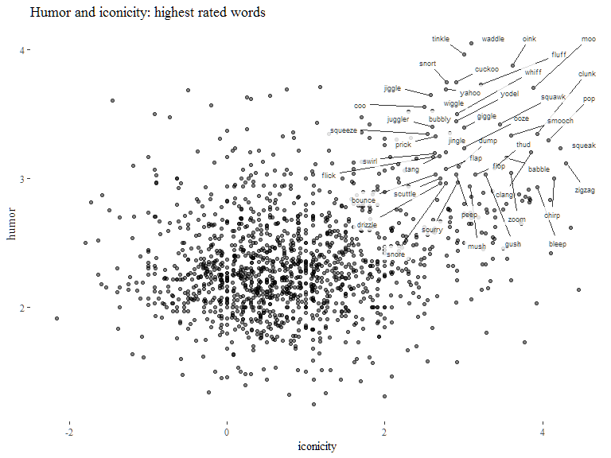
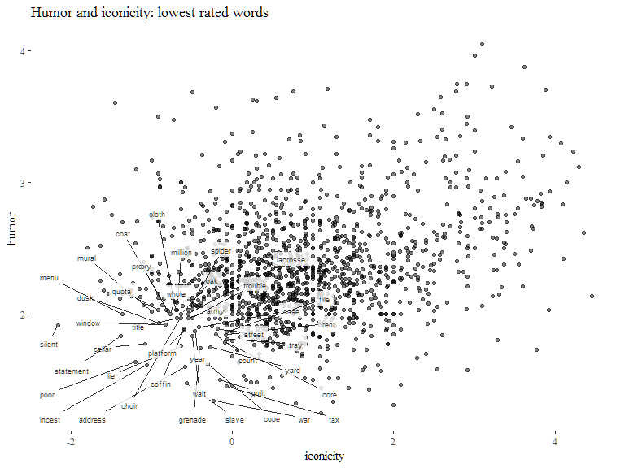
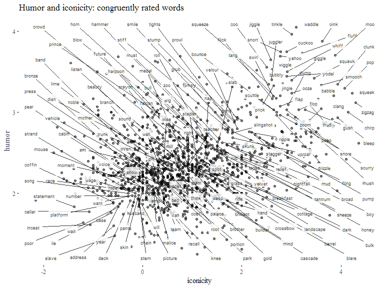
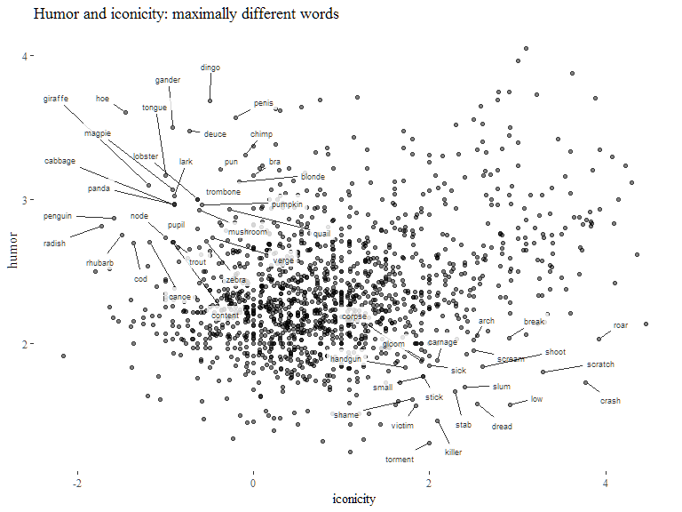
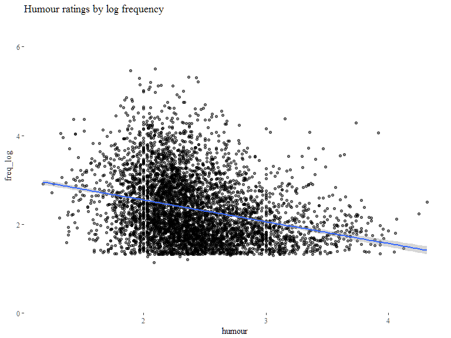
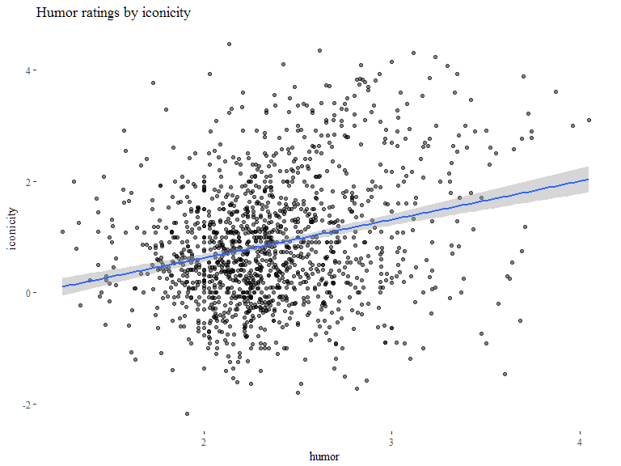
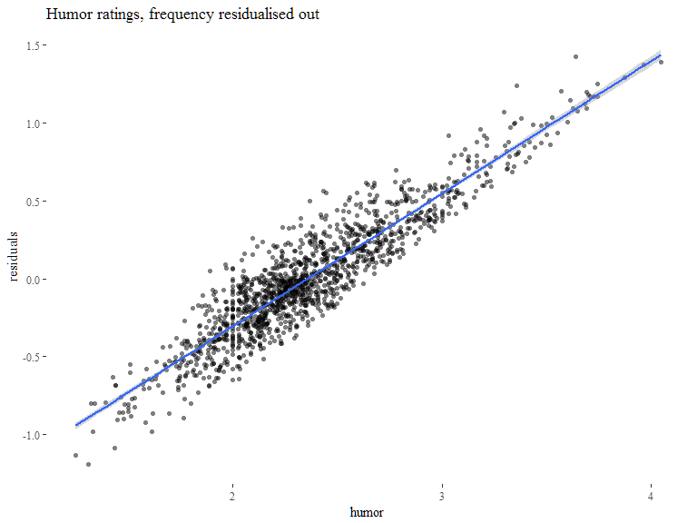
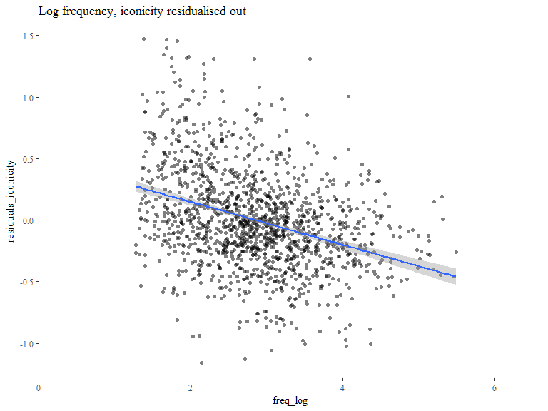
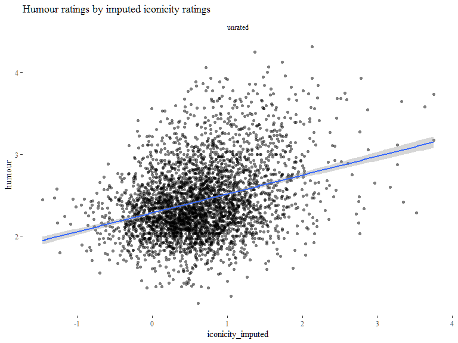
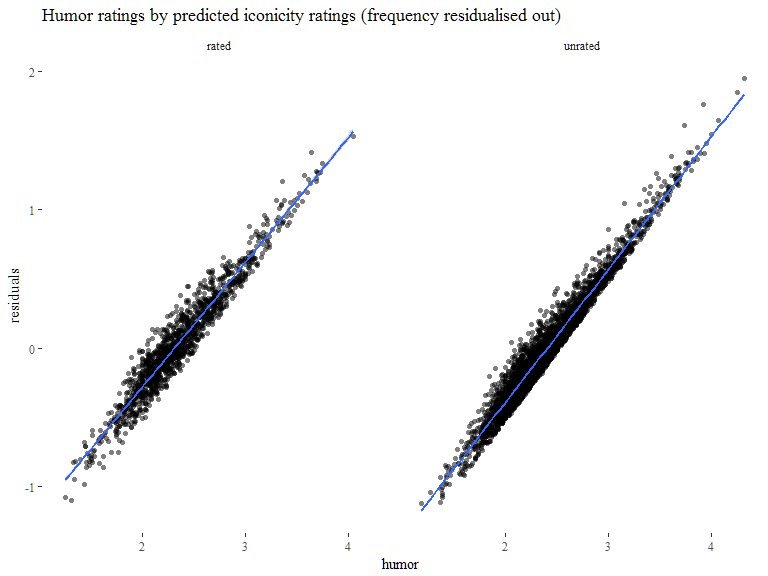

Playful iconicity: relating iconicity and humor ratings
================
Mark Dingemanse & Bill Thompson
(this version: 2018-03-31)

Abstract
--------

Iconic words are widespread in natural languages (Nuckolls 1999; Perniss, Thompson, and Vigliocco 2010), and iconic methods of communication are common in everyday interaction (Clark 2016). Scholars working on iconic words have long drawn attention to their expressive and playful nature, but empirical studies of when and why some words appear more playful than others are rare. Here we study the intersection of iconicity and playfulness using databases of humour ratings (Engelthaler and Hills 2017) and iconicity ratings (Perry et al. 2017) that have recently become available. We combine correlational evidence and linguistic analysis to understand what makes people rate words as playful and iconic. We also introduce and benchmark a method for imputing iconicity ratings using word embeddings. The method is applicable more generally to the task of increasing the intersection between iconicity ratings and other norm sets.

Ideophones are iconic words with sensory meanings found in many of the world’s languages (Nuckolls 1999). Their marked phonology has been connected to playful and expressive functions of language (Samarin 1970; Zwicky and Pullum 1987), and they have been defined —only partly tongue-in-cheek— as “those words with are such fun to use” (Welmers 1973). In an independent strand of research, people have recently started to investigate the perceived humour of word forms. For nonwords, humour ratings appear to correlate with a measure of entropy which may be linked to phonological markedness (Westbury et al. 2016). For existing English words, a new set of humour norms finds that the strongest correlates are with frequency and lexical decision time (Engelthaler and Hills 2017). Neither of these studies consider a link to iconicity, so the newly available ratings enable us, for the first time, to empirically test intuitions about the playfulness of iconic words.

Here we test the prediction that iconicity ratings will be positively correlated with humor ratings, controlling for frequency. We find that iconicity and humour are related with good accuracy across the entire range of judgments: many highly iconic words are rated as highly funny (‘tinkle’, ‘oink’, ‘waddle’), and many words rated as not iconic are rated as not funny (‘tray’, ‘spider’, ‘wait’). Using an independent set of data, we also find that imputed iconicity values correlate with humour ratings at the same level as actual iconicity ratings, controlling for frequency. This demonstrates the utility of our imputation method for generalising beyond relatively small sets of seed words (Thompson and Lupyan under review). Areas where the ratings deviate bring to light other mediating factors. For instance, “blonde” is rated as highly funny but not iconic; its humour rating is likely derived from co-occurrence relations (e.g. appearance in a genre of jokes) rather than from its formal characteristics. On the other hand, highly iconic words like ‘crash’, ‘scratch’ and ‘roar’ are low in humour ratings, likely because they are associated with negative events, pointing to valence and arousal as potential mediating variables.

Playfulness and iconicity are pervasive features of language, and their investigation can shed light on fundamental topics in language development (Cook 2000) and language use (Jakobson and Waugh 1979). This study makes four substantive contributions to experimental work on iconicity. Empirically, it (i) puts the playfulness of iconic words on firm empirical footing and (ii) illuminates what makes people rate words as funny and/or iconic by examining associations and dissociations between sets of ratings. Methodologically, it (iii) introduces and benchmarks a method for imputing iconicity ratings and (iv) examines strengths and limitations of iconicity ratings, both collected & imputed.

Explaining iconic words has been declared a risky enterprise: “linguists … cannot handle them. If they handle them carelessly, they will run into problems” (Gomi 1989). Likewise, explaining humour has been compared to dissecting an animal: you understand it better, but it dies in the process. If our study helps to explain the relation between humour and iconicity, at least we have killed two birds with one stone.

Setup
-----

``` r
# Clear workspace
rm(list=ls())

# check for /in/ and /out/ directories (create them if needed)
add_working_dir <- function(x) { if(file.exists(x)) { cat(x,"dir:",paste0(getwd(),"/",x,"/")) } else { dir.create(paste0(getwd(),"/",x)) 
  cat("subdirectory",x,"created in",getwd()) } }
add_working_dir("in")
add_working_dir("out")

# Packages and useful functions
list.of.packages <- c("tidyverse","GGally","ggthemes","readxl","ggrepel","lme4","ppcor")
new.packages <- list.of.packages[!(list.of.packages %in% installed.packages()[,"Package"])]
if(length(new.packages)>0) install.packages(new.packages)
lapply(list.of.packages, require, character.only=T)
rm(list.of.packages,new.packages)

`%notin%` <- function(x,y) !(x %in% y) 
```

Data
----

Data sources:

-   Perry, Lynn K. et al. “Iconicity in the Speech of Children and Adults.” Developmental Science, n/a-n/a. <doi:10.1111/desc.12572>.
-   Engelthaler, Tomas, and Thomas T. Hills. 2017. “Humor Norms for 4,997 English Words.” Behavior Research Methods, July, 1–9. <doi:10.3758/s13428-017-0930-6>.

``` r
iconicity <- read_csv("https://raw.githubusercontent.com/bodowinter/iconicity_acquisition/master/data/iconicity.csv") %>%
  mutate(POS = SUBTLEX_dom_POS) %>%
  plyr::rename(c("Word" = "word","Iconicity"="iconicity","OrthoLength"="len_ortho","SUBTLEX_Rawfreq" = "freq_count"))

humor <- read_csv("https://raw.githubusercontent.com/tomasengelthaler/HumorNorms/master/humor_dataset.csv") %>%
  plyr::rename(c("mean" = "humor"))

df <- merge(iconicity,humor,by="word") %>%
  drop_na(iconicity,humor,freq_count) %>%
  mutate(freq_log = log(freq_count))
```

Combine humor with predicted iconicity ratings from Bill and frequency / POS data from SUBTLEX

``` r
p.ico <- read_csv("in/ipennl.csv") %>%
  filter(language=="en") %>%
  dplyr::select(Word,Concreteness,Iconicity_PREDICTED)
names(p.ico) <- tolower(names(p.ico))

subtlex <- read_excel(path="in/SUBTLEX-US frequency list with PoS and Zipf information.xlsx") %>%
  plyr::rename(c("Word" = "word","FREQcount" = "freq_count","Lg10WF" = "freq_log","Dom_PoS_SUBTLEX" = "POS")) %>%
  dplyr::select(word,freq_log,POS) %>%
  filter(word %in% p.ico$word)

df_pred <- humor %>%
  left_join(p.ico) %>%
  drop_na(humor,iconicity_predicted) %>%
  left_join(df) %>%
  dplyr::select(-POS,-freq_log) %>%
  left_join(subtlex) %>% 
  drop_na(freq_log,POS) %>%
  mutate(set = ifelse(is.na(iconicity),"unrated","rated")) # indicate subsets
```

Words
-----

Which words are rated as highly funny *and* highly iconic? And what are the most differently rated words?

Let's start by plotting the top ranked words:

``` r
df <- df %>% 
  mutate(humor_perc = ntile(humor,10),
         iconicity_perc = ntile(iconicity,10),
         difference = humor_perc - iconicity_perc,
         diff_abs = abs(difference),
         diff_rank = humor_perc+iconicity_perc)

ggplot(df,aes(iconicity,humor)) +
  theme_tufte() + ggtitle("Humor and iconicity: highest rated words") +
  geom_point(alpha=0.5,na.rm=T) +
  geom_label_repel(
    data=subset(df,diff_rank == 20),
    aes(label=word),
    size=2.5,
    alpha=0.8,
    label.size=NA,
    label.r=unit(0,"lines"),
    box.padding=unit(0.35, "lines"),
    point.padding=unit(0.3,"lines")
  )
```



``` r
df %>%
  filter(diff_rank > 19) %>%
  arrange(desc(humor)) %>%
  dplyr::select(word,humor,iconicity) %>%
  slice(1:20)
```

    ## # A tibble: 20 x 3
    ##       word    humor iconicity
    ##      <chr>    <dbl>     <dbl>
    ##  1  waddle 4.045455  3.100000
    ##  2  tinkle 3.962963  3.000000
    ##  3    oink 3.871795  3.615385
    ##  4  cuckoo 3.743590  2.900000
    ##  5   snort 3.741935  2.785714
    ##  6   fluff 3.724138  3.214286
    ##  7     moo 3.700000  3.882353
    ##  8   yahoo 3.689655  2.769231
    ##  9  jiggle 3.645161  2.583333
    ## 10     coo 3.551724  2.500000
    ## 11  wiggle 3.523810  2.600000
    ## 12   whiff 3.500000  2.916667
    ## 13   yodel 3.441176  2.900000
    ## 14  squawk 3.418605  3.461538
    ## 15 juggler 3.400000  2.600000
    ## 16  giggle 3.391304  3.000000
    ## 17  bubbly 3.352941  2.818182
    ## 18   clunk 3.344828  3.928571
    ## 19 squeeze 3.344828  2.538462
    ## 20  smooch 3.333333  3.600000

Many highly iconic words are also rated as highly funny. The power of iconic words to evoke colourful imagery (as in *waddle, tinkle, oink, fluff, jiggle, smooch*) likely plays a major role here. Samarin (1969) connects the occurrence of laughter following the use of ideophones to their imagistic and sensory meanings.

The distribution across the senses is remarkable, with movement, visual phenomena, sounds, and tactile texture represented. (Given what we know about the correlation of sensory ratings with iconicity ratings (Winter et al. 2017), this suggests that sensory ratings and humor ratings will also correlate well.)

Let's also have a quick look at the converse: words rated as low in funniness and low in iconicity.

``` r
ggplot(df,aes(iconicity,humor)) +
  theme_tufte() + ggtitle("Humor and iconicity: lowest rated words") +
  geom_point(alpha=0.5,na.rm=T) +
  geom_label_repel(
    data=subset(df,diff_rank <= 3),
    aes(label=word),
    size=2.5,
    alpha=0.8,
    label.size=NA,
    label.r=unit(0,"lines"),
    box.padding=unit(0.35, "lines"),
    point.padding=unit(0.3,"lines")
  )
```



``` r
df %>%
  filter(diff_rank <= 3) %>%
  arrange(desc(humor)) %>%
  dplyr::select(word,humor,iconicity) %>%
  slice(1:20)
```

    ## # A tibble: 20 x 3
    ##        word    humor  iconicity
    ##       <chr>    <dbl>      <dbl>
    ##  1    proxy 2.030303 -0.8181818
    ##  2    quota 2.030303 -0.9166667
    ##  3   spider 2.029412 -0.5454545
    ##  4    cloth 2.028571 -0.7000000
    ##  5  million 2.028571 -0.6923077
    ##  6     coat 2.025641 -0.8000000
    ##  7    mural 2.021277 -1.0000000
    ##  8 lacrosse 2.000000 -0.5454545
    ##  9     menu 2.000000 -1.3636364
    ## 10      oak 2.000000 -0.6363636
    ## 11    whole 2.000000 -0.7692308
    ## 12    choir 1.972222 -0.6363636
    ## 13     army 1.969697 -0.5454545
    ## 14    title 1.969697 -0.6923077
    ## 15  trouble 1.969697 -0.5000000
    ## 16     dusk 1.931034 -0.9090909
    ## 17   window 1.918919 -0.8333333
    ## 18   silent 1.911765 -2.1666667
    ## 19     case 1.900000 -0.4166667
    ## 20   coffin 1.891892 -0.6000000

Sidenote: plotting words with the smallest absolute difference across the boards is kind of messy and not very helpful.

``` r
ggplot(df,aes(iconicity,humor)) +
  theme_tufte() + ggtitle("Humor and iconicity: congruently rated words") +
  geom_point(alpha=0.5,na.rm=T) +
  geom_label_repel(
    data=subset(df,diff_abs == 0),
    aes(label=word),
    size=2.5,
    alpha=0.8,
    label.size=NA,
    label.r=unit(0,"lines"),
    box.padding=unit(0.35, "lines"),
    point.padding=unit(0.3,"lines")
  )
```



``` r
df %>%
  filter(diff_abs == 0) %>%
  arrange(desc(humor)) %>%
  dplyr::select(word,humor,iconicity) %>%
  sample_n(20)
```

    ##          word    humor   iconicity
    ## 15    juggler 3.400000  2.60000000
    ## 158      song 2.000000 -0.30000000
    ## 84    harpoon 2.500000  1.10000000
    ## 20     smooch 3.333333  3.60000000
    ## 59  slingshot 2.739130  1.80000000
    ## 146     cabin 2.088235  0.09090909
    ## 48      grind 2.896552  2.00000000
    ## 101    crayon 2.361111  0.81818182
    ## 144    moment 2.125000  0.08333333
    ## 13      yodel 3.441176  2.90000000
    ## 119    branch 2.275862  0.57142857
    ## 118     noble 2.285714  0.54545455
    ## 78     relief 2.551724  1.38461538
    ## 73        rub 2.586207  1.50000000
    ## 93    stapler 2.406250  1.09090909
    ## 153       van 2.055556  0.09090909
    ## 38       gush 3.029412  3.27272727
    ## 36       flop 3.031250  3.14285714
    ## 68        mud 2.600000  1.69230769
    ## 54     flimsy 2.785714  1.80000000

But there are also quite some cases where the two ratings don't add up:

``` r
# difference sd
diffabs.sd <- sd(df$diff_abs,na.rm=T)

ggplot(df,aes(iconicity,humor)) +
  theme_tufte() + ggtitle("Humor and iconicity: maximally different words") +
  geom_point(alpha=0.5,na.rm=T) +
  geom_label_repel(
    data=subset(df,diff_abs > 3.5*diffabs.sd),
    # alpha=0.5,  # (affects not just the bounding box)
    aes(label=word),
    size=2.5,
    alpha=0.8,
    label.size=NA,
    label.r=unit(0,"lines"),
    box.padding=unit(0.35, "lines"),
    point.padding=unit(0.3,"lines")
  )
```



Among funny words not rated as iconic, there are lots of animals (dingo, panda, lobster, giraffe), some taboo words (hoe, penis), and joke-related words like pun and blonde.

``` r
# rated as funny but not iconic
df %>% 
  filter(humor_perc > 9, iconicity_perc < 4) %>%
  arrange(desc(humor)) %>%
  dplyr::select(word,humor,iconicity) %>%
  slice(1:20)
```

    ## # A tibble: 20 x 3
    ##        word    humor   iconicity
    ##       <chr>    <dbl>       <dbl>
    ##  1    dingo 3.682927 -0.50000000
    ##  2      hoe 3.600000 -1.45454545
    ##  3    penis 3.567568 -0.20000000
    ##  4   gander 3.500000 -0.91666667
    ##  5    deuce 3.475000 -0.73333333
    ##  6    hippo 3.366667  0.00000000
    ##  7    chimp 3.307692 -0.09090909
    ##  8 chipmunk 3.230769  0.10000000
    ##  9   turkey 3.214286  0.06666667
    ## 10      pun 3.210526 -0.37500000
    ## 11      bra 3.166667  0.00000000
    ## 12   tongue 3.166667 -1.00000000
    ## 13   blonde 3.121212 -0.16666667
    ## 14  giraffe 3.096774 -1.19047619
    ## 15   magpie 3.066667 -0.91666667
    ## 16   beaver 3.064516  0.20000000
    ## 17     lark 3.025641 -0.90000000
    ## 18  lobster 3.000000 -0.63636364
    ## 19 trombone 3.000000 -0.63636364
    ## 20   walrus 3.000000  0.18181818

Something related to valence and/or arousal plays the most important role in explaining why some highly iconic words are not rated as funny. Negatively valenced words like 'roar', 'crash', 'clash' and 'scream' may be highly iconic but they have no positive or humorous connotations. So the image-evoking potency of iconic words does not always translate into funniness. Samarin proposed that ideophones are not in themselves humourous, but they *are* "the locus of affective meaning" (Samarin 1969:321).

``` r
# rated as iconic but not funny
df %>% 
  filter(iconicity_perc > 9, humor_perc < 4) %>%
  arrange(desc(iconicity)) %>%
  dplyr::select(word,humor,iconicity) %>%
  slice(1:20)
```

    ## # A tibble: 14 x 3
    ##        word    humor iconicity
    ##       <chr>    <dbl>     <dbl>
    ##  1    click 2.135135  4.461538
    ##  2     roar 2.031250  3.923077
    ##  3    crash 1.731707  3.769231
    ##  4  scratch 1.800000  3.285714
    ##  5    swift 2.135135  3.230769
    ##  6 sunshine 2.064516  3.090909
    ##  7      low 1.575758  2.916667
    ##  8    break 2.034483  2.900000
    ##  9    clash 2.086957  2.666667
    ## 10    shoot 1.838710  2.600000
    ## 11 airplane 2.057143  2.545455
    ## 12    dread 1.583333  2.545455
    ## 13     arch 2.026316  2.500000
    ## 14   scream 1.952381  2.500000

Iconicity ~ humour: existing ratings
------------------------------------

First eyeball data. Iconicity looks a pretty good predictor in addition to frequency, which was the best predictor according to Engelthaler & Hills (2017). Humor shows a positive correlation with iconicity rating, as predicted. The relation is clearest for iconicity ratings &gt;0. My take on this (based on considerations noted elsewhere) is that the negative iconicity ratings do not capture one thing.

``` r
summary(lm(humor ~ freq_log + iconicity, df))
```

    ## 
    ## Call:
    ## lm(formula = humor ~ freq_log + iconicity, data = df)
    ## 
    ## Residuals:
    ##      Min       1Q   Median       3Q      Max 
    ## -1.25741 -0.23478 -0.03009  0.21646  1.43346 
    ## 
    ## Coefficients:
    ##              Estimate Std. Error t value Pr(>|t|)    
    ## (Intercept)  2.808262   0.039394  71.286  < 2e-16 ***
    ## freq_log    -0.078124   0.005454 -14.323  < 2e-16 ***
    ## iconicity    0.072498   0.009140   7.932 4.34e-15 ***
    ## ---
    ## Signif. codes:  0 '***' 0.001 '**' 0.01 '*' 0.05 '.' 0.1 ' ' 1
    ## 
    ## Residual standard error: 0.3748 on 1416 degrees of freedom
    ## Multiple R-squared:  0.1846, Adjusted R-squared:  0.1835 
    ## F-statistic: 160.3 on 2 and 1416 DF,  p-value: < 2.2e-16

``` r
ggplot(df,aes(humor,freq_log)) +
  theme_tufte() + ggtitle("Humor ratings by log frequency") + 
  geom_point(alpha=0.5) +
  geom_smooth(method="lm")
```



``` r
ggplot(df,aes(humor,iconicity)) +
  theme_tufte() + ggtitle("Humor ratings by iconicity") + 
  geom_point(alpha=0.5) +
  geom_smooth(method="lm")
```



Let's residualise out `log_freq` so we get a better look at the humor ~ iconicity relation; and conversely, residualise `iconicity` to look at humor ~ frequency.

``` r
summary(lm(humor ~ freq_log + iconicity,df))
```

    ## 
    ## Call:
    ## lm(formula = humor ~ freq_log + iconicity, data = df)
    ## 
    ## Residuals:
    ##      Min       1Q   Median       3Q      Max 
    ## -1.25741 -0.23478 -0.03009  0.21646  1.43346 
    ## 
    ## Coefficients:
    ##              Estimate Std. Error t value Pr(>|t|)    
    ## (Intercept)  2.808262   0.039394  71.286  < 2e-16 ***
    ## freq_log    -0.078124   0.005454 -14.323  < 2e-16 ***
    ## iconicity    0.072498   0.009140   7.932 4.34e-15 ***
    ## ---
    ## Signif. codes:  0 '***' 0.001 '**' 0.01 '*' 0.05 '.' 0.1 ' ' 1
    ## 
    ## Residual standard error: 0.3748 on 1416 degrees of freedom
    ## Multiple R-squared:  0.1846, Adjusted R-squared:  0.1835 
    ## F-statistic: 160.3 on 2 and 1416 DF,  p-value: < 2.2e-16

``` r
df$residuals <- residuals(lm(humor ~ freq_log,df))
ggplot(df,aes(iconicity,residuals)) +
  theme_tufte() + ggtitle("Iconicity, frequency residualised out") + 
  geom_point(shape=16,alpha=0.5) +
  geom_smooth(method="lm")
```



``` r
df$residuals <- residuals(lm(humor ~ iconicity,df))
ggplot(df,aes(freq_log,residuals)) +
  theme_tufte() + ggtitle("Log frequency, iconicity residualised out") + 
  geom_point(shape=16,alpha=0.5) +
  geom_smooth(method="lm")
```



Iconicity ~ humour: imputed ratings
-----------------------------------

Now look at Bill's imputed iconicity ratings. To avoid double-dipping we tease apart words for which the predictions overlap with the ratings (n=1391) and words for which predictions are newly inferred (n=3242) (encoded in `$set`).

Imputed iconicity values correlate with humor ratings even when controlling for frequency. For every point gained in predicted iconicity there's a .21 increase in humor rating.

``` r
summary(lm(humor ~ freq_log + iconicity_predicted,df_pred))
```

    ## 
    ## Call:
    ## lm(formula = humor ~ freq_log + iconicity_predicted, data = df_pred)
    ## 
    ## Residuals:
    ##      Min       1Q   Median       3Q      Max 
    ## -1.18031 -0.25035 -0.03078  0.21508  1.93199 
    ## 
    ## Coefficients:
    ##                      Estimate Std. Error t value Pr(>|t|)    
    ## (Intercept)          2.537225   0.020666  122.78   <2e-16 ***
    ## freq_log            -0.130162   0.007588  -17.15   <2e-16 ***
    ## iconicity_predicted  0.212588   0.010150   20.95   <2e-16 ***
    ## ---
    ## Signif. codes:  0 '***' 0.001 '**' 0.01 '*' 0.05 '.' 0.1 ' ' 1
    ## 
    ## Residual standard error: 0.3849 on 4629 degrees of freedom
    ## Multiple R-squared:  0.1409, Adjusted R-squared:  0.1405 
    ## F-statistic: 379.6 on 2 and 4629 DF,  p-value: < 2.2e-16

``` r
ggplot(df_pred,aes(iconicity_predicted,humor)) +
  theme_tufte() + ggtitle("Humor ratings by inferred iconicity ratings") + 
  geom_point(shape=16,alpha=0.5) +
  geom_smooth(method="lm") +
  facet_wrap(~set)
```



Here too we can residualise out `freq_log` to get a better view of the relation:

``` r
summary(lm(humor ~ freq_log + iconicity_predicted,df_pred))
```

    ## 
    ## Call:
    ## lm(formula = humor ~ freq_log + iconicity_predicted, data = df_pred)
    ## 
    ## Residuals:
    ##      Min       1Q   Median       3Q      Max 
    ## -1.18031 -0.25035 -0.03078  0.21508  1.93199 
    ## 
    ## Coefficients:
    ##                      Estimate Std. Error t value Pr(>|t|)    
    ## (Intercept)          2.537225   0.020666  122.78   <2e-16 ***
    ## freq_log            -0.130162   0.007588  -17.15   <2e-16 ***
    ## iconicity_predicted  0.212588   0.010150   20.95   <2e-16 ***
    ## ---
    ## Signif. codes:  0 '***' 0.001 '**' 0.01 '*' 0.05 '.' 0.1 ' ' 1
    ## 
    ## Residual standard error: 0.3849 on 4629 degrees of freedom
    ## Multiple R-squared:  0.1409, Adjusted R-squared:  0.1405 
    ## F-statistic: 379.6 on 2 and 4629 DF,  p-value: < 2.2e-16

``` r
df_pred$residuals <- residuals(lm(humor ~ freq_log,df_pred))

ggplot(df_pred,aes(iconicity_predicted,residuals)) +
  theme_tufte() + ggtitle("Humor ratings by predicted iconicity ratings (frequency residualised out)") +   geom_point(shape=16,alpha=0.5) +
  geom_smooth(method="lm") +
  facet_wrap(~ set)
```



Stats
-----

Partial correlations show a -9.5% correlation between iconicity and frequency when partialing out humor. This is as expected: Winter et al. (2017) report a negative correlation between iconicity and frequency. Partial correlations also show -35.7% covariance between humor and frequency, controlling out iconicity as a mediator (the more frequent a word, the less funny). This replicates the finding reported by Engelthaler and Hill (2017). Finally, there is 20.6% covariance between humor and iconicity, partialing out log frequency as a mediator.

``` r
pcor.test(x=df$humor,y=df$freq_log,z=df$iconicity)
```

    ##    estimate      p.value statistic    n gp  Method
    ## 1 -0.355736 1.480235e-43 -14.32319 1419  1 pearson

``` r
pcor.test(x=df$iconicity,y=df$freq_log,z=df$humor)
```

    ##      estimate      p.value statistic    n gp  Method
    ## 1 -0.09460514 0.0003606165 -3.576009 1419  1 pearson

``` r
pcor.test(x=df$humor,y=df$iconicity,z=df$freq_log)
```

    ##    estimate      p.value statistic    n gp  Method
    ## 1 0.2062649 4.335228e-15  7.932275 1419  1 pearson

We can do the same for the imputed iconicity ratings, again using only the unrated subset to avoid double dipping. Looks like there is 30% covariance between humor and imputed iconicity, partialing out log frequency as a mediator:

``` r
df_unrated <- df_pred %>%
  filter(set == "unrated")
pcor.test(x=df_unrated$humor,y=df_unrated$iconicity_predicted,z=df_unrated$freq_log)
```

    ##    estimate      p.value statistic    n gp  Method
    ## 1 0.3018317 3.172601e-69  18.01548 3241  1 pearson

Discussion
----------

The negative relation between humor and frequency reported by Engelthaler and Hill (2017) is replicated for a subset of words for which we have iconicity ratings. However, controlling for this relation, there remains a strong partial correlation of 20.6% between iconicity and humor ratings — stronger than the next highest correlation reported by Engelthaler and Hill (which was for lexical decision time).

Many highly iconic words are rated as funny, and many words rated as not iconic are rated as not funny. This sheds light on the relation between iconicity and playfulness. Across languages, iconic words display marked phonotactics, sound play and evocative imagery, all things that can make iconic words sound funny. The data analysed here suggests these aspects of iconic words indeed lead to higher funniness ratings, though only for positively valenced words.

The discrepancies between humor and iconicity ratings also shed light on the various factors that go into humor ratings. Highly funny words not rated as highly iconic include animal names, taboo words and joke-related words. This shows that at least some humor ratings are made on the basis of semantics and word associations.

References
----------

-   Clark, Herbert H. 2016. “Depicting as a method of communication.” Psychological Review 123 (3): 324–347. <doi:10.1037/rev0000026>.
-   Cook, Guy. 2000. Language Play, Language Learning. 1 edition. Oxford: Oxford University Press, February 21.
-   Engelthaler, Tomas, and Thomas T. Hills. 2017. “Humor norms for 4,997 English words.” Behavior Research Methods: 1–9. <doi:10.3758/s13428-017-0930-6>.
-   Gomi, Taro. 1989. An Illustrated Dictionary of Japanese Onomatopoeic Expressions. Transl. by J. Turrent. Tokyo: Japan Times.
-   Jakobson, Roman, and Linda R. Waugh. 1979. The Sound Shape of Language. Bloomington: Indiana University Press.
-   Nuckolls, Janis B. 1999. “The Case for Sound Symbolism.” Annual Review of Anthropology 28: 225–252.
-   Perniss, Pamela, Robin L. Thompson, and Gabriella Vigliocco. 2010. “Iconicity as a General Property of Language: Evidence from Spoken and Signed Languages.” Frontiers in Psychology 1 (227): 1–15. <doi:10.3389/fpsyg.2010.00227>.
-   Perry, Lynn K., Marcus Perlman, Bodo Winter, Dominic W. Massaro, and Gary Lupyan. 2017. “Iconicity in the speech of children and adults.” Developmental Science. <doi:10.1111/desc.12572>. <http://onlinelibrary.wiley.com/doi/10.1111/desc.12572/abstract>.
-   Samarin, William J. 1970. “Inventory and choice in expressive language.” Word 26: 153–169.
-   Thompson, Bill, and Gary Lupyan. under review. Automatic Estimation of Lexical Concreteness in 77 Languages. In .
-   Welmers, William E. 1973. African Language Structures. Berkeley: University of California Press.
-   Westbury, Chris, Cyrus Shaoul, Gail Moroschan, and Michael Ramscar. 2016. “Telling the world’s least funny jokes: On the quantification of humor as entropy.” Journal of Memory and Language 86: 141–156. <doi:10.1016/j.jml.2015.09.001>.
-   Zwicky, Arnold M., and Geoffrey K. Pullum. 1987. Plain Morphology and Expressive Morphology. In Proceedings of the Thirteenth Annual Meeting of the Berkeley Linguistics Society, ed by. John Aske, Beery, Natasha, Laura Michaelis, and Hana Filip, VII:330–340. Berkeley: Berkeley Linguistics Society.
