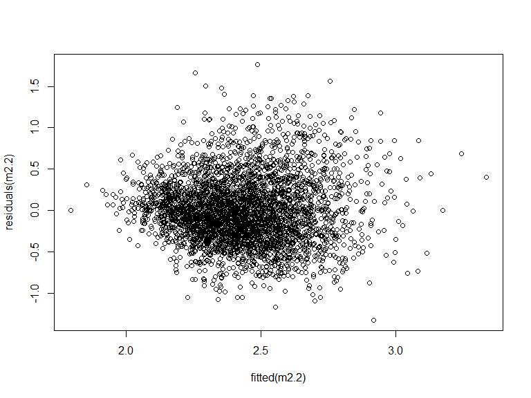
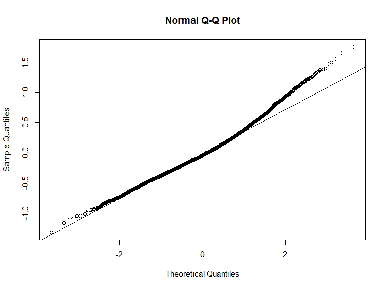
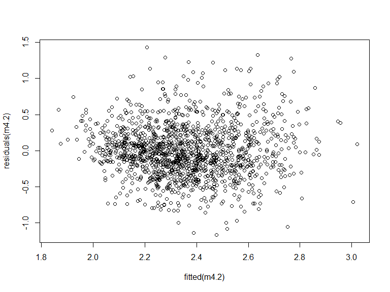
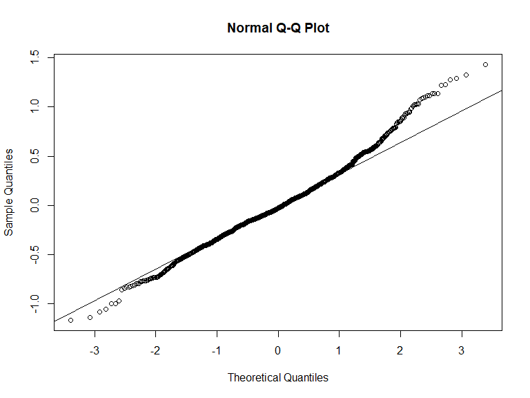
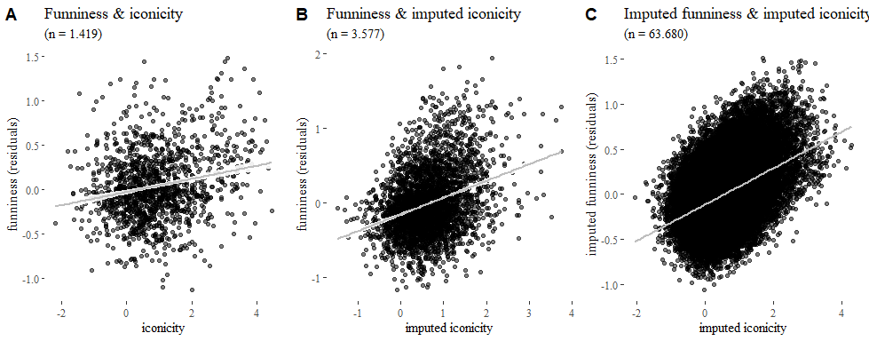
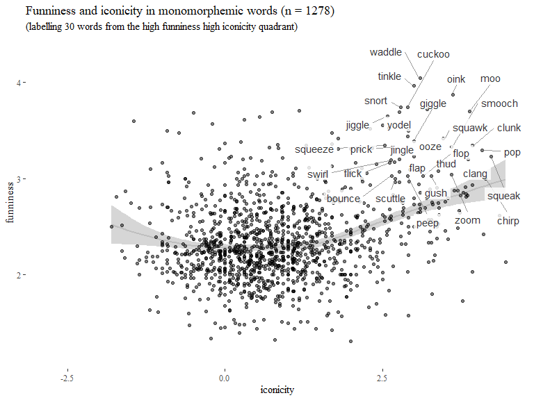
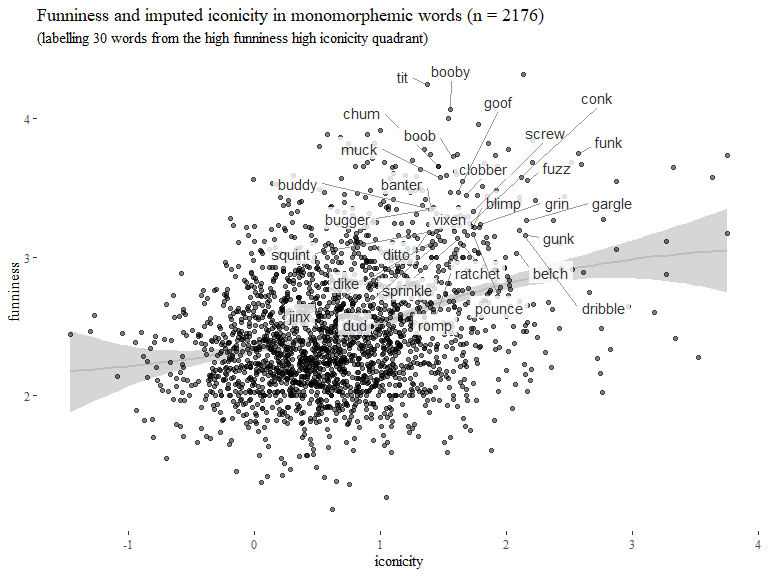

Playful iconicity: data & analyses
================
Mark Dingemanse & Bill Thompson
(this version: 2019-10-02)

Setup
-----

``` r
# Packages and useful functions
list.of.packages <- c("knitr","stringr","tidyverse","GGally","ggthemes","readxl","ggrepel","ppcor","stringr","car","lme4","mgcv","cowplot","flextable","effsize")
new.packages <- list.of.packages[!(list.of.packages %in% installed.packages()[,"Package"])]
if(length(new.packages)>0) install.packages(new.packages)
lapply(list.of.packages, require, character.only=T)
rm(list.of.packages,new.packages)

`%notin%` <- function(x,y) !(x %in% y) 

# with thanks to Bodo Winter:
mean.na <- function(x) mean(x, na.rm = T)
sd.na <- function(x) sd(x, na.rm = T)

# print model outputs using kable
print_table <- function(lm.input) {
  lm.anova <- anova(lm.input) %>%
    mutate(predictor = row.names(.),
           pes = c(`Sum Sq`[-nrow(.)],NA)/(`Sum Sq` + `Sum Sq`[nrow(.)])) %>%
    setNames(., c("df", "SS","MS", "$F$", "$p$","predictor", "partial $\\eta^2$")) %>%
    dplyr::select(c(predictor,1:2,4:5,7))
  kable(lm.anova,digits=3)
}
```

Data
----

Primary data sources:

-   Perry, Lynn K. et al. Iconicity in the Speech of Children and Adults. Developmental Science. <doi:10.1111/desc.12572>
-   Engelthaler, Tomas, and Thomas T. Hills. 2017. Humor Norms for 4,997 English Words. Behavior Research Methods, July, 1-9. <doi:10.3758/s13428-017-0930-6>

We use these ratings in our analyses, but we also feed them to our [imputation method](/benchmark-prediction.py), which regresses the human ratings against semantic vectors in order to generate imputed ratings for an additional 63.721 words (`fun_imputed` and `ico_imputed`).

Secondary data sources:

-   Balota, D. A., Yap, M. J., Hutchison, K. A., Cortese, M. J., Kessler, B., Loftis, B., … Treiman, R. (2007). The English Lexicon Project. Behavior Research Methods, 39(3), 445–459. doi: 10.3758/BF03193014
-   Brysbaert, M., & New, B. (2009). Moving beyond Kucera and Francis: A critical evaluation of current word frequency norms and the introduction of a new and improved word frequency measure for American English. Behavior Research Methods, 41(4), 977-990. doi: 10.3758/BRM.41.4.977
-   Keuleers, E., Lacey, P., Rastle, K., & Brysbaert, M. (2012). The British Lexicon Project: Lexical decision data for 28,730 monosyllabic and disyllabic English words. Behavior Research Methods, 44(1), 287-304. doi: 10.3758/s13428-011-0118-4
-   Vaden, K.I., Halpin, H.R., Hickok, G.S. (2009). Irvine Phonotactic Online Dictionary, Version 2.0. \[Data file\]. Available from <http://www.iphod.com>.
-   Warriner, A.B., Kuperman, V., & Brysbaert, M. (2013). Norms of valence, arousal, and dominance for 13,915 English lemmas. Behavior Research Methods, 45, 1191-1207

``` r
words <- read_csv("data/experimental-and-imputed-norms-for-funniness-iconicity-logletterfreq.csv") %>%
  plyr::rename(c("iconicity" = "ico","iconicity_imputed" = "ico_imputed"))

subtlex <- read_excel(path="data/SUBTLEX-US frequency list with PoS and Zipf information.xlsx") %>%
  plyr::rename(c("Word" = "word","FREQcount" = "freq_count","Lg10WF" = "logfreq","Dom_PoS_SUBTLEX" = "POS")) %>%
  dplyr::select(word,logfreq,POS) %>%
  filter(word %in% words$word)

# which words are in the norms, but not in subtlex? some pretty colourful ones, but
# not too many (62) - we'll exclude them so we have frequency data for every word
unique(words$word)[unique(words$word) %notin% unique(subtlex$word)]

words <- words %>%
  left_join(subtlex) %>%
  drop_na(logfreq,POS) %>%
  mutate(set = ifelse(is.na(ico) & is.na(fun), "F",
                      ifelse(is.na(ico) & !is.na(fun), "E", 
                             ifelse(!is.na(fun) & !is.na(ico),"C",NA))))
rm(subtlex)

# add RT data from Keuleers et al. 2012
RT <- read_tsv("data/blp-items-RT.txt") %>%
  plyr::rename(c("spelling" = "word")) %>%
  dplyr::select(word,rt)

words <- words %>%
  left_join(RT)
rm(RT)

# center variables for use in models
words <- words %>%
  mutate(fun_z = (fun - mean.na(fun)) / sd.na(fun),
         ico_z = (ico - mean.na(ico)) / sd.na(ico))

# add frequency residuals so we can present plots with frequency residualised out 
# (but see Wurm & Fisicaro, 2014 for details and caveats on using residualised measures in regression analyses)

words$fun_resid <- NA
words[which(!is.na(words$logfreq) & !is.na(words$fun)),]$fun_resid <- residuals(lm(fun ~ logfreq,words))

words$fun_imputed_resid <- NA
words[which(!is.na(words$logfreq) & !is.na(words$fun_imputed)),]$fun_imputed_resid <- residuals(lm(fun_imputed ~ logfreq,words))
```

We further add a range of phonological measures from IPhOD and number of morphemes from the British Lexicon Project.

IPhOD contains homographs (e.g. for 'the' it includes DH.AH0, DH.AH1, and DH.IY, where the first two differ only in stress pattern). However, frequencies are given only at the level of orthographic forms so homographs do not differ in frequency, one of the key measures we are interested in. To avoid duplication of data we keep only the first of multiple homographs in IPhOD, accepting some loss of precision about possible pronunciations.

From IPhOD, we use phonotactic probability and phonological density measures. Since we have no stress-related hypotheses we work with unstressed calculations. We work with values unweighted for frequency because we include frequency as a fixed effect in later analyses

``` r
iphod.raw <- read_delim("data/IPhOD2_Words.txt",delim="\t") %>%
  plyr::rename(c("Word" = "word")) 

# have a peek at homographs
# iphod.raw %>% 
#   filter(word %in% iphod.raw[duplicated(iphod.raw$word),]$word) %>% 
#   arrange(desc(SFreq)) %>% 
#   dplyr::select(word,StTrn,SFreq) %>% 
#   slice(1:20)

# keep only unique orthographic words and the most informative non-redundant columns: number of syllables (NSyll), number of phonemes (NPhon), transciption (UnTrn), phonological neighbourhood density (unsDENS), average biphone probability (unsBPAV), average positional probability (unsPOSPAV)
iphod <- iphod.raw[!duplicated(iphod.raw$word),] %>%
  dplyr::select(word,NSyll,UnTrn,NPhon,unsDENS,unsBPAV,unsTPAV,unsPOSPAV,unsLCPOSPAV)

# add to words
words <- words %>% 
  left_join(iphod)
rm(iphod,iphod.raw)

# and we add number of morphemes from the British Lexicon Project
morph <- read_csv("data/EnglishLexiconProject_nmorph_Items.csv") %>% 
  plyr::rename(c("Word" = "word", "NMorph" = "nmorph"))

words <- words %>% 
  left_join(morph)
rm(morph)
```

Finally we add a range of summary variables, mainly for easy plotting and subset selection

``` r
words <- words %>%
  mutate(fun_perc = ntile(fun,10),
         fun_resid_perc = ntile(fun_resid,10),
         ico_perc = ntile(ico,10),
         diff_rank = fun_perc + ico_perc,
         ico_imputed_perc = ntile(ico_imputed,10),
         hum_imputed_perc = ntile(fun_imputed,10),
         hum_imputed_resid_perc = ntile(fun_imputed_resid,10),
         diff_rank_setE = fun_perc + ico_imputed_perc,
         diff_rank_setF = hum_imputed_perc + ico_imputed_perc,
         logletterfreq_perc = ntile(logletterfreq,10),
         dens_perc = ntile(unsDENS,10),
         biphone_perc = ntile(unsBPAV,10),
         triphone_perc = ntile(unsTPAV,10),
         posprob_perc = ntile(unsPOSPAV,10),
         valence_perc = ntile(valence,10))
```

### Descriptive data

We have 4996 words rated for funniness, 2945 rated for iconicity, and 1419 in the intersection (set C). We have 3577 words with human funniness ratings and imputed iconicity ratings (set E). We have imputed data for a total of 70.245 words, and we're venturing outside the realm of rated words for 63.723 of them (set F).

``` r
words %>%
  drop_na(set) %>% group_by(set) %>% summarise(n=n())
```

    ## # A tibble: 3 x 2
    ##   set       n
    ##   <chr> <int>
    ## 1 C      1419
    ## 2 E      3577
    ## 3 F     63723

The most important columns in the data are shown below for set C (some summary columns excluded). Sets E and F also feature `ico_imputed` and `fun_imputed`. The field `diff_rank` is the sum of `fun` and `ico` deciles for a given word: a word with `diff_rank` 2 occurs in the first decile (lowest 10%) of both funniness and iconicity ratings, and a word with `diff_rank` 20 occurs in the 10th decile (highest 10%) of both.

``` r
words %>% 
  filter(set == "C") %>%
  group_by(diff_rank) %>% arrange(-diff_rank) %>%
  dplyr::select(word,ico,fun,logletterfreq,logfreq,rt,nmorph,diff_rank) %>%
  slice(1)
```

    ## # A tibble: 19 x 8
    ## # Groups:   diff_rank [19]
    ##    word     ico   fun logletterfreq logfreq    rt nmorph diff_rank
    ##    <chr>  <dbl> <dbl>         <dbl>   <dbl> <dbl> <chr>      <int>
    ##  1 wait  -0.5    1.83         -2.71    4.63  526. 1              2
    ##  2 whole -0.769  2            -2.79    4.29  561. 1              3
    ##  3 want  -0.214  1.97         -2.71    5.15  511. 1              4
    ##  4 will   0.214  2.04         -3.12    5.03  532. 1              5
    ##  5 know   0.769  1.89         -3.14    5.47  572. 1              6
    ##  6 think  0.364  2.14         -2.84    5.14  564. 1              7
    ##  7 like  -0.333  2.43         -2.79    5.31  514. 1              8
    ##  8 do     0.846  2.09         -2.87    5.50  524. 1              9
    ##  9 go     1.45   1.97         -3.04    5.29  516. 1             10
    ## 10 one    1.85   2.06         -2.42    5.20  487. 1             11
    ## 11 right  0.917  2.37         -2.83    5.31  516. 1             12
    ## 12 girl   0.636  2.65         -3.00    4.45  542. 1             13
    ## 13 look   1.82   2.32         -3.00    5.00  546. 1             14
    ## 14 play   1.08   2.68         -3.19    4.26  508. 1             15
    ## 15 must   1.5    2.64         -2.95    4.55  570. 1             16
    ## 16 kid    1.45   2.78         -3.22    4.24  522. 1             17
    ## 17 high   2.64   2.61         -3.03    4.00  544. 1             18
    ## 18 party  1.92   3.03         -2.90    4.08  598. 1             19
    ## 19 pop    4.08   3.29         -3.25    3.54  590. 1             20

Main analyses
-------------

### 0. Reproducing prior results for frequency and RT

Engelthaler & Hills report frequency as the strongest correlate with funniness (less frequent words are rated as more funny), and lexical decision RT as the second strongest (words with slower RTs are rated as more funny). By way of sanity check let's replicate their analysis.

Raw correlations hover around 28%, as reported (without corrections or controls) in their paper. A linear model with funniness as dependent variable and frequency and RT as predictors shows a role for both, though frequency accounts for a much larger portion of the variance (15%) than rt (0.6%).

``` r
# raw correlations at ~28% as reported (without corrections or controls) in E&T
cor.test(words$fun,words$logfreq)
```

    ## 
    ##  Pearson's product-moment correlation
    ## 
    ## data:  words$fun and words$logfreq
    ## t = -21.101, df = 4994, p-value < 2.2e-16
    ## alternative hypothesis: true correlation is not equal to 0
    ## 95 percent confidence interval:
    ##  -0.3113654 -0.2604413
    ## sample estimates:
    ##        cor 
    ## -0.2861054

``` r
cor.test(words$fun,words$rt)
```

    ## 
    ##  Pearson's product-moment correlation
    ## 
    ## data:  words$fun and words$rt
    ## t = 21.185, df = 4994, p-value < 2.2e-16
    ## alternative hypothesis: true correlation is not equal to 0
    ## 95 percent confidence interval:
    ##  0.2615112 0.3124018
    ## sample estimates:
    ##       cor 
    ## 0.2871591

``` r
# to what extent do frequency and RT predict funniness?
m0 <- lm(fun ~ logfreq + rt, words %>% drop_na(fun))
summary(m0)
```

    ## 
    ## Call:
    ## lm(formula = fun ~ logfreq + rt, data = words %>% drop_na(fun))
    ## 
    ## Residuals:
    ##     Min      1Q  Median      3Q     Max 
    ## -1.1922 -0.2706 -0.0513  0.2268  1.8987 
    ## 
    ## Coefficients:
    ##               Estimate Std. Error t value Pr(>|t|)    
    ## (Intercept)  1.9671576  0.0857458   22.94   <2e-16 ***
    ## logfreq     -0.1010876  0.0102624   -9.85   <2e-16 ***
    ## rt           0.0011254  0.0001123   10.02   <2e-16 ***
    ## ---
    ## Signif. codes:  0 '***' 0.001 '**' 0.01 '*' 0.05 '.' 0.1 ' ' 1
    ## 
    ## Residual standard error: 0.4153 on 4993 degrees of freedom
    ## Multiple R-squared:  0.09995,    Adjusted R-squared:  0.09959 
    ## F-statistic: 277.2 on 2 and 4993 DF,  p-value: < 2.2e-16

``` r
# model validation
plot(fitted(m0),
     residuals(m0))   # no obvious nonlinearity
```


``` r
qqnorm(residuals(m0)) # looks OK
qqline(residuals(m0)) # looks OK, slight right skew
```


``` r
vif(m0)               # below 2 so no indication of multicollinearity
```

    ## logfreq      rt 
    ##  1.7086  1.7086

``` r
print_table(m0)
```

| predictor |    df|       SS|      *F*|  *p*|  partial *η*<sup>2</sup>|
|:----------|-----:|--------:|--------:|----:|------------------------:|
| logfreq   |     1|   78.329|  454.096|    0|                    0.083|
| rt        |     1|   17.315|  100.380|    0|                    0.020|
| Residuals |  4993|  861.264|         |     |                         |

### 1. Known knowns

If frequency and RT explain some of the variance in funniness ratings, how much is left for iconicity? We'll do this analysis on the core set of 1419 words for which we have funniness and iconicity ratings.

Turns out that the magnitude estimate of iconicity is about half that of frequency, and with positive sign instead of a negative one (higher funniness ratings go with higher iconicity ratings). The effect of iconicity ratings is much larger than RT, the second most important correlate reported by Engelthaler & Hill.

``` r
m1.1 <- lm(fun ~ logfreq + rt, words %>% filter(set=="C"))
summary(m1.1)
```

    ## 
    ## Call:
    ## lm(formula = fun ~ logfreq + rt, data = words %>% filter(set == 
    ##     "C"))
    ## 
    ## Residuals:
    ##      Min       1Q   Median       3Q      Max 
    ## -1.17871 -0.23859 -0.03316  0.21847  1.46007 
    ## 
    ## Coefficients:
    ##               Estimate Std. Error t value Pr(>|t|)    
    ## (Intercept)  2.4075929  0.1809601  13.305  < 2e-16 ***
    ## logfreq     -0.1688004  0.0162420 -10.393  < 2e-16 ***
    ## rt           0.0007654  0.0002616   2.926  0.00349 ** 
    ## ---
    ## Signif. codes:  0 '***' 0.001 '**' 0.01 '*' 0.05 '.' 0.1 ' ' 1
    ## 
    ## Residual standard error: 0.3819 on 1416 degrees of freedom
    ## Multiple R-squared:  0.1533, Adjusted R-squared:  0.1521 
    ## F-statistic: 128.2 on 2 and 1416 DF,  p-value: < 2.2e-16

``` r
print_table(m1.1)
```

| predictor |    df|       SS|      *F*|    *p*|  partial *η*<sup>2</sup>|
|:----------|-----:|--------:|--------:|------:|------------------------:|
| logfreq   |     1|   36.143|  247.813|  0.000|                    0.149|
| rt        |     1|    1.249|    8.562|  0.003|                    0.006|
| Residuals |  1416|  206.519|         |       |                         |

``` r
m1.2 <- lm(fun ~ logfreq + rt + ico, words %>% filter(set=="C"))
plot(fitted(m1.2),residuals(m1.2))  # no obvious linearity
```


``` r
qqnorm(residuals(m1.2))
qqline(residuals(m1.2))           # looks OK, slight right skew or light tailed as above
```


``` r
vif(m1.2)                         # all below 2 so no indications of multicollinearity
```

    ##  logfreq       rt      ico 
    ## 1.692160 1.655702 1.034818

``` r
anova(m1.1,m1.2)
```

    ## Analysis of Variance Table
    ## 
    ## Model 1: fun ~ logfreq + rt
    ## Model 2: fun ~ logfreq + rt + ico
    ##   Res.Df    RSS Df Sum of Sq      F    Pr(>F)    
    ## 1   1416 206.52                                  
    ## 2   1415 197.63  1    8.8913 63.661 3.027e-15 ***
    ## ---
    ## Signif. codes:  0 '***' 0.001 '**' 0.01 '*' 0.05 '.' 0.1 ' ' 1

``` r
summary(m1.2)
```

    ## 
    ## Call:
    ## lm(formula = fun ~ logfreq + rt + ico, data = words %>% filter(set == 
    ##     "C"))
    ## 
    ## Residuals:
    ##      Min       1Q   Median       3Q      Max 
    ## -1.24752 -0.22691 -0.03056  0.21258  1.47125 
    ## 
    ## Coefficients:
    ##               Estimate Std. Error t value Pr(>|t|)    
    ## (Intercept)  2.2838755  0.1777619  12.848  < 2e-16 ***
    ## logfreq     -0.1499682  0.0160684  -9.333  < 2e-16 ***
    ## rt           0.0007769  0.0002560   3.035  0.00245 ** 
    ## ico          0.0727154  0.0091136   7.979 3.03e-15 ***
    ## ---
    ## Signif. codes:  0 '***' 0.001 '**' 0.01 '*' 0.05 '.' 0.1 ' ' 1
    ## 
    ## Residual standard error: 0.3737 on 1415 degrees of freedom
    ## Multiple R-squared:  0.1898, Adjusted R-squared:  0.188 
    ## F-statistic: 110.5 on 3 and 1415 DF,  p-value: < 2.2e-16

``` r
print_table(m1.2)
```

| predictor |    df|       SS|      *F*|    *p*|  partial *η*<sup>2</sup>|
|:----------|-----:|--------:|--------:|------:|------------------------:|
| logfreq   |     1|   36.143|  258.779|  0.000|                    0.155|
| rt        |     1|    1.249|    8.941|  0.003|                    0.006|
| ico       |     1|    8.891|   63.661|  0.000|                    0.043|
| Residuals |  1415|  197.628|         |       |                         |

Partial correlations show 20.6% covariance between funniness and iconicity, partialing out log frequency as a mediator. This shows the effects of iconicity and funniness are not reducible to frequency alone.

``` r
words.setC <- words %>% filter(set=="C")

pcor.test(x=words.setC$fun,y=words.setC$ico,z=words.setC$logfreq)
```

    ##    estimate      p.value statistic    n gp  Method
    ## 1 0.2064276 4.122044e-15  7.938811 1419  1 pearson

``` r
# the other two:
# pcor.test(x=words.setC$fun,y=words.setC$logfreq,z=words.setC$ico)
# pcor.test(x=words.setC$ico,y=words.setC$logfreq,z=words.setC$fun)
```

Example words:

``` r
# both high
words %>%
  filter(diff_rank > 19) %>%
  arrange(-ico) %>%
  dplyr::select(word) %>% slice(1:20) %>% unlist() %>% unname()
```

    ##  [1] "zigzag" "squeak" "chirp"  "pop"    "clunk"  "moo"    "clang" 
    ##  [8] "oink"   "zoom"   "smooch" "babble" "squawk" "thud"   "gush"  
    ## [15] "fluff"  "flop"   "waddle" "giggle" "tinkle" "ooze"

``` r
# both low
words %>%
  filter(diff_rank <= 2) %>%
  arrange(ico) %>%
  dplyr::select(word) %>% slice(1:20) %>% unlist() %>% unname()
```

    ##  [1] "silent"    "statement" "poor"      "cellar"    "incest"   
    ##  [6] "window"    "lie"       "coffin"    "platform"  "address"  
    ## [11] "slave"     "wait"      "year"      "case"

``` r
# rated as funny but not iconic
words %>% 
  filter(fun_perc > 9, ico_perc < 4) %>%
  arrange(-ico) %>%
  dplyr::select(word) %>% slice(1:20) %>% unlist() %>% unname()
```

    ##  [1] "belly"    "buttocks" "beaver"   "chipmunk" "turkey"   "bra"     
    ##  [7] "hippo"    "chimp"    "blonde"   "penis"    "pun"      "dingo"   
    ## [13] "trombone" "deuce"    "lark"     "gander"   "magpie"   "tongue"  
    ## [19] "giraffe"  "hoe"

``` r
# rated as iconic but not funny
words %>% 
  filter(ico_perc > 9, fun_perc < 4) %>%
  arrange(-ico) %>%
  dplyr::select(word) %>% slice(1:20) %>% unlist() %>% unname()
```

    ##  [1] "click"    "roar"     "crash"    "chime"    "scratch"  "swift"   
    ##  [7] "sunshine" "low"      "break"    "clash"    "shoot"    "airplane"
    ## [13] "dread"

``` r
# N.B. controlling for frequency in this list (by using fun_resid instead of fun) does not make a difference in ranking, so not done here and elsewhere

# what about compound nouns among high iconicity words? about 10% in this set:
words %>% 
  filter(set == "C", ico_perc > 8, POS == "Noun") %>%
  arrange(-ico) %>%
  slice(1:200) %>% dplyr::select(word) %>% unlist %>% unname() 
```

    ##   [1] "beep"       "zigzag"     "buzzer"     "bleep"      "clunk"     
    ##   [6] "roar"       "moo"        "clang"      "boom"       "murmur"    
    ##  [11] "whirl"      "crunch"     "crash"      "flash"      "sludge"    
    ##  [16] "ping"       "skateboard" "blast"      "purr"       "splash"    
    ##  [21] "shriek"     "thud"       "snarl"      "bump"       "tap"       
    ##  [26] "slush"      "groan"      "fluff"      "slime"      "drum"      
    ##  [31] "flop"       "crack"      "jolt"       "sunshine"   "limp"      
    ##  [36] "mash"       "tinkle"     "silk"       "zipper"     "freezer"   
    ##  [41] "whiff"      "shot"       "tick"       "peep"       "cuckoo"    
    ##  [46] "yodel"      "thunder"    "rumble"     "twist"      "echo"      
    ##  [51] "sigh"       "snort"      "flap"       "jingle"     "yahoo"     
    ##  [56] "snowball"   "drizzle"    "tang"       "clash"      "prick"     
    ##  [61] "swirl"      "flick"      "cricket"    "juggler"    "whimper"   
    ##  [66] "airplane"   "dread"      "hole"       "bedroom"    "arch"      
    ##  [71] "goldfish"   "seaweed"    "coo"        "slur"       "mist"      
    ##  [76] "dash"       "block"      "pulse"      "loop"       "lipstick"  
    ##  [81] "slum"       "mixer"      "corkscrew"  "pump"       "cough"     
    ##  [86] "gloss"      "tingle"     "flat"       "charge"     "muzzle"    
    ##  [91] "slobber"    "stench"     "doorknob"   "slump"      "shock"     
    ##  [96] "baby"       "stagger"    "frog"       "sleet"      "anchor"    
    ## [101] "gallop"     "wisp"       "ripple"     "spring"     "creep"     
    ## [106] "python"     "killer"     "mirror"     "cushion"    "carnage"   
    ## [111] "punch"      "slick"      "father"     "snake"      "hug"       
    ## [116] "moonlight"  "torment"    "tummy"      "sparkle"    "leech"     
    ## [121] "prune"      "prance"     "miss"       "kingdom"    "party"     
    ## [126] "razor"      "gloom"      "singer"     "pin"        "drift"     
    ## [131] "ashtray"    "prowl"      "velour"     "bomb"       "corpse"    
    ## [136] "shield"     "fireworks"  "axe"        "twilight"   "pliers"    
    ## [141] "rush"       "stump"      "victim"     "flow"       "grub"      
    ## [146] "inch"       "bliss"      "leap"       "fling"      "racer"     
    ## [151] "uproar"     "egg"

### 2. Known unknowns

Here we study the link between funniness ratings and imputed iconicity ratings.

``` r
words.setE <- words %>%
  filter(!is.na(fun),
         is.na(ico))

m2.1 <- lm(fun ~ logfreq + rt, words.setE)
summary(m2.1)
```

    ## 
    ## Call:
    ## lm(formula = fun ~ logfreq + rt, data = words.setE)
    ## 
    ## Residuals:
    ##      Min       1Q   Median       3Q      Max 
    ## -1.19057 -0.27861 -0.06132  0.22845  1.92420 
    ## 
    ## Coefficients:
    ##               Estimate Std. Error t value Pr(>|t|)    
    ## (Intercept)  1.7563035  0.1011357  17.366  < 2e-16 ***
    ## logfreq     -0.0815523  0.0141686  -5.756 9.35e-09 ***
    ## rt           0.0013693  0.0001288  10.635  < 2e-16 ***
    ## ---
    ## Signif. codes:  0 '***' 0.001 '**' 0.01 '*' 0.05 '.' 0.1 ' ' 1
    ## 
    ## Residual standard error: 0.4256 on 3574 degrees of freedom
    ## Multiple R-squared:  0.08484,    Adjusted R-squared:  0.08432 
    ## F-statistic: 165.7 on 2 and 3574 DF,  p-value: < 2.2e-16

``` r
print_table(m2.1)
```

| predictor |    df|       SS|      *F*|  *p*|  partial *η*<sup>2</sup>|
|:----------|-----:|--------:|--------:|----:|------------------------:|
| logfreq   |     1|   39.528|  218.214|    0|                    0.058|
| rt        |     1|   20.487|  113.100|    0|                    0.031|
| Residuals |  3574|  647.400|         |     |                         |

``` r
m2.2 <- lm(fun ~ logfreq + rt + ico_imputed, words.setE)
plot(fitted(m2.2),residuals(m2.2))  # no obvious linearity
```



``` r
qqnorm(residuals(m2.2))
qqline(residuals(m2.2))           # looks OK, slight right skew or light tailed as above
```



``` r
vif(m2.2)                         # all below 2 so no indications of multicollinearity
```

    ##     logfreq          rt ico_imputed 
    ##    1.525041    1.522614    1.002874

``` r
summary(m2.2)
```

    ## 
    ## Call:
    ## lm(formula = fun ~ logfreq + rt + ico_imputed, data = words.setE)
    ## 
    ## Residuals:
    ##      Min       1Q   Median       3Q      Max 
    ## -1.32424 -0.27101 -0.03488  0.22716  1.76368 
    ## 
    ## Coefficients:
    ##               Estimate Std. Error t value Pr(>|t|)    
    ## (Intercept)  1.5197832  0.0959515  15.839  < 2e-16 ***
    ## logfreq     -0.0664087  0.0133706  -4.967 7.13e-07 ***
    ## rt           0.0014606  0.0001214  12.030  < 2e-16 ***
    ## ico_imputed  0.2289423  0.0107713  21.255  < 2e-16 ***
    ## ---
    ## Signif. codes:  0 '***' 0.001 '**' 0.01 '*' 0.05 '.' 0.1 ' ' 1
    ## 
    ## Residual standard error: 0.4011 on 3573 degrees of freedom
    ## Multiple R-squared:  0.1876, Adjusted R-squared:  0.1869 
    ## F-statistic:   275 on 3 and 3573 DF,  p-value: < 2.2e-16

``` r
anova(m2.1,m2.2)
```

    ## Analysis of Variance Table
    ## 
    ## Model 1: fun ~ logfreq + rt
    ## Model 2: fun ~ logfreq + rt + ico_imputed
    ##   Res.Df    RSS Df Sum of Sq      F    Pr(>F)    
    ## 1   3574 647.40                                  
    ## 2   3573 574.73  1    72.669 451.77 < 2.2e-16 ***
    ## ---
    ## Signif. codes:  0 '***' 0.001 '**' 0.01 '*' 0.05 '.' 0.1 ' ' 1

``` r
print_table(m2.2)
```

| predictor    |    df|       SS|      *F*|  *p*|  partial *η*<sup>2</sup>|
|:-------------|-----:|--------:|--------:|----:|------------------------:|
| logfreq      |     1|   39.528|  245.736|    0|                    0.064|
| rt           |     1|   20.487|  127.365|    0|                    0.034|
| ico\_imputed |     1|   72.669|  451.769|    0|                    0.112|
| Residuals    |  3573|  574.731|         |     |                         |

``` r
# partial correlation
pcor.test(x=words.setE$fun,y=words.setE$ico_imputed,z=words.setE$logfreq)
```

    ##    estimate      p.value statistic    n gp  Method
    ## 1 0.3234563 7.050977e-88  20.43573 3577  1 pearson

Example words

``` r
# high funniness and high imputed iconicity

words.setE %>%
  filter(diff_rank_setE > 19) %>%
  arrange(-ico_imputed) %>%
  dplyr::select(word) %>% slice(1:20) %>% unlist() %>% unname()
```

    ##  [1] "swish"   "chug"    "bop"     "gobble"  "smack"   "blip"    "whack"  
    ##  [8] "oomph"   "poke"    "wallop"  "funk"    "chuckle" "quickie" "wriggle"
    ## [15] "quiver"  "scamp"   "burp"    "hooky"   "oodles"  "weasel"

``` r
# low funniness and low imputed iconicity
words.setE %>%
  filter(diff_rank_setE <= 2) %>%
  arrange(-desc(ico_imputed)) %>%
  dplyr::select(word) %>% slice(1:20) %>% unlist() %>% unname()
```

    ##  [1] "subject"   "ransom"    "libel"     "bible"     "siege"    
    ##  [6] "hospice"   "conduct"   "arsenic"   "clothing"  "negro"    
    ## [11] "mosque"    "typhoid"   "request"   "expense"   "author"   
    ## [16] "length"    "anthrax"   "mandate"   "plaintiff" "hostage"

``` r
# high funniness and low imputed iconicity
words.setE %>% 
  filter(fun_perc > 9, ico_imputed_perc < 4) %>%
  arrange(desc(fun)) %>%
  dplyr::select(word) %>% slice(1:20) %>% unlist() %>% unname()
```

    ##  [1] "heifer"     "dinghy"     "cuckold"    "nudist"     "sheepdog"  
    ##  [6] "oddball"    "spam"       "harlot"     "getup"      "rickshaw"  
    ## [11] "sac"        "kiwi"       "whorehouse" "soiree"     "condom"    
    ## [16] "plaything"  "croquet"    "charade"    "fiver"      "loch"

``` r
# low funniness and high imputed iconicity
words.setE %>% 
  filter(ico_imputed_perc > 9, fun_perc < 3) %>%
  arrange(-ico_imputed) %>%
  dplyr::select(word) %>% slice(1:20) %>% unlist() %>% unname()
```

    ##  [1] "shudder"   "scrape"    "taps"      "fright"    "heartbeat"
    ##  [6] "puncture"  "choke"     "tremor"    "biceps"    "glimpse"  
    ## [11] "disgust"   "doom"      "stir"      "dent"      "scold"    
    ## [16] "bully"     "reign"     "blister"   "check"     "horror"

``` r
# what about analysable compounds among high iconicity nouns? here too about 10%
words.setE %>% 
  filter(ico_imputed_perc > 9,
         POS == "Noun") %>%
  arrange(-ico_imputed) %>%
  slice(1:200) %>%
  dplyr::select(word) %>% unlist %>% unname() 
```

    ##   [1] "gasp"        "grunt"       "clatter"     "blip"        "oomph"      
    ##   [6] "tic"         "pounding"    "cramp"       "clink"       "wallop"     
    ##  [11] "funk"        "chuckle"     "quickie"     "whirlwind"   "wink"       
    ##  [16] "quiver"      "gust"        "scamp"       "pang"        "whiplash"   
    ##  [21] "scuff"       "oodles"      "weasel"      "rash"        "popper"     
    ##  [26] "marvel"      "fuzz"        "taps"        "gunk"        "scoop"      
    ##  [31] "surge"       "booty"       "bebop"       "slice"       "blur"       
    ##  [36] "spunk"       "handshake"   "toots"       "claw"        "patter"     
    ##  [41] "scuffle"     "fright"      "heartbeat"   "goggles"     "chunk"      
    ##  [46] "poof"        "stunner"     "fanfare"     "spray"       "clog"       
    ##  [51] "slag"        "squealer"    "lisp"        "chatter"     "stroke"     
    ##  [56] "puncture"    "groove"      "riff"        "butt"        "fizz"       
    ##  [61] "awe"         "disco"       "gap"         "waffle"      "hock"       
    ##  [66] "massage"     "limey"       "tremor"      "tip"         "smudge"     
    ##  [71] "spinner"     "gaggle"      "suds"        "spreader"    "inkling"    
    ##  [76] "mew"         "ruff"        "mouthful"    "gash"        "bluebird"   
    ##  [81] "boogie"      "swag"        "sunroof"     "spark"       "eyeful"     
    ##  [86] "ticker"      "biceps"      "gangway"     "quicksand"   "twister"    
    ##  [91] "blossom"     "grin"        "reflex"      "craze"       "shocker"    
    ##  [96] "bulge"       "pixie"       "twerp"       "rave"        "boon"       
    ## [101] "slicker"     "combo"       "glimpse"     "expo"        "conga"      
    ## [106] "workout"     "grinder"     "shred"       "taffy"       "skeet"      
    ## [111] "splinter"    "chump"       "knockout"    "rubble"      "bellboy"    
    ## [116] "grate"       "hooter"      "trademark"   "stinker"     "bummer"     
    ## [121] "frisbee"     "blimp"       "cesspool"    "disgust"     "stardom"    
    ## [126] "pal"         "surf"        "rim"         "jiffy"       "doom"       
    ## [131] "dent"        "clutter"     "pad"         "champ"       "fluke"      
    ## [136] "earful"      "popcorn"     "nugget"      "sync"        "peeper"     
    ## [141] "spa"         "bully"       "ratchet"     "catchphrase" "spasm"      
    ## [146] "rev"         "blob"        "pinch"       "spanking"    "stamp"      
    ## [151] "romp"        "grip"        "braid"       "rap"         "lowdown"    
    ## [156] "puss"        "reggae"      "heck"        "runt"        "gusher"     
    ## [161] "killjoy"     "goof"        "ditty"       "rump"        "reign"      
    ## [166] "squat"       "cunt"        "loom"        "tattoo"      "vamp"       
    ## [171] "geezer"      "guru"        "clump"       "haw"         "boost"      
    ## [176] "crumb"       "whimsy"      "squall"      "blister"     "kidder"     
    ## [181] "boob"        "throes"      "scowl"       "neon"        "plunge"     
    ## [186] "smog"        "goner"       "hoop"        "brawn"       "booby"      
    ## [191] "toothpick"   "pinkie"      "burr"        "putty"       "drip"       
    ## [196] "breather"    "horror"      "doggy"       "comeback"    "dragon"

### 3. Unknown unknowns

``` r
words.setF <- words %>%
  filter(is.na(fun),
         is.na(ico))

m3.1 <- lm(fun_imputed ~ logfreq + rt, words.setF)
summary(m3.1)
```

    ## 
    ## Call:
    ## lm(formula = fun_imputed ~ logfreq + rt, data = words.setF)
    ## 
    ## Residuals:
    ##      Min       1Q   Median       3Q      Max 
    ## -0.98595 -0.20841 -0.02714  0.18109  1.45635 
    ## 
    ## Coefficients:
    ##               Estimate Std. Error t value Pr(>|t|)    
    ## (Intercept)  2.257e+00  2.277e-02   99.13   <2e-16 ***
    ## logfreq     -6.405e-02  3.092e-03  -20.71   <2e-16 ***
    ## rt           3.702e-04  3.048e-05   12.15   <2e-16 ***
    ## ---
    ## Signif. codes:  0 '***' 0.001 '**' 0.01 '*' 0.05 '.' 0.1 ' ' 1
    ## 
    ## Residual standard error: 0.3023 on 19232 degrees of freedom
    ##   (44488 observations deleted due to missingness)
    ## Multiple R-squared:  0.0565, Adjusted R-squared:  0.0564 
    ## F-statistic: 575.8 on 2 and 19232 DF,  p-value: < 2.2e-16

``` r
print_table(m3.1)
```

| predictor |     df|        SS|       *F*|  *p*|  partial *η*<sup>2</sup>|
|:----------|------:|---------:|---------:|----:|------------------------:|
| logfreq   |      1|    91.757|  1004.158|    0|                    0.050|
| rt        |      1|    13.480|   147.523|    0|                    0.008|
| Residuals |  19232|  1757.369|          |     |                         |

``` r
m3.2 <- lm(fun_imputed ~ logfreq + rt + ico_imputed, words.setF)
plot(fitted(m3.2),residuals(m3.2))  # no obvious linearity
```


``` r
qqnorm(residuals(m3.2))
qqline(residuals(m3.2))           # looks OK, slight right skew or light tailed as above
```


``` r
vif(m3.2)                         # all below 2 so no indications of multicollinearity
```

    ##     logfreq          rt ico_imputed 
    ##    1.376477    1.385190    1.008887

``` r
summary(m3.2)
```

    ## 
    ## Call:
    ## lm(formula = fun_imputed ~ logfreq + rt + ico_imputed, data = words.setF)
    ## 
    ## Residuals:
    ##      Min       1Q   Median       3Q      Max 
    ## -0.92034 -0.18674 -0.01567  0.16951  1.24541 
    ## 
    ## Coefficients:
    ##               Estimate Std. Error t value Pr(>|t|)    
    ## (Intercept)  1.994e+00  2.084e-02   95.65   <2e-16 ***
    ## logfreq     -5.460e-02  2.784e-03  -19.61   <2e-16 ***
    ## rt           5.445e-04  2.753e-05   19.78   <2e-16 ***
    ## ico_imputed  1.907e-01  2.826e-03   67.47   <2e-16 ***
    ## ---
    ## Signif. codes:  0 '***' 0.001 '**' 0.01 '*' 0.05 '.' 0.1 ' ' 1
    ## 
    ## Residual standard error: 0.2718 on 19231 degrees of freedom
    ##   (44488 observations deleted due to missingness)
    ## Multiple R-squared:  0.2371, Adjusted R-squared:  0.237 
    ## F-statistic:  1992 on 3 and 19231 DF,  p-value: < 2.2e-16

``` r
anova(m3.1,m3.2)
```

    ## Analysis of Variance Table
    ## 
    ## Model 1: fun_imputed ~ logfreq + rt
    ## Model 2: fun_imputed ~ logfreq + rt + ico_imputed
    ##   Res.Df    RSS Df Sum of Sq      F    Pr(>F)    
    ## 1  19232 1757.4                                  
    ## 2  19231 1421.0  1    336.41 4552.9 < 2.2e-16 ***
    ## ---
    ## Signif. codes:  0 '***' 0.001 '**' 0.01 '*' 0.05 '.' 0.1 ' ' 1

``` r
print_table(m3.2)
```

| predictor    |     df|        SS|       *F*|  *p*|  partial *η*<sup>2</sup>|
|:-------------|------:|---------:|---------:|----:|------------------------:|
| logfreq      |      1|    91.757|  1241.826|    0|                    0.061|
| rt           |      1|    13.480|   182.439|    0|                    0.009|
| ico\_imputed |      1|   336.409|  4552.893|    0|                    0.191|
| Residuals    |  19231|  1420.960|          |     |                         |

``` r
# partial correlation
pcor.test(x=words.setF$fun_imputed,y=words.setF$ico_imputed,z=words.setF$logfreq)
```

    ##    estimate p.value statistic     n gp  Method
    ## 1 0.4276056       0  119.4069 63723  1 pearson

Sample words:

``` r
# high imputed funniness and high imputed iconicity

words.setF %>%
  filter(diff_rank_setF > 18) %>%
  arrange(desc(ico_imputed)) %>%
  dplyr::select(word) %>% slice(1:20) %>% unlist() %>% unname()
```

    ##  [1] "whoosh"    "whirr"     "whooshing" "brr"       "argh"     
    ##  [6] "chomp"     "whir"      "swoosh"    "brrr"      "zaps"     
    ## [11] "squeaks"   "whirring"  "squelchy"  "gulps"     "smacking" 
    ## [16] "growls"    "clanks"    "squish"    "whoo"      "clop"

``` r
# low imputed funniness and low imputed iconicity
words.setF %>%
  filter(diff_rank_setF <= 2) %>%
  arrange(-desc(ico_imputed)) %>%
  dplyr::select(word) %>% slice(1:20) %>% unlist() %>% unname()
```

    ##  [1] "apr"          "dei"          "covenants"    "palestinians"
    ##  [5] "covenant"     "clothier"     "palestinian"  "variant"     
    ##  [9] "mitochondria" "israelis"     "serb"         "sufferers"   
    ## [13] "herein"       "isotope"      "duration"     "ciudad"      
    ## [17] "appellant"    "palestine"    "alexandria"   "infantrymen"

``` r
# high imputed funniness and low imputed iconicity
words.setF %>% 
  filter(hum_imputed_perc > 9, ico_imputed_perc < 4) %>%
  arrange(desc(fun)) %>%
  dplyr::select(word) %>% slice(1:20) %>% unlist() %>% unname()
```

    ##  [1] "pigs"     "monkeys"  "herr"     "raja"     "franz"    "lulu"    
    ##  [7] "von"      "beau"     "caviar"   "penguins" "elves"    "virgins" 
    ## [13] "lesbians" "fez"      "amuse"    "hawaiian" "hens"     "salami"  
    ## [19] "perverts" "gertrude"

``` r
# low imputed funniness and high imputed iconicity
words.setF %>% 
  filter(ico_imputed_perc > 9, hum_imputed_perc < 3) %>%
  arrange(-ico_imputed) %>%
  dplyr::select(word) %>% slice(1:20) %>% unlist() %>% unname()
```

    ##  [1] "slashes"   "gunshots"  "footstep"  "cries"     "footsteps"
    ##  [6] "fade"      "froze"     "cr"        "swelter"   "crushing" 
    ## [11] "piercing"  "shoots"    "breathing" "sobs"      "tremors"  
    ## [16] "strokes"   "choking"   "slammed"   "shocked"   "ng"

``` r
# what about compound nouns here? In the top 200 nouns we can spot ~5 (shockwave, doodlebug, flashbulb, backflip, footstep) but that is of course a tiny tail end of a much larger dataset than the earlier two.
words.setF %>% 
  filter(ico_imputed_perc > 9,
         POS == "Noun") %>%
  arrange(-ico_imputed) %>%
  slice(1:200) %>%
  dplyr::select(word) %>% unlist %>% unname() 
```

    ##   [1] "whir"          "growls"        "whizzle"       "crackle"      
    ##   [5] "screechy"      "poppin"        "whooshes"      "slurps"       
    ##   [9] "crackles"      "squelching"    "whizz"         "yips"         
    ##  [13] "shimmy"        "grunts"        "yowl"          "splats"       
    ##  [17] "screeches"     "smooches"      "abuzz"         "flashes"      
    ##  [21] "snarls"        "zings"         "sizzles"       "ska"          
    ##  [25] "grunting"      "punches"       "cackle"        "doodle"       
    ##  [29] "roarings"      "whinny"        "glop"          "oohs"         
    ##  [33] "bobble"        "biggity"       "yippie"        "shivers"      
    ##  [37] "knocks"        "splay"         "giggles"       "cha"          
    ##  [41] "thwacks"       "murmurs"       "hoppity"       "quicks"       
    ##  [45] "cack"          "digs"          "screecher"     "peek"         
    ##  [49] "chewie"        "dings"         "drumming"      "boohoo"       
    ##  [53] "cruncher"      "thunderclap"   "scrapes"       "whinnies"     
    ##  [57] "blasts"        "clicks"        "hooey"         "woom"         
    ##  [61] "woohoo"        "biddy"         "splatters"     "cracks"       
    ##  [65] "bumble"        "twang"         "busts"         "booms"        
    ##  [69] "tootsy"        "rumblings"     "squiggle"      "gunshots"     
    ##  [73] "doodah"        "sps"           "doodles"       "yaw"          
    ##  [77] "blips"         "flickers"      "woofs"         "gags"         
    ##  [81] "bumps"         "exhale"        "cluck"         "flashbulb"    
    ##  [85] "wheezes"       "bobs"          "smoothy"       "swells"       
    ##  [89] "bumpity"       "footstep"      "rebop"         "blooey"       
    ##  [93] "aahs"          "chimes"        "twirp"         "shoos"        
    ##  [97] "crush"         "wa"            "swizzle"       "swirls"       
    ## [101] "widdy"         "humph"         "ba"            "clacker"      
    ## [105] "yaps"          "phoo"          "ricochet"      "techno"       
    ## [109] "glints"        "boos"          "spik"          "snippety"     
    ## [113] "dap"           "looey"         "squeaker"      "clacks"       
    ## [117] "hiccup"        "girlies"       "buzzers"       "woofy"        
    ## [121] "unison"        "squeegee"      "gobbler"       "scuffs"       
    ## [125] "crushes"       "dd"            "dop"           "wisps"        
    ## [129] "boogaloo"      "whips"         "swizzles"      "spurts"       
    ## [133] "shockwave"     "titties"       "rustles"       "chocks"       
    ## [137] "blaster"       "scratches"     "jabs"          "suction"      
    ## [141] "clinker"       "thrum"         "scuz"          "puncher"      
    ## [145] "jinks"         "spurt"         "roo"           "girlie"       
    ## [149] "unsnarl"       "grumblings"    "sips"          "shotty"       
    ## [153] "doodler"       "chuggers"      "sla"           "bubby"        
    ## [157] "berserk"       "shocks"        "flashbulbs"    "bonkers"      
    ## [161] "squiggles"     "jingles"       "hubba"         "explosions"   
    ## [165] "titty"         "bongs"         "woozle"        "flashiness"   
    ## [169] "twi"           "shuffling"     "twitches"      "tingles"      
    ## [173] "bong"          "sprocket"      "wagger"        "tsp"          
    ## [177] "sprockets"     "backflip"      "pizzle"        "hooves"       
    ## [181] "noises"        "hootch"        "jiff"          "flurry"       
    ## [185] "awhirl"        "creeps"        "duh"           "doohickey"    
    ## [189] "widdle"        "bu"            "hyp"           "pecs"         
    ## [193] "clamors"       "abracadabra"   "whiney"        "reverberation"
    ## [197] "quacks"        "hubbub"        "doodlebug"     "fu"

``` r
# better way is to sample 200 random nouns from a proportionate slice of the data, i.e. 200 * 17.8 = 3560 top nouns in imputed iconicity. In this subset we find at least 30 non-iconic analysable compounds: fireworm, deadbolt, footstep, pockmark, uppercut, woodwork, biotech, notepad, spellbinder, henchmen, quicksands, blowgun, heartbreaks, moonbeams, sketchpad, etc. 

set.seed(1983)
words.setF %>% 
  filter(ico_imputed_perc > 9,
         POS == "Noun") %>%
  arrange(-ico_imputed) %>%
  slice(1:3560) %>%
  sample_n(200) %>%
  dplyr::select(word) %>% unlist %>% unname() 
```

    ##   [1] "jism"          "scrunchie"     "sk"            "thunderbolts" 
    ##   [5] "moonbeams"     "pulsations"    "exploder"      "piff"         
    ##   [9] "footstep"      "knockouts"     "fogs"          "rassle"       
    ##  [13] "moshing"       "collapses"     "scree"         "buzzwords"    
    ##  [17] "massages"      "kerfuffle"     "woofers"       "prods"        
    ##  [21] "pockmark"      "sparks"        "clackers"      "stroker"      
    ##  [25] "peepers"       "buzzers"       "glist"         "doodads"      
    ##  [29] "wedgie"        "whinny"        "rooftops"      "shreds"       
    ##  [33] "shutters"      "bloopers"      "grump"         "cartoons"     
    ##  [37] "gums"          "jutty"         "duffs"         "tingler"      
    ##  [41] "yaps"          "unix"          "bu"            "cobweb"       
    ##  [45] "gaga"          "cackle"        "slalom"        "oohs"         
    ##  [49] "feh"           "gears"         "whips"         "wist"         
    ##  [53] "stunts"        "flapdoodle"    "dool"          "cliffy"       
    ##  [57] "woa"           "uppercut"      "heartbreaks"   "biotech"      
    ##  [61] "snippers"      "fireworm"      "pointers"      "jackhammers"  
    ##  [65] "pulps"         "dago"          "thunderheads"  "pooka"        
    ##  [69] "gyrations"     "grackle"       "mimsy"         "scup"         
    ##  [73] "spitfire"      "kook"          "dysplasia"     "smarts"       
    ##  [77] "yi"            "loo"           "handshaker"    "wags"         
    ##  [81] "boobies"       "thunders"      "bobs"          "sip"          
    ##  [85] "skeets"        "blooey"        "ticklers"      "weeble"       
    ##  [89] "blowgun"       "bimbo"         "choker"        "latch"        
    ##  [93] "cacophony"     "hickies"       "yeahs"         "scads"        
    ##  [97] "clicker"       "lubbers"       "grips"         "defibrillator"
    ## [101] "quicksands"    "duh"           "hangnails"     "smoothness"   
    ## [105] "buds"          "lubrication"   "hunh"          "klaxon"       
    ## [109] "nozzle"        "pho"           "noo"           "ticks"        
    ## [113] "whirlybird"    "slings"        "shouter"       "glitch"       
    ## [117] "tig"           "cuckoos"       "pimples"       "tushie"       
    ## [121] "dribbler"      "chomper"       "swizzles"      "dwindles"     
    ## [125] "slapstick"     "pushups"       "reminder"      "mojo"         
    ## [129] "sw"            "roarer"        "dweebs"        "hater"        
    ## [133] "clubby"        "hiccups"       "truncheon"     "hyp"          
    ## [137] "munchy"        "knocks"        "scorcher"      "deadbolt"     
    ## [141] "pedal"         "muffs"         "pumpers"       "gimps"        
    ## [145] "backbiting"    "loads"         "punchers"      "woodwork"     
    ## [149] "bod"           "notepad"       "clutters"      "twilights"    
    ## [153] "scuttlebutt"   "speeds"        "gonging"       "gavel"        
    ## [157] "curls"         "flitter"       "slowpokes"     "fumy"         
    ## [161] "braces"        "doodah"        "flashbulbs"    "swizzle"      
    ## [165] "hubba"         "sprigs"        "buzzword"      "sma"          
    ## [169] "tappings"      "hos"           "punches"       "tortures"     
    ## [173] "henchmen"      "sleety"        "roo"           "thunderhead"  
    ## [177] "slapper"       "ember"         "snippety"      "dashes"       
    ## [181] "strop"         "guttering"     "cartwheels"    "rubbers"      
    ## [185] "backswing"     "transformer"   "jeepers"       "jibber"       
    ## [189] "chinks"        "sketchpad"     "clodhoppers"   "herpes"       
    ## [193] "moolah"        "reporter"      "gullets"       "scap"         
    ## [197] "spellbinder"   "thunderstorm"  "flouncy"       "gumdrops"

### 4. Markedness and the high iconicity high funniness corner

Mean iconicity and mean funniness are higher for lower log letter frequency quantiles, and high-iconicity high-funniness words tend to have lower log letter frequencies.

``` r
# mean iconicity and mean funniness by logletterfreq deciles
words %>%
  filter(set == "C") %>%
  group_by(logletterfreq_perc) %>%
  summarise(mean_ico = mean.na(ico),mean_fun = mean.na(fun))
```

    ## # A tibble: 10 x 3
    ##    logletterfreq_perc mean_ico mean_fun
    ##                 <int>    <dbl>    <dbl>
    ##  1                  1    1.25      2.51
    ##  2                  2    1.10      2.43
    ##  3                  3    0.944     2.34
    ##  4                  4    0.768     2.31
    ##  5                  5    0.616     2.32
    ##  6                  6    0.721     2.29
    ##  7                  7    0.795     2.36
    ##  8                  8    0.843     2.28
    ##  9                  9    0.753     2.25
    ## 10                 10    0.510     2.27

``` r
# high-ico high-fun words tend to fall in lower logletterfreq quantiles
words %>%
  filter(set == "C",
         diff_rank > 18) %>%
  arrange(desc(ico)) %>%
  dplyr::select(word,fun,ico,diff_rank,logletterfreq_perc) %>%
  slice(1:20)
```

    ## # A tibble: 20 x 5
    ##    word     fun   ico diff_rank logletterfreq_perc
    ##    <chr>  <dbl> <dbl>     <int>              <int>
    ##  1 zigzag  3.11  4.3         20                  1
    ##  2 squeak  3.23  4.23        20                  2
    ##  3 chirp   3     4.14        20                  1
    ##  4 buzzer  2.83  4.09        19                  1
    ##  5 pop     3.29  4.08        20                  1
    ##  6 bleep   2.93  3.93        19                  6
    ##  7 clunk   3.34  3.93        20                  1
    ##  8 moo     3.7   3.88        20                  4
    ##  9 clang   3.2   3.86        20                  2
    ## 10 boom    2.83  3.85        19                  1
    ## 11 bang    2.84  3.83        19                  1
    ## 12 murmur  2.81  3.83        19                  1
    ## 13 whirl   2.91  3.82        19                  2
    ## 14 crunch  2.86  3.79        19                  1
    ## 15 rip     2.83  3.74        19                  2
    ## 16 sludge  2.88  3.7         19                  2
    ## 17 ping    2.88  3.64        19                  1
    ## 18 oink    3.87  3.62        20                  3
    ## 19 zoom    3.04  3.6         20                  1
    ## 20 smooch  3.33  3.6         20                  3

Model comparison with funniness as the DV and log letter frequency as an additional predictor.

``` r
# m4.1 = m1.2, reproduced here for clarity
m4.1 <- lm(fun ~ logfreq + rt + ico,data=words %>% filter(set=="C"))

# add logletterfreq as predictor
m4.2 <- lm(fun ~ logfreq + rt + ico + logletterfreq, data=words %>% filter(set=="C"))

plot(fitted(m4.2),residuals(m4.2))  # no obvious linearity
```



``` r
qqnorm(residuals(m4.2))
qqline(residuals(m4.2))           # looks OK, slight right skew or light tailedness
```



``` r
vif(m4.2)                         # all below 2 so no indications of multicollinearity
```

    ##       logfreq            rt           ico logletterfreq 
    ##      1.692195      1.657687      1.077905      1.046380

``` r
summary(m4.2)
```

    ## 
    ## Call:
    ## lm(formula = fun ~ logfreq + rt + ico + logletterfreq, data = words %>% 
    ##     filter(set == "C"))
    ## 
    ## Residuals:
    ##      Min       1Q   Median       3Q      Max 
    ## -1.16607 -0.22089 -0.02884  0.21276  1.43160 
    ## 
    ## Coefficients:
    ##                 Estimate Std. Error t value Pr(>|t|)    
    ## (Intercept)    1.5979003  0.2095470   7.625 4.44e-14 ***
    ## logfreq       -0.1504017  0.0158735  -9.475  < 2e-16 ***
    ## rt             0.0007244  0.0002530   2.863  0.00426 ** 
    ## ico            0.0616938  0.0091885   6.714 2.73e-11 ***
    ## logletterfreq -0.2558368  0.0426429  -6.000 2.51e-09 ***
    ## ---
    ## Signif. codes:  0 '***' 0.001 '**' 0.01 '*' 0.05 '.' 0.1 ' ' 1
    ## 
    ## Residual standard error: 0.3692 on 1414 degrees of freedom
    ## Multiple R-squared:  0.2099, Adjusted R-squared:  0.2076 
    ## F-statistic: 93.89 on 4 and 1414 DF,  p-value: < 2.2e-16

``` r
anova(m4.1,m4.2)
```

    ## Analysis of Variance Table
    ## 
    ## Model 1: fun ~ logfreq + rt + ico
    ## Model 2: fun ~ logfreq + rt + ico + logletterfreq
    ##   Res.Df    RSS Df Sum of Sq      F   Pr(>F)    
    ## 1   1415 197.63                                 
    ## 2   1414 192.72  1    4.9059 35.994 2.51e-09 ***
    ## ---
    ## Signif. codes:  0 '***' 0.001 '**' 0.01 '*' 0.05 '.' 0.1 ' ' 1

``` r
print_table(m4.2)
```

| predictor     |    df|       SS|      *F*|    *p*|  partial *η*<sup>2</sup>|
|:--------------|-----:|--------:|--------:|------:|------------------------:|
| logfreq       |     1|   36.143|  265.179|  0.000|                    0.158|
| rt            |     1|    1.249|    9.162|  0.003|                    0.006|
| ico           |     1|    8.891|   65.236|  0.000|                    0.044|
| logletterfreq |     1|    4.906|   35.994|  0.000|                    0.025|
| Residuals     |  1414|  192.722|         |       |                         |

``` r
#partial correlations 
pcor.test(x=words.setC$fun,y=words.setC$logletterfreq,z=words.setC$ico)
```

    ##    estimate      p.value statistic    n gp  Method
    ## 1 -0.157001 2.785496e-09 -5.982098 1419  1 pearson

``` r
pcor.test(x=words.setC$ico,y=words.setC$logletterfreq,z=words.setC$fun)
```

    ##     estimate      p.value statistic    n gp  Method
    ## 1 -0.1634579 5.960039e-10 -6.234739 1419  1 pearson

``` r
#model comparison for combined funniness and iconicity scores (DV)
words <- words %>%
  mutate(funico = ico_z + fun_z,
         funico_perc = ntile(funico,100))
  
words.setC <- words %>% filter(set == "C")
m5.1 <- lm(funico ~ logfreq + rt,data=words.setC)
summary(m5.1)
```

    ## 
    ## Call:
    ## lm(formula = funico ~ logfreq + rt, data = words.setC)
    ## 
    ## Residuals:
    ##     Min      1Q  Median      3Q     Max 
    ## -4.1943 -1.0410 -0.1078  0.8046  5.3520 
    ## 
    ## Coefficients:
    ##               Estimate Std. Error t value Pr(>|t|)    
    ## (Intercept)  0.6874077  0.6766582   1.016     0.31    
    ## logfreq     -0.6147195  0.0607331 -10.122   <2e-16 ***
    ## rt           0.0016086  0.0009781   1.645     0.10    
    ## ---
    ## Signif. codes:  0 '***' 0.001 '**' 0.01 '*' 0.05 '.' 0.1 ' ' 1
    ## 
    ## Residual standard error: 1.428 on 1416 degrees of freedom
    ## Multiple R-squared:  0.1285, Adjusted R-squared:  0.1273 
    ## F-statistic: 104.4 on 2 and 1416 DF,  p-value: < 2.2e-16

``` r
m5.2 <- lm(funico ~ logfreq + rt + logletterfreq,data=words.setC)
summary(m5.2)
```

    ## 
    ## Call:
    ## lm(formula = funico ~ logfreq + rt + logletterfreq, data = words.setC)
    ## 
    ## Residuals:
    ##     Min      1Q  Median      3Q     Max 
    ## -3.9805 -0.9533 -0.1111  0.8027  5.1481 
    ## 
    ## Coefficients:
    ##                 Estimate Std. Error t value Pr(>|t|)    
    ## (Intercept)   -3.5435311  0.7839915  -4.520  6.7e-06 ***
    ## logfreq       -0.6001852  0.0588036 -10.207  < 2e-16 ***
    ## rt             0.0013036  0.0009472   1.376    0.169    
    ## logletterfreq -1.5359557  0.1564312  -9.819  < 2e-16 ***
    ## ---
    ## Signif. codes:  0 '***' 0.001 '**' 0.01 '*' 0.05 '.' 0.1 ' ' 1
    ## 
    ## Residual standard error: 1.382 on 1415 degrees of freedom
    ## Multiple R-squared:  0.1841, Adjusted R-squared:  0.1824 
    ## F-statistic: 106.4 on 3 and 1415 DF,  p-value: < 2.2e-16

``` r
anova(m5.1,m5.2)
```

    ## Analysis of Variance Table
    ## 
    ## Model 1: funico ~ logfreq + rt
    ## Model 2: funico ~ logfreq + rt + logletterfreq
    ##   Res.Df    RSS Df Sum of Sq      F    Pr(>F)    
    ## 1   1416 2887.6                                  
    ## 2   1415 2703.4  1    184.19 96.407 < 2.2e-16 ***
    ## ---
    ## Signif. codes:  0 '***' 0.001 '**' 0.01 '*' 0.05 '.' 0.1 ' ' 1

``` r
print_table(m5.2)
```

| predictor     |    df|        SS|      *F*|   *p*|  partial *η*<sup>2</sup>|
|:--------------|-----:|---------:|--------:|-----:|------------------------:|
| logfreq       |     1|   420.245|  219.963|  0.00|                    0.135|
| rt            |     1|     5.516|    2.887|  0.09|                    0.002|
| logletterfreq |     1|   184.189|   96.407|  0.00|                    0.064|
| Residuals     |  1415|  2703.390|         |      |                         |

We carry out a qualitative analysis of the 80 highest ranked words (top deciles for funniness+iconicity) to see if there are formal cues of foregrounding and structural markedness that can help predict funniness and iconicity ratings. Then we find these cues in the larger dataset and see if the patterns hold up.

``` r
words.high <- words %>%
  filter(set=="C",
         diff_rank > 18) %>%
  dplyr::select(word,ico,fun,POS,logletterfreq,UnTrn,NSyll,NPhon,diff_rank) %>%
  write_excel_csv(path="data/words_highest.csv",delim = ",")

# BTW, some versions of excel cope better with output from csv2
# write_excel_csv2(path="data/words_highest.csv",delim = ",")

# qualitative analysis of the top 80 words reveals the following sets of complex onsets, codas, and verbal diminutive suffixes that are likely structural cues of markedness:

onsets <- "^(bl|cl|cr|dr|fl|sc|sl|sn|sp|spl|sw|tr|pr|sq)"
codas <- "(nch|mp|nk|rt|rl|rr|sh|wk)$"
verbdim <- "([b-df-hj-np-tv-xz]le)$" # i.e., look for -le after a consonant

# tag words for these patterns, applying verbdim only to verbs
# add a cumulative measure of complexity
words <- words %>%
  mutate(group = ifelse(diff_rank > 18,"highest","other")) %>%
  mutate(complex.coda = ifelse(str_detect(word,pattern=codas),1,0),
         complex.onset = ifelse(str_detect(word,pattern=onsets),1,0),
         complex.verbdim = ifelse(str_detect(word,pattern=verbdim),
                                  ifelse(POS == "Verb",1,0),0)) %>%
  mutate(cumulative = rowSums(.[c("complex.coda","complex.onset","complex.verbdim")])) 

# sanity check: all words ending in -le vs all verbs
#words[str_detect(words$word,pattern=verbdim),]$word
#words[which(words$complex.verbdim == 1),]$word

# compare these cues in the 80 highest rated words versus the rest
words %>%
  group_by(group) %>% drop_na(group) %>% drop_na(cumulative) %>%
  summarise(n=n(),
            ico=mean.na(ico),
            fun=mean.na(fun),
            onset=mean.na(complex.onset),
            coda=mean.na(complex.coda),
            verbdim=mean.na(complex.verbdim),
            cumul=mean.na(cumulative),
            sd=sd.na(cumulative))
```

    ## # A tibble: 2 x 9
    ##   group       n   ico   fun onset   coda verbdim cumul    sd
    ##   <chr>   <int> <dbl> <dbl> <dbl>  <dbl>   <dbl> <dbl> <dbl>
    ## 1 highest    80 3.06   3.16 0.375 0.2    0.112   0.688 0.686
    ## 2 other    1339 0.742  2.31 0.147 0.0508 0.00597 0.204 0.425

``` r
# t-test & effect size
t.test(words[which(words$group == "highest"),]$cumulative,
       words[which(words$group == "other"),]$cumulative)
```

    ## 
    ##  Welch Two Sample t-test
    ## 
    ## data:  words[which(words$group == "highest"), ]$cumulative and words[which(words$group == "other"), ]$cumulative
    ## t = 6.2337, df = 82.656, p-value = 1.831e-08
    ## alternative hypothesis: true difference in means is not equal to 0
    ## 95 percent confidence interval:
    ##  0.3293016 0.6379314
    ## sample estimates:
    ## mean of x mean of y 
    ## 0.6875000 0.2038835

``` r
cohen.d(words[which(words$group == "highest"),]$cumulative,
       words[which(words$group == "other"),]$cumulative)
```

    ## 
    ## Cohen's d
    ## 
    ## d estimate: 1.090818 (large)
    ## 95 percent confidence interval:
    ##     lower     upper 
    ## 0.8614979 1.3201374

Model the contribution of markedness relative to logletter frequency

``` r
# predicting fun+ico from markedness

words.setC <- words %>% filter(set=="C")

m5.3 <- lm(funico ~ logfreq + rt + logletterfreq + cumulative,data=words.setC)
anova(m5.2,m5.3)
```

    ## Analysis of Variance Table
    ## 
    ## Model 1: funico ~ logfreq + rt + logletterfreq
    ## Model 2: funico ~ logfreq + rt + logletterfreq + cumulative
    ##   Res.Df    RSS Df Sum of Sq      F    Pr(>F)    
    ## 1   1415 2703.4                                  
    ## 2   1414 2606.1  1    97.283 52.783 6.134e-13 ***
    ## ---
    ## Signif. codes:  0 '***' 0.001 '**' 0.01 '*' 0.05 '.' 0.1 ' ' 1

``` r
summary(m5.3)
```

    ## 
    ## Call:
    ## lm(formula = funico ~ logfreq + rt + logletterfreq + cumulative, 
    ##     data = words.setC)
    ## 
    ## Residuals:
    ##     Min      1Q  Median      3Q     Max 
    ## -4.1489 -0.9443 -0.1046  0.7995  5.3319 
    ## 
    ## Coefficients:
    ##                 Estimate Std. Error t value Pr(>|t|)    
    ## (Intercept)   -3.6334362  0.7701276  -4.718 2.62e-06 ***
    ## logfreq       -0.5293428  0.0585736  -9.037  < 2e-16 ***
    ## rt             0.0014890  0.0009307   1.600     0.11    
    ## logletterfreq -1.4115951  0.1545957  -9.131  < 2e-16 ***
    ## cumulative     0.5882816  0.0809726   7.265 6.13e-13 ***
    ## ---
    ## Signif. codes:  0 '***' 0.001 '**' 0.01 '*' 0.05 '.' 0.1 ' ' 1
    ## 
    ## Residual standard error: 1.358 on 1414 degrees of freedom
    ## Multiple R-squared:  0.2135, Adjusted R-squared:  0.2112 
    ## F-statistic: 95.93 on 4 and 1414 DF,  p-value: < 2.2e-16

``` r
print_table(m5.3)
```

| predictor     |    df|        SS|      *F*|    *p*|  partial *η*<sup>2</sup>|
|:--------------|-----:|---------:|--------:|------:|------------------------:|
| logfreq       |     1|   420.245|  228.013|  0.000|                    0.139|
| rt            |     1|     5.516|    2.993|  0.084|                    0.002|
| logletterfreq |     1|   184.189|   99.936|  0.000|                    0.066|
| cumulative    |     1|    97.283|   52.783|  0.000|                    0.036|
| Residuals     |  1414|  2606.107|         |       |                         |

Now we trace cumulative markedness in the imputed portions of the dataset, and do the same model comparison as above.

``` r
# have a look at a random sample of top imputed words and their markedness
words %>%
  filter(is.na(ico),
         cumulative > 0,
         ico_imputed_perc > 9) %>%
  group_by(cumulative) %>%
  sample_n(10) %>%
  arrange(-ico_imputed) %>%
  dplyr::select(word,ico_imputed_perc,ico_imputed,cumulative)
```

    ## # A tibble: 20 x 4
    ## # Groups:   cumulative [2]
    ##    word       ico_imputed_perc ico_imputed cumulative
    ##    <chr>                 <int>       <dbl>      <dbl>
    ##  1 squish                   10        3.57          2
    ##  2 snap                     10        3.34          1
    ##  3 gawk                     10        2.61          1
    ##  4 crush                    10        2.49          2
    ##  5 flexes                   10        2.31          1
    ##  6 scooch                   10        2.19          1
    ##  7 blink                    10        2.17          2
    ##  8 slink                    10        2.12          2
    ##  9 scattering               10        1.84          1
    ## 10 bleacher                 10        1.61          1
    ## 11 sprink                   10        1.59          2
    ## 12 sluggish                 10        1.59          2
    ## 13 spangle                  10        1.58          2
    ## 14 snafu                    10        1.56          1
    ## 15 snoozer                  10        1.51          1
    ## 16 swink                    10        1.51          2
    ## 17 squint                   10        1.47          1
    ## 18 squash                   10        1.47          2
    ## 19 tramp                    10        1.43          2
    ## 20 blobby                   10        1.43          1

``` r
# have a look at a random sample of words from lower quadrants and their markedness
words %>%
  filter(is.na(ico),
         cumulative > 0,
         ico_imputed_perc < 8) %>%
  group_by(cumulative) %>%
  sample_n(10) %>%
  arrange(-ico_imputed) %>%
  dplyr::select(word,ico_imputed_perc,ico_imputed,cumulative)
```

    ## # A tibble: 20 x 4
    ## # Groups:   cumulative [2]
    ##    word            ico_imputed_perc ico_imputed cumulative
    ##    <chr>                      <int>       <dbl>      <dbl>
    ##  1 spoilsport                     7     0.790            2
    ##  2 crimp                          7     0.754            2
    ##  3 clowned                        7     0.737            1
    ##  4 troublemaking                  7     0.716            1
    ##  5 provocatively                  7     0.643            1
    ##  6 drank                          6     0.616            2
    ##  7 prestidigitator                5     0.400            1
    ##  8 prove                          5     0.393            1
    ##  9 prefixes                       5     0.350            1
    ## 10 tradespeople                   4     0.256            2
    ## 11 sportsmanlike                  4     0.202            1
    ## 12 crayfish                       3     0.161            2
    ## 13 preshrunk                      3     0.158            2
    ## 14 transport                      3     0.0254           2
    ## 15 databank                       3     0.0236           1
    ## 16 proceeds                       2     0.00263          1
    ## 17 swordfish                      2    -0.0153           2
    ## 18 scalpers                       1    -0.274            1
    ## 19 scottish                       1    -0.295            2
    ## 20 schubert                       1    -0.373            2

``` r
# random samples of 20 high-complexity words always feature a majority of high iconicity words
words %>%
  filter(is.na(ico),
         cumulative == 2) %>%
  sample_n(20) %>%
  arrange(-ico_imputed) %>%
  dplyr::select(word,ico_imputed_perc,ico_imputed,fun_imputed,cumulative)
```

    ## # A tibble: 20 x 5
    ##    word        ico_imputed_perc ico_imputed fun_imputed cumulative
    ##    <chr>                  <int>       <dbl>       <dbl>      <dbl>
    ##  1 swish                     10      3.75          2.91          2
    ##  2 slunk                     10      2.72          2.82          2
    ##  3 blurt                     10      2.29          3.05          2
    ##  4 crumple                   10      1.95          2.60          2
    ##  5 trundle                   10      1.77          2.57          2
    ##  6 blimp                     10      1.72          2.94          2
    ##  7 sluggish                  10      1.59          2.58          2
    ##  8 snuggle                   10      1.55          2.99          2
    ##  9 squash                    10      1.47          2.66          2
    ## 10 blowfish                   9      1.14          2.81          2
    ## 11 bluish                     9      1.13          2.16          2
    ## 12 drench                     9      1.09          2.37          2
    ## 13 swank                      9      1.04          2.96          2
    ## 14 swinish                    8      0.850         2.48          2
    ## 15 spinsterish                6      0.548         2.33          2
    ## 16 schrank                    5      0.468         2.52          2
    ## 17 scrimp                     5      0.466         2.53          2
    ## 18 spanish                    4      0.328         2.21          2
    ## 19 swedish                    2     -0.0868        2.65          2
    ## 20 schubert                   1     -0.373         2.54          2

``` r
# closer look at subsets
words.setE <- words %>% filter(set=="E")

words.setF <- words %>% filter(set=="F")

# compare four quadrants
words.setF %>%
  mutate(target_perc = ntile(ico_imputed,4)) %>%
  group_by(target_perc) %>%
  summarise(n=n(),
            onset=mean.na(complex.onset),
            coda=mean.na(complex.coda),
            verbdim=mean.na(complex.verbdim),
            complexity=mean.na(cumulative))
```

    ## # A tibble: 4 x 6
    ##   target_perc     n  onset    coda  verbdim complexity
    ##         <int> <int>  <dbl>   <dbl>    <dbl>      <dbl>
    ## 1           1 15931 0.0639 0.00603 0.000377     0.0703
    ## 2           2 15931 0.0732 0.00766 0.000942     0.0818
    ## 3           3 15931 0.0924 0.00967 0.000942     0.103 
    ## 4           4 15930 0.158  0.0156  0.00496      0.179

``` r
# or deciles
words.setF %>%
  mutate(target_perc = ntile(ico_imputed,10)) %>%
  group_by(target_perc) %>%
  summarise(n=n(),
            onset=mean.na(complex.onset),
            coda=mean.na(complex.coda),
            verbdim=mean.na(complex.verbdim),
            complexity=mean.na(cumulative))
```

    ## # A tibble: 10 x 6
    ##    target_perc     n  onset    coda  verbdim complexity
    ##          <int> <int>  <dbl>   <dbl>    <dbl>      <dbl>
    ##  1           1  6373 0.0565 0.00612 0.000314     0.0629
    ##  2           2  6372 0.0684 0.00455 0.000471     0.0734
    ##  3           3  6372 0.0716 0.00847 0.000157     0.0802
    ##  4           4  6373 0.0675 0.00690 0.00110      0.0755
    ##  5           5  6372 0.0788 0.00816 0.00126      0.0882
    ##  6           6  6372 0.0822 0.00769 0.000628     0.0906
    ##  7           7  6373 0.0979 0.0105  0.00110      0.110 
    ##  8           8  6372 0.110  0.0111  0.00251      0.124 
    ##  9           9  6372 0.135  0.0144  0.00282      0.152 
    ## 10          10  6372 0.202  0.0195  0.00769      0.229

``` r
# model comparison

# create funico_imputed measure
words.setF <- words.setF %>%
  mutate(fun_imputed_z = (fun_imputed - mean.na(fun_imputed)) / sd.na(fun_imputed),
         ico_imputed_z = (ico_imputed - mean.na(ico_imputed)) / sd.na(ico_imputed),
         funico_imputed = fun_imputed_z + ico_imputed_z)


m5.4 <- lm(funico_imputed ~ logfreq + rt + logletterfreq,data=words.setF)
summary(m5.4)
```

    ## 
    ## Call:
    ## lm(formula = funico_imputed ~ logfreq + rt + logletterfreq, data = words.setF)
    ## 
    ## Residuals:
    ##    Min     1Q Median     3Q    Max 
    ## -5.846 -1.156 -0.137  1.010  8.484 
    ## 
    ## Coefficients:
    ##                 Estimate Std. Error t value Pr(>|t|)    
    ## (Intercept)   -6.9906976  0.2184278  -32.01  < 2e-16 ***
    ## logfreq       -0.2898692  0.0172261  -16.83  < 2e-16 ***
    ## rt            -0.0004739  0.0001699   -2.79  0.00527 ** 
    ## logletterfreq -2.8860106  0.0646921  -44.61  < 2e-16 ***
    ## ---
    ## Signif. codes:  0 '***' 0.001 '**' 0.01 '*' 0.05 '.' 0.1 ' ' 1
    ## 
    ## Residual standard error: 1.684 on 19231 degrees of freedom
    ##   (44488 observations deleted due to missingness)
    ## Multiple R-squared:  0.1087, Adjusted R-squared:  0.1086 
    ## F-statistic: 782.2 on 3 and 19231 DF,  p-value: < 2.2e-16

``` r
print_table(m5.4)
```

| predictor     |     df|        SS|       *F*|    *p*|  partial *η*<sup>2</sup>|
|:--------------|------:|---------:|---------:|------:|------------------------:|
| logfreq       |      1|   1005.50|   354.617|  0.000|                    0.018|
| rt            |      1|      4.85|     1.711|  0.191|                    0.000|
| logletterfreq |      1|   5643.07|  1990.182|  0.000|                    0.094|
| Residuals     |  19231|  54528.61|          |       |                         |

``` r
m5.5 <- lm(funico_imputed ~ logfreq + rt + logletterfreq + cumulative,data=words.setF)
summary(m5.5)
```

    ## 
    ## Call:
    ## lm(formula = funico_imputed ~ logfreq + rt + logletterfreq + 
    ##     cumulative, data = words.setF)
    ## 
    ## Residuals:
    ##     Min      1Q  Median      3Q     Max 
    ## -5.7433 -1.1465 -0.1314  1.0063  8.5662 
    ## 
    ## Coefficients:
    ##                 Estimate Std. Error t value Pr(>|t|)    
    ## (Intercept)   -6.9256989  0.2165672 -31.979   <2e-16 ***
    ## logfreq       -0.2739142  0.0170991 -16.019   <2e-16 ***
    ## rt            -0.0003916  0.0001684  -2.325   0.0201 *  
    ## logletterfreq -2.8016371  0.0642965 -43.574   <2e-16 ***
    ## cumulative     0.5968165  0.0324589  18.387   <2e-16 ***
    ## ---
    ## Signif. codes:  0 '***' 0.001 '**' 0.01 '*' 0.05 '.' 0.1 ' ' 1
    ## 
    ## Residual standard error: 1.669 on 19230 degrees of freedom
    ##   (44488 observations deleted due to missingness)
    ## Multiple R-squared:  0.1241, Adjusted R-squared:  0.124 
    ## F-statistic: 681.4 on 4 and 19230 DF,  p-value: < 2.2e-16

``` r
anova(m5.4,m5.5)
```

    ## Analysis of Variance Table
    ## 
    ## Model 1: funico_imputed ~ logfreq + rt + logletterfreq
    ## Model 2: funico_imputed ~ logfreq + rt + logletterfreq + cumulative
    ##   Res.Df   RSS Df Sum of Sq      F    Pr(>F)    
    ## 1  19231 54529                                  
    ## 2  19230 53587  1    942.08 338.07 < 2.2e-16 ***
    ## ---
    ## Signif. codes:  0 '***' 0.001 '**' 0.01 '*' 0.05 '.' 0.1 ' ' 1

``` r
print_table(m5.5)
```

| predictor     |     df|         SS|       *F*|    *p*|  partial *η*<sup>2</sup>|
|:--------------|------:|----------:|---------:|------:|------------------------:|
| logfreq       |      1|   1005.500|   360.833|  0.000|                    0.018|
| rt            |      1|      4.850|     1.740|  0.187|                    0.000|
| logletterfreq |      1|   5643.070|  2025.066|  0.000|                    0.095|
| cumulative    |      1|    942.083|   338.075|  0.000|                    0.017|
| Residuals     |  19230|  53586.523|          |       |                         |

Figures
-------

### Descriptive data

``` r
# use plotly to interactively select words to display on overview plot
# ggplot(words.setC,aes(ico,fun,label=word)) +
#   theme_tufte() + ggtitle("Iconicity and funniness") +
#   labs(y = "funniness (residuals)") +
#   geom_smooth(method="loess")
# library(plotly)
# ggplotly()

these_words <- c("baboon","jiggle","giggle","smooch","zigzag","murmur","roar","scratch","victim","grade","grenade","business","canoe","magpie","deuce","buttocks","plush","grain","mud","tender","waddle","fluff","sound")

pA <- ggplot(words.setC,aes(ico,fun,label=word)) +
  theme_tufte() + ggtitle("Iconicity and funniness (n = 1.419)") +
  labs(x="iconicity", y = "funniness") +
  stat_smooth(method="loess",colour="grey",span=0.8) +
  geom_point(alpha=0.5,na.rm=T) +
    geom_label_repel(
    data=subset(words.setC, word %in% these_words),
    aes(label=word),
    size=4,
    alpha=0.8,
    label.size=NA,
    label.r=unit(0,"lines"),
    box.padding=unit(0.35, "lines"),
    point.padding=unit(0.3,"lines"),
    min.segment.length = unit(1.5,"lines")
  ) +
  NULL

pB <- ggplot(words.setC,aes(ico)) +
  theme_tufte() + ggtitle("Iconicity ratings (n = 2.945)") +
  labs(x = "iconicity") + scale_x_continuous(limits=c(-5,5)) +
  stat_density(geom="line") + geom_rug()

pC <- ggplot(words.setC,aes(fun)) +
  theme_tufte() + ggtitle("Funniness ratings (n = 4.996)") +
  labs(x = "funniness") + scale_x_continuous(limits=c(1,5)) +
  stat_density(geom="line") + geom_rug()

right_panel <- plot_grid(pB, pC,ncol = 1,labels=c("B","C"))

plot_grid(pA, right_panel,labels=c("A",NA,NA), label_size=14, rel_widths = c(2,1))
```


``` r
ggsave("out/fig_ico_funniness_labelled.png",width=8,height=5)
```

### Scatterplots for analyses 1-3

``` r
p3A <- ggplot(words.setC,aes(ico,fun_resid)) +
  theme_tufte() + ggtitle("Funniness & iconicity", subtitle="(n = 1.419)") +
  labs(x="iconicity", y="funniness (residuals)") +
  geom_point(alpha=0.5,na.rm=T) +
  stat_smooth(method="lm",se=T,colour="grey",fill="white",alpha=0.9)

p3B <- ggplot(words.setE,aes(ico_imputed,fun_resid)) +
  theme_tufte() + ggtitle("Funniness & imputed iconicity",subtitle="(n = 3.577)") +
  labs(x="imputed iconicity",y="funniness (residuals)") +
  geom_point(alpha=0.5,na.rm=T) +
  stat_smooth(method="lm",se=T,colour="grey",fill="white",alpha=0.9)

p3C <- ggplot(words.setF,aes(ico_imputed,fun_imputed_resid)) +
  theme_tufte() + ggtitle("Imputed funniness & imputed iconicity", subtitle="(n = 63.721)") +
  labs(x="imputed iconicity",y="imputed funniness (residuals)") +
  geom_point(alpha=0.5,na.rm=T) +
  stat_smooth(method="lm",se=T,colour="grey",fill="white",alpha=0.9)

plot_grid(p3A, p3B, p3C, labels="AUTO", label_size=14,nrow=1)
```



``` r
ggsave("out/fig_ico_funniness_lm.png",width=10.2,height=4)
```

### High-iconicity high-funniness words

``` r
ggplot(words.setC,aes(ico,fun)) +
  theme_tufte() + ggtitle("Funniness and iconicity: highest rated words") +
  labs(x="iconicity",y="funniness") +
  geom_point(alpha=0.5,na.rm=T) +
  geom_label_repel(
    data=sample_n(subset(words.setC,diff_rank > 18),40),
    aes(label=word),
    size=4,
    alpha=0.8,
    segment.colour="grey50",
    label.size=NA,
    label.r=unit(0,"lines"),
    box.padding=unit(0.35, "lines"),
    point.padding=unit(0.3,"lines")
  )
```


``` r
ggsave("out/fig_ico_funniness_highestrated.png",width=10.2,height=6)
```

### Structural markedness

``` r
# define snippets to minimise repetition
markedness_layers <- list(
  stat_smooth(method="loess", span=0.8,color="black",se=T),
  stat_smooth(method="loess", span=0.7,se=F, color="black",show.legend = T,linetype="longdash",aes(y=onset)),
  stat_smooth(method="loess", span=0.7,se=F, color="black",show.legend = T,linetype="dashed",aes(y=coda)),
  stat_smooth(method="loess", span=0.7,se=F, color="black",show.legend = T,linetype="dotted",aes(y=verbdim))
)

# there are many other avoidable redundancies here but okay
p4A <- words %>%
  drop_na(diff_rank) %>%
  mutate(fun_perc = ntile(fun,100)) %>%
  group_by(fun_perc) %>%
  summarise(n=n(),
            onset=mean.na(complex.onset),
            coda=mean.na(complex.coda),
            verbdim=mean.na(complex.verbdim),
            complexity=mean.na(cumulative)) %>%
  ggplot(aes(fun_perc,complexity)) +
  theme_tufte() +
  ggtitle("Structural markedness") +
  labs(y="cumulative markedness",x="funniness (percentile)") +
  scale_y_continuous(limits=c(0,1)) +
  geom_point(shape=1) +
  markedness_layers +
  annotate("segment",x=5,xend=15,y=0.96,yend=0.96,colour="black",linetype="longdash",size=0.8) +
  annotate("segment",x=5,xend=15,y=0.88,yend=0.88,colour="black",linetype="dashed",size=0.8) +
  annotate("segment",x=5,xend=15,y=0.80,yend=0.80,colour="black",linetype="dotted",size=0.8) +
  annotate("segment",x=5,xend=15,y=0.72,yend=0.72,colour="black",linetype="solid",size=0.8) +
  annotate("text",x=20,y=c(0.97,0.89,0.81,0.73),
           label=c("onset","coda","'-le' suffix","cumulative"),
           hjust=0,size=3.8,family="serif")

p4B <- words %>%
  drop_na(diff_rank) %>%
  mutate(ico_perc = ntile(ico,100)) %>%
  group_by(ico_perc) %>%
  summarise(n=n(),
            onset=mean.na(complex.onset),
            coda=mean.na(complex.coda),
            verbdim=mean.na(complex.verbdim),
            complexity=mean.na(cumulative)) %>%
  ggplot(aes(ico_perc,complexity)) +
  theme_tufte() +
  ggtitle("") +
  labs(y="cumulative markedness",x="iconicity (percentile)") +
  scale_y_continuous(limits=c(0,1)) +
  geom_point(shape=1) +
  markedness_layers 

p4C <- words %>%
  drop_na(diff_rank) %>%
  mutate(funico_perc = ntile(ico_z + fun_z,100)) %>%
  group_by(funico_perc) %>%
  summarise(n=n(),
            onset=mean.na(complex.onset),
            coda=mean.na(complex.coda),
            verbdim=mean.na(complex.verbdim),
            complexity=mean.na(cumulative)) %>%
  ggplot(aes(funico_perc,complexity)) +
  theme_tufte() +
  ggtitle("") +
  labs(y="cumulative markedness",x="funniness + iconicity (percentile)") +
  scale_y_continuous(limits=c(0,1)) +
  geom_point(shape=1) +
  markedness_layers

plot_grid(p4A, p4B, p4C, labels="AUTO", label_size=14,nrow=1)
```


``` r
ggsave("out/fig_markedness_panel.png",width=10.2,height=4)
```

Supplementary analyses
----------------------

### Inspecting iconicity ratings

A quick inspection of the top few hundred words reveals many clearly iconic words, but also a number of transparently compositional words like sunshine, seaweed, downpour, dishwasher, corkscrew, bedroom.

``` r
# 200 most iconic words for visual inspection
words %>%
  drop_na(ico) %>%
  filter(ico_perc > 8) %>%
  arrange(-ico) %>%
  dplyr::select(word) %>%
  slice(1:200) %>% unlist() %>% unname()
```

    ##   [1] "humming"     "click"       "hissing"     "gurgle"      "mushy"      
    ##   [6] "beep"        "buzzing"     "screech"     "zigzag"      "squeak"     
    ##  [11] "icky"        "goopy"       "hiss"        "clank"       "chirp"      
    ##  [16] "stomp"       "buzzer"      "quack"       "pop"         "cooing"     
    ##  [21] "howl"        "bleep"       "clunk"       "roar"        "chirping"   
    ##  [26] "squishy"     "mini"        "moo"         "sizzling"    "clang"      
    ##  [31] "boom"        "shrieking"   "bang"        "murmur"      "crinkle"    
    ##  [36] "whirl"       "sizzle"      "slosh"       "crunch"      "slurp"      
    ##  [41] "crash"       "hum"         "purring"     "rip"         "flash"      
    ##  [46] "moan"        "crisp"       "sludge"      "splat"       "crinkly"    
    ##  [51] "buzz"        "hard"        "ping"        "oink"        "zoom"       
    ##  [56] "skateboard"  "smooch"      "shh"         "explosion"   "blast"      
    ##  [61] "howling"     "scoot"       "vroom"       "babble"      "purr"       
    ##  [66] "smash"       "popping"     "splash"      "screeching"  "fluffy"     
    ##  [71] "meow"        "shriek"      "meowing"     "slither"     "mumble"     
    ##  [76] "ouch"        "yucky"       "squawk"      "hoot"        "bleeping"   
    ##  [81] "murky"       "sneak"       "zip"         "windy"       "munch"      
    ##  [86] "thud"        "yawn"        "snarl"       "tiny"        "bump"       
    ##  [91] "tap"         "sniff"       "twirl"       "quick"       "barking"    
    ##  [96] "booming"     "chime"       "hop"         "thump"       "scratch"    
    ## [101] "rumbling"    "heave"       "shrill"      "crawl"       "chop"       
    ## [106] "rattle"      "gooey"       "gush"        "woof"        "smooth"     
    ## [111] "roaring"     "snarling"    "slush"       "sweep"       "swift"      
    ## [116] "groan"       "fluff"       "drab"        "dishwasher"  "slime"      
    ## [121] "shuffle"     "raspy"       "drum"        "blunt"       "thumping"   
    ## [126] "ring"        "goo"         "flop"        "crack"       "whip"       
    ## [131] "crushed"     "swollen"     "jolt"        "megaphone"   "waddle"     
    ## [136] "sunshine"    "gong"        "bash"        "crunching"   "beeping"    
    ## [141] "squeaking"   "mush"        "tinkling"    "fuzzy"       "sparkly"    
    ## [146] "thunderous"  "zing"        "knock"       "pat"         "cracked"    
    ## [151] "whistling"   "muffled"     "slippery"    "juicy"       "limp"       
    ## [156] "babbling"    "mash"        "giggle"      "glide"       "tinkle"     
    ## [161] "sleek"       "ooze"        "dump"        "clicking"    "sticky"     
    ## [166] "whispering"  "silk"        "squeal"      "growl"       "bouncy"     
    ## [171] "scurry"      "zipper"      "low"         "burst"       "moaning"    
    ## [176] "freezer"     "whiff"       "rattlesnake" "jingling"    "shot"       
    ## [181] "pointed"     "tick"        "silky"       "snicker"     "gnarled"    
    ## [186] "break"       "peep"        "cuckoo"      "kleenex"     "trickle"    
    ## [191] "yodel"       "thunder"     "spite"       "whiffy"      "dazzling"   
    ## [196] "soggy"       "yum"         "slimy"       "crackling"   "puffy"

``` r
# top rated iconic nouns with >1 morphemes is a good way of getting at many of these
words %>%
  drop_na(ico) %>%
  filter(ico_perc > 8,
         nmorph > 1,
         POS == "Noun") %>%
  arrange(-ico) %>%
  dplyr::select(word) %>%
  slice(1:200) %>% unlist() %>% unname()
```

    ##  [1] "zigzag"      "buzzer"      "skateboard"  "explosion"   "dishwasher" 
    ##  [6] "megaphone"   "sunshine"    "whistling"   "zipper"      "freezer"    
    ## [11] "rattlesnake" "whiffy"      "woodpecker"  "snowball"    "warbler"    
    ## [16] "blueberry"   "juggler"     "expansion"   "airplane"    "bedroom"    
    ## [21] "bubbles"     "goldfish"    "seaweed"     "scratchy"    "downpour"   
    ## [26] "tricycle"    "bagpipe"     "lipstick"    "mixer"       "corkscrew"  
    ## [31] "woods"       "lips"        "blotchy"     "grasshopper" "bicycle"    
    ## [36] "certificate" "doorknob"    "jello"       "festival"    "oblivion"   
    ## [41] "blender"     "mockingbird" "killer"      "sunset"      "octopus"    
    ## [46] "moonlight"   "tummy"       "commotion"   "amplifier"   "foamy"      
    ## [51] "earmuffs"    "kingdom"     "razor"       "singer"      "ashtray"    
    ## [56] "fireworks"   "pliers"      "sprinkler"   "typewriter"  "racer"      
    ## [61] "uproar"

### IPHOD

A quick look at a range of IPhOD measures shows that none of them correlates as strongly with iconicity or funniness as logletterfreq, so they don't offer us much additional explanatory power.

``` r
words %>%
  filter(!is.na(ico)) %>% 
  dplyr::select(ico,fun,unsDENS,unsBPAV,unsPOSPAV,unsTPAV,unsLCPOSPAV) %>%
  ggpairs(cardinality_threshold=20) +
  theme_tufte()
```


``` r
# extreme ends of triphone probability
words %>%
  filter(!is.na(ico), !is.na(fun),
         (triphone_perc > 9 | triphone_perc < 2)) %>%
  arrange(triphone_perc) %>%
  dplyr::select(word,fun,ico,unsTPAV,triphone_perc) %>%
  group_by(triphone_perc) %>%
  slice(1:10)
```

    ## # A tibble: 20 x 5
    ## # Groups:   triphone_perc [2]
    ##    word      fun     ico    unsTPAV triphone_perc
    ##    <chr>   <dbl>   <dbl>      <dbl>         <int>
    ##  1 do       2.09  0.846  0                      1
    ##  2 know     1.89  0.769  0                      1
    ##  3 go       1.97  1.45   0                      1
    ##  4 see      2.12  1.27   0                      1
    ##  5 good     2.24  0.929  0.00000681             1
    ##  6 look     2.32  1.82   0.0000272              1
    ##  7 say      2.27  0.8    0                      1
    ##  8 day      2.21 -0.154  0                      1
    ##  9 put      2.05  1.23   0.0000187              1
    ## 10 name     1.96  0.0714 0.0000306              1
    ## 11 must     2.64  1.5    0.000784              10
    ## 12 money    2.25 -0.6    0.00105               10
    ## 13 woman    2.54 -1.2    0.000650              10
    ## 14 moment   2.12  0.0833 0.00111               10
    ## 15 sister   2.44  0.533  0.000812              10
    ## 16 trouble  1.97 -0.5    0.000881              10
    ## 17 trust    2.26  0.2    0.000942              10
    ## 18 meeting  1.59  1.08   0.000636              10
    ## 19 land     2.22 -0.8    0.000701              10
    ## 20 system   2.04 -0.5    0.000745              10

``` r
# extreme ends of biphone probability
words %>%
  filter(!is.na(ico), !is.na(fun),
         (biphone_perc > 9 | biphone_perc < 2)) %>%
  arrange(biphone_perc) %>%
  dplyr::select(word,fun,ico,unsTPAV,biphone_perc) %>%
  group_by(biphone_perc) %>%
  slice(1:10)
```

    ## # A tibble: 20 x 5
    ## # Groups:   biphone_perc [2]
    ##    word     fun     ico   unsTPAV biphone_perc
    ##    <chr>  <dbl>   <dbl>     <dbl>        <int>
    ##  1 do      2.09  0.846  0                    1
    ##  2 know    1.89  0.769  0                    1
    ##  3 go      1.97  1.45   0                    1
    ##  4 look    2.32  1.82   0.0000272            1
    ##  5 say     2.27  0.8    0                    1
    ##  6 make    1.86  0.643  0.000102             1
    ##  7 life    2.42  0.333  0.0000443            1
    ##  8 work    1.91  1.71   0.000162             1
    ##  9 day     2.21 -0.154  0                    1
    ## 10 put     2.05  1.23   0.0000187            1
    ## 11 one     2.06  1.85   0.000100            10
    ## 12 will    2.04  0.214  0.000305            10
    ## 13 little  2.29  1.15   0.000477            10
    ## 14 must    2.64  1.5    0.000784            10
    ## 15 money   2.25 -0.6    0.00105             10
    ## 16 woman   2.54 -1.2    0.000650            10
    ## 17 person  2.19 -0.2    0.000346            10
    ## 18 open    2.05  1.1    0.000152            10
    ## 19 second  2.23  0.231  0.000599            10
    ## 20 moment  2.12  0.0833 0.00111             10

``` r
# extreme ends of phonological density
words %>%
  filter(!is.na(ico), !is.na(fun)) %>%
  arrange(-unsDENS) %>%
  dplyr::select(word,fun,ico,unsDENS) %>%
  slice(1:20)
```

    ## # A tibble: 20 x 4
    ##    word    fun     ico unsDENS
    ##    <chr> <dbl>   <dbl>   <dbl>
    ##  1 see    2.12  1.27        56
    ##  2 lie    1.76 -0.636       50
    ##  3 kill   1.43  1.69        49
    ##  4 mill   2.31  0.733       49
    ##  5 man    2.10  0.647       48
    ##  6 low    1.58  2.92        48
    ##  7 rain   2.54  0.333       48
    ##  8 bat    2.25  0.154       48
    ##  9 do     2.09  0.846       47
    ## 10 back   2     0.4         47
    ## 11 win    2.06  0.429       47
    ## 12 due    1.94  0.417       47
    ## 13 rat    1.92  1.64        47
    ## 14 sin    1.82  0.1         47
    ## 15 key    2.05  0.3         46
    ## 16 lick   2.91  1.17        46
    ## 17 seed   2.21 -0.0833      46
    ## 18 go     1.97  1.45        45
    ## 19 sick   1.85  2           45
    ## 20 tie    2.30  0.462       45

``` r
words %>%
  filter(!is.na(ico), !is.na(fun)) %>%
  arrange(unsDENS) %>%
  dplyr::select(word,fun,ico,unsDENS) %>%
  slice(1:20)
```

    ## # A tibble: 20 x 4
    ##    word         fun    ico unsDENS
    ##    <chr>      <dbl>  <dbl>   <dbl>
    ##  1 children    2.06  0.8         0
    ##  2 garbage     2.5   0.333       0
    ##  3 crisis      1.83  0.2         0
    ##  4 wisdom      2.36  1.27        0
    ##  5 essence     2.09  0.846       0
    ##  6 welfare     2.16 -1.54        0
    ##  7 twilight    2.33  1.9         0
    ##  8 ketchup     2.48  0.3         0
    ##  9 goldfish    2.32  2.5         0
    ## 10 cockroach   2.88  1.09        0
    ## 11 spinach     2.4   0.1         0
    ## 12 banjo       2.81  1.36        0
    ## 13 carnage     1.89  2.09        0
    ## 14 skateboard  2.21  3.6         0
    ## 15 catfish     2.72  0.545       0
    ## 16 grotesque   2.15  0.857       0
    ## 17 crowbar     2.19  0.6         0
    ## 18 walrus      3     0.182       0
    ## 19 asphalt     2.18 -1.6         0
    ## 20 mackerel    2.76  0.545       0

### Markedness for imputed ratings

While the primary focus of analysis 4 was on set C (the core set of human ratings), it's interesting to see how well the structural cues fare in explaining independently imputed iconicity ratings in the larger datasets.

``` r
# quick look: are words high in cumulative markedness also high in imputed iconicity?

words %>%
  filter(is.na(ico)) %>%
  group_by(cumulative) %>%
  summarise(n=n(),ico_imputed=mean.na(ico_imputed),fun_imputed=mean.na(fun_imputed))
```

    ## # A tibble: 3 x 4
    ##   cumulative     n ico_imputed fun_imputed
    ##        <dbl> <int>       <dbl>       <dbl>
    ## 1          0 59880       0.491        2.38
    ## 2          1  7307       0.785        2.45
    ## 3          2   113       1.23         2.65

``` r
words %>%
  filter(is.na(ico),
         ico_imputed_perc < 10) %>%
  summarise(n=n(),ico_imputed=mean.na(ico_imputed),
            fun_imputed=mean.na(fun_imputed),
            cumulative=mean.na(cumulative))
```

    ## # A tibble: 1 x 4
    ##       n ico_imputed fun_imputed cumulative
    ##   <int>       <dbl>       <dbl>      <dbl>
    ## 1 60978       0.390        2.35     0.0986

``` r
# sample any 20 words of high phonological complexity and you'll get mostly the upper 10%
words %>%
  filter(is.na(ico),
         cumulative == 2) %>%
  sample_n(20) %>%
  arrange(-ico_imputed) %>%
  dplyr::select(word,ico_imputed_perc,ico_imputed,cumulative)
```

    ## # A tibble: 20 x 4
    ##    word         ico_imputed_perc ico_imputed cumulative
    ##    <chr>                   <int>       <dbl>      <dbl>
    ##  1 clench                     10      2.61            2
    ##  2 crumble                    10      2.35            2
    ##  3 blimp                      10      1.72            2
    ##  4 flush                      10      1.60            2
    ##  5 scribble                   10      1.53            2
    ##  6 squash                     10      1.47            2
    ##  7 bluish                      9      1.13            2
    ##  8 drench                      9      1.09            2
    ##  9 swank                       9      1.04            2
    ## 10 swaddle                     8      1.02            2
    ## 11 trush                       8      0.990           2
    ## 12 squarish                    8      0.842           2
    ## 13 sweetheart                  8      0.827           2
    ## 14 spinsterish                 6      0.548           2
    ## 15 dragonfish                  6      0.492           2
    ## 16 flatfish                    5      0.387           2
    ## 17 trench                      4      0.283           2
    ## 18 tradespeople                4      0.256           2
    ## 19 bluefish                    3      0.0474          2
    ## 20 scottish                    1     -0.295           2

``` r
# have a look at the distribution
words.setE %>%
  group_by(ico_imputed_perc) %>%
  summarise(n=n(),
            ico=mean.na(ico_imputed),
            fun=mean.na(fun_imputed),
            onset=mean.na(complex.onset),
            coda=mean.na(complex.coda),
            verbdim=mean.na(complex.verbdim),
            cumulative=mean.na(cumulative))
```

    ## # A tibble: 10 x 8
    ##    ico_imputed_perc     n     ico   fun  onset   coda verbdim cumulative
    ##               <int> <int>   <dbl> <dbl>  <dbl>  <dbl>   <dbl>      <dbl>
    ##  1                1   236 -0.451   2.21 0.0763 0.0127 0           0.0890
    ##  2                2   286 -0.0834  2.27 0.0769 0.0175 0           0.0944
    ##  3                3   279  0.103   2.32 0.100  0.0251 0           0.125 
    ##  4                4   339  0.258   2.32 0.136  0.0177 0.00295     0.156 
    ##  5                5   337  0.404   2.34 0.107  0.0237 0.00593     0.136 
    ##  6                6   381  0.548   2.38 0.126  0.0262 0.00262     0.155 
    ##  7                7   402  0.709   2.41 0.127  0.0174 0           0.144 
    ##  8                8   428  0.901   2.49 0.140  0.0491 0           0.189 
    ##  9                9   460  1.17    2.53 0.157  0.0283 0.00652     0.191 
    ## 10               10   429  1.78    2.71 0.233  0.0862 0.0326      0.352

``` r
words.setF %>%
  group_by(ico_imputed_perc) %>%
  summarise(n=n(),
            ico=mean.na(ico_imputed),
            fun=mean.na(fun_imputed),
            onset=mean.na(complex.onset),
            coda=mean.na(complex.coda),
            verbdim=mean.na(complex.verbdim),
            cumulative=mean.na(cumulative))
```

    ## # A tibble: 10 x 8
    ##    ico_imputed_perc     n     ico   fun  onset    coda  verbdim cumulative
    ##               <int> <int>   <dbl> <dbl>  <dbl>   <dbl>    <dbl>      <dbl>
    ##  1                1  6676 -0.452   2.25 0.0574 0.00584 0.000300     0.0635
    ##  2                2  6585 -0.0870  2.27 0.0682 0.00532 0.000456     0.0740
    ##  3                3  6566  0.103   2.29 0.0711 0.00761 0.000305     0.0790
    ##  4                4  6456  0.259   2.31 0.0675 0.00790 0.00124      0.0767
    ##  5                5  6407  0.404   2.34 0.0784 0.00765 0.00109      0.0871
    ##  6                6  6389  0.550   2.36 0.0872 0.00814 0.000783     0.0961
    ##  7                7  6295  0.711   2.40 0.0985 0.0106  0.00111      0.110 
    ##  8                8  6277  0.905   2.45 0.111  0.0119  0.00239      0.125 
    ##  9                9  6179  1.17    2.52 0.138  0.0144  0.00356      0.156 
    ## 10               10  5893  1.82    2.69 0.206  0.0193  0.00747      0.233

``` r
words.setE %>%
  mutate(target_perc = ntile(ico_imputed,100)) %>%
  group_by(target_perc) %>%
  summarise(n=n(),
            onset=mean.na(complex.onset),
            coda=mean.na(complex.coda),
            verbdim=mean.na(complex.verbdim),
            complexity=mean.na(cumulative)) %>%
  ggplot(aes(target_perc,complexity)) +
  theme_tufte() +
  ggtitle("Structural markedness and imputed iconicity (n = 3.577)",
          subtitle="Every dot represents 36 words") +
  labs(y="cumulative markedness",x="imputed iconicity (percentile)") +
  scale_y_continuous(limits=c(0,1)) +
  geom_point(shape=1) + markedness_layers
```


``` r
words.setF %>%
  mutate(target_perc = ntile(ico_imputed,100)) %>%
  group_by(target_perc) %>%
  summarise(n=n(),
            onset=mean.na(complex.onset),
            coda=mean.na(complex.coda),
            verbdim=mean.na(complex.verbdim),
            complexity=mean.na(cumulative)) %>%
  ggplot(aes(target_perc,complexity)) +
  theme_tufte() +
  ggtitle("Structural markedness and imputed iconicity (n = 63.721)",
          subtitle="Every dot represents 637 or 638 words") +
  labs(y="cumulative markedness",x="imputed iconicity (percentile)") +
  scale_y_continuous(limits=c(0,1)) +
  geom_point(shape=1) +
  markedness_layers
```


### Cumulative markedness for iconicity vs funniness ratings

``` r
mS.1 <- lm(ico ~ logfreq + rt + fun + logletterfreq + cumulative,data=words.setC)
summary(mS.1)
```

    ## 
    ## Call:
    ## lm(formula = ico ~ logfreq + rt + fun + logletterfreq + cumulative, 
    ##     data = words.setC)
    ## 
    ## Residuals:
    ##     Min      1Q  Median      3Q     Max 
    ## -3.2348 -0.6923 -0.0563  0.6681  3.5648 
    ## 
    ## Coefficients:
    ##                 Estimate Std. Error t value Pr(>|t|)    
    ## (Intercept)   -1.6500031  0.5934897  -2.780  0.00551 ** 
    ## logfreq       -0.1116797  0.0458326  -2.437  0.01495 *  
    ## rt            -0.0005082  0.0007062  -0.720  0.47192    
    ## fun            0.4642734  0.0729834   6.361 2.69e-10 ***
    ## logletterfreq -0.6745040  0.1190520  -5.666 1.77e-08 ***
    ## cumulative     0.5109600  0.0613863   8.324  < 2e-16 ***
    ## ---
    ## Signif. codes:  0 '***' 0.001 '**' 0.01 '*' 0.05 '.' 0.1 ' ' 1
    ## 
    ## Residual standard error: 1.027 on 1413 degrees of freedom
    ## Multiple R-squared:  0.143,  Adjusted R-squared:  0.1399 
    ## F-statistic: 47.14 on 5 and 1413 DF,  p-value: < 2.2e-16

``` r
# cumulative markedness is particularly good for iconicity, rivalling funniness, word frequency and log letter frequency as a predictor of iconicity rating
print_table(mS.1)
```

| predictor     |    df|        SS|     *F*|    *p*|  partial *η*<sup>2</sup>|
|:--------------|-----:|---------:|-------:|------:|------------------------:|
| logfreq       |     1|    58.495|  55.422|  0.000|                    0.038|
| rt            |     1|     0.054|   0.051|  0.822|                    0.000|
| fun           |     1|    72.397|  68.594|  0.000|                    0.046|
| logletterfreq |     1|    44.700|  42.351|  0.000|                    0.029|
| cumulative    |     1|    73.125|  69.284|  0.000|                    0.047|
| Residuals     |  1413|  1491.344|        |       |                         |

``` r
# much less so for funniness ratings, which are (as we know) also influenced by semantic and collocational factors
mS.2 <- lm(fun ~ logfreq + rt + logletterfreq + ico * cumulative,data=words.setC)
summary(mS.2)
```

    ## 
    ## Call:
    ## lm(formula = fun ~ logfreq + rt + logletterfreq + ico * cumulative, 
    ##     data = words.setC)
    ## 
    ## Residuals:
    ##      Min       1Q   Median       3Q      Max 
    ## -1.14343 -0.22719 -0.02499  0.20744  1.43007 
    ## 
    ## Coefficients:
    ##                  Estimate Std. Error t value Pr(>|t|)    
    ## (Intercept)     1.6018476  0.2092695   7.654 3.58e-14 ***
    ## logfreq        -0.1464628  0.0160188  -9.143  < 2e-16 ***
    ## rt              0.0007348  0.0002527   2.908  0.00369 ** 
    ## logletterfreq  -0.2512482  0.0426707  -5.888 4.88e-09 ***
    ## ico             0.0470435  0.0107232   4.387 1.23e-05 ***
    ## cumulative     -0.0420897  0.0330241  -1.275  0.20269    
    ## ico:cumulative  0.0428726  0.0170604   2.513  0.01208 *  
    ## ---
    ## Signif. codes:  0 '***' 0.001 '**' 0.01 '*' 0.05 '.' 0.1 ' ' 1
    ## 
    ## Residual standard error: 0.3685 on 1412 degrees of freedom
    ## Multiple R-squared:  0.2138, Adjusted R-squared:  0.2104 
    ## F-statistic: 63.98 on 6 and 1412 DF,  p-value: < 2.2e-16

``` r
print_table(mS.2)
```

| predictor      |    df|       SS|      *F*|    *p*|  partial *η*<sup>2</sup>|
|:---------------|-----:|--------:|--------:|------:|------------------------:|
| logfreq        |     1|   36.143|  266.115|  0.000|                    0.159|
| rt             |     1|    1.249|    9.195|  0.002|                    0.006|
| logletterfreq  |     1|    7.653|   56.346|  0.000|                    0.038|
| ico            |     1|    6.144|   45.241|  0.000|                    0.031|
| cumulative     |     1|    0.092|    0.676|  0.411|                    0.000|
| ico:cumulative |     1|    0.858|    6.315|  0.012|                    0.004|
| Residuals      |  1412|  191.773|         |       |                         |

### Valence helps explain high-iconicity low-funniness words

Valence is one reason for some iconic words not being rated as funny. Words like 'crash', 'dread', 'scratch' and 'shoot' (all in the lowest percentiles of valence) may be highly iconic but they have no positive or humorous connotation. In general, valence is of course already known to be related to funniness ratings: negative words are unlikely to be rated as highly funny.

``` r
# words rated as iconic but not funny tend to be from lower valence percentiles
words %>% 
  filter(ico_perc > 8, fun_perc < 2) %>%
  arrange(-ico) %>%
  dplyr::select(word,ico,fun,ico_perc,fun_perc,valence_perc) %>%
  slice(1:20)
```

    ## # A tibble: 18 x 6
    ##    word      ico   fun ico_perc fun_perc valence_perc
    ##    <chr>   <dbl> <dbl>    <int>    <int>        <int>
    ##  1 crash    3.77  1.73       10        1            1
    ##  2 scratch  3.29  1.8        10        1            5
    ##  3 low      2.92  1.58       10        1            3
    ##  4 shoot    2.6   1.84       10        1            2
    ##  5 dread    2.55  1.58       10        1            1
    ##  6 pulse    2.42  1.92        9        1            9
    ##  7 slum     2.4   1.70        9        1            1
    ##  8 stab     2.29  1.67        9        1            1
    ##  9 killer   2.09  1.47        9        1            1
    ## 10 carnage  2.09  1.89        9        1            2
    ## 11 sick     2     1.85        9        1            1
    ## 12 torment  2     1.31        9        1            1
    ## 13 prompt   2     1.91        9        1            9
    ## 14 stick    1.93  1.77        9        1            6
    ## 15 small    1.92  1.77        9        1            7
    ## 16 gloom    1.92  1.89        9        1            1
    ## 17 corpse   1.9   1.88        9        1            1
    ## 18 victim   1.85  1.57        9        1            1

### AoA

Simon Kirby asked [https://twitter.com/SimonKirby/status/1123602157322887169](on%20Twitter) whether the relation between funniness and iconicity might have something to do with child-directedness. This is hard to test directly (and unlikely to apply across the board) but if this were the case presumably it would also be reflected in AoA ratings — e.g., the more funny and iconic words would have relatively lower AoA ratings. (We know of course from Perry et al. 2017 that AoA is negatively correlated with iconicity: words rated higher in iconicity have a somewhat lower age of acquisition.)

-   Kuperman, V., Stadthagen-Gonzalez, H., & Brysbaert, M. (2012). Age-of-acquisition ratings for 30,000 English words. Behavior Research Methods, 44(4), 978-990. doi: 10.3758/s13428-012-0210-4

We have AoA data for all 1.419 words in set C. It doesn't really explain the iconicity + funniness relation. Though an important caveat is that this particular small subset may not be the best data to judge this on.

``` r
# using AoA data from Kuperman et al. 2012
aoa <- read_csv("data/kuperman_2014_AOA.csv") %>% 
  plyr::rename(c("Word" = "word", "Rating.Mean" = "aoa"))

words <- words %>% 
  left_join(aoa) %>%
  mutate(aoa_perc = ntile(aoa,100))

# if iconicity+fun is explained by AoA we would expect diff_rank (where 2 = minimum ico & funniness, 20 = maximum ico and funniness) to show a pattern. In particular, higher deciles should show lower AoA. This doesn't seem to be the case: AoA hovers around 6-7 for every step.
words %>%
  drop_na(ico,fun) %>%
  group_by(diff_rank) %>%
  summarise(n=n(),mean.aoa=mean.na(aoa))
```

    ## # A tibble: 19 x 3
    ##    diff_rank     n mean.aoa
    ##        <int> <int>    <dbl>
    ##  1         2    14     6.71
    ##  2         3    39     7.15
    ##  3         4    66     6.63
    ##  4         5    71     6.58
    ##  5         6    98     6.43
    ##  6         7   104     6.50
    ##  7         8   113     6.42
    ##  8         9   122     6.42
    ##  9        10   112     6.27
    ## 10        11   124     6.34
    ## 11        12   102     5.98
    ## 12        13    88     6.21
    ## 13        14    84     6.35
    ## 14        15    62     6.19
    ## 15        16    48     6.37
    ## 16        17    48     6.67
    ## 17        18    44     6.93
    ## 18        19    40     7.02
    ## 19        20    40     7.15

``` r
# and looking at all words learned until age 3.5, it's not predominantly the ones in the high-iconicity high-funniness quadrant
words %>% 
  drop_na(ico,fun,aoa) %>% 
  ggplot(aes(ico,fun)) +
  theme_tufte() +
  ggtitle("Funniness and iconicity", subtitle="(all words learned until age 3.5 labelled") +
  labs(x="iconicity", y="funniness") +
  geom_point(alpha=0.5,na.rm=T) +
  geom_label_repel(
    data=. %>% filter(aoa < 3.5),
    aes(label=word),
    size=5,
    alpha=0.8,
    label.size=NA,
    label.r=unit(0,"lines"),
    box.padding=unit(0.35, "lines"),
    point.padding=unit(0.3,"lines")
  )
```


``` r
# the sign of simple (uncorrected) correlations is positive for funniness (r = 0.1), but negative for iconicity (r = -0.07), so if anything there is not a unitary effect here (and the two cancel each other out). 
cor.test(words$fun,words$aoa)
```

    ## 
    ##  Pearson's product-moment correlation
    ## 
    ## data:  words$fun and words$aoa
    ## t = 7.6792, df = 4994, p-value = 1.914e-14
    ## alternative hypothesis: true correlation is not equal to 0
    ## 95 percent confidence interval:
    ##  0.08054062 0.13535464
    ## sample estimates:
    ##       cor 
    ## 0.1080297

``` r
cor.test(words$ico,words$aoa)
```

    ## 
    ##  Pearson's product-moment correlation
    ## 
    ## data:  words$ico and words$aoa
    ## t = -3.82, df = 2740, p-value = 0.0001364
    ## alternative hypothesis: true correlation is not equal to 0
    ## 95 percent confidence interval:
    ##  -0.10991717 -0.03544817
    ## sample estimates:
    ##         cor 
    ## -0.07278411

``` r
cor.test(words$diff_rank,words$aoa)
```

    ## 
    ##  Pearson's product-moment correlation
    ## 
    ## data:  words$diff_rank and words$aoa
    ## t = 0.23048, df = 1417, p-value = 0.8178
    ## alternative hypothesis: true correlation is not equal to 0
    ## 95 percent confidence interval:
    ##  -0.04593040  0.05814252
    ## sample estimates:
    ##        cor 
    ## 0.00612264

``` r
# doesn't look very different in the ico_imputed ratings in set E

words %>%
  drop_na(aoa) %>%
  filter(set=="E") %>%
  group_by(diff_rank_setE) %>%
  summarise(n=n(),mean.ico=mean.na(ico_imputed),mean.aoa=mean.na(aoa))
```

    ## # A tibble: 19 x 4
    ##    diff_rank_setE     n mean.ico mean.aoa
    ##             <int> <int>    <dbl>    <dbl>
    ##  1              2    35 -0.494       9.92
    ##  2              3    66 -0.231       9.22
    ##  3              4    99 -0.166       9.31
    ##  4              5   124 -0.00722     9.27
    ##  5              6   156  0.0997      9.33
    ##  6              7   227  0.152       8.92
    ##  7              8   243  0.275       9.11
    ##  8              9   289  0.341       9.24
    ##  9             10   269  0.504       9.15
    ## 10             11   297  0.612       9.13
    ## 11             12   241  0.660       8.96
    ## 12             13   235  0.753       8.99
    ## 13             14   230  0.809       9.52
    ## 14             15   252  0.907       9.27
    ## 15             16   187  1.02        8.89
    ## 16             17   182  1.15        9.27
    ## 17             18   169  1.26        9.45
    ## 18             19   140  1.48        9.08
    ## 19             20   136  1.84        8.62

``` r
words %>% 
  drop_na(aoa) %>% 
  filter(set=="E") %>%
  ggplot(aes(ico_imputed,fun)) +
  theme_tufte() +
  ggtitle("Funniness and imputed iconicity",subtitle="(all words learned until age 3.5 labelled)") +
  labs(x="iconicity", y="funniness") +
  geom_point(alpha=0.5,na.rm=T) +
  geom_label_repel(
    data=. %>% filter(aoa < 3.6),
    aes(label=word),
    size=5,
    alpha=0.8,
    label.size=NA,
    label.r=unit(0,"lines"),
    box.padding=unit(0.35, "lines"),
    point.padding=unit(0.3,"lines")
  )
```


``` r
# ico_imputed and fun_imputed ratings in set F

words %>%
  drop_na(aoa) %>%
  filter(set=="F") %>%
  group_by(diff_rank_setF) %>%
  summarise(n=n(),mean.ico=mean.na(ico_imputed),mean.aoa=mean.na(aoa))
```

    ## # A tibble: 19 x 4
    ##    diff_rank_setF     n  mean.ico mean.aoa
    ##             <int> <int>     <dbl>    <dbl>
    ##  1              2   541 -0.443       12.2 
    ##  2              3   819 -0.254       12.0 
    ##  3              4  1107 -0.104       11.9 
    ##  4              5  1343  0.000745    12.0 
    ##  5              6  1470  0.0751      11.9 
    ##  6              7  1727  0.173       11.8 
    ##  7              8  1662  0.261       11.8 
    ##  8              9  1803  0.337       11.9 
    ##  9             10  1835  0.420       11.7 
    ## 10             11  1717  0.520       11.6 
    ## 11             12  1576  0.594       11.6 
    ## 12             13  1446  0.679       11.5 
    ## 13             14  1258  0.779       11.5 
    ## 14             15  1111  0.855       11.4 
    ## 15             16   989  0.960       11.1 
    ## 16             17   872  1.06        11.1 
    ## 17             18   754  1.23        10.9 
    ## 18             19   695  1.39        10.6 
    ## 19             20   720  1.88         9.92

``` r
words %>% 
  drop_na(aoa) %>% 
  filter(set=="F") %>%
  ggplot(aes(ico_imputed,fun_imputed)) +
  theme_tufte() +
  ggtitle("Imputed funniness and imputed iconicity",subtitle="(all words learned until age 3.5 labelled)") +
  labs(x="imputed iconicity", y="imputed funniness") +
  geom_point(alpha=0.5,na.rm=T) +
  geom_label_repel(
    data=. %>% filter(aoa < 3.5),
    aes(label=word),
    size=5,
    alpha=0.8,
    label.size=NA,
    label.r=unit(0,"lines"),
    box.padding=unit(0.35, "lines"),
    point.padding=unit(0.3,"lines")
  )
```


``` r
# whatever there is seems mostly driven by iconicity, not funniness

words %>%
  drop_na(aoa) %>%
  filter(set=="F") %>%
  mutate(fun_imputed_perc = ntile(fun_imputed,20)) %>%
  group_by(fun_imputed_perc) %>%
  summarise(n=n(),mean.fun=mean.na(fun_imputed),mean.aoa=mean.na(aoa))
```

    ## # A tibble: 20 x 4
    ##    fun_imputed_perc     n mean.fun mean.aoa
    ##               <int> <int>    <dbl>    <dbl>
    ##  1                1  1173     1.81     11.3
    ##  2                2  1172     1.96     11.5
    ##  3                3  1172     2.03     11.5
    ##  4                4  1172     2.08     11.5
    ##  5                5  1173     2.12     11.6
    ##  6                6  1172     2.16     11.5
    ##  7                7  1172     2.20     11.6
    ##  8                8  1172     2.24     11.6
    ##  9                9  1173     2.27     11.6
    ## 10               10  1172     2.30     11.8
    ## 11               11  1172     2.34     11.7
    ## 12               12  1172     2.38     11.8
    ## 13               13  1173     2.42     11.8
    ## 14               14  1172     2.46     11.8
    ## 15               15  1172     2.51     11.9
    ## 16               16  1172     2.56     11.9
    ## 17               17  1173     2.63     11.7
    ## 18               18  1172     2.71     11.6
    ## 19               19  1172     2.83     11.5
    ## 20               20  1172     3.09     10.7

### Morphological complexity

We noted a rating artefact to do with analysable compound nouns like bedroom, corkscrew, and airplane, which naïve raters treat as "sounding like what they mean" and therefore give high iconicity ratings. We can use data on number of morphemes from the English lexicon project (Balota et al. 2007) to filter out such words and look at monomorphemic words only.

``` r
words.setC <- words %>%
  drop_na(ico,fun)

words.setE <- words %>%
  drop_na(fun) %>%
  filter(is.na(ico))

words.setF <- words %>%
  filter(is.na(ico),
         is.na(fun))

words %>%
  drop_na(ico,fun) %>%
  group_by(nmorph) %>%
  summarise(n=n(),mean.ico=mean.na(ico))
```

    ## # A tibble: 4 x 3
    ##   nmorph     n mean.ico
    ##   <chr>  <int>    <dbl>
    ## 1 <NA>       1    1    
    ## 2 1       1278    0.855
    ## 3 2        137    1.02 
    ## 4 3          3    1.41

``` r
words %>%
  drop_na(ico,fun,nmorph) %>%
  group_by(nmorph) %>%
  arrange(-ico) %>%
  dplyr::select(word,ico,fun,nmorph) %>%
  slice(1:7)
```

    ## # A tibble: 17 x 4
    ## # Groups:   nmorph [3]
    ##    word         ico   fun nmorph
    ##    <chr>      <dbl> <dbl> <chr> 
    ##  1 click      4.46   2.14 1     
    ##  2 beep       4.36   2.62 1     
    ##  3 squeak     4.23   3.23 1     
    ##  4 chirp      4.14   3    1     
    ##  5 stomp      4.1    2.42 1     
    ##  6 pop        4.08   3.29 1     
    ##  7 bleep      3.93   2.93 1     
    ##  8 zigzag     4.3    3.11 2     
    ##  9 buzzer     4.09   2.83 2     
    ## 10 skateboard 3.6    2.21 2     
    ## 11 sunshine   3.09   2.06 2     
    ## 12 zipper     2.92   2.52 2     
    ## 13 freezer    2.92   2.28 2     
    ## 14 bubbly     2.82   3.35 2     
    ## 15 fireworks  1.9    2.29 3     
    ## 16 pliers     1.9    2.35 3     
    ## 17 influence  0.417  1.91 3

``` r
words %>% drop_na(ico,fun) %>% filter(nmorph == 1) %>% summarise(n=n())
```

    ## # A tibble: 1 x 1
    ##       n
    ##   <int>
    ## 1  1278

``` r
words %>%
  filter(nmorph == 1) %>%
  ggplot(aes(ico,fun)) +
  theme_tufte() + 
  labs(x="iconicity", y="funniness") + 
  ggtitle("Funniness and iconicity in monomorphemic words (n = 1278)",subtitle="(labelling 30 words from the high funniness high iconicity quadrant)") +
  stat_smooth(method="loess",colour="grey",span=0.8) +
  geom_point(alpha=0.5,na.rm=T) +
  geom_label_repel(
    data=sample_n(subset(words.setC %>% filter(nmorph==1),diff_rank > 19),30),
    aes(label=word),
    size=4,
    alpha=0.8,
    segment.colour="grey50",
    label.size=NA,
    label.r=unit(0,"lines"),
    box.padding=unit(0.35, "lines"),
    point.padding=unit(0.3,"lines")
  )
```



``` r
# Funniness and imputed iconicity
words %>%
  drop_na(fun) %>%
  filter(is.na(ico),
         nmorph == 1) %>%
  summarise(n=n())
```

    ## # A tibble: 1 x 1
    ##       n
    ##   <int>
    ## 1  2176

``` r
words %>%
  drop_na(fun) %>%
  filter(is.na(ico),
         nmorph == 1) %>%
  ggplot(aes(ico_imputed,fun)) +
  theme_tufte() + labs(x="iconicity", y="funniness") + 
  ggtitle("Funniness and imputed iconicity in monomorphemic words (n = 2176)",subtitle="(labelling 30 words from the high funniness high iconicity quadrant)") +
  stat_smooth(method="loess",colour="grey",span=0.8) +
  geom_point(alpha=0.5,na.rm=T) +
  geom_label_repel(
    data=sample_n(subset(words.setE %>% filter(nmorph==1),diff_rank_setE > 19),30),
    aes(label=word),
    size=4,
    alpha=0.8,
    segment.colour="grey50",
    label.size=NA,
    label.r=unit(0,"lines"),
    box.padding=unit(0.35, "lines"),
    point.padding=unit(0.3,"lines")
  )
```



``` r
# Imputed funniness and imputed iconicity (n = 5188)
words %>%
  filter(is.na(ico),
         is.na(fun),
         nmorph == 1) %>%
  summarise(n=n())
```

    ## # A tibble: 1 x 1
    ##       n
    ##   <int>
    ## 1  5188

``` r
words %>%
  drop_na(fun) %>%
  filter(is.na(ico),
         nmorph == 1) %>%
  ggplot(aes(ico_imputed,fun_imputed)) +
  theme_tufte() + labs(x="iconicity", y="imputed funniness") + 
  ggtitle("Imputed funniness and imputed iconicity in monomorphemic words (n = 5188)",subtitle="(labelling 30 words from the high funniness high iconicity quadrant)") +
  stat_smooth(method="loess",colour="grey",span=0.8) +
  geom_point(alpha=0.5,na.rm=T) +
  geom_label_repel(
    data=sample_n(subset(words.setF %>% filter(nmorph==1),diff_rank_setF > 19),30),
    aes(label=word),
    size=4,
    alpha=0.8,
    segment.colour="grey50",
    label.size=NA,
    label.r=unit(0,"lines"),
    box.padding=unit(0.35, "lines"),
    point.padding=unit(0.3,"lines")
  )
```


The End.
--------

If you find this useful, consider checking out the following resources that have been helpful in preparing this Rmarkdown document:

-   [Formatting ANOVA tables in R](http://www.understandingdata.net/2017/05/11/anova-tables-in-r/) (by Rose Hartman, Understanding Data)
-   [Coloured vowels: open data and code](https://github.com/mdingemanse/colouredvowels/blob/master/BRM_colouredvowels_opendata.md) (by Mark Dingemanse & Christine Cuskley) (remember, the person most grateful for your well-documented past code is future you)
-   [Iconicity in the speech of children and adults](https://github.com/bodowinter/iconicity_acquisition) (by Bodo Winter)
-   [English letter frequencies](http://practicalcryptography.com/cryptanalysis/letter-frequencies-various-languages/english-letter-frequencies/)
