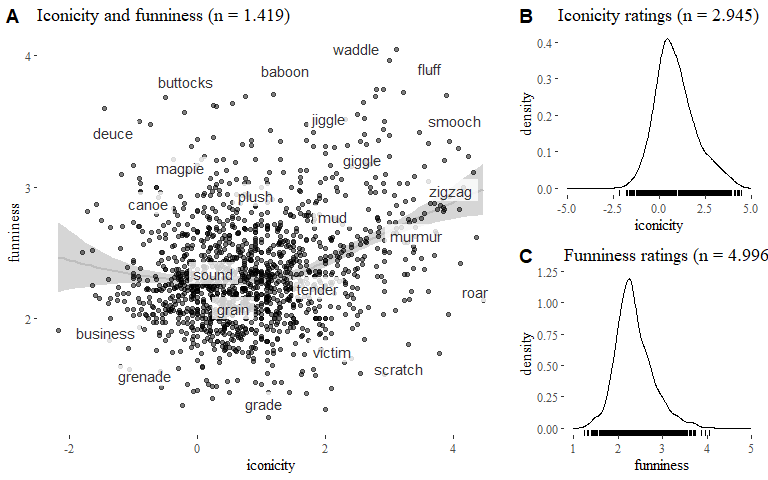
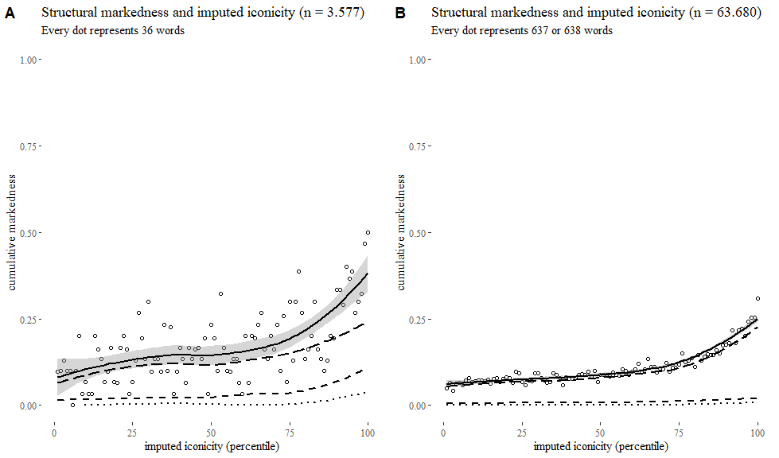
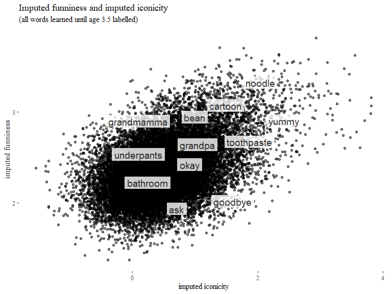

Playful iconicity: data & analyses
================
Mark Dingemanse & Bill Thompson
(this version: 2019-11-22)

  - [Introduction](#introduction)
      - [Data sources](#data-sources)
      - [Descriptive data](#descriptive-data)
      - [Figures](#figures)
  - [Main analyses](#main-analyses)
      - [3.1 Funniness and iconicity](#funniness-and-iconicity)
      - [3.2. Funniness and imputed
        iconicity](#funniness-and-imputed-iconicity)
      - [3.3 Imputed iconicity and imputed
        funniness](#imputed-iconicity-and-imputed-funniness)
      - [3.4 Structural properties of highly rated
        words](#structural-properties-of-highly-rated-words)
  - [Supplementary analyses](#supplementary-analyses)
      - [(includes markedness, phonotactics, morphology, valence, age of
        acquisition)](#includes-markedness-phonotactics-morphology-valence-age-of-acquisition)
  - [End](#end)

## Introduction

This code notebook provides a fully reproducible workflow for the paper
‘Playful iconicity’. To increase readability, not all code chunks
present in the .Rmd source are shown in the output.

### Data sources

Primary data sources:

  - *iconicity ratings*: Perry, Lynn K. et al. Iconicity in the Speech
    of Children and Adults. Developmental Science.
    <doi:10.1111/desc.12572>
  - *funniness ratings*: Engelthaler, Tomas, and Thomas T. Hills. 2017.
    Humor Norms for 4,997 English Words. Behavior Research Methods,
    July, 1-9. <doi:10.3758/s13428-017-0930-6>

We use these ratings in our analyses, but we also feed them to our
[imputation method](/benchmark-prediction.py), which regresses the human
ratings against semantic vectors in order to generate imputed ratings
for an additional 63.721 words.

Secondary data sources:

  - *number of morphemes*: Balota, D. A., Yap, M. J., Hutchison, K. A.,
    Cortese, M. J., Kessler, B., Loftis, B., … Treiman, R. (2007). The
    English Lexicon Project. Behavior Research Methods, 39(3), 445–459.
    doi: 10.3758/BF03193014
  - *word frequency*: Brysbaert, M., New, B., & Keuleers, E. (2012).
    Adding part-of-speech information to the SUBTLEX-US word
    frequencies. Behavior Research Methods, 44(4), 991–997. doi:
    10.3758/s13428-012-0190-4 (for *word frequency*)
  - *lexical decision times*: Keuleers, E., Lacey, P., Rastle, K., &
    Brysbaert, M. (2012). The British Lexicon Project: Lexical decision
    data for 28,730 monosyllabic and disyllabic English words. Behavior
    Research Methods, 44(1), 287-304. doi: 10.3758/s13428-011-0118-4
  - *phonotactic measures*: Vaden, K.I., Halpin, H.R., Hickok, G.S.
    (2009). Irvine Phonotactic Online Dictionary, Version 2.0. \[Data
    file\]. Available from <http://www.iphod.com>.

Secondary data sources used in supplementary analyses:

  - *valence, arousal and dominance*: Warriner, A.B., Kuperman, V., &
    Brysbaert, M. (2013). Norms of valence, arousal, and dominance for
    13,915 English lemmas. Behavior Research Methods, 45, 1191-1207
  - *age of acquisition*: Kuperman, V., Stadthagen-Gonzalez, H., &
    Brysbaert, M. (2012). Age-of-acquisition ratings for 30,000 English
    words. Behavior Research Methods, 44(4), 978-990. doi:
    10.3758/s13428-012-0210-4

After collating these data sources we add a range of summary variables,
mainly for easy plotting and subset selection.

``` r
words <- words %>%
  mutate(fun_perc = ntile(fun,10),
         fun_resid_perc = ntile(fun_resid,10),
         ico_perc = ntile(ico,10),
         diff_rank = fun_perc + ico_perc,
         ico_imputed_perc = ntile(ico_imputed,10),
         hum_imputed_perc = ntile(fun_imputed,10),
         hum_imputed_resid_perc = ntile(fun_imputed_resid,10),
         diff_rank_setB = fun_perc + ico_imputed_perc,
         diff_rank_setC = hum_imputed_perc + ico_imputed_perc,
         logletterfreq_perc = ntile(logletterfreq,10),
         dens_perc = ntile(unsDENS,10),
         biphone_perc = ntile(unsBPAV,10),
         triphone_perc = ntile(unsTPAV,10),
         posprob_perc = ntile(unsPOSPAV,10),
         valence_perc = ntile(valence,10))
```

### Descriptive data

We have **4996** words rated for funniness, **2945** rated for
iconicity, and **1419** in the intersection (set A). We have **3577**
words with human funniness ratings and imputed iconicity ratings (set
B). We have imputed data for a total of **70.245** words, and we’re
venturing outside the realm of rated words for **63.723** of them (set
C).

<table>

<thead>

<tr>

<th style="text-align:left;">

set

</th>

<th style="text-align:right;">

n

</th>

</tr>

</thead>

<tbody>

<tr>

<td style="text-align:left;">

A

</td>

<td style="text-align:right;">

1419

</td>

</tr>

<tr>

<td style="text-align:left;">

B

</td>

<td style="text-align:right;">

3577

</td>

</tr>

<tr>

<td style="text-align:left;">

C

</td>

<td style="text-align:right;">

63723

</td>

</tr>

</tbody>

</table>

The most important columns in the data are shown below for set A. Sets B
and C feature `ico_imputed` and `fun_imputed` instead of or in addition
to the human ratings. The field `diff_rank` is the sum of `fun` and
`ico` deciles for a given word: a word with `diff_rank` 2 occurs in the
first decile (lowest 10%) of both funniness and iconicity ratings, and a
word with `diff_rank` 20 occurs in the 10th decile (highest 10%) of
both.

<table>

<caption>

Structure of the data

</caption>

<thead>

<tr>

<th style="text-align:left;">

word

</th>

<th style="text-align:right;">

ico

</th>

<th style="text-align:right;">

fun

</th>

<th style="text-align:right;">

logletterfreq

</th>

<th style="text-align:right;">

logfreq

</th>

<th style="text-align:right;">

rt

</th>

<th style="text-align:left;">

nmorph

</th>

<th style="text-align:right;">

diff\_rank

</th>

</tr>

</thead>

<tbody>

<tr>

<td style="text-align:left;">

oink

</td>

<td style="text-align:right;">

3.615385

</td>

<td style="text-align:right;">

3.871795

</td>

<td style="text-align:right;">

\-2.865582

</td>

<td style="text-align:right;">

1.748188

</td>

<td style="text-align:right;">

669.3214

</td>

<td style="text-align:left;">

1

</td>

<td style="text-align:right;">

20

</td>

</tr>

</tbody>

</table>

### Figures

For a quick impression of the main findings, this section reproduces the
figures from the paper.

**Figure 1: Overview** <!-- -->

**Figure 3: Funniness and iconicity**

<!-- -->

**Figure 4: Highest rated words**

<!-- -->

**Figure 5: Structural markedness**

<!-- -->

## Main analyses

### 3.1 Funniness and iconicity

#### Reproducing prior results

Engelthaler & Hills report frequency as the strongest correlate with
funniness (less frequent words are rated as more funny), and lexical
decision RT as the second strongest (words with slower RTs are rated as
more funny). By way of sanity check let’s replicate their analysis.

Raw correlations hover around 28%, as reported (without corrections or
controls) in their paper. A linear model with funniness as dependent
variable and frequency and RT as predictors shows a role for both,
though frequency accounts for a much larger portion of the variance
(15%) than rt (0.6%).

To what extent do frequency and RT predict funniness?

**Model m0:** lm(formula = fun \~ logfreq + rt, data = words %\>%
drop\_na(fun))

<table>

<thead>

<tr>

<th style="text-align:left;">

predictor

</th>

<th style="text-align:right;">

df

</th>

<th style="text-align:right;">

SS

</th>

<th style="text-align:right;">

\(F\)

</th>

<th style="text-align:right;">

\(p\)

</th>

<th style="text-align:right;">

partial \(\eta^2\)

</th>

</tr>

</thead>

<tbody>

<tr>

<td style="text-align:left;">

logfreq

</td>

<td style="text-align:right;">

1

</td>

<td style="text-align:right;">

78.329

</td>

<td style="text-align:right;">

454.096

</td>

<td style="text-align:right;">

0

</td>

<td style="text-align:right;">

0.083

</td>

</tr>

<tr>

<td style="text-align:left;">

rt

</td>

<td style="text-align:right;">

1

</td>

<td style="text-align:right;">

17.315

</td>

<td style="text-align:right;">

100.380

</td>

<td style="text-align:right;">

0

</td>

<td style="text-align:right;">

0.020

</td>

</tr>

<tr>

<td style="text-align:left;">

Residuals

</td>

<td style="text-align:right;">

4993

</td>

<td style="text-align:right;">

861.264

</td>

<td style="text-align:right;">

</td>

<td style="text-align:right;">

</td>

<td style="text-align:right;">

</td>

</tr>

</tbody>

</table>

#### Known knowns

If frequency and RT explain some of the variance in funniness ratings,
how much is left for iconicity? We’ll do this analysis on the core set
of 1419 words for which we have funniness and iconicity ratings.

Turns out that the magnitude estimate of iconicity is about half that of
frequency, and with positive sign instead of a negative one (higher
funniness ratings go with higher iconicity ratings). The effect of
iconicity ratings is much larger than RT, the second most important
correlate reported by Engelthaler & Hill.

**Model m1.1**: lm(formula = fun \~ logfreq + rt, data = words %\>%
filter(set == , “A”))

<table>

<thead>

<tr>

<th style="text-align:left;">

predictor

</th>

<th style="text-align:right;">

df

</th>

<th style="text-align:right;">

SS

</th>

<th style="text-align:right;">

\(F\)

</th>

<th style="text-align:right;">

\(p\)

</th>

<th style="text-align:right;">

partial \(\eta^2\)

</th>

</tr>

</thead>

<tbody>

<tr>

<td style="text-align:left;">

logfreq

</td>

<td style="text-align:right;">

1

</td>

<td style="text-align:right;">

36.143

</td>

<td style="text-align:right;">

247.813

</td>

<td style="text-align:right;">

0.000

</td>

<td style="text-align:right;">

0.149

</td>

</tr>

<tr>

<td style="text-align:left;">

rt

</td>

<td style="text-align:right;">

1

</td>

<td style="text-align:right;">

1.249

</td>

<td style="text-align:right;">

8.562

</td>

<td style="text-align:right;">

0.003

</td>

<td style="text-align:right;">

0.006

</td>

</tr>

<tr>

<td style="text-align:left;">

Residuals

</td>

<td style="text-align:right;">

1416

</td>

<td style="text-align:right;">

206.519

</td>

<td style="text-align:right;">

</td>

<td style="text-align:right;">

</td>

<td style="text-align:right;">

</td>

</tr>

</tbody>

</table>

**Model m1.2**: lm(formula = fun \~ logfreq + rt + ico, data = words
%\>% filter(set == , “A”))

<table>

<thead>

<tr>

<th style="text-align:left;">

predictor

</th>

<th style="text-align:right;">

df

</th>

<th style="text-align:right;">

SS

</th>

<th style="text-align:right;">

\(F\)

</th>

<th style="text-align:right;">

\(p\)

</th>

<th style="text-align:right;">

partial \(\eta^2\)

</th>

</tr>

</thead>

<tbody>

<tr>

<td style="text-align:left;">

logfreq

</td>

<td style="text-align:right;">

1

</td>

<td style="text-align:right;">

36.143

</td>

<td style="text-align:right;">

258.779

</td>

<td style="text-align:right;">

0.000

</td>

<td style="text-align:right;">

0.155

</td>

</tr>

<tr>

<td style="text-align:left;">

rt

</td>

<td style="text-align:right;">

1

</td>

<td style="text-align:right;">

1.249

</td>

<td style="text-align:right;">

8.941

</td>

<td style="text-align:right;">

0.003

</td>

<td style="text-align:right;">

0.006

</td>

</tr>

<tr>

<td style="text-align:left;">

ico

</td>

<td style="text-align:right;">

1

</td>

<td style="text-align:right;">

8.891

</td>

<td style="text-align:right;">

63.661

</td>

<td style="text-align:right;">

0.000

</td>

<td style="text-align:right;">

0.043

</td>

</tr>

<tr>

<td style="text-align:left;">

Residuals

</td>

<td style="text-align:right;">

1415

</td>

<td style="text-align:right;">

197.628

</td>

<td style="text-align:right;">

</td>

<td style="text-align:right;">

</td>

<td style="text-align:right;">

</td>

</tr>

</tbody>

</table>

<table>

<caption>

model comparison of m1.1 and m1.2

</caption>

<thead>

<tr>

<th style="text-align:right;">

Res.Df

</th>

<th style="text-align:right;">

RSS

</th>

<th style="text-align:right;">

Df

</th>

<th style="text-align:right;">

Sum of Sq

</th>

<th style="text-align:right;">

F

</th>

<th style="text-align:right;">

Pr(\>F)

</th>

</tr>

</thead>

<tbody>

<tr>

<td style="text-align:right;">

1416

</td>

<td style="text-align:right;">

206.5194

</td>

<td style="text-align:right;">

</td>

<td style="text-align:right;">

</td>

<td style="text-align:right;">

</td>

<td style="text-align:right;">

</td>

</tr>

<tr>

<td style="text-align:right;">

1415

</td>

<td style="text-align:right;">

197.6281

</td>

<td style="text-align:right;">

1

</td>

<td style="text-align:right;">

8.891332

</td>

<td style="text-align:right;">

63.66118

</td>

<td style="text-align:right;">

0

</td>

</tr>

</tbody>

</table>

Partial correlations show 20.6% covariance between funniness and
iconicity, partialing out log frequency as a mediator. This shows the
effects of iconicity and funniness are not reducible to frequency alone.

<table>

<caption>

funniness and iconicity controlling for word frequency

</caption>

<thead>

<tr>

<th style="text-align:right;">

estimate

</th>

<th style="text-align:right;">

p.value

</th>

<th style="text-align:right;">

statistic

</th>

<th style="text-align:right;">

n

</th>

<th style="text-align:right;">

gp

</th>

<th style="text-align:left;">

Method

</th>

</tr>

</thead>

<tbody>

<tr>

<td style="text-align:right;">

0.2064276

</td>

<td style="text-align:right;">

0

</td>

<td style="text-align:right;">

7.938811

</td>

<td style="text-align:right;">

1419

</td>

<td style="text-align:right;">

1

</td>

<td style="text-align:left;">

pearson

</td>

</tr>

</tbody>

</table>

**Example words**

Both high: *zigzag, squeak, chirp, pop, clunk, moo, clang, oink, zoom,
smooch, babble, squawk, thud, gush, fluff, flop, waddle, giggle, tinkle,
ooze*

Both low: *silent, statement, poor, cellar, incest, window, lie, coffin,
platform, address, slave, wait, year, case*

High funniness, low iconicity: *belly, buttocks, beaver, chipmunk,
turkey, bra, hippo, chimp, blonde, penis, pun, dingo, trombone, deuce,
lark, gander, magpie, tongue, giraffe, hoe*

High iconicity, low funniness: *click, roar, crash, chime, scratch,
swift, sunshine, low, break, clash, shoot, airplane, dread*

N.B. controlling for frequency in these lists (by using `fun_resid`
instead of `fun`) does not make a difference in ranking, so not done
here and elsewhere.

What about compound nouns among high iconicity words? From eyeballing,
it seems to be about 10% in a set of the highest rated 200 nouns. Many
probable examples can be found by looking at highly rated nouns with
multiple morphemes: *zigzag, buzzer, skateboard, sunshine, zipper,
freezer, snowball, juggler, airplane, bedroom, goldfish, seaweed,
lipstick, mixer, corkscrew, doorknob, killer, moonlight, tummy, kingdom,
razor, singer, ashtray, fireworks, pliers, racer, uproar* (*zigzag*, one
of the few reduplicative words in English, is included here because the
Balota et al. database lists it as having 2 morphemes).

### 3.2. Funniness and imputed iconicity

Here we study the link between funniness ratings and imputed iconicity
ratings.

Compared to model m2.1 with just log frequency and lexical decision time
as predictors, model m2.2 including imputed iconicity as predictor
provides a significantly better fit and explains a larger portion of the
variance.

**Model m2.1**: lm(formula = fun \~ logfreq + rt, data = words.setB)

<table>

<thead>

<tr>

<th style="text-align:left;">

predictor

</th>

<th style="text-align:right;">

df

</th>

<th style="text-align:right;">

SS

</th>

<th style="text-align:right;">

\(F\)

</th>

<th style="text-align:right;">

\(p\)

</th>

<th style="text-align:right;">

partial \(\eta^2\)

</th>

</tr>

</thead>

<tbody>

<tr>

<td style="text-align:left;">

logfreq

</td>

<td style="text-align:right;">

1

</td>

<td style="text-align:right;">

39.528

</td>

<td style="text-align:right;">

218.214

</td>

<td style="text-align:right;">

0

</td>

<td style="text-align:right;">

0.058

</td>

</tr>

<tr>

<td style="text-align:left;">

rt

</td>

<td style="text-align:right;">

1

</td>

<td style="text-align:right;">

20.487

</td>

<td style="text-align:right;">

113.100

</td>

<td style="text-align:right;">

0

</td>

<td style="text-align:right;">

0.031

</td>

</tr>

<tr>

<td style="text-align:left;">

Residuals

</td>

<td style="text-align:right;">

3574

</td>

<td style="text-align:right;">

647.400

</td>

<td style="text-align:right;">

</td>

<td style="text-align:right;">

</td>

<td style="text-align:right;">

</td>

</tr>

</tbody>

</table>

**Model m2.2**: lm(formula = fun \~ logfreq + rt + ico\_imputed, data =
words.setB)

<table>

<thead>

<tr>

<th style="text-align:left;">

predictor

</th>

<th style="text-align:right;">

df

</th>

<th style="text-align:right;">

SS

</th>

<th style="text-align:right;">

\(F\)

</th>

<th style="text-align:right;">

\(p\)

</th>

<th style="text-align:right;">

partial \(\eta^2\)

</th>

</tr>

</thead>

<tbody>

<tr>

<td style="text-align:left;">

logfreq

</td>

<td style="text-align:right;">

1

</td>

<td style="text-align:right;">

39.528

</td>

<td style="text-align:right;">

245.736

</td>

<td style="text-align:right;">

0

</td>

<td style="text-align:right;">

0.064

</td>

</tr>

<tr>

<td style="text-align:left;">

rt

</td>

<td style="text-align:right;">

1

</td>

<td style="text-align:right;">

20.487

</td>

<td style="text-align:right;">

127.365

</td>

<td style="text-align:right;">

0

</td>

<td style="text-align:right;">

0.034

</td>

</tr>

<tr>

<td style="text-align:left;">

ico\_imputed

</td>

<td style="text-align:right;">

1

</td>

<td style="text-align:right;">

72.669

</td>

<td style="text-align:right;">

451.769

</td>

<td style="text-align:right;">

0

</td>

<td style="text-align:right;">

0.112

</td>

</tr>

<tr>

<td style="text-align:left;">

Residuals

</td>

<td style="text-align:right;">

3573

</td>

<td style="text-align:right;">

574.731

</td>

<td style="text-align:right;">

</td>

<td style="text-align:right;">

</td>

<td style="text-align:right;">

</td>

</tr>

</tbody>

</table>

<table>

<caption>

model comparison

</caption>

<thead>

<tr>

<th style="text-align:right;">

Res.Df

</th>

<th style="text-align:right;">

RSS

</th>

<th style="text-align:right;">

Df

</th>

<th style="text-align:right;">

Sum of Sq

</th>

<th style="text-align:right;">

F

</th>

<th style="text-align:right;">

Pr(\>F)

</th>

</tr>

</thead>

<tbody>

<tr>

<td style="text-align:right;">

3574

</td>

<td style="text-align:right;">

647.3997

</td>

<td style="text-align:right;">

</td>

<td style="text-align:right;">

</td>

<td style="text-align:right;">

</td>

<td style="text-align:right;">

</td>

</tr>

<tr>

<td style="text-align:right;">

3573

</td>

<td style="text-align:right;">

574.7308

</td>

<td style="text-align:right;">

1

</td>

<td style="text-align:right;">

72.66885

</td>

<td style="text-align:right;">

451.7694

</td>

<td style="text-align:right;">

0

</td>

</tr>

</tbody>

</table>

A partial correlations analysis shows that imputed iconicity values
correlate with funniness ratings at at least the same level as actual
iconicity ratings, controlling for frequency (r = 0.32, p \< 0.0001).

**Example words**

High imputed funniness and high imputed iconicity: *swish, chug, bop,
gobble, smack, blip, whack, oomph, poke, wallop, funk, chuckle, quickie,
wriggle, quiver, scamp, burp, hooky, oodles, weasel*

Low imputed funniness and low imputed iconicity: *subject, ransom,
libel, bible, siege, hospice, conduct, arsenic, clothing, negro, mosque,
typhoid, request, expense, author, length, anthrax, mandate, plaintiff,
hostage*

High funniness and low imputed iconicity: *heifer, dinghy, cuckold,
nudist, sheepdog, oddball, spam, harlot, getup, rickshaw, sac, kiwi,
whorehouse, soiree, condom, plaything, croquet, charade, fiver, loch*

Low funniness and high imputed iconicity: *shudder, scrape, taps,
fright, heartbeat, puncture, choke, tremor, biceps, glimpse, disgust,
doom, stir, dent, scold, bully, reign, blister, check, horror*

What about analysable compounds among high iconicity nouns? Here too
about 10%, with examples like *heartbeat, mouthful, handshake, bellboy,
comeback, catchphrase*.

### 3.3 Imputed iconicity and imputed funniness

Model 3.1: lm(formula = fun\_imputed \~ logfreq + rt, data = words.setC)

<table>

<thead>

<tr>

<th style="text-align:left;">

predictor

</th>

<th style="text-align:right;">

df

</th>

<th style="text-align:right;">

SS

</th>

<th style="text-align:right;">

\(F\)

</th>

<th style="text-align:right;">

\(p\)

</th>

<th style="text-align:right;">

partial \(\eta^2\)

</th>

</tr>

</thead>

<tbody>

<tr>

<td style="text-align:left;">

logfreq

</td>

<td style="text-align:right;">

1

</td>

<td style="text-align:right;">

91.757

</td>

<td style="text-align:right;">

1004.158

</td>

<td style="text-align:right;">

0

</td>

<td style="text-align:right;">

0.050

</td>

</tr>

<tr>

<td style="text-align:left;">

rt

</td>

<td style="text-align:right;">

1

</td>

<td style="text-align:right;">

13.480

</td>

<td style="text-align:right;">

147.523

</td>

<td style="text-align:right;">

0

</td>

<td style="text-align:right;">

0.008

</td>

</tr>

<tr>

<td style="text-align:left;">

Residuals

</td>

<td style="text-align:right;">

19232

</td>

<td style="text-align:right;">

1757.369

</td>

<td style="text-align:right;">

</td>

<td style="text-align:right;">

</td>

<td style="text-align:right;">

</td>

</tr>

</tbody>

</table>

Model 3.2: lm(formula = fun\_imputed \~ logfreq + rt + ico\_imputed,
data = words.setC)

<table>

<thead>

<tr>

<th style="text-align:left;">

predictor

</th>

<th style="text-align:right;">

df

</th>

<th style="text-align:right;">

SS

</th>

<th style="text-align:right;">

\(F\)

</th>

<th style="text-align:right;">

\(p\)

</th>

<th style="text-align:right;">

partial \(\eta^2\)

</th>

</tr>

</thead>

<tbody>

<tr>

<td style="text-align:left;">

logfreq

</td>

<td style="text-align:right;">

1

</td>

<td style="text-align:right;">

91.757

</td>

<td style="text-align:right;">

1241.826

</td>

<td style="text-align:right;">

0

</td>

<td style="text-align:right;">

0.061

</td>

</tr>

<tr>

<td style="text-align:left;">

rt

</td>

<td style="text-align:right;">

1

</td>

<td style="text-align:right;">

13.480

</td>

<td style="text-align:right;">

182.439

</td>

<td style="text-align:right;">

0

</td>

<td style="text-align:right;">

0.009

</td>

</tr>

<tr>

<td style="text-align:left;">

ico\_imputed

</td>

<td style="text-align:right;">

1

</td>

<td style="text-align:right;">

336.409

</td>

<td style="text-align:right;">

4552.893

</td>

<td style="text-align:right;">

0

</td>

<td style="text-align:right;">

0.191

</td>

</tr>

<tr>

<td style="text-align:left;">

Residuals

</td>

<td style="text-align:right;">

19231

</td>

<td style="text-align:right;">

1420.960

</td>

<td style="text-align:right;">

</td>

<td style="text-align:right;">

</td>

<td style="text-align:right;">

</td>

</tr>

</tbody>

</table>

<table>

<caption>

model comparison

</caption>

<thead>

<tr>

<th style="text-align:right;">

Res.Df

</th>

<th style="text-align:right;">

RSS

</th>

<th style="text-align:right;">

Df

</th>

<th style="text-align:right;">

Sum of Sq

</th>

<th style="text-align:right;">

F

</th>

<th style="text-align:right;">

Pr(\>F)

</th>

</tr>

</thead>

<tbody>

<tr>

<td style="text-align:right;">

19232

</td>

<td style="text-align:right;">

1757.369

</td>

<td style="text-align:right;">

</td>

<td style="text-align:right;">

</td>

<td style="text-align:right;">

</td>

<td style="text-align:right;">

</td>

</tr>

<tr>

<td style="text-align:right;">

19231

</td>

<td style="text-align:right;">

1420.960

</td>

<td style="text-align:right;">

1

</td>

<td style="text-align:right;">

336.4088

</td>

<td style="text-align:right;">

4552.893

</td>

<td style="text-align:right;">

0

</td>

</tr>

</tbody>

</table>

**Example words**

High imputed funniness and high imputed iconicity: *whoosh, whirr,
whooshing, brr, argh, chomp, whir, swoosh, brrr, zaps, squeaks,
whirring, squelchy, gulps, smacking, growls, clanks, squish, whoo, clop*

Low imputed funniness and low imputed iconicity: *apr, dei, covenants,
palestinians, covenant, clothier, palestinian, variant, mitochondria,
israelis, serb, sufferers, herein, isotope, duration, ciudad, appellant,
palestine, alexandria, infantrymen*

High imputed funniness and low imputed iconicity: *pigs, monkeys, herr,
raja, franz, lulu, von, beau, caviar, penguins, elves, virgins,
lesbians, fez, amuse, hawaiian, hens, salami, perverts, gertrude*

Low imputed funniness and high imputed iconicity: *slashes, gunshots,
footstep, cries, footsteps, fade, froze, cr, swelter, crushing,
piercing, shoots, breathing, sobs, tremors, strokes, choking, slammed,
shocked, ng*

What about compound nouns here? In the top 200 nouns we can spot \~5
(*shockwave, doodlebug, flashbulb, backflip, footstep*) but that is of
course a tiny tail end of a much larger dataset than the earlier two.

A better way is to sample 200 random nouns from a proportionate slice of
the data, i.e. 200 \* 17.8 = 3560 top nouns in imputed iconicity. In
this subset we find at least 30 non-iconic analysable compounds:
*fireworm, deadbolt, footstep, pockmark, uppercut, woodwork, biotech,
notepad, spellbinder, henchmen, quicksands, blowgun, heartbreaks,
moonbeams, sketchpad*, et cetera.

``` r
words.setC %>% 
  filter(ico_imputed_perc > 9,
         POS == "Noun") %>%
  arrange(-ico_imputed) %>%
  slice(1:200) %>%
  dplyr::select(word) %>% unlist %>% unname() 

set.seed(1983)
words.setC %>% 
  filter(ico_imputed_perc > 9,
         POS == "Noun") %>%
  arrange(-ico_imputed) %>%
  slice(1:3560) %>%
  sample_n(200) %>%
  dplyr::select(word) %>% unlist %>% unname() 
```

### 3.4 Structural properties of highly rated words

#### Log letter frequency

Mean iconicity and mean funniness are higher for lower log letter
frequency quantiles:

<table>

<caption>

Mean funniness and iconicity by log letter frequency quantiles

</caption>

<thead>

<tr>

<th style="text-align:right;">

logletterfreq\_perc

</th>

<th style="text-align:right;">

mean\_ico

</th>

<th style="text-align:right;">

mean\_fun

</th>

</tr>

</thead>

<tbody>

<tr>

<td style="text-align:right;">

1

</td>

<td style="text-align:right;">

1.2535179

</td>

<td style="text-align:right;">

2.511225

</td>

</tr>

<tr>

<td style="text-align:right;">

2

</td>

<td style="text-align:right;">

1.1030444

</td>

<td style="text-align:right;">

2.434061

</td>

</tr>

<tr>

<td style="text-align:right;">

3

</td>

<td style="text-align:right;">

0.9435569

</td>

<td style="text-align:right;">

2.339590

</td>

</tr>

<tr>

<td style="text-align:right;">

4

</td>

<td style="text-align:right;">

0.7677072

</td>

<td style="text-align:right;">

2.313565

</td>

</tr>

<tr>

<td style="text-align:right;">

5

</td>

<td style="text-align:right;">

0.6163793

</td>

<td style="text-align:right;">

2.323666

</td>

</tr>

<tr>

<td style="text-align:right;">

6

</td>

<td style="text-align:right;">

0.7206575

</td>

<td style="text-align:right;">

2.286704

</td>

</tr>

<tr>

<td style="text-align:right;">

7

</td>

<td style="text-align:right;">

0.7950753

</td>

<td style="text-align:right;">

2.361308

</td>

</tr>

<tr>

<td style="text-align:right;">

8

</td>

<td style="text-align:right;">

0.8434129

</td>

<td style="text-align:right;">

2.284869

</td>

</tr>

<tr>

<td style="text-align:right;">

9

</td>

<td style="text-align:right;">

0.7531960

</td>

<td style="text-align:right;">

2.249879

</td>

</tr>

<tr>

<td style="text-align:right;">

10

</td>

<td style="text-align:right;">

0.5100479

</td>

<td style="text-align:right;">

2.273432

</td>

</tr>

</tbody>

</table>

High-iconicity high-funniness words tend to have lower log letter
frequencies:

<table>

<caption>

Log letter frequency percentiles for upper quantiles of funniness +
iconicity

</caption>

<thead>

<tr>

<th style="text-align:left;">

word

</th>

<th style="text-align:right;">

fun

</th>

<th style="text-align:right;">

ico

</th>

<th style="text-align:right;">

diff\_rank

</th>

<th style="text-align:right;">

logletterfreq\_perc

</th>

</tr>

</thead>

<tbody>

<tr>

<td style="text-align:left;">

zigzag

</td>

<td style="text-align:right;">

3.113636

</td>

<td style="text-align:right;">

4.300000

</td>

<td style="text-align:right;">

20

</td>

<td style="text-align:right;">

1

</td>

</tr>

<tr>

<td style="text-align:left;">

squeak

</td>

<td style="text-align:right;">

3.230769

</td>

<td style="text-align:right;">

4.230769

</td>

<td style="text-align:right;">

20

</td>

<td style="text-align:right;">

2

</td>

</tr>

<tr>

<td style="text-align:left;">

chirp

</td>

<td style="text-align:right;">

3.000000

</td>

<td style="text-align:right;">

4.142857

</td>

<td style="text-align:right;">

20

</td>

<td style="text-align:right;">

1

</td>

</tr>

<tr>

<td style="text-align:left;">

buzzer

</td>

<td style="text-align:right;">

2.833333

</td>

<td style="text-align:right;">

4.090909

</td>

<td style="text-align:right;">

19

</td>

<td style="text-align:right;">

1

</td>

</tr>

<tr>

<td style="text-align:left;">

pop

</td>

<td style="text-align:right;">

3.294118

</td>

<td style="text-align:right;">

4.076923

</td>

<td style="text-align:right;">

20

</td>

<td style="text-align:right;">

1

</td>

</tr>

<tr>

<td style="text-align:left;">

bleep

</td>

<td style="text-align:right;">

2.931818

</td>

<td style="text-align:right;">

3.928571

</td>

<td style="text-align:right;">

19

</td>

<td style="text-align:right;">

6

</td>

</tr>

<tr>

<td style="text-align:left;">

clunk

</td>

<td style="text-align:right;">

3.344828

</td>

<td style="text-align:right;">

3.928571

</td>

<td style="text-align:right;">

20

</td>

<td style="text-align:right;">

1

</td>

</tr>

<tr>

<td style="text-align:left;">

moo

</td>

<td style="text-align:right;">

3.700000

</td>

<td style="text-align:right;">

3.882353

</td>

<td style="text-align:right;">

20

</td>

<td style="text-align:right;">

4

</td>

</tr>

<tr>

<td style="text-align:left;">

clang

</td>

<td style="text-align:right;">

3.200000

</td>

<td style="text-align:right;">

3.857143

</td>

<td style="text-align:right;">

20

</td>

<td style="text-align:right;">

2

</td>

</tr>

<tr>

<td style="text-align:left;">

boom

</td>

<td style="text-align:right;">

2.829268

</td>

<td style="text-align:right;">

3.846154

</td>

<td style="text-align:right;">

19

</td>

<td style="text-align:right;">

1

</td>

</tr>

<tr>

<td style="text-align:left;">

bang

</td>

<td style="text-align:right;">

2.843750

</td>

<td style="text-align:right;">

3.833333

</td>

<td style="text-align:right;">

19

</td>

<td style="text-align:right;">

1

</td>

</tr>

<tr>

<td style="text-align:left;">

murmur

</td>

<td style="text-align:right;">

2.812500

</td>

<td style="text-align:right;">

3.833333

</td>

<td style="text-align:right;">

19

</td>

<td style="text-align:right;">

1

</td>

</tr>

<tr>

<td style="text-align:left;">

whirl

</td>

<td style="text-align:right;">

2.911765

</td>

<td style="text-align:right;">

3.818182

</td>

<td style="text-align:right;">

19

</td>

<td style="text-align:right;">

2

</td>

</tr>

<tr>

<td style="text-align:left;">

crunch

</td>

<td style="text-align:right;">

2.857143

</td>

<td style="text-align:right;">

3.785714

</td>

<td style="text-align:right;">

19

</td>

<td style="text-align:right;">

1

</td>

</tr>

<tr>

<td style="text-align:left;">

rip

</td>

<td style="text-align:right;">

2.827586

</td>

<td style="text-align:right;">

3.736842

</td>

<td style="text-align:right;">

19

</td>

<td style="text-align:right;">

2

</td>

</tr>

<tr>

<td style="text-align:left;">

sludge

</td>

<td style="text-align:right;">

2.875000

</td>

<td style="text-align:right;">

3.700000

</td>

<td style="text-align:right;">

19

</td>

<td style="text-align:right;">

2

</td>

</tr>

<tr>

<td style="text-align:left;">

ping

</td>

<td style="text-align:right;">

2.875000

</td>

<td style="text-align:right;">

3.636364

</td>

<td style="text-align:right;">

19

</td>

<td style="text-align:right;">

1

</td>

</tr>

<tr>

<td style="text-align:left;">

oink

</td>

<td style="text-align:right;">

3.871795

</td>

<td style="text-align:right;">

3.615385

</td>

<td style="text-align:right;">

20

</td>

<td style="text-align:right;">

3

</td>

</tr>

<tr>

<td style="text-align:left;">

zoom

</td>

<td style="text-align:right;">

3.043478

</td>

<td style="text-align:right;">

3.600000

</td>

<td style="text-align:right;">

20

</td>

<td style="text-align:right;">

1

</td>

</tr>

<tr>

<td style="text-align:left;">

smooch

</td>

<td style="text-align:right;">

3.333333

</td>

<td style="text-align:right;">

3.600000

</td>

<td style="text-align:right;">

20

</td>

<td style="text-align:right;">

3

</td>

</tr>

</tbody>

</table>

Model comparison with funniness as the DV and log letter frequency as an
additional predictor shows that a model including log letter frequency
provides a significantly better fit.

**Model m4.1**: lm(formula = fun \~ logfreq + rt + ico, data = words
%\>% filter(set == , “A”))

<table>

<thead>

<tr>

<th style="text-align:left;">

predictor

</th>

<th style="text-align:right;">

df

</th>

<th style="text-align:right;">

SS

</th>

<th style="text-align:right;">

\(F\)

</th>

<th style="text-align:right;">

\(p\)

</th>

<th style="text-align:right;">

partial \(\eta^2\)

</th>

</tr>

</thead>

<tbody>

<tr>

<td style="text-align:left;">

logfreq

</td>

<td style="text-align:right;">

1

</td>

<td style="text-align:right;">

36.143

</td>

<td style="text-align:right;">

258.779

</td>

<td style="text-align:right;">

0.000

</td>

<td style="text-align:right;">

0.155

</td>

</tr>

<tr>

<td style="text-align:left;">

rt

</td>

<td style="text-align:right;">

1

</td>

<td style="text-align:right;">

1.249

</td>

<td style="text-align:right;">

8.941

</td>

<td style="text-align:right;">

0.003

</td>

<td style="text-align:right;">

0.006

</td>

</tr>

<tr>

<td style="text-align:left;">

ico

</td>

<td style="text-align:right;">

1

</td>

<td style="text-align:right;">

8.891

</td>

<td style="text-align:right;">

63.661

</td>

<td style="text-align:right;">

0.000

</td>

<td style="text-align:right;">

0.043

</td>

</tr>

<tr>

<td style="text-align:left;">

Residuals

</td>

<td style="text-align:right;">

1415

</td>

<td style="text-align:right;">

197.628

</td>

<td style="text-align:right;">

</td>

<td style="text-align:right;">

</td>

<td style="text-align:right;">

</td>

</tr>

</tbody>

</table>

**Model m4.2**: lm(formula = fun \~ logfreq + rt + ico + logletterfreq,
data = words %\>% , filter(set == “A”))

<table>

<thead>

<tr>

<th style="text-align:left;">

predictor

</th>

<th style="text-align:right;">

df

</th>

<th style="text-align:right;">

SS

</th>

<th style="text-align:right;">

\(F\)

</th>

<th style="text-align:right;">

\(p\)

</th>

<th style="text-align:right;">

partial \(\eta^2\)

</th>

</tr>

</thead>

<tbody>

<tr>

<td style="text-align:left;">

logfreq

</td>

<td style="text-align:right;">

1

</td>

<td style="text-align:right;">

36.143

</td>

<td style="text-align:right;">

265.179

</td>

<td style="text-align:right;">

0.000

</td>

<td style="text-align:right;">

0.158

</td>

</tr>

<tr>

<td style="text-align:left;">

rt

</td>

<td style="text-align:right;">

1

</td>

<td style="text-align:right;">

1.249

</td>

<td style="text-align:right;">

9.162

</td>

<td style="text-align:right;">

0.003

</td>

<td style="text-align:right;">

0.006

</td>

</tr>

<tr>

<td style="text-align:left;">

ico

</td>

<td style="text-align:right;">

1

</td>

<td style="text-align:right;">

8.891

</td>

<td style="text-align:right;">

65.236

</td>

<td style="text-align:right;">

0.000

</td>

<td style="text-align:right;">

0.044

</td>

</tr>

<tr>

<td style="text-align:left;">

logletterfreq

</td>

<td style="text-align:right;">

1

</td>

<td style="text-align:right;">

4.906

</td>

<td style="text-align:right;">

35.994

</td>

<td style="text-align:right;">

0.000

</td>

<td style="text-align:right;">

0.025

</td>

</tr>

<tr>

<td style="text-align:left;">

Residuals

</td>

<td style="text-align:right;">

1414

</td>

<td style="text-align:right;">

192.722

</td>

<td style="text-align:right;">

</td>

<td style="text-align:right;">

</td>

<td style="text-align:right;">

</td>

</tr>

</tbody>

</table>

<table>

<caption>

model comparison

</caption>

<thead>

<tr>

<th style="text-align:right;">

Res.Df

</th>

<th style="text-align:right;">

RSS

</th>

<th style="text-align:right;">

Df

</th>

<th style="text-align:right;">

Sum of Sq

</th>

<th style="text-align:right;">

F

</th>

<th style="text-align:right;">

Pr(\>F)

</th>

</tr>

</thead>

<tbody>

<tr>

<td style="text-align:right;">

1415

</td>

<td style="text-align:right;">

197.6281

</td>

<td style="text-align:right;">

</td>

<td style="text-align:right;">

</td>

<td style="text-align:right;">

</td>

<td style="text-align:right;">

</td>

</tr>

<tr>

<td style="text-align:right;">

1414

</td>

<td style="text-align:right;">

192.7222

</td>

<td style="text-align:right;">

1

</td>

<td style="text-align:right;">

4.905856

</td>

<td style="text-align:right;">

35.9942

</td>

<td style="text-align:right;">

0

</td>

</tr>

</tbody>

</table>

Partial correlations show that funniness rating and log letter frequency
have a covariance of -15.7% controlling for iconicity, and that
iconicity and log letter frequency have a covariance of -16.3%
controlling for funniness ratings (all p \< 0.0001 correcting for
multiple comparisons).

<table>

<caption>

funniness and log letter frequency controlling for iconicity

</caption>

<thead>

<tr>

<th style="text-align:right;">

estimate

</th>

<th style="text-align:right;">

p.value

</th>

<th style="text-align:right;">

statistic

</th>

<th style="text-align:right;">

n

</th>

<th style="text-align:right;">

gp

</th>

<th style="text-align:left;">

Method

</th>

</tr>

</thead>

<tbody>

<tr>

<td style="text-align:right;">

\-0.157001

</td>

<td style="text-align:right;">

0

</td>

<td style="text-align:right;">

\-5.982098

</td>

<td style="text-align:right;">

1419

</td>

<td style="text-align:right;">

1

</td>

<td style="text-align:left;">

pearson

</td>

</tr>

</tbody>

</table>

<table>

<caption>

iconicity and log letter frequency controlling for funniness

</caption>

<thead>

<tr>

<th style="text-align:right;">

estimate

</th>

<th style="text-align:right;">

p.value

</th>

<th style="text-align:right;">

statistic

</th>

<th style="text-align:right;">

n

</th>

<th style="text-align:right;">

gp

</th>

<th style="text-align:left;">

Method

</th>

</tr>

</thead>

<tbody>

<tr>

<td style="text-align:right;">

\-0.1634579

</td>

<td style="text-align:right;">

0

</td>

<td style="text-align:right;">

\-6.234739

</td>

<td style="text-align:right;">

1419

</td>

<td style="text-align:right;">

1

</td>

<td style="text-align:left;">

pearson

</td>

</tr>

</tbody>

</table>

Model comparison for combined funniness and iconicity scores suggests
that having log letter frequency as a predictor significantly improves
fit over and above word frequency and lexical decision time.

**Model m5.1**: lm(formula = funico \~ logfreq + rt, data = words.setA)

<table>

<thead>

<tr>

<th style="text-align:left;">

predictor

</th>

<th style="text-align:right;">

df

</th>

<th style="text-align:right;">

SS

</th>

<th style="text-align:right;">

\(F\)

</th>

<th style="text-align:right;">

\(p\)

</th>

<th style="text-align:right;">

partial \(\eta^2\)

</th>

</tr>

</thead>

<tbody>

<tr>

<td style="text-align:left;">

logfreq

</td>

<td style="text-align:right;">

1

</td>

<td style="text-align:right;">

420.245

</td>

<td style="text-align:right;">

206.078

</td>

<td style="text-align:right;">

0.0

</td>

<td style="text-align:right;">

0.127

</td>

</tr>

<tr>

<td style="text-align:left;">

rt

</td>

<td style="text-align:right;">

1

</td>

<td style="text-align:right;">

5.516

</td>

<td style="text-align:right;">

2.705

</td>

<td style="text-align:right;">

0.1

</td>

<td style="text-align:right;">

0.002

</td>

</tr>

<tr>

<td style="text-align:left;">

Residuals

</td>

<td style="text-align:right;">

1416

</td>

<td style="text-align:right;">

2887.579

</td>

<td style="text-align:right;">

</td>

<td style="text-align:right;">

</td>

<td style="text-align:right;">

</td>

</tr>

</tbody>

</table>

**Model m5.2**: lm(formula = funico \~ logfreq + rt + logletterfreq,
data = words.setA)

<table>

<thead>

<tr>

<th style="text-align:left;">

predictor

</th>

<th style="text-align:right;">

df

</th>

<th style="text-align:right;">

SS

</th>

<th style="text-align:right;">

\(F\)

</th>

<th style="text-align:right;">

\(p\)

</th>

<th style="text-align:right;">

partial \(\eta^2\)

</th>

</tr>

</thead>

<tbody>

<tr>

<td style="text-align:left;">

logfreq

</td>

<td style="text-align:right;">

1

</td>

<td style="text-align:right;">

420.245

</td>

<td style="text-align:right;">

219.963

</td>

<td style="text-align:right;">

0.00

</td>

<td style="text-align:right;">

0.135

</td>

</tr>

<tr>

<td style="text-align:left;">

rt

</td>

<td style="text-align:right;">

1

</td>

<td style="text-align:right;">

5.516

</td>

<td style="text-align:right;">

2.887

</td>

<td style="text-align:right;">

0.09

</td>

<td style="text-align:right;">

0.002

</td>

</tr>

<tr>

<td style="text-align:left;">

logletterfreq

</td>

<td style="text-align:right;">

1

</td>

<td style="text-align:right;">

184.189

</td>

<td style="text-align:right;">

96.407

</td>

<td style="text-align:right;">

0.00

</td>

<td style="text-align:right;">

0.064

</td>

</tr>

<tr>

<td style="text-align:left;">

Residuals

</td>

<td style="text-align:right;">

1415

</td>

<td style="text-align:right;">

2703.390

</td>

<td style="text-align:right;">

</td>

<td style="text-align:right;">

</td>

<td style="text-align:right;">

</td>

</tr>

</tbody>

</table>

<table>

<caption>

model comparison

</caption>

<thead>

<tr>

<th style="text-align:right;">

Res.Df

</th>

<th style="text-align:right;">

RSS

</th>

<th style="text-align:right;">

Df

</th>

<th style="text-align:right;">

Sum of Sq

</th>

<th style="text-align:right;">

F

</th>

<th style="text-align:right;">

Pr(\>F)

</th>

</tr>

</thead>

<tbody>

<tr>

<td style="text-align:right;">

1416

</td>

<td style="text-align:right;">

2887.579

</td>

<td style="text-align:right;">

</td>

<td style="text-align:right;">

</td>

<td style="text-align:right;">

</td>

<td style="text-align:right;">

</td>

</tr>

<tr>

<td style="text-align:right;">

1415

</td>

<td style="text-align:right;">

2703.390

</td>

<td style="text-align:right;">

1

</td>

<td style="text-align:right;">

184.1887

</td>

<td style="text-align:right;">

96.40745

</td>

<td style="text-align:right;">

0

</td>

</tr>

</tbody>

</table>

#### Structural analysis

We carry out a qualitative analysis of the 80 highest ranked words (top
deciles for funniness+iconicity) to see if there are formal cues of
foregrounding and structural markedness that can help predict funniness
and iconicity ratings. Then we find these cues in the larger dataset and
see if the patterns hold up.

This analysis reveals the following sets of complex onsets, codas, and
verbal diminutive suffixes that are likely structural cues of markedness
(given here in the form of regular expressions):

  - onsets: `^(bl|cl|cr|dr|fl|sc|sl|sn|sp|spl|sw|tr|pr|sq)`
  - codas: `(nch|mp|nk|rt|rl|rr|sh|wk)$`
  - verbal suffix: `[b-df-hj-np-tv-xz]le)$`" (i.e., look for -le after a
    consonant)

We tag these cues across the whole dataset (looking for the *-le* suffix
only in verbs because words like *mutable, unnameable, scalable,
manacle* are not the same phenomenon) in order to see how they relate to
funniness and iconicity.

Model the contribution of markedness relative to logletter frequency.
Model comparison shows that a model including the measure of cumulative
markedness as predictor provides a significantly better fit (F = 52.78,
p \< 0.0001) and explains a larger portion of the variance (adjusted R2
= 0.21 vs. 0.18) than a model with just word frequency, lexical decision
time and log letter frequency.

**Model m5.3**: lm(formula = funico \~ logfreq + rt + logletterfreq +
cumulative, , data = words.setA)

<table>

<thead>

<tr>

<th style="text-align:left;">

predictor

</th>

<th style="text-align:right;">

df

</th>

<th style="text-align:right;">

SS

</th>

<th style="text-align:right;">

\(F\)

</th>

<th style="text-align:right;">

\(p\)

</th>

<th style="text-align:right;">

partial \(\eta^2\)

</th>

</tr>

</thead>

<tbody>

<tr>

<td style="text-align:left;">

logfreq

</td>

<td style="text-align:right;">

1

</td>

<td style="text-align:right;">

420.245

</td>

<td style="text-align:right;">

228.013

</td>

<td style="text-align:right;">

0.000

</td>

<td style="text-align:right;">

0.139

</td>

</tr>

<tr>

<td style="text-align:left;">

rt

</td>

<td style="text-align:right;">

1

</td>

<td style="text-align:right;">

5.516

</td>

<td style="text-align:right;">

2.993

</td>

<td style="text-align:right;">

0.084

</td>

<td style="text-align:right;">

0.002

</td>

</tr>

<tr>

<td style="text-align:left;">

logletterfreq

</td>

<td style="text-align:right;">

1

</td>

<td style="text-align:right;">

184.189

</td>

<td style="text-align:right;">

99.936

</td>

<td style="text-align:right;">

0.000

</td>

<td style="text-align:right;">

0.066

</td>

</tr>

<tr>

<td style="text-align:left;">

cumulative

</td>

<td style="text-align:right;">

1

</td>

<td style="text-align:right;">

97.283

</td>

<td style="text-align:right;">

52.783

</td>

<td style="text-align:right;">

0.000

</td>

<td style="text-align:right;">

0.036

</td>

</tr>

<tr>

<td style="text-align:left;">

Residuals

</td>

<td style="text-align:right;">

1414

</td>

<td style="text-align:right;">

2606.107

</td>

<td style="text-align:right;">

</td>

<td style="text-align:right;">

</td>

<td style="text-align:right;">

</td>

</tr>

</tbody>

</table>

<table>

<caption>

Model comparison of m5.2 and m5.3

</caption>

<thead>

<tr>

<th style="text-align:right;">

Res.Df

</th>

<th style="text-align:right;">

RSS

</th>

<th style="text-align:right;">

Df

</th>

<th style="text-align:right;">

Sum of Sq

</th>

<th style="text-align:right;">

F

</th>

<th style="text-align:right;">

Pr(\>F)

</th>

</tr>

</thead>

<tbody>

<tr>

<td style="text-align:right;">

1415

</td>

<td style="text-align:right;">

2703.390

</td>

<td style="text-align:right;">

</td>

<td style="text-align:right;">

</td>

<td style="text-align:right;">

</td>

<td style="text-align:right;">

</td>

</tr>

<tr>

<td style="text-align:right;">

1414

</td>

<td style="text-align:right;">

2606.107

</td>

<td style="text-align:right;">

1

</td>

<td style="text-align:right;">

97.28312

</td>

<td style="text-align:right;">

52.78307

</td>

<td style="text-align:right;">

0

</td>

</tr>

</tbody>

</table>

Now we trace cumulative markedness in the imputed portions of the
dataset, and do the same model comparison as above.

First have a look at a random sample of top imputed words and their
markedness:

<table>

<caption>

Cumulative markedness in a random sample of words from the highest
quantile of imputed iconicity

</caption>

<thead>

<tr>

<th style="text-align:left;">

word

</th>

<th style="text-align:right;">

ico\_imputed\_perc

</th>

<th style="text-align:right;">

ico\_imputed

</th>

<th style="text-align:right;">

cumulative

</th>

</tr>

</thead>

<tbody>

<tr>

<td style="text-align:left;">

squish

</td>

<td style="text-align:right;">

10

</td>

<td style="text-align:right;">

3.570914

</td>

<td style="text-align:right;">

2

</td>

</tr>

<tr>

<td style="text-align:left;">

squiggle

</td>

<td style="text-align:right;">

10

</td>

<td style="text-align:right;">

2.594691

</td>

<td style="text-align:right;">

1

</td>

</tr>

<tr>

<td style="text-align:left;">

scraping

</td>

<td style="text-align:right;">

10

</td>

<td style="text-align:right;">

2.537723

</td>

<td style="text-align:right;">

1

</td>

</tr>

<tr>

<td style="text-align:left;">

scamp

</td>

<td style="text-align:right;">

10

</td>

<td style="text-align:right;">

2.397420

</td>

<td style="text-align:right;">

2

</td>

</tr>

<tr>

<td style="text-align:left;">

spank

</td>

<td style="text-align:right;">

10

</td>

<td style="text-align:right;">

2.360551

</td>

<td style="text-align:right;">

2

</td>

</tr>

<tr>

<td style="text-align:left;">

squoosh

</td>

<td style="text-align:right;">

10

</td>

<td style="text-align:right;">

2.312993

</td>

<td style="text-align:right;">

2

</td>

</tr>

<tr>

<td style="text-align:left;">

crunk

</td>

<td style="text-align:right;">

10

</td>

<td style="text-align:right;">

2.165342

</td>

<td style="text-align:right;">

2

</td>

</tr>

<tr>

<td style="text-align:left;">

sweeps

</td>

<td style="text-align:right;">

10

</td>

<td style="text-align:right;">

1.959795

</td>

<td style="text-align:right;">

1

</td>

</tr>

<tr>

<td style="text-align:left;">

squirting

</td>

<td style="text-align:right;">

10

</td>

<td style="text-align:right;">

1.919734

</td>

<td style="text-align:right;">

1

</td>

</tr>

<tr>

<td style="text-align:left;">

arr

</td>

<td style="text-align:right;">

10

</td>

<td style="text-align:right;">

1.870472

</td>

<td style="text-align:right;">

1

</td>

</tr>

<tr>

<td style="text-align:left;">

cloudless

</td>

<td style="text-align:right;">

10

</td>

<td style="text-align:right;">

1.758071

</td>

<td style="text-align:right;">

1

</td>

</tr>

<tr>

<td style="text-align:left;">

flourish

</td>

<td style="text-align:right;">

10

</td>

<td style="text-align:right;">

1.722582

</td>

<td style="text-align:right;">

2

</td>

</tr>

<tr>

<td style="text-align:left;">

pried

</td>

<td style="text-align:right;">

10

</td>

<td style="text-align:right;">

1.642401

</td>

<td style="text-align:right;">

1

</td>

</tr>

<tr>

<td style="text-align:left;">

snappish

</td>

<td style="text-align:right;">

10

</td>

<td style="text-align:right;">

1.612547

</td>

<td style="text-align:right;">

2

</td>

</tr>

<tr>

<td style="text-align:left;">

flush

</td>

<td style="text-align:right;">

10

</td>

<td style="text-align:right;">

1.598260

</td>

<td style="text-align:right;">

2

</td>

</tr>

<tr>

<td style="text-align:left;">

scrumptious

</td>

<td style="text-align:right;">

10

</td>

<td style="text-align:right;">

1.491476

</td>

<td style="text-align:right;">

1

</td>

</tr>

<tr>

<td style="text-align:left;">

blank

</td>

<td style="text-align:right;">

10

</td>

<td style="text-align:right;">

1.435437

</td>

<td style="text-align:right;">

2

</td>

</tr>

<tr>

<td style="text-align:left;">

tramp

</td>

<td style="text-align:right;">

10

</td>

<td style="text-align:right;">

1.426469

</td>

<td style="text-align:right;">

2

</td>

</tr>

<tr>

<td style="text-align:left;">

snaffles

</td>

<td style="text-align:right;">

10

</td>

<td style="text-align:right;">

1.409668

</td>

<td style="text-align:right;">

1

</td>

</tr>

<tr>

<td style="text-align:left;">

suckle

</td>

<td style="text-align:right;">

10

</td>

<td style="text-align:right;">

1.382101

</td>

<td style="text-align:right;">

1

</td>

</tr>

</tbody>

</table>

And at a random sample of words from lower quadrants and their
markedness:

<table>

<caption>

Cumulative markedness in a random sample of words from lower quantiles
of imputed iconicity

</caption>

<thead>

<tr>

<th style="text-align:left;">

word

</th>

<th style="text-align:right;">

ico\_imputed\_perc

</th>

<th style="text-align:right;">

ico\_imputed

</th>

<th style="text-align:right;">

cumulative

</th>

</tr>

</thead>

<tbody>

<tr>

<td style="text-align:left;">

spoilsport

</td>

<td style="text-align:right;">

7

</td>

<td style="text-align:right;">

0.7898544

</td>

<td style="text-align:right;">

2

</td>

</tr>

<tr>

<td style="text-align:left;">

drank

</td>

<td style="text-align:right;">

6

</td>

<td style="text-align:right;">

0.6164557

</td>

<td style="text-align:right;">

2

</td>

</tr>

<tr>

<td style="text-align:left;">

cranial

</td>

<td style="text-align:right;">

6

</td>

<td style="text-align:right;">

0.6046020

</td>

<td style="text-align:right;">

1

</td>

</tr>

<tr>

<td style="text-align:left;">

pragmatically

</td>

<td style="text-align:right;">

6

</td>

<td style="text-align:right;">

0.5722633

</td>

<td style="text-align:right;">

1

</td>

</tr>

<tr>

<td style="text-align:left;">

sloughed

</td>

<td style="text-align:right;">

6

</td>

<td style="text-align:right;">

0.5457573

</td>

<td style="text-align:right;">

1

</td>

</tr>

<tr>

<td style="text-align:left;">

sweetfish

</td>

<td style="text-align:right;">

6

</td>

<td style="text-align:right;">

0.5390918

</td>

<td style="text-align:right;">

2

</td>

</tr>

<tr>

<td style="text-align:left;">

schrank

</td>

<td style="text-align:right;">

5

</td>

<td style="text-align:right;">

0.4676592

</td>

<td style="text-align:right;">

2

</td>

</tr>

<tr>

<td style="text-align:left;">

criticising

</td>

<td style="text-align:right;">

5

</td>

<td style="text-align:right;">

0.4053748

</td>

<td style="text-align:right;">

1

</td>

</tr>

<tr>

<td style="text-align:left;">

flatfish

</td>

<td style="text-align:right;">

5

</td>

<td style="text-align:right;">

0.3870658

</td>

<td style="text-align:right;">

2

</td>

</tr>

<tr>

<td style="text-align:left;">

preciouses

</td>

<td style="text-align:right;">

4

</td>

<td style="text-align:right;">

0.3157891

</td>

<td style="text-align:right;">

1

</td>

</tr>

<tr>

<td style="text-align:left;">

trench

</td>

<td style="text-align:right;">

4

</td>

<td style="text-align:right;">

0.2827599

</td>

<td style="text-align:right;">

2

</td>

</tr>

<tr>

<td style="text-align:left;">

splurge

</td>

<td style="text-align:right;">

4

</td>

<td style="text-align:right;">

0.2610832

</td>

<td style="text-align:right;">

1

</td>

</tr>

<tr>

<td style="text-align:left;">

creates

</td>

<td style="text-align:right;">

4

</td>

<td style="text-align:right;">

0.2384936

</td>

<td style="text-align:right;">

1

</td>

</tr>

<tr>

<td style="text-align:left;">

preshrunk

</td>

<td style="text-align:right;">

3

</td>

<td style="text-align:right;">

0.1581131

</td>

<td style="text-align:right;">

2

</td>

</tr>

<tr>

<td style="text-align:left;">

prelaunch

</td>

<td style="text-align:right;">

3

</td>

<td style="text-align:right;">

0.0355877

</td>

<td style="text-align:right;">

2

</td>

</tr>

<tr>

<td style="text-align:left;">

spearfish

</td>

<td style="text-align:right;">

2

</td>

<td style="text-align:right;">

0.0134083

</td>

<td style="text-align:right;">

2

</td>

</tr>

<tr>

<td style="text-align:left;">

flemish

</td>

<td style="text-align:right;">

2

</td>

<td style="text-align:right;">

\-0.0374782

</td>

<td style="text-align:right;">

2

</td>

</tr>

<tr>

<td style="text-align:left;">

creationists

</td>

<td style="text-align:right;">

2

</td>

<td style="text-align:right;">

\-0.0599508

</td>

<td style="text-align:right;">

1

</td>

</tr>

<tr>

<td style="text-align:left;">

scripting

</td>

<td style="text-align:right;">

1

</td>

<td style="text-align:right;">

\-0.2189394

</td>

<td style="text-align:right;">

1

</td>

</tr>

<tr>

<td style="text-align:left;">

pronouns

</td>

<td style="text-align:right;">

1

</td>

<td style="text-align:right;">

\-0.2318031

</td>

<td style="text-align:right;">

1

</td>

</tr>

</tbody>

</table>

Looks like random samples of 20 high-complexity words always feature a
majority of high iconicity words:

<table>

<caption>

Imputed ratings for 20 random words high in cumulative markedness

</caption>

<thead>

<tr>

<th style="text-align:left;">

word

</th>

<th style="text-align:right;">

ico\_imputed\_perc

</th>

<th style="text-align:right;">

ico\_imputed

</th>

<th style="text-align:right;">

fun\_imputed

</th>

<th style="text-align:right;">

cumulative

</th>

</tr>

</thead>

<tbody>

<tr>

<td style="text-align:left;">

squoosh

</td>

<td style="text-align:right;">

10

</td>

<td style="text-align:right;">

2.3129932

</td>

<td style="text-align:right;">

2.945588

</td>

<td style="text-align:right;">

2

</td>

</tr>

<tr>

<td style="text-align:left;">

squirt

</td>

<td style="text-align:right;">

10

</td>

<td style="text-align:right;">

2.1139378

</td>

<td style="text-align:right;">

3.302116

</td>

<td style="text-align:right;">

2

</td>

</tr>

<tr>

<td style="text-align:left;">

crump

</td>

<td style="text-align:right;">

10

</td>

<td style="text-align:right;">

1.7575309

</td>

<td style="text-align:right;">

3.072162

</td>

<td style="text-align:right;">

2

</td>

</tr>

<tr>

<td style="text-align:left;">

snaffle

</td>

<td style="text-align:right;">

10

</td>

<td style="text-align:right;">

1.6898653

</td>

<td style="text-align:right;">

3.005494

</td>

<td style="text-align:right;">

2

</td>

</tr>

<tr>

<td style="text-align:left;">

crank

</td>

<td style="text-align:right;">

10

</td>

<td style="text-align:right;">

1.6032802

</td>

<td style="text-align:right;">

2.772123

</td>

<td style="text-align:right;">

2

</td>

</tr>

<tr>

<td style="text-align:left;">

flush

</td>

<td style="text-align:right;">

10

</td>

<td style="text-align:right;">

1.5982598

</td>

<td style="text-align:right;">

2.668945

</td>

<td style="text-align:right;">

2

</td>

</tr>

<tr>

<td style="text-align:left;">

clump

</td>

<td style="text-align:right;">

10

</td>

<td style="text-align:right;">

1.5840648

</td>

<td style="text-align:right;">

2.744887

</td>

<td style="text-align:right;">

2

</td>

</tr>

<tr>

<td style="text-align:left;">

spangle

</td>

<td style="text-align:right;">

10

</td>

<td style="text-align:right;">

1.5792685

</td>

<td style="text-align:right;">

3.046803

</td>

<td style="text-align:right;">

2

</td>

</tr>

<tr>

<td style="text-align:left;">

scribble

</td>

<td style="text-align:right;">

10

</td>

<td style="text-align:right;">

1.5335878

</td>

<td style="text-align:right;">

2.832759

</td>

<td style="text-align:right;">

2

</td>

</tr>

<tr>

<td style="text-align:left;">

swink

</td>

<td style="text-align:right;">

10

</td>

<td style="text-align:right;">

1.5061947

</td>

<td style="text-align:right;">

3.015406

</td>

<td style="text-align:right;">

2

</td>

</tr>

<tr>

<td style="text-align:left;">

tramp

</td>

<td style="text-align:right;">

10

</td>

<td style="text-align:right;">

1.4264688

</td>

<td style="text-align:right;">

2.899633

</td>

<td style="text-align:right;">

2

</td>

</tr>

<tr>

<td style="text-align:left;">

slapdash

</td>

<td style="text-align:right;">

9

</td>

<td style="text-align:right;">

1.3323017

</td>

<td style="text-align:right;">

2.544342

</td>

<td style="text-align:right;">

2

</td>

</tr>

<tr>

<td style="text-align:left;">

prank

</td>

<td style="text-align:right;">

8

</td>

<td style="text-align:right;">

0.9101965

</td>

<td style="text-align:right;">

3.091282

</td>

<td style="text-align:right;">

2

</td>

</tr>

<tr>

<td style="text-align:left;">

crawfish

</td>

<td style="text-align:right;">

8

</td>

<td style="text-align:right;">

0.8564163

</td>

<td style="text-align:right;">

2.726631

</td>

<td style="text-align:right;">

2

</td>

</tr>

<tr>

<td style="text-align:left;">

sweetheart

</td>

<td style="text-align:right;">

8

</td>

<td style="text-align:right;">

0.8273857

</td>

<td style="text-align:right;">

2.711589

</td>

<td style="text-align:right;">

2

</td>

</tr>

<tr>

<td style="text-align:left;">

spinsterish

</td>

<td style="text-align:right;">

6

</td>

<td style="text-align:right;">

0.5475747

</td>

<td style="text-align:right;">

2.329725

</td>

<td style="text-align:right;">

2

</td>

</tr>

<tr>

<td style="text-align:left;">

scrimp

</td>

<td style="text-align:right;">

5

</td>

<td style="text-align:right;">

0.4658493

</td>

<td style="text-align:right;">

2.534127

</td>

<td style="text-align:right;">

2

</td>

</tr>

<tr>

<td style="text-align:left;">

flatfish

</td>

<td style="text-align:right;">

5

</td>

<td style="text-align:right;">

0.3870658

</td>

<td style="text-align:right;">

2.628965

</td>

<td style="text-align:right;">

2

</td>

</tr>

<tr>

<td style="text-align:left;">

prelaunch

</td>

<td style="text-align:right;">

3

</td>

<td style="text-align:right;">

0.0355877

</td>

<td style="text-align:right;">

2.304523

</td>

<td style="text-align:right;">

2

</td>

</tr>

<tr>

<td style="text-align:left;">

scottish

</td>

<td style="text-align:right;">

1

</td>

<td style="text-align:right;">

\-0.2946582

</td>

<td style="text-align:right;">

2.556597

</td>

<td style="text-align:right;">

2

</td>

</tr>

</tbody>

</table>

Let’s have a closer look at subsets. First quadrants, then deciles.

<table>

<caption>

Markedness cues across quartiles of imputed iconicity

</caption>

<thead>

<tr>

<th style="text-align:right;">

target\_perc

</th>

<th style="text-align:right;">

n

</th>

<th style="text-align:right;">

onset

</th>

<th style="text-align:right;">

coda

</th>

<th style="text-align:right;">

verbdim

</th>

<th style="text-align:right;">

complexity

</th>

</tr>

</thead>

<tbody>

<tr>

<td style="text-align:right;">

1

</td>

<td style="text-align:right;">

15931

</td>

<td style="text-align:right;">

0.0639006

</td>

<td style="text-align:right;">

0.0060260

</td>

<td style="text-align:right;">

0.0003766

</td>

<td style="text-align:right;">

0.0703032

</td>

</tr>

<tr>

<td style="text-align:right;">

2

</td>

<td style="text-align:right;">

15931

</td>

<td style="text-align:right;">

0.0731906

</td>

<td style="text-align:right;">

0.0076580

</td>

<td style="text-align:right;">

0.0009416

</td>

<td style="text-align:right;">

0.0817902

</td>

</tr>

<tr>

<td style="text-align:right;">

3

</td>

<td style="text-align:right;">

15931

</td>

<td style="text-align:right;">

0.0923985

</td>

<td style="text-align:right;">

0.0096667

</td>

<td style="text-align:right;">

0.0009416

</td>

<td style="text-align:right;">

0.1030067

</td>

</tr>

<tr>

<td style="text-align:right;">

4

</td>

<td style="text-align:right;">

15930

</td>

<td style="text-align:right;">

0.1583176

</td>

<td style="text-align:right;">

0.0156309

</td>

<td style="text-align:right;">

0.0049592

</td>

<td style="text-align:right;">

0.1789077

</td>

</tr>

</tbody>

</table>

<table>

<caption>

Markedness cues across deciles of imputed iconicity

</caption>

<thead>

<tr>

<th style="text-align:right;">

target\_perc

</th>

<th style="text-align:right;">

n

</th>

<th style="text-align:right;">

onset

</th>

<th style="text-align:right;">

coda

</th>

<th style="text-align:right;">

verbdim

</th>

<th style="text-align:right;">

complexity

</th>

</tr>

</thead>

<tbody>

<tr>

<td style="text-align:right;">

1

</td>

<td style="text-align:right;">

6373

</td>

<td style="text-align:right;">

0.0564883

</td>

<td style="text-align:right;">

0.0061196

</td>

<td style="text-align:right;">

0.0003138

</td>

<td style="text-align:right;">

0.0629217

</td>

</tr>

<tr>

<td style="text-align:right;">

2

</td>

<td style="text-align:right;">

6372

</td>

<td style="text-align:right;">

0.0684244

</td>

<td style="text-align:right;">

0.0045512

</td>

<td style="text-align:right;">

0.0004708

</td>

<td style="text-align:right;">

0.0734463

</td>

</tr>

<tr>

<td style="text-align:right;">

3

</td>

<td style="text-align:right;">

6372

</td>

<td style="text-align:right;">

0.0715631

</td>

<td style="text-align:right;">

0.0084746

</td>

<td style="text-align:right;">

0.0001569

</td>

<td style="text-align:right;">

0.0801946

</td>

</tr>

<tr>

<td style="text-align:right;">

4

</td>

<td style="text-align:right;">

6373

</td>

<td style="text-align:right;">

0.0674721

</td>

<td style="text-align:right;">

0.0069041

</td>

<td style="text-align:right;">

0.0010984

</td>

<td style="text-align:right;">

0.0754747

</td>

</tr>

<tr>

<td style="text-align:right;">

5

</td>

<td style="text-align:right;">

6372

</td>

<td style="text-align:right;">

0.0787822

</td>

<td style="text-align:right;">

0.0081607

</td>

<td style="text-align:right;">

0.0012555

</td>

<td style="text-align:right;">

0.0881984

</td>

</tr>

<tr>

<td style="text-align:right;">

6

</td>

<td style="text-align:right;">

6372

</td>

<td style="text-align:right;">

0.0822348

</td>

<td style="text-align:right;">

0.0076899

</td>

<td style="text-align:right;">

0.0006277

</td>

<td style="text-align:right;">

0.0905524

</td>

</tr>

<tr>

<td style="text-align:right;">

7

</td>

<td style="text-align:right;">

6373

</td>

<td style="text-align:right;">

0.0979131

</td>

<td style="text-align:right;">

0.0105131

</td>

<td style="text-align:right;">

0.0010984

</td>

<td style="text-align:right;">

0.1095246

</td>

</tr>

<tr>

<td style="text-align:right;">

8

</td>

<td style="text-align:right;">

6372

</td>

<td style="text-align:right;">

0.1101695

</td>

<td style="text-align:right;">

0.0111425

</td>

<td style="text-align:right;">

0.0025110

</td>

<td style="text-align:right;">

0.1238230

</td>

</tr>

<tr>

<td style="text-align:right;">

9

</td>

<td style="text-align:right;">

6372

</td>

<td style="text-align:right;">

0.1348085

</td>

<td style="text-align:right;">

0.0144382

</td>

<td style="text-align:right;">

0.0028249

</td>

<td style="text-align:right;">

0.1520716

</td>

</tr>

<tr>

<td style="text-align:right;">

10

</td>

<td style="text-align:right;">

6372

</td>

<td style="text-align:right;">

0.2016635

</td>

<td style="text-align:right;">

0.0194601

</td>

<td style="text-align:right;">

0.0076899

</td>

<td style="text-align:right;">

0.2288136

</td>

</tr>

</tbody>

</table>

Comparison of models with combined imputed funniness and iconicity as a
dependent variable shows that a linear model including cumulative
markedness as predictor provides a significantly better fit (F1,19230 =
338.07, p \< 0.0001) and explains a little bit more the variance
(adjusted R2 = 0.11 vs. 0.12) than a model with just word frequency,
lexical decision time and log letter frequency.

**Model m5.4**: lm(formula = funico\_imputed \~ logfreq + rt +
logletterfreq, data = words.setC)

<table>

<thead>

<tr>

<th style="text-align:left;">

predictor

</th>

<th style="text-align:right;">

df

</th>

<th style="text-align:right;">

SS

</th>

<th style="text-align:right;">

\(F\)

</th>

<th style="text-align:right;">

\(p\)

</th>

<th style="text-align:right;">

partial \(\eta^2\)

</th>

</tr>

</thead>

<tbody>

<tr>

<td style="text-align:left;">

logfreq

</td>

<td style="text-align:right;">

1

</td>

<td style="text-align:right;">

1005.50

</td>

<td style="text-align:right;">

354.617

</td>

<td style="text-align:right;">

0.000

</td>

<td style="text-align:right;">

0.018

</td>

</tr>

<tr>

<td style="text-align:left;">

rt

</td>

<td style="text-align:right;">

1

</td>

<td style="text-align:right;">

4.85

</td>

<td style="text-align:right;">

1.711

</td>

<td style="text-align:right;">

0.191

</td>

<td style="text-align:right;">

0.000

</td>

</tr>

<tr>

<td style="text-align:left;">

logletterfreq

</td>

<td style="text-align:right;">

1

</td>

<td style="text-align:right;">

5643.07

</td>

<td style="text-align:right;">

1990.182

</td>

<td style="text-align:right;">

0.000

</td>

<td style="text-align:right;">

0.094

</td>

</tr>

<tr>

<td style="text-align:left;">

Residuals

</td>

<td style="text-align:right;">

19231

</td>

<td style="text-align:right;">

54528.61

</td>

<td style="text-align:right;">

</td>

<td style="text-align:right;">

</td>

<td style="text-align:right;">

</td>

</tr>

</tbody>

</table>

**Model m5.5**: lm(formula = funico\_imputed \~ logfreq + rt +
logletterfreq + , cumulative, data = words.setC)

<table>

<thead>

<tr>

<th style="text-align:left;">

predictor

</th>

<th style="text-align:right;">

df

</th>

<th style="text-align:right;">

SS

</th>

<th style="text-align:right;">

\(F\)

</th>

<th style="text-align:right;">

\(p\)

</th>

<th style="text-align:right;">

partial \(\eta^2\)

</th>

</tr>

</thead>

<tbody>

<tr>

<td style="text-align:left;">

logfreq

</td>

<td style="text-align:right;">

1

</td>

<td style="text-align:right;">

1005.500

</td>

<td style="text-align:right;">

360.833

</td>

<td style="text-align:right;">

0.000

</td>

<td style="text-align:right;">

0.018

</td>

</tr>

<tr>

<td style="text-align:left;">

rt

</td>

<td style="text-align:right;">

1

</td>

<td style="text-align:right;">

4.850

</td>

<td style="text-align:right;">

1.740

</td>

<td style="text-align:right;">

0.187

</td>

<td style="text-align:right;">

0.000

</td>

</tr>

<tr>

<td style="text-align:left;">

logletterfreq

</td>

<td style="text-align:right;">

1

</td>

<td style="text-align:right;">

5643.070

</td>

<td style="text-align:right;">

2025.066

</td>

<td style="text-align:right;">

0.000

</td>

<td style="text-align:right;">

0.095

</td>

</tr>

<tr>

<td style="text-align:left;">

cumulative

</td>

<td style="text-align:right;">

1

</td>

<td style="text-align:right;">

942.083

</td>

<td style="text-align:right;">

338.075

</td>

<td style="text-align:right;">

0.000

</td>

<td style="text-align:right;">

0.017

</td>

</tr>

<tr>

<td style="text-align:left;">

Residuals

</td>

<td style="text-align:right;">

19230

</td>

<td style="text-align:right;">

53586.523

</td>

<td style="text-align:right;">

</td>

<td style="text-align:right;">

</td>

<td style="text-align:right;">

</td>

</tr>

</tbody>

</table>

<table>

<caption>

model comparison

</caption>

<thead>

<tr>

<th style="text-align:right;">

Res.Df

</th>

<th style="text-align:right;">

RSS

</th>

<th style="text-align:right;">

Df

</th>

<th style="text-align:right;">

Sum of Sq

</th>

<th style="text-align:right;">

F

</th>

<th style="text-align:right;">

Pr(\>F)

</th>

</tr>

</thead>

<tbody>

<tr>

<td style="text-align:right;">

19231

</td>

<td style="text-align:right;">

54528.61

</td>

<td style="text-align:right;">

</td>

<td style="text-align:right;">

</td>

<td style="text-align:right;">

</td>

<td style="text-align:right;">

</td>

</tr>

<tr>

<td style="text-align:right;">

19230

</td>

<td style="text-align:right;">

53586.52

</td>

<td style="text-align:right;">

1

</td>

<td style="text-align:right;">

942.0828

</td>

<td style="text-align:right;">

338.0748

</td>

<td style="text-align:right;">

0

</td>

</tr>

</tbody>

</table>

## Supplementary analyses

### (includes markedness, phonotactics, morphology, valence, age of acquisition)

Here we report additional analyses that provide more details than we
have room for in the paper.

#### Markedness patterns in words with imputed ratings

While the primary focus of analysis 4 was on set A (the core set of
human ratings), it’s interesting to see how well the structural cues
fare in explaining independently imputed iconicity ratings in the larger
datasets.

<table>

<caption>

Mean imputed scores by levels of cumulative markedness

</caption>

<thead>

<tr>

<th style="text-align:right;">

cumulative

</th>

<th style="text-align:right;">

n

</th>

<th style="text-align:right;">

ico\_imputed

</th>

<th style="text-align:right;">

fun\_imputed

</th>

</tr>

</thead>

<tbody>

<tr>

<td style="text-align:right;">

0

</td>

<td style="text-align:right;">

59880

</td>

<td style="text-align:right;">

0.4911536

</td>

<td style="text-align:right;">

2.377658

</td>

</tr>

<tr>

<td style="text-align:right;">

1

</td>

<td style="text-align:right;">

7307

</td>

<td style="text-align:right;">

0.7854608

</td>

<td style="text-align:right;">

2.450575

</td>

</tr>

<tr>

<td style="text-align:right;">

2

</td>

<td style="text-align:right;">

113

</td>

<td style="text-align:right;">

1.2294607

</td>

<td style="text-align:right;">

2.646994

</td>

</tr>

</tbody>

</table>

<table>

<caption>

Cumulative markedness for \<10 deciles of imputed iconicity

</caption>

<thead>

<tr>

<th style="text-align:right;">

n

</th>

<th style="text-align:right;">

ico\_imputed

</th>

<th style="text-align:right;">

fun\_imputed

</th>

<th style="text-align:right;">

cumulative

</th>

</tr>

</thead>

<tbody>

<tr>

<td style="text-align:right;">

60978

</td>

<td style="text-align:right;">

0.3904239

</td>

<td style="text-align:right;">

2.35391

</td>

<td style="text-align:right;">

0.0985765

</td>

</tr>

</tbody>

</table>

<table>

<caption>

imputed iconicity for 20 random words of high phonological complexity

</caption>

<thead>

<tr>

<th style="text-align:left;">

word

</th>

<th style="text-align:right;">

ico\_imputed\_perc

</th>

<th style="text-align:right;">

ico\_imputed

</th>

<th style="text-align:right;">

cumulative

</th>

</tr>

</thead>

<tbody>

<tr>

<td style="text-align:left;">

squish

</td>

<td style="text-align:right;">

10

</td>

<td style="text-align:right;">

3.5709144

</td>

<td style="text-align:right;">

2

</td>

</tr>

<tr>

<td style="text-align:left;">

clink

</td>

<td style="text-align:right;">

10

</td>

<td style="text-align:right;">

2.6584769

</td>

<td style="text-align:right;">

2

</td>

</tr>

<tr>

<td style="text-align:left;">

crumble

</td>

<td style="text-align:right;">

10

</td>

<td style="text-align:right;">

2.3524300

</td>

<td style="text-align:right;">

2

</td>

</tr>

<tr>

<td style="text-align:left;">

blink

</td>

<td style="text-align:right;">

10

</td>

<td style="text-align:right;">

2.1668420

</td>

<td style="text-align:right;">

2

</td>

</tr>

<tr>

<td style="text-align:left;">

crunk

</td>

<td style="text-align:right;">

10

</td>

<td style="text-align:right;">

2.1653418

</td>

<td style="text-align:right;">

2

</td>

</tr>

<tr>

<td style="text-align:left;">

trunch

</td>

<td style="text-align:right;">

10

</td>

<td style="text-align:right;">

1.9866388

</td>

<td style="text-align:right;">

2

</td>

</tr>

<tr>

<td style="text-align:left;">

flinch

</td>

<td style="text-align:right;">

10

</td>

<td style="text-align:right;">

1.8646337

</td>

<td style="text-align:right;">

2

</td>

</tr>

<tr>

<td style="text-align:left;">

flourish

</td>

<td style="text-align:right;">

10

</td>

<td style="text-align:right;">

1.7225817

</td>

<td style="text-align:right;">

2

</td>

</tr>

<tr>

<td style="text-align:left;">

snaffle

</td>

<td style="text-align:right;">

10

</td>

<td style="text-align:right;">

1.6898653

</td>

<td style="text-align:right;">

2

</td>

</tr>

<tr>

<td style="text-align:left;">

snappish

</td>

<td style="text-align:right;">

10

</td>

<td style="text-align:right;">

1.6125467

</td>

<td style="text-align:right;">

2

</td>

</tr>

<tr>

<td style="text-align:left;">

spangle

</td>

<td style="text-align:right;">

10

</td>

<td style="text-align:right;">

1.5792685

</td>

<td style="text-align:right;">

2

</td>

</tr>

<tr>

<td style="text-align:left;">

snuggle

</td>

<td style="text-align:right;">

10

</td>

<td style="text-align:right;">

1.5526855

</td>

<td style="text-align:right;">

2

</td>

</tr>

<tr>

<td style="text-align:left;">

scribble

</td>

<td style="text-align:right;">

10

</td>

<td style="text-align:right;">

1.5335878

</td>

<td style="text-align:right;">

2

</td>

</tr>

<tr>

<td style="text-align:left;">

clannish

</td>

<td style="text-align:right;">

8

</td>

<td style="text-align:right;">

0.8745363

</td>

<td style="text-align:right;">

2

</td>

</tr>

<tr>

<td style="text-align:left;">

squarish

</td>

<td style="text-align:right;">

8

</td>

<td style="text-align:right;">

0.8420693

</td>

<td style="text-align:right;">

2

</td>

</tr>

<tr>

<td style="text-align:left;">

snowbank

</td>

<td style="text-align:right;">

7

</td>

<td style="text-align:right;">

0.7425518

</td>

<td style="text-align:right;">

2

</td>

</tr>

<tr>

<td style="text-align:left;">

drank

</td>

<td style="text-align:right;">

6

</td>

<td style="text-align:right;">

0.6164557

</td>

<td style="text-align:right;">

2

</td>

</tr>

<tr>

<td style="text-align:left;">

schrank

</td>

<td style="text-align:right;">

5

</td>

<td style="text-align:right;">

0.4676592

</td>

<td style="text-align:right;">

2

</td>

</tr>

<tr>

<td style="text-align:left;">

spanish

</td>

<td style="text-align:right;">

4

</td>

<td style="text-align:right;">

0.3279848

</td>

<td style="text-align:right;">

2

</td>

</tr>

<tr>

<td style="text-align:left;">

prelaunch

</td>

<td style="text-align:right;">

3

</td>

<td style="text-align:right;">

0.0355877

</td>

<td style="text-align:right;">

2

</td>

</tr>

</tbody>

</table>

<table>

<caption>

Cumulative markedness scores per iconicity decile in Set B

</caption>

<thead>

<tr>

<th style="text-align:right;">

ico\_imputed\_perc

</th>

<th style="text-align:right;">

n

</th>

<th style="text-align:right;">

ico

</th>

<th style="text-align:right;">

fun

</th>

<th style="text-align:right;">

onset

</th>

<th style="text-align:right;">

coda

</th>

<th style="text-align:right;">

verbdim

</th>

<th style="text-align:right;">

cumulative

</th>

</tr>

</thead>

<tbody>

<tr>

<td style="text-align:right;">

1

</td>

<td style="text-align:right;">

236

</td>

<td style="text-align:right;">

\-0.4510110

</td>

<td style="text-align:right;">

2.208529

</td>

<td style="text-align:right;">

0.0762712

</td>

<td style="text-align:right;">

0.0127119

</td>

<td style="text-align:right;">

0.0000000

</td>

<td style="text-align:right;">

0.0889831

</td>

</tr>

<tr>

<td style="text-align:right;">

2

</td>

<td style="text-align:right;">

286

</td>

<td style="text-align:right;">

\-0.0833503

</td>

<td style="text-align:right;">

2.271581

</td>

<td style="text-align:right;">

0.0769231

</td>

<td style="text-align:right;">

0.0174825

</td>

<td style="text-align:right;">

0.0000000

</td>

<td style="text-align:right;">

0.0944056

</td>

</tr>

<tr>

<td style="text-align:right;">

3

</td>

<td style="text-align:right;">

279

</td>

<td style="text-align:right;">

0.1031261

</td>

<td style="text-align:right;">

2.317306

</td>

<td style="text-align:right;">

0.1003584

</td>

<td style="text-align:right;">

0.0250896

</td>

<td style="text-align:right;">

0.0000000

</td>

<td style="text-align:right;">

0.1254480

</td>

</tr>

<tr>

<td style="text-align:right;">

4

</td>

<td style="text-align:right;">

339

</td>

<td style="text-align:right;">

0.2583464

</td>

<td style="text-align:right;">

2.317771

</td>

<td style="text-align:right;">

0.1356932

</td>

<td style="text-align:right;">

0.0176991

</td>

<td style="text-align:right;">

0.0029499

</td>

<td style="text-align:right;">

0.1563422

</td>

</tr>

<tr>

<td style="text-align:right;">

5

</td>

<td style="text-align:right;">

337

</td>

<td style="text-align:right;">

0.4039974

</td>

<td style="text-align:right;">

2.343713

</td>

<td style="text-align:right;">

0.1068249

</td>

<td style="text-align:right;">

0.0237389

</td>

<td style="text-align:right;">

0.0059347

</td>

<td style="text-align:right;">

0.1364985

</td>

</tr>

<tr>

<td style="text-align:right;">

6

</td>

<td style="text-align:right;">

381

</td>

<td style="text-align:right;">

0.5478001

</td>

<td style="text-align:right;">

2.378327

</td>

<td style="text-align:right;">

0.1259843

</td>

<td style="text-align:right;">

0.0262467

</td>

<td style="text-align:right;">

0.0026247

</td>

<td style="text-align:right;">

0.1548556

</td>

</tr>

<tr>

<td style="text-align:right;">

7

</td>

<td style="text-align:right;">

402

</td>

<td style="text-align:right;">

0.7090162

</td>

<td style="text-align:right;">

2.414340

</td>

<td style="text-align:right;">

0.1268657

</td>

<td style="text-align:right;">

0.0174129

</td>

<td style="text-align:right;">

0.0000000

</td>

<td style="text-align:right;">

0.1442786

</td>

</tr>

<tr>

<td style="text-align:right;">

8

</td>

<td style="text-align:right;">

428

</td>

<td style="text-align:right;">

0.9010321

</td>

<td style="text-align:right;">

2.493104

</td>

<td style="text-align:right;">

0.1401869

</td>

<td style="text-align:right;">

0.0490654

</td>

<td style="text-align:right;">

0.0000000

</td>

<td style="text-align:right;">

0.1892523

</td>

</tr>

<tr>

<td style="text-align:right;">

9

</td>

<td style="text-align:right;">

460

</td>

<td style="text-align:right;">

1.1700581

</td>

<td style="text-align:right;">

2.532319

</td>

<td style="text-align:right;">

0.1565217

</td>

<td style="text-align:right;">

0.0282609

</td>

<td style="text-align:right;">

0.0065217

</td>

<td style="text-align:right;">

0.1913043

</td>

</tr>

<tr>

<td style="text-align:right;">

10

</td>

<td style="text-align:right;">

429

</td>

<td style="text-align:right;">

1.7755170

</td>

<td style="text-align:right;">

2.711261

</td>

<td style="text-align:right;">

0.2331002

</td>

<td style="text-align:right;">

0.0862471

</td>

<td style="text-align:right;">

0.0326340

</td>

<td style="text-align:right;">

0.3519814

</td>

</tr>

</tbody>

</table>

<table>

<caption>

Cumulative markedness scores per iconicity decile in Set C

</caption>

<thead>

<tr>

<th style="text-align:right;">

ico\_imputed\_perc

</th>

<th style="text-align:right;">

n

</th>

<th style="text-align:right;">

ico

</th>

<th style="text-align:right;">

fun

</th>

<th style="text-align:right;">

onset

</th>

<th style="text-align:right;">

coda

</th>

<th style="text-align:right;">

verbdim

</th>

<th style="text-align:right;">

cumulative

</th>

</tr>

</thead>

<tbody>

<tr>

<td style="text-align:right;">

1

</td>

<td style="text-align:right;">

6676

</td>

<td style="text-align:right;">

\-0.4515018

</td>

<td style="text-align:right;">

2.246385

</td>

<td style="text-align:right;">

0.0573697

</td>

<td style="text-align:right;">

0.0058418

</td>

<td style="text-align:right;">

0.0002996

</td>

<td style="text-align:right;">

0.0635111

</td>

</tr>

<tr>

<td style="text-align:right;">

2

</td>

<td style="text-align:right;">

6585

</td>

<td style="text-align:right;">

\-0.0869870

</td>

<td style="text-align:right;">

2.271796

</td>

<td style="text-align:right;">

0.0681853

</td>

<td style="text-align:right;">

0.0053151

</td>

<td style="text-align:right;">

0.0004556

</td>

<td style="text-align:right;">

0.0739560

</td>

</tr>

<tr>

<td style="text-align:right;">

3

</td>

<td style="text-align:right;">

6566

</td>

<td style="text-align:right;">

0.1026346

</td>

<td style="text-align:right;">

2.292720

</td>

<td style="text-align:right;">

0.0711240

</td>

<td style="text-align:right;">

0.0076150

</td>

<td style="text-align:right;">

0.0003046

</td>

<td style="text-align:right;">

0.0790436

</td>

</tr>

<tr>

<td style="text-align:right;">

4

</td>

<td style="text-align:right;">

6456

</td>

<td style="text-align:right;">

0.2592712

</td>

<td style="text-align:right;">

2.308436

</td>

<td style="text-align:right;">

0.0675341

</td>

<td style="text-align:right;">

0.0078996

</td>

<td style="text-align:right;">

0.0012392

</td>

<td style="text-align:right;">

0.0766729

</td>

</tr>

<tr>

<td style="text-align:right;">

5

</td>

<td style="text-align:right;">

6407

</td>

<td style="text-align:right;">

0.4035463

</td>

<td style="text-align:right;">

2.335267

</td>

<td style="text-align:right;">

0.0783518

</td>

<td style="text-align:right;">

0.0076479

</td>

<td style="text-align:right;">

0.0010926

</td>

<td style="text-align:right;">

0.0870922

</td>

</tr>

<tr>

<td style="text-align:right;">

6

</td>

<td style="text-align:right;">

6389

</td>

<td style="text-align:right;">

0.5498806

</td>

<td style="text-align:right;">

2.359699

</td>

<td style="text-align:right;">

0.0871811

</td>

<td style="text-align:right;">

0.0081390

</td>

<td style="text-align:right;">

0.0007826

</td>

<td style="text-align:right;">

0.0961027

</td>

</tr>

<tr>

<td style="text-align:right;">

7

</td>

<td style="text-align:right;">

6295

</td>

<td style="text-align:right;">

0.7112090

</td>

<td style="text-align:right;">

2.398376

</td>

<td style="text-align:right;">

0.0984909

</td>

<td style="text-align:right;">

0.0106434

</td>

<td style="text-align:right;">

0.0011120

</td>

<td style="text-align:right;">

0.1102462

</td>

</tr>

<tr>

<td style="text-align:right;">

8

</td>

<td style="text-align:right;">

6277

</td>

<td style="text-align:right;">

0.9048808

</td>

<td style="text-align:right;">

2.451664

</td>

<td style="text-align:right;">

0.1110403

</td>

<td style="text-align:right;">

0.0119484

</td>

<td style="text-align:right;">

0.0023897

</td>

<td style="text-align:right;">

0.1253784

</td>

</tr>

<tr>

<td style="text-align:right;">

9

</td>

<td style="text-align:right;">

6179

</td>

<td style="text-align:right;">

1.1734941

</td>

<td style="text-align:right;">

2.524058

</td>

<td style="text-align:right;">

0.1382101

</td>

<td style="text-align:right;">

0.0144036

</td>

<td style="text-align:right;">

0.0035604

</td>

<td style="text-align:right;">

0.1561741

</td>

</tr>

<tr>

<td style="text-align:right;">

10

</td>

<td style="text-align:right;">

5893

</td>

<td style="text-align:right;">

1.8190395

</td>

<td style="text-align:right;">

2.694686

</td>

<td style="text-align:right;">

0.2058374

</td>

<td style="text-align:right;">

0.0193450

</td>

<td style="text-align:right;">

0.0074665

</td>

<td style="text-align:right;">

0.2326489

</td>

</tr>

</tbody>

</table>

<!-- -->

#### Inspecting iconicity ratings

An inspection of the top few hundred words reveals many clearly iconic
words, but also a number of transparently compositional words like
*sunshine, seaweed, downpour, dishwasher, corkscrew, bedroom*. Looking
at top rated iconic nouns with \>1 morphemes is a good way of finding
many of these.

``` r
# 200 most iconic words for visual inspection
words %>%
  drop_na(ico) %>%
  filter(ico_perc > 8) %>%
  arrange(-ico) %>%
  dplyr::select(word) %>%
  slice(1:200) %>% unlist() %>% unname()

# top rated iconic nouns with >1 morphemes is a good way of getting at many of these
words %>%
  drop_na(ico) %>%
  filter(ico_perc > 8,
         nmorph > 1,
         POS == "Noun") %>%
  arrange(-ico) %>%
  dplyr::select(word) %>%
  slice(1:200) %>% unlist() %>% unname()
```

#### Morphological complexity

We noted a rating artefact to do with analysable compound nouns like
bedroom, corkscrew, and airplane, which naïve raters treat as “sounding
like what they mean” and therefore give high iconicity ratings. We can
use data on number of morphemes from the English lexicon project (Balota
et al. 2007) to filter out such words and look at monomorphemic words
only.

There are **1278** monomorphemic words in set A (out of a total of
1419).

<table>

<caption>

mean iconicity by number of morphemes

</caption>

<thead>

<tr>

<th style="text-align:left;">

nmorph

</th>

<th style="text-align:right;">

n

</th>

<th style="text-align:right;">

mean.ico

</th>

</tr>

</thead>

<tbody>

<tr>

<td style="text-align:left;">

1

</td>

<td style="text-align:right;">

1278

</td>

<td style="text-align:right;">

0.8546147

</td>

</tr>

<tr>

<td style="text-align:left;">

2

</td>

<td style="text-align:right;">

137

</td>

<td style="text-align:right;">

1.0236474

</td>

</tr>

<tr>

<td style="text-align:left;">

3

</td>

<td style="text-align:right;">

3

</td>

<td style="text-align:right;">

1.4055556

</td>

</tr>

<tr>

<td style="text-align:left;">

</td>

<td style="text-align:right;">

1

</td>

<td style="text-align:right;">

1.0000000

</td>

</tr>

</tbody>

</table>

<table>

<caption>

highest 7 iconic words per number of morphemes (1-3)

</caption>

<thead>

<tr>

<th style="text-align:left;">

word

</th>

<th style="text-align:right;">

ico

</th>

<th style="text-align:right;">

fun

</th>

<th style="text-align:left;">

nmorph

</th>

</tr>

</thead>

<tbody>

<tr>

<td style="text-align:left;">

click

</td>

<td style="text-align:right;">

4.4615385

</td>

<td style="text-align:right;">

2.135135

</td>

<td style="text-align:left;">

1

</td>

</tr>

<tr>

<td style="text-align:left;">

beep

</td>

<td style="text-align:right;">

4.3571429

</td>

<td style="text-align:right;">

2.615385

</td>

<td style="text-align:left;">

1

</td>

</tr>

<tr>

<td style="text-align:left;">

squeak

</td>

<td style="text-align:right;">

4.2307692

</td>

<td style="text-align:right;">

3.230769

</td>

<td style="text-align:left;">

1

</td>

</tr>

<tr>

<td style="text-align:left;">

chirp

</td>

<td style="text-align:right;">

4.1428571

</td>

<td style="text-align:right;">

3.000000

</td>

<td style="text-align:left;">

1

</td>

</tr>

<tr>

<td style="text-align:left;">

stomp

</td>

<td style="text-align:right;">

4.1000000

</td>

<td style="text-align:right;">

2.421053

</td>

<td style="text-align:left;">

1

</td>

</tr>

<tr>

<td style="text-align:left;">

pop

</td>

<td style="text-align:right;">

4.0769231

</td>

<td style="text-align:right;">

3.294118

</td>

<td style="text-align:left;">

1

</td>

</tr>

<tr>

<td style="text-align:left;">

bleep

</td>

<td style="text-align:right;">

3.9285714

</td>

<td style="text-align:right;">

2.931818

</td>

<td style="text-align:left;">

1

</td>

</tr>

<tr>

<td style="text-align:left;">

zigzag

</td>

<td style="text-align:right;">

4.3000000

</td>

<td style="text-align:right;">

3.113636

</td>

<td style="text-align:left;">

2

</td>

</tr>

<tr>

<td style="text-align:left;">

buzzer

</td>

<td style="text-align:right;">

4.0909091

</td>

<td style="text-align:right;">

2.833333

</td>

<td style="text-align:left;">

2

</td>

</tr>

<tr>

<td style="text-align:left;">

skateboard

</td>

<td style="text-align:right;">

3.6000000

</td>

<td style="text-align:right;">

2.208333

</td>

<td style="text-align:left;">

2

</td>

</tr>

<tr>

<td style="text-align:left;">

sunshine

</td>

<td style="text-align:right;">

3.0909091

</td>

<td style="text-align:right;">

2.064516

</td>

<td style="text-align:left;">

2

</td>

</tr>

<tr>

<td style="text-align:left;">

zipper

</td>

<td style="text-align:right;">

2.9230769

</td>

<td style="text-align:right;">

2.516129

</td>

<td style="text-align:left;">

2

</td>

</tr>

<tr>

<td style="text-align:left;">

freezer

</td>

<td style="text-align:right;">

2.9166667

</td>

<td style="text-align:right;">

2.281250

</td>

<td style="text-align:left;">

2

</td>

</tr>

<tr>

<td style="text-align:left;">

bubbly

</td>

<td style="text-align:right;">

2.8181818

</td>

<td style="text-align:right;">

3.352941

</td>

<td style="text-align:left;">

2

</td>

</tr>

<tr>

<td style="text-align:left;">

fireworks

</td>

<td style="text-align:right;">

1.9000000

</td>

<td style="text-align:right;">

2.294118

</td>

<td style="text-align:left;">

3

</td>

</tr>

<tr>

<td style="text-align:left;">

pliers

</td>

<td style="text-align:right;">

1.9000000

</td>

<td style="text-align:right;">

2.352941

</td>

<td style="text-align:left;">

3

</td>

</tr>

<tr>

<td style="text-align:left;">

influence

</td>

<td style="text-align:right;">

0.4166667

</td>

<td style="text-align:right;">

1.914286

</td>

<td style="text-align:left;">

3

</td>

</tr>

</tbody>

</table>

<!-- -->

There are 2176 monomorphemic words in set B (61% of 3577).

<table>

<caption>

mean iconicity by number of morphemes in set B

</caption>

<thead>

<tr>

<th style="text-align:left;">

nmorph

</th>

<th style="text-align:right;">

n

</th>

<th style="text-align:right;">

mean.ico

</th>

</tr>

</thead>

<tbody>

<tr>

<td style="text-align:left;">

\#

</td>

<td style="text-align:right;">

14

</td>

<td style="text-align:right;">

0.8584171

</td>

</tr>

<tr>

<td style="text-align:left;">

1

</td>

<td style="text-align:right;">

2176

</td>

<td style="text-align:right;">

0.6878947

</td>

</tr>

<tr>

<td style="text-align:left;">

2

</td>

<td style="text-align:right;">

1321

</td>

<td style="text-align:right;">

0.5808049

</td>

</tr>

<tr>

<td style="text-align:left;">

3

</td>

<td style="text-align:right;">

42

</td>

<td style="text-align:right;">

0.4412872

</td>

</tr>

<tr>

<td style="text-align:left;">

</td>

<td style="text-align:right;">

24

</td>

<td style="text-align:right;">

0.2862270

</td>

</tr>

</tbody>

</table>

<!-- -->

There are only 5188 monomorphemic words in set C (out of 41581 words for
which we have data on number of morphemes).

<table>

<caption>

mean iconicity by number of morphemes in set C

</caption>

<thead>

<tr>

<th style="text-align:left;">

nmorph

</th>

<th style="text-align:right;">

n

</th>

<th style="text-align:right;">

mean.ico

</th>

</tr>

</thead>

<tbody>

<tr>

<td style="text-align:left;">

\#

</td>

<td style="text-align:right;">

1320

</td>

<td style="text-align:right;">

0.4958385

</td>

</tr>

<tr>

<td style="text-align:left;">

1

</td>

<td style="text-align:right;">

5188

</td>

<td style="text-align:right;">

0.5429181

</td>

</tr>

<tr>

<td style="text-align:left;">

2

</td>

<td style="text-align:right;">

20468

</td>

<td style="text-align:right;">

0.6487038

</td>

</tr>

<tr>

<td style="text-align:left;">

3

</td>

<td style="text-align:right;">

11576

</td>

<td style="text-align:right;">

0.4195044

</td>

</tr>

<tr>

<td style="text-align:left;">

4

</td>

<td style="text-align:right;">

2689

</td>

<td style="text-align:right;">

0.3195566

</td>

</tr>

<tr>

<td style="text-align:left;">

5

</td>

<td style="text-align:right;">

329

</td>

<td style="text-align:right;">

0.2877888

</td>

</tr>

<tr>

<td style="text-align:left;">

6

</td>

<td style="text-align:right;">

11

</td>

<td style="text-align:right;">

0.3718408

</td>

</tr>

<tr>

<td style="text-align:left;">

</td>

<td style="text-align:right;">

22142

</td>

<td style="text-align:right;">

0.4707780

</td>

</tr>

</tbody>

</table>

<!-- -->

#### Markedness for iconicity vs funniness ratings

Cumulative markedness is particularly good for predicting iconicity,
rivalling funniness, word frequency and log letter frequency as a
predictor of iconicity rating (model `mS.1`). It is less good for
predicting funniness ratings, which are (as we know) also influenced by
semantic and collocational factors (model `mS.2`).

**Model mS.1**: lm(formula = ico \~ logfreq + rt + fun + logletterfreq +
cumulative, , data = words.setA)

<table>

<thead>

<tr>

<th style="text-align:left;">

predictor

</th>

<th style="text-align:right;">

df

</th>

<th style="text-align:right;">

SS

</th>

<th style="text-align:right;">

\(F\)

</th>

<th style="text-align:right;">

\(p\)

</th>

<th style="text-align:right;">

partial \(\eta^2\)

</th>

</tr>

</thead>

<tbody>

<tr>

<td style="text-align:left;">

logfreq

</td>

<td style="text-align:right;">

1

</td>

<td style="text-align:right;">

58.495

</td>

<td style="text-align:right;">

55.422

</td>

<td style="text-align:right;">

0.000

</td>

<td style="text-align:right;">

0.038

</td>

</tr>

<tr>

<td style="text-align:left;">

rt

</td>

<td style="text-align:right;">

1

</td>

<td style="text-align:right;">

0.054

</td>

<td style="text-align:right;">

0.051

</td>

<td style="text-align:right;">

0.822

</td>

<td style="text-align:right;">

0.000

</td>

</tr>

<tr>

<td style="text-align:left;">

fun

</td>

<td style="text-align:right;">

1

</td>

<td style="text-align:right;">

72.397

</td>

<td style="text-align:right;">

68.594

</td>

<td style="text-align:right;">

0.000

</td>

<td style="text-align:right;">

0.046

</td>

</tr>

<tr>

<td style="text-align:left;">

logletterfreq

</td>

<td style="text-align:right;">

1

</td>

<td style="text-align:right;">

44.700

</td>

<td style="text-align:right;">

42.351

</td>

<td style="text-align:right;">

0.000

</td>

<td style="text-align:right;">

0.029

</td>

</tr>

<tr>

<td style="text-align:left;">

cumulative

</td>

<td style="text-align:right;">

1

</td>

<td style="text-align:right;">

73.125

</td>

<td style="text-align:right;">

69.284

</td>

<td style="text-align:right;">

0.000

</td>

<td style="text-align:right;">

0.047

</td>

</tr>

<tr>

<td style="text-align:left;">

Residuals

</td>

<td style="text-align:right;">

1413

</td>

<td style="text-align:right;">

1491.344

</td>

<td style="text-align:right;">

</td>

<td style="text-align:right;">

</td>

<td style="text-align:right;">

</td>

</tr>

</tbody>

</table>

**Model mS.2**: lm(formula = fun \~ logfreq + rt + logletterfreq + ico
\* cumulative, , data = words.setA)

<table>

<thead>

<tr>

<th style="text-align:left;">

predictor

</th>

<th style="text-align:right;">

df

</th>

<th style="text-align:right;">

SS

</th>

<th style="text-align:right;">

\(F\)

</th>

<th style="text-align:right;">

\(p\)

</th>

<th style="text-align:right;">

partial \(\eta^2\)

</th>

</tr>

</thead>

<tbody>

<tr>

<td style="text-align:left;">

logfreq

</td>

<td style="text-align:right;">

1

</td>

<td style="text-align:right;">

36.143

</td>

<td style="text-align:right;">

266.115

</td>

<td style="text-align:right;">

0.000

</td>

<td style="text-align:right;">

0.159

</td>

</tr>

<tr>

<td style="text-align:left;">

rt

</td>

<td style="text-align:right;">

1

</td>

<td style="text-align:right;">

1.249

</td>

<td style="text-align:right;">

9.195

</td>

<td style="text-align:right;">

0.002

</td>

<td style="text-align:right;">

0.006

</td>

</tr>

<tr>

<td style="text-align:left;">

logletterfreq

</td>

<td style="text-align:right;">

1

</td>

<td style="text-align:right;">

7.653

</td>

<td style="text-align:right;">

56.346

</td>

<td style="text-align:right;">

0.000

</td>

<td style="text-align:right;">

0.038

</td>

</tr>

<tr>

<td style="text-align:left;">

ico

</td>

<td style="text-align:right;">

1

</td>

<td style="text-align:right;">

6.144

</td>

<td style="text-align:right;">

45.241

</td>

<td style="text-align:right;">

0.000

</td>

<td style="text-align:right;">

0.031

</td>

</tr>

<tr>

<td style="text-align:left;">

cumulative

</td>

<td style="text-align:right;">

1

</td>

<td style="text-align:right;">

0.092

</td>

<td style="text-align:right;">

0.676

</td>

<td style="text-align:right;">

0.411

</td>

<td style="text-align:right;">

0.000

</td>

</tr>

<tr>

<td style="text-align:left;">

ico:cumulative

</td>

<td style="text-align:right;">

1

</td>

<td style="text-align:right;">

0.858

</td>

<td style="text-align:right;">

6.315

</td>

<td style="text-align:right;">

0.012

</td>

<td style="text-align:right;">

0.004

</td>

</tr>

<tr>

<td style="text-align:left;">

Residuals

</td>

<td style="text-align:right;">

1412

</td>

<td style="text-align:right;">

191.773

</td>

<td style="text-align:right;">

</td>

<td style="text-align:right;">

</td>

<td style="text-align:right;">

</td>

</tr>

</tbody>

</table>

#### Phonotactic measures from IPHOD

A quick look at a range of IPhOD measures shows that none of them
correlates as strongly with iconicity or funniness as logletterfreq, so
they don’t offer us much additional explanatory power.

N.B. IPhOD contains homographs, but frequencies are given only at the
level of orthographic forms. To avoid duplication of data we keep only
the first of multiple homographs in IPhOD, accepting some loss of
precision about possible pronunciations. We use IPhOD’s phonotactic
probability and phonological density measures. Since we have no
stress-related hypotheses we work with unstressed calculations. We work
with values unweighted for frequency because we include frequency as a
fixed effect in later analyses.

<!-- -->

#### Valence helps explain high-iconicity low-funniness words

Valence is one reason for some iconic words not being rated as funny.
Words like ‘crash’, ‘dread’, ‘scratch’ and ‘shoot’ (all in the lowest
percentiles of valence) may be highly iconic but they have no positive
or humorous connotation. In general, valence is of course already known
to be related to funniness ratings: negative words are unlikely to be
rated as highly funny.

<table>

<caption>

Valence percentiles for words rated as iconic but not funny

</caption>

<thead>

<tr>

<th style="text-align:left;">

word

</th>

<th style="text-align:right;">

ico

</th>

<th style="text-align:right;">

fun

</th>

<th style="text-align:right;">

ico\_perc

</th>

<th style="text-align:right;">

fun\_perc

</th>

<th style="text-align:right;">

valence\_perc

</th>

</tr>

</thead>

<tbody>

<tr>

<td style="text-align:left;">

crash

</td>

<td style="text-align:right;">

3.769231

</td>

<td style="text-align:right;">

1.731707

</td>

<td style="text-align:right;">

10

</td>

<td style="text-align:right;">

1

</td>

<td style="text-align:right;">

1

</td>

</tr>

<tr>

<td style="text-align:left;">

scratch

</td>

<td style="text-align:right;">

3.285714

</td>

<td style="text-align:right;">

1.800000

</td>

<td style="text-align:right;">

10

</td>

<td style="text-align:right;">

1

</td>

<td style="text-align:right;">

5

</td>

</tr>

<tr>

<td style="text-align:left;">

low

</td>

<td style="text-align:right;">

2.916667

</td>

<td style="text-align:right;">

1.575758

</td>

<td style="text-align:right;">

10

</td>

<td style="text-align:right;">

1

</td>

<td style="text-align:right;">

3

</td>

</tr>

<tr>

<td style="text-align:left;">

shoot

</td>

<td style="text-align:right;">

2.600000

</td>

<td style="text-align:right;">

1.838710

</td>

<td style="text-align:right;">

10

</td>

<td style="text-align:right;">

1

</td>

<td style="text-align:right;">

2

</td>

</tr>

<tr>

<td style="text-align:left;">

dread

</td>

<td style="text-align:right;">

2.545454

</td>

<td style="text-align:right;">

1.583333

</td>

<td style="text-align:right;">

10

</td>

<td style="text-align:right;">

1

</td>

<td style="text-align:right;">

1

</td>

</tr>

<tr>

<td style="text-align:left;">

pulse

</td>

<td style="text-align:right;">

2.416667

</td>

<td style="text-align:right;">

1.923077

</td>

<td style="text-align:right;">

9

</td>

<td style="text-align:right;">

1

</td>

<td style="text-align:right;">

9

</td>

</tr>

<tr>

<td style="text-align:left;">

slum

</td>

<td style="text-align:right;">

2.400000

</td>

<td style="text-align:right;">

1.696970

</td>

<td style="text-align:right;">

9

</td>

<td style="text-align:right;">

1

</td>

<td style="text-align:right;">

1

</td>

</tr>

<tr>

<td style="text-align:left;">

stab

</td>

<td style="text-align:right;">

2.285714

</td>

<td style="text-align:right;">

1.666667

</td>

<td style="text-align:right;">

9

</td>

<td style="text-align:right;">

1

</td>

<td style="text-align:right;">

1

</td>

</tr>

<tr>

<td style="text-align:left;">

killer

</td>

<td style="text-align:right;">

2.090909

</td>

<td style="text-align:right;">

1.466667

</td>

<td style="text-align:right;">

9

</td>

<td style="text-align:right;">

1

</td>

<td style="text-align:right;">

1

</td>

</tr>

<tr>

<td style="text-align:left;">

carnage

</td>

<td style="text-align:right;">

2.090909

</td>

<td style="text-align:right;">

1.885714

</td>

<td style="text-align:right;">

9

</td>

<td style="text-align:right;">

1

</td>

<td style="text-align:right;">

2

</td>

</tr>

<tr>

<td style="text-align:left;">

sick

</td>

<td style="text-align:right;">

2.000000

</td>

<td style="text-align:right;">

1.846154

</td>

<td style="text-align:right;">

9

</td>

<td style="text-align:right;">

1

</td>

<td style="text-align:right;">

1

</td>

</tr>

<tr>

<td style="text-align:left;">

torment

</td>

<td style="text-align:right;">

2.000000

</td>

<td style="text-align:right;">

1.310345

</td>

<td style="text-align:right;">

9

</td>

<td style="text-align:right;">

1

</td>

<td style="text-align:right;">

1

</td>

</tr>

<tr>

<td style="text-align:left;">

prompt

</td>

<td style="text-align:right;">

2.000000

</td>

<td style="text-align:right;">

1.914286

</td>

<td style="text-align:right;">

9

</td>

<td style="text-align:right;">

1

</td>

<td style="text-align:right;">

9

</td>

</tr>

<tr>

<td style="text-align:left;">

stick

</td>

<td style="text-align:right;">

1.928571

</td>

<td style="text-align:right;">

1.769231

</td>

<td style="text-align:right;">

9

</td>

<td style="text-align:right;">

1

</td>

<td style="text-align:right;">

6

</td>

</tr>

<tr>

<td style="text-align:left;">

small

</td>

<td style="text-align:right;">

1.923077

</td>

<td style="text-align:right;">

1.769231

</td>

<td style="text-align:right;">

9

</td>

<td style="text-align:right;">

1

</td>

<td style="text-align:right;">

7

</td>

</tr>

<tr>

<td style="text-align:left;">

gloom

</td>

<td style="text-align:right;">

1.916667

</td>

<td style="text-align:right;">

1.888889

</td>

<td style="text-align:right;">

9

</td>

<td style="text-align:right;">

1

</td>

<td style="text-align:right;">

1

</td>

</tr>

<tr>

<td style="text-align:left;">

corpse

</td>

<td style="text-align:right;">

1.900000

</td>

<td style="text-align:right;">

1.878788

</td>

<td style="text-align:right;">

9

</td>

<td style="text-align:right;">

1

</td>

<td style="text-align:right;">

1

</td>

</tr>

<tr>

<td style="text-align:left;">

victim

</td>

<td style="text-align:right;">

1.846154

</td>

<td style="text-align:right;">

1.571429

</td>

<td style="text-align:right;">

9

</td>

<td style="text-align:right;">

1

</td>

<td style="text-align:right;">

1

</td>

</tr>

</tbody>

</table>

#### Age of acquisition

Simon Kirby [asked on
Twitter](https://twitter.com/SimonKirby/status/1123602157322887169)
whether the relation between funniness and iconicity might have
something to do with child-directedness. This is hard to test directly
(and unlikely to apply across the board) but if this were the case
presumably it would also be reflected in AoA ratings — e.g., the more
funny and iconic words would have relatively lower AoA ratings.
(Importantly: we already know from Perry et al. 2017 that AoA is
negatively correlated with iconicity: words rated higher in iconicity
have a somewhat lower age of acquisition.)

We have AoA data for all 1.419 words in set A. It doesn’t really explain
the iconicity + funniness relation. That is, words high in both
iconicity and funniness are not strikingly low in AoA.

Though an important caveat is that this particular small subset may not
be the best data to judge this on.

<table>

<caption>

AoA ratings for every decile of combined iconicity and funniness

</caption>

<thead>

<tr>

<th style="text-align:right;">

diff\_rank

</th>

<th style="text-align:right;">

n

</th>

<th style="text-align:right;">

mean.aoa

</th>

</tr>

</thead>

<tbody>

<tr>

<td style="text-align:right;">

2

</td>

<td style="text-align:right;">

14

</td>

<td style="text-align:right;">

6.714286

</td>

</tr>

<tr>

<td style="text-align:right;">

3

</td>

<td style="text-align:right;">

39

</td>

<td style="text-align:right;">

7.150513

</td>

</tr>

<tr>

<td style="text-align:right;">

4

</td>

<td style="text-align:right;">

66

</td>

<td style="text-align:right;">

6.632273

</td>

</tr>

<tr>

<td style="text-align:right;">

5

</td>

<td style="text-align:right;">

71

</td>

<td style="text-align:right;">

6.578169

</td>

</tr>

<tr>

<td style="text-align:right;">

6

</td>

<td style="text-align:right;">

98

</td>

<td style="text-align:right;">

6.425612

</td>

</tr>

<tr>

<td style="text-align:right;">

7

</td>

<td style="text-align:right;">

104

</td>

<td style="text-align:right;">

6.498365

</td>

</tr>

<tr>

<td style="text-align:right;">

8

</td>

<td style="text-align:right;">

113

</td>

<td style="text-align:right;">

6.420443

</td>

</tr>

<tr>

<td style="text-align:right;">

9

</td>

<td style="text-align:right;">

122

</td>

<td style="text-align:right;">

6.417049

</td>

</tr>

<tr>

<td style="text-align:right;">

10

</td>

<td style="text-align:right;">

112

</td>

<td style="text-align:right;">

6.270446

</td>

</tr>

<tr>

<td style="text-align:right;">

11

</td>

<td style="text-align:right;">

124

</td>

<td style="text-align:right;">

6.340081

</td>

</tr>

<tr>

<td style="text-align:right;">

12

</td>

<td style="text-align:right;">

102

</td>

<td style="text-align:right;">

5.975392

</td>

</tr>

<tr>

<td style="text-align:right;">

13

</td>

<td style="text-align:right;">

88

</td>

<td style="text-align:right;">

6.211932

</td>

</tr>

<tr>

<td style="text-align:right;">

14

</td>

<td style="text-align:right;">

84

</td>

<td style="text-align:right;">

6.348333

</td>

</tr>

<tr>

<td style="text-align:right;">

15

</td>

<td style="text-align:right;">

62

</td>

<td style="text-align:right;">

6.193387

</td>

</tr>

<tr>

<td style="text-align:right;">

16

</td>

<td style="text-align:right;">

48

</td>

<td style="text-align:right;">

6.368542

</td>

</tr>

<tr>

<td style="text-align:right;">

17

</td>

<td style="text-align:right;">

48

</td>

<td style="text-align:right;">

6.667917

</td>

</tr>

<tr>

<td style="text-align:right;">

18

</td>

<td style="text-align:right;">

44

</td>

<td style="text-align:right;">

6.930454

</td>

</tr>

<tr>

<td style="text-align:right;">

19

</td>

<td style="text-align:right;">

40

</td>

<td style="text-align:right;">

7.022500

</td>

</tr>

<tr>

<td style="text-align:right;">

20

</td>

<td style="text-align:right;">

40

</td>

<td style="text-align:right;">

7.146500

</td>

</tr>

</tbody>

</table>

<!-- -->

The sign of simple (uncorrected) correlations is positive for funniness
(r = 0.1), but negative for iconicity (r = -0.07), so if anything there
is not a unitary effect here (and the two cancel each other out).

``` r
cor.test(words$fun,words$aoa)
cor.test(words$ico,words$aoa)

cor.test(words$diff_rank,words$aoa)


# doesn't look very different in the ico_imputed ratings in set B

words %>%
  drop_na(aoa) %>%
  filter(set=="B") %>%
  group_by(diff_rank_setB) %>%
  summarise(n=n(),mean.ico=mean.na(ico_imputed),mean.aoa=mean.na(aoa)) %>%
  kable(caption="AoA ratings for every decile of imputed iconicity and funniness in set B")
```

<!-- -->

<table>

<caption>

AoA ratings for every decile of imputed iconicity and funniness in set C

</caption>

<thead>

<tr>

<th style="text-align:right;">

diff\_rank\_setC

</th>

<th style="text-align:right;">

n

</th>

<th style="text-align:right;">

mean.ico

</th>

<th style="text-align:right;">

mean.aoa

</th>

</tr>

</thead>

<tbody>

<tr>

<td style="text-align:right;">

2

</td>

<td style="text-align:right;">

541

</td>

<td style="text-align:right;">

\-0.4430372

</td>

<td style="text-align:right;">

12.207763

</td>

</tr>

<tr>

<td style="text-align:right;">

3

</td>

<td style="text-align:right;">

819

</td>

<td style="text-align:right;">

\-0.2536526

</td>

<td style="text-align:right;">

12.024139

</td>

</tr>

<tr>

<td style="text-align:right;">

4

</td>

<td style="text-align:right;">

1107

</td>

<td style="text-align:right;">

\-0.1041372

</td>

<td style="text-align:right;">

11.913487

</td>

</tr>

<tr>

<td style="text-align:right;">

5

</td>

<td style="text-align:right;">

1343

</td>

<td style="text-align:right;">

0.0007449

</td>

<td style="text-align:right;">

12.018317

</td>

</tr>

<tr>

<td style="text-align:right;">

6

</td>

<td style="text-align:right;">

1470

</td>

<td style="text-align:right;">

0.0751371

</td>

<td style="text-align:right;">

11.941469

</td>

</tr>

<tr>

<td style="text-align:right;">

7

</td>

<td style="text-align:right;">

1727

</td>

<td style="text-align:right;">

0.1730005

</td>

<td style="text-align:right;">

11.830724

</td>

</tr>

<tr>

<td style="text-align:right;">

8

</td>

<td style="text-align:right;">

1662

</td>

<td style="text-align:right;">

0.2612421

</td>

<td style="text-align:right;">

11.806552

</td>

</tr>

<tr>

<td style="text-align:right;">

9

</td>

<td style="text-align:right;">

1803

</td>

<td style="text-align:right;">

0.3371805

</td>

<td style="text-align:right;">

11.927848

</td>

</tr>

<tr>

<td style="text-align:right;">

10

</td>

<td style="text-align:right;">

1835

</td>

<td style="text-align:right;">

0.4196720

</td>

<td style="text-align:right;">

11.680169

</td>

</tr>

<tr>

<td style="text-align:right;">

11

</td>

<td style="text-align:right;">

1717

</td>

<td style="text-align:right;">

0.5198181

</td>

<td style="text-align:right;">

11.644985

</td>

</tr>

<tr>

<td style="text-align:right;">

12

</td>

<td style="text-align:right;">

1576

</td>

<td style="text-align:right;">

0.5936368

</td>

<td style="text-align:right;">

11.555647

</td>

</tr>

<tr>

<td style="text-align:right;">

13

</td>

<td style="text-align:right;">

1446

</td>

<td style="text-align:right;">

0.6787072

</td>

<td style="text-align:right;">

11.525470

</td>

</tr>

<tr>

<td style="text-align:right;">

14

</td>

<td style="text-align:right;">

1258

</td>

<td style="text-align:right;">

0.7794434

</td>

<td style="text-align:right;">

11.491240

</td>

</tr>

<tr>

<td style="text-align:right;">

15

</td>

<td style="text-align:right;">

1111

</td>

<td style="text-align:right;">

0.8547821

</td>

<td style="text-align:right;">

11.429307

</td>

</tr>

<tr>

<td style="text-align:right;">

16

</td>

<td style="text-align:right;">

989

</td>

<td style="text-align:right;">

0.9603580

</td>

<td style="text-align:right;">

11.149737

</td>

</tr>

<tr>

<td style="text-align:right;">

17

</td>

<td style="text-align:right;">

872

</td>

<td style="text-align:right;">

1.0550966

</td>

<td style="text-align:right;">

11.097764

</td>

</tr>

<tr>

<td style="text-align:right;">

18

</td>

<td style="text-align:right;">

754

</td>

<td style="text-align:right;">

1.2269235

</td>

<td style="text-align:right;">

10.894496

</td>

</tr>

<tr>

<td style="text-align:right;">

19

</td>

<td style="text-align:right;">

695

</td>

<td style="text-align:right;">

1.3899950

</td>

<td style="text-align:right;">

10.605137

</td>

</tr>

<tr>

<td style="text-align:right;">

20

</td>

<td style="text-align:right;">

720

</td>

<td style="text-align:right;">

1.8808527

</td>

<td style="text-align:right;">

9.922056

</td>

</tr>

</tbody>

</table>

<!-- -->

<table>

<caption>

Same for funniness

</caption>

<thead>

<tr>

<th style="text-align:right;">

fun\_imputed\_perc

</th>

<th style="text-align:right;">

n

</th>

<th style="text-align:right;">

mean.fun

</th>

<th style="text-align:right;">

mean.aoa

</th>

</tr>

</thead>

<tbody>

<tr>

<td style="text-align:right;">

1

</td>

<td style="text-align:right;">

1173

</td>

<td style="text-align:right;">

1.812664

</td>

<td style="text-align:right;">

11.31784

</td>

</tr>

<tr>

<td style="text-align:right;">

2

</td>

<td style="text-align:right;">

1172

</td>

<td style="text-align:right;">

1.957615

</td>

<td style="text-align:right;">

11.50012

</td>

</tr>

<tr>

<td style="text-align:right;">

3

</td>

<td style="text-align:right;">

1172

</td>

<td style="text-align:right;">

2.025881

</td>

<td style="text-align:right;">

11.45037

</td>

</tr>

<tr>

<td style="text-align:right;">

4

</td>

<td style="text-align:right;">

1172

</td>

<td style="text-align:right;">

2.077926

</td>

<td style="text-align:right;">

11.52347

</td>

</tr>

<tr>

<td style="text-align:right;">

5

</td>

<td style="text-align:right;">

1173

</td>

<td style="text-align:right;">

2.121506

</td>

<td style="text-align:right;">

11.57662

</td>

</tr>

<tr>

<td style="text-align:right;">

6

</td>

<td style="text-align:right;">

1172

</td>

<td style="text-align:right;">

2.161231

</td>

<td style="text-align:right;">

11.53405

</td>

</tr>

<tr>

<td style="text-align:right;">

7

</td>

<td style="text-align:right;">

1172

</td>

<td style="text-align:right;">

2.200283

</td>

<td style="text-align:right;">

11.56191

</td>

</tr>

<tr>

<td style="text-align:right;">

8

</td>

<td style="text-align:right;">

1172

</td>

<td style="text-align:right;">

2.236559

</td>

<td style="text-align:right;">

11.60704

</td>

</tr>

<tr>

<td style="text-align:right;">

9

</td>

<td style="text-align:right;">

1173

</td>

<td style="text-align:right;">

2.270368

</td>

<td style="text-align:right;">

11.63872

</td>

</tr>

<tr>

<td style="text-align:right;">

10

</td>

<td style="text-align:right;">

1172

</td>

<td style="text-align:right;">

2.303472

</td>

<td style="text-align:right;">

11.77792

</td>

</tr>

<tr>

<td style="text-align:right;">

11

</td>

<td style="text-align:right;">

1172

</td>

<td style="text-align:right;">

2.338455

</td>

<td style="text-align:right;">

11.66225

</td>

</tr>

<tr>

<td style="text-align:right;">

12

</td>

<td style="text-align:right;">

1172

</td>

<td style="text-align:right;">

2.375916

</td>

<td style="text-align:right;">

11.78852

</td>

</tr>

<tr>

<td style="text-align:right;">

13

</td>

<td style="text-align:right;">

1173

</td>

<td style="text-align:right;">

2.416352

</td>

<td style="text-align:right;">

11.81532

</td>

</tr>

<tr>

<td style="text-align:right;">

14

</td>

<td style="text-align:right;">

1172

</td>

<td style="text-align:right;">

2.458623

</td>

<td style="text-align:right;">

11.76346

</td>

</tr>

<tr>

<td style="text-align:right;">

15

</td>

<td style="text-align:right;">

1172

</td>

<td style="text-align:right;">

2.505897

</td>

<td style="text-align:right;">

11.89981

</td>

</tr>

<tr>

<td style="text-align:right;">

16

</td>

<td style="text-align:right;">

1172

</td>

<td style="text-align:right;">

2.560511

</td>

<td style="text-align:right;">

11.85959

</td>

</tr>

<tr>

<td style="text-align:right;">

17

</td>

<td style="text-align:right;">

1173

</td>

<td style="text-align:right;">

2.625822

</td>

<td style="text-align:right;">

11.69723

</td>

</tr>

<tr>

<td style="text-align:right;">

18

</td>

<td style="text-align:right;">

1172

</td>

<td style="text-align:right;">

2.712530

</td>

<td style="text-align:right;">

11.59436

</td>

</tr>

<tr>

<td style="text-align:right;">

19

</td>

<td style="text-align:right;">

1172

</td>

<td style="text-align:right;">

2.833903

</td>

<td style="text-align:right;">

11.54706

</td>

</tr>

<tr>

<td style="text-align:right;">

20

</td>

<td style="text-align:right;">

1172

</td>

<td style="text-align:right;">

3.092242

</td>

<td style="text-align:right;">

10.73520

</td>

</tr>

</tbody>

</table>

## End

Thanks for your interest. If you find this useful, consider checking out
the following resources that have been helpful in preparing this
Rmarkdown document:

  - Two of my own past projects (remember, the person most grateful for
    your well-documented past code is future you):
      - [Expressiveness and grammatical
        integration](http://ideophone.org/collab/expint/) (by Mark
        Dingemanse)
      - [Coloured vowels: open data and
        code](https://github.com/mdingemanse/colouredvowels/blob/master/BRM_colouredvowels_opendata.md)
        (by Mark Dingemanse & Christine Cuskley)
  - [Formatting ANOVA tables in
    R](http://www.understandingdata.net/2017/05/11/anova-tables-in-r/)
    (by Rose Hartman, Understanding Data)
  - [Iconicity in the speech of children and
    adults](https://github.com/bodowinter/iconicity_acquisition) (by
    Bodo Winter)
  - [English letter
    frequencies](http://practicalcryptography.com/cryptanalysis/letter-frequencies-various-languages/english-letter-frequencies/)

And of course have a look at the paper itself — latest preprint here:
[Playful iconicity](https://psyarxiv.com/9ak7e/)
