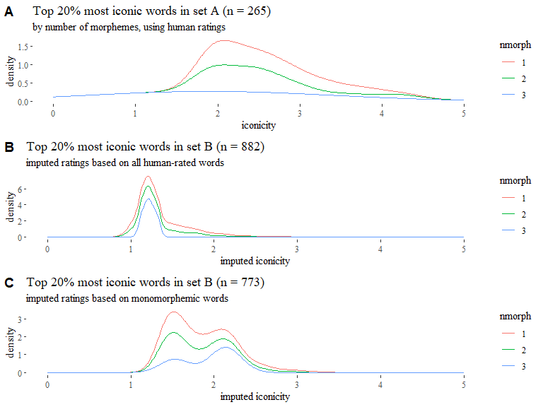
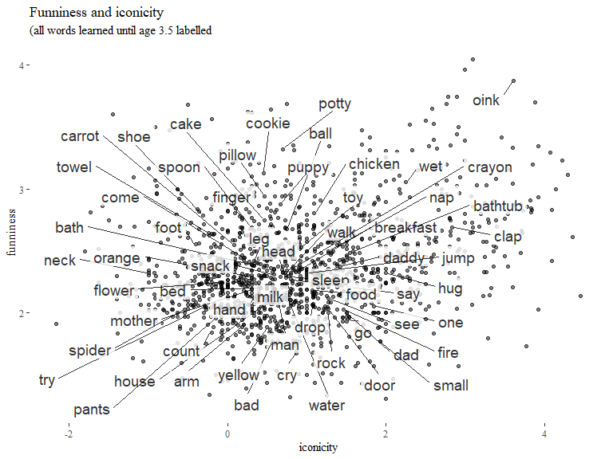

Playful iconicity: supplementary analyses
================
Mark Dingemanse & Bill Thompson
(this version: 2019-11-28)

Part of supporting materials the paper **Playful iconicity: Structural
markedness underlies the relation between funniness and iconicity**.
Here we report additional analyses that provide more details than we
have room for in the paper.

## Imputed funniness and iconicity

In the paper, we test the imputation method by seeing whether the
funniness \~ iconicity relation is upheld in imputed iconicity ratings.
This is a good test case because we have a sizable test set (3.577) and
there is an objective definition of iconicity (resemblance between
aspects of form and aspects of meaning). Indeed we find that words with
high imputed iconicity are clearly imitative and cite some evidence from
OED definitions (though we don’t do this in a systematic way).

It is also reasonable to test the imputation method the other way
around. Does the relation between human iconicity ratings and imputed
funniness ratings make any sense? There are 1.526 words for which we
have human iconicity ratings but not funniness ratings. Since this is a
much smaller set and there is no objective ways to judge the funniness
of words we don’t report this comparison in the paper, but it comes out
just as expected.

<!-- -->

We construct a linear model predicting imputed funniness based on
frequency and rt, and compare that with a model that includes human
iconicity ratings see how much this improves our predictions.

Compared to model mS2.1, which predicts fun\_imputed with just log
frequency and lexical decision time, model mS2.2 including iconicity as
predictor provides a significantly better fit (F = 125.88, *p* \<
0.0001) and explains a larger portion of the variance (adjusted R2 =
0.32 vs. 0.24).

**Model mS2.1**: lm(formula = fun\_imputed \~ logfreq + rt, data =
words.setD)

<table>

<thead>

<tr>

<th style="text-align:left;">

predictor

</th>

<th style="text-align:right;">

df

</th>

<th style="text-align:right;">

SS

</th>

<th style="text-align:right;">

\(F\)

</th>

<th style="text-align:right;">

\(p\)

</th>

<th style="text-align:right;">

partial \(\eta^2\)

</th>

</tr>

</thead>

<tbody>

<tr>

<td style="text-align:left;">

logfreq

</td>

<td style="text-align:right;">

1

</td>

<td style="text-align:right;">

25.869

</td>

<td style="text-align:right;">

291.852

</td>

<td style="text-align:right;">

0

</td>

<td style="text-align:right;">

0.225

</td>

</tr>

<tr>

<td style="text-align:left;">

rt

</td>

<td style="text-align:right;">

1

</td>

<td style="text-align:right;">

2.174

</td>

<td style="text-align:right;">

24.522

</td>

<td style="text-align:right;">

0

</td>

<td style="text-align:right;">

0.024

</td>

</tr>

<tr>

<td style="text-align:left;">

Residuals

</td>

<td style="text-align:right;">

1006

</td>

<td style="text-align:right;">

89.170

</td>

<td style="text-align:right;">

</td>

<td style="text-align:right;">

</td>

<td style="text-align:right;">

</td>

</tr>

</tbody>

</table>

**Model m2.2**: lm(formula = fun\_imputed \~ logfreq + rt + ico, data =
words.setD)

<table>

<thead>

<tr>

<th style="text-align:left;">

predictor

</th>

<th style="text-align:right;">

df

</th>

<th style="text-align:right;">

SS

</th>

<th style="text-align:right;">

\(F\)

</th>

<th style="text-align:right;">

\(p\)

</th>

<th style="text-align:right;">

partial \(\eta^2\)

</th>

</tr>

</thead>

<tbody>

<tr>

<td style="text-align:left;">

logfreq

</td>

<td style="text-align:right;">

1

</td>

<td style="text-align:right;">

25.869

</td>

<td style="text-align:right;">

328.080

</td>

<td style="text-align:right;">

0

</td>

<td style="text-align:right;">

0.246

</td>

</tr>

<tr>

<td style="text-align:left;">

rt

</td>

<td style="text-align:right;">

1

</td>

<td style="text-align:right;">

2.174

</td>

<td style="text-align:right;">

27.566

</td>

<td style="text-align:right;">

0

</td>

<td style="text-align:right;">

0.027

</td>

</tr>

<tr>

<td style="text-align:left;">

ico

</td>

<td style="text-align:right;">

1

</td>

<td style="text-align:right;">

9.926

</td>

<td style="text-align:right;">

125.878

</td>

<td style="text-align:right;">

0

</td>

<td style="text-align:right;">

0.111

</td>

</tr>

<tr>

<td style="text-align:left;">

Residuals

</td>

<td style="text-align:right;">

1005

</td>

<td style="text-align:right;">

79.244

</td>

<td style="text-align:right;">

</td>

<td style="text-align:right;">

</td>

<td style="text-align:right;">

</td>

</tr>

</tbody>

</table>

<table>

<caption>

model comparison

</caption>

<thead>

<tr>

<th style="text-align:right;">

Res.Df

</th>

<th style="text-align:right;">

RSS

</th>

<th style="text-align:right;">

Df

</th>

<th style="text-align:right;">

Sum of Sq

</th>

<th style="text-align:right;">

F

</th>

<th style="text-align:right;">

Pr(\>F)

</th>

</tr>

</thead>

<tbody>

<tr>

<td style="text-align:right;">

1006

</td>

<td style="text-align:right;">

89.16985

</td>

<td style="text-align:right;">

</td>

<td style="text-align:right;">

</td>

<td style="text-align:right;">

</td>

<td style="text-align:right;">

</td>

</tr>

<tr>

<td style="text-align:right;">

1005

</td>

<td style="text-align:right;">

79.24433

</td>

<td style="text-align:right;">

1

</td>

<td style="text-align:right;">

9.92552

</td>

<td style="text-align:right;">

125.8784

</td>

<td style="text-align:right;">

0

</td>

</tr>

</tbody>

</table>

A partial correlations analysis shows that there is 32% of covariance
between iconicity ratings and imputed funniness that is not explained by
word frequency (r = 0.32, p \< 0.0001). In other words, human iconicity
ratings are a strong predictor of imputed funniness.

<table>

<caption>

imputed funniness and iconicity controlling for word frequency

</caption>

<thead>

<tr>

<th style="text-align:right;">

estimate

</th>

<th style="text-align:right;">

p.value

</th>

<th style="text-align:right;">

statistic

</th>

<th style="text-align:right;">

n

</th>

<th style="text-align:right;">

gp

</th>

<th style="text-align:left;">

Method

</th>

</tr>

</thead>

<tbody>

<tr>

<td style="text-align:right;">

0.3230455

</td>

<td style="text-align:right;">

0

</td>

<td style="text-align:right;">

13.3213

</td>

<td style="text-align:right;">

1526

</td>

<td style="text-align:right;">

1

</td>

<td style="text-align:left;">

pearson

</td>

</tr>

</tbody>

</table>

**Example words**

High imputed funniness and high iconicity: *gurgle, mushy, screech,
icky, goopy, hiss, quack, cooing, chirping, squishy, mini, crinkle,
sizzle, slosh, slurp, purring, splat, crinkly, buzz, scoot*

Low imputed funniness and low iconicity: *synagogue, bequeath, require,
choose, repent, condition, ambulance, polio, injury, attorney, oppose,
resign, denial, motionless*

High funniness and low iconicity: *buttock, knave, cockatoo, bib, yam,
donut, zucchini, honeyed, dewy, emu, budgie, buttery, holey, vagina,
leotards, parakeet, kitten, burl, downy, slang*

Low imputed funniness and high iconicity: *explosion, crushed, no,
stinging, breathe, harsh, sting, huge, fibrous*

## Analysable morphology bias in iconicity ratings

An inspection of the top few hundred words reveals many clearly iconic
words, but also a number of transparently compositional words like
*sunshine, seaweed, downpour, dishwasher, corkscrew, bedroom*. Looking
at top rated iconic nouns with \>1 morphemes is a good way of finding
many of these.

``` r
# 200 most iconic words for visual inspection
words %>%
  drop_na(ico) %>%
  filter(ico_perc > 8) %>%
  arrange(-ico) %>%
  dplyr::select(word) %>%
  slice(1:200) %>% unlist() %>% unname()

# top rated iconic nouns with >1 morphemes is a good way of getting at many of these
words %>%
  drop_na(ico) %>%
  filter(ico_perc > 8,
         nmorph > 1,
         POS == "Noun") %>%
  arrange(-ico) %>%
  dplyr::select(word) %>%
  slice(1:200) %>% unlist() %>% unname()
```

These analysable compound nouns are treated by naïve raters as “sounding
like what they mean” and therefore given high iconicity ratings, leading
to rating artefacts. We can use data on number of morphemes from the
English lexicon project (Balota et al. 2007) to filter out such words
and look at monomorphemic words only.

The plots and partial correlations below show that the basic patterns
emerge somewhat clearer in monomorphemic words, as expected. All
findings remain the same.

There are **1278** monomorphemic words in set A (out of a total of
1419).

<table>

<caption>

mean iconicity by number of morphemes

</caption>

<thead>

<tr>

<th style="text-align:left;">

nmorph

</th>

<th style="text-align:right;">

n

</th>

<th style="text-align:right;">

mean.ico

</th>

</tr>

</thead>

<tbody>

<tr>

<td style="text-align:left;">

1

</td>

<td style="text-align:right;">

1278

</td>

<td style="text-align:right;">

0.8546147

</td>

</tr>

<tr>

<td style="text-align:left;">

2

</td>

<td style="text-align:right;">

137

</td>

<td style="text-align:right;">

1.0236474

</td>

</tr>

<tr>

<td style="text-align:left;">

3

</td>

<td style="text-align:right;">

3

</td>

<td style="text-align:right;">

1.4055556

</td>

</tr>

<tr>

<td style="text-align:left;">

</td>

<td style="text-align:right;">

1

</td>

<td style="text-align:right;">

1.0000000

</td>

</tr>

</tbody>

</table>

<table>

<caption>

highest 7 iconic words per number of morphemes (1-3)

</caption>

<thead>

<tr>

<th style="text-align:left;">

word

</th>

<th style="text-align:right;">

ico

</th>

<th style="text-align:right;">

fun

</th>

<th style="text-align:left;">

nmorph

</th>

</tr>

</thead>

<tbody>

<tr>

<td style="text-align:left;">

click

</td>

<td style="text-align:right;">

4.4615385

</td>

<td style="text-align:right;">

2.135135

</td>

<td style="text-align:left;">

1

</td>

</tr>

<tr>

<td style="text-align:left;">

beep

</td>

<td style="text-align:right;">

4.3571429

</td>

<td style="text-align:right;">

2.615385

</td>

<td style="text-align:left;">

1

</td>

</tr>

<tr>

<td style="text-align:left;">

squeak

</td>

<td style="text-align:right;">

4.2307692

</td>

<td style="text-align:right;">

3.230769

</td>

<td style="text-align:left;">

1

</td>

</tr>

<tr>

<td style="text-align:left;">

chirp

</td>

<td style="text-align:right;">

4.1428571

</td>

<td style="text-align:right;">

3.000000

</td>

<td style="text-align:left;">

1

</td>

</tr>

<tr>

<td style="text-align:left;">

stomp

</td>

<td style="text-align:right;">

4.1000000

</td>

<td style="text-align:right;">

2.421053

</td>

<td style="text-align:left;">

1

</td>

</tr>

<tr>

<td style="text-align:left;">

pop

</td>

<td style="text-align:right;">

4.0769231

</td>

<td style="text-align:right;">

3.294118

</td>

<td style="text-align:left;">

1

</td>

</tr>

<tr>

<td style="text-align:left;">

bleep

</td>

<td style="text-align:right;">

3.9285714

</td>

<td style="text-align:right;">

2.931818

</td>

<td style="text-align:left;">

1

</td>

</tr>

<tr>

<td style="text-align:left;">

zigzag

</td>

<td style="text-align:right;">

4.3000000

</td>

<td style="text-align:right;">

3.113636

</td>

<td style="text-align:left;">

2

</td>

</tr>

<tr>

<td style="text-align:left;">

buzzer

</td>

<td style="text-align:right;">

4.0909091

</td>

<td style="text-align:right;">

2.833333

</td>

<td style="text-align:left;">

2

</td>

</tr>

<tr>

<td style="text-align:left;">

skateboard

</td>

<td style="text-align:right;">

3.6000000

</td>

<td style="text-align:right;">

2.208333

</td>

<td style="text-align:left;">

2

</td>

</tr>

<tr>

<td style="text-align:left;">

sunshine

</td>

<td style="text-align:right;">

3.0909091

</td>

<td style="text-align:right;">

2.064516

</td>

<td style="text-align:left;">

2

</td>

</tr>

<tr>

<td style="text-align:left;">

zipper

</td>

<td style="text-align:right;">

2.9230769

</td>

<td style="text-align:right;">

2.516129

</td>

<td style="text-align:left;">

2

</td>

</tr>

<tr>

<td style="text-align:left;">

freezer

</td>

<td style="text-align:right;">

2.9166667

</td>

<td style="text-align:right;">

2.281250

</td>

<td style="text-align:left;">

2

</td>

</tr>

<tr>

<td style="text-align:left;">

bubbly

</td>

<td style="text-align:right;">

2.8181818

</td>

<td style="text-align:right;">

3.352941

</td>

<td style="text-align:left;">

2

</td>

</tr>

<tr>

<td style="text-align:left;">

fireworks

</td>

<td style="text-align:right;">

1.9000000

</td>

<td style="text-align:right;">

2.294118

</td>

<td style="text-align:left;">

3

</td>

</tr>

<tr>

<td style="text-align:left;">

pliers

</td>

<td style="text-align:right;">

1.9000000

</td>

<td style="text-align:right;">

2.352941

</td>

<td style="text-align:left;">

3

</td>

</tr>

<tr>

<td style="text-align:left;">

influence

</td>

<td style="text-align:right;">

0.4166667

</td>

<td style="text-align:right;">

1.914286

</td>

<td style="text-align:left;">

3

</td>

</tr>

</tbody>

</table>

<!-- -->

<table>

<caption>

Partial correlations between funniness and iconicity, controlling for
frequency, in monomorphemic words

</caption>

<thead>

<tr>

<th style="text-align:right;">

estimate

</th>

<th style="text-align:right;">

p.value

</th>

<th style="text-align:right;">

statistic

</th>

<th style="text-align:right;">

n

</th>

<th style="text-align:right;">

gp

</th>

<th style="text-align:left;">

Method

</th>

</tr>

</thead>

<tbody>

<tr>

<td style="text-align:right;">

0.2158506

</td>

<td style="text-align:right;">

0

</td>

<td style="text-align:right;">

7.893486

</td>

<td style="text-align:right;">

1278

</td>

<td style="text-align:right;">

1

</td>

<td style="text-align:left;">

pearson

</td>

</tr>

</tbody>

</table>

There are 2176 monomorphemic words in set B (61% of 3577).

<table>

<caption>

mean iconicity by number of morphemes in set B

</caption>

<thead>

<tr>

<th style="text-align:left;">

nmorph

</th>

<th style="text-align:right;">

n

</th>

<th style="text-align:right;">

mean.ico

</th>

</tr>

</thead>

<tbody>

<tr>

<td style="text-align:left;">

\#

</td>

<td style="text-align:right;">

14

</td>

<td style="text-align:right;">

0.8584171

</td>

</tr>

<tr>

<td style="text-align:left;">

1

</td>

<td style="text-align:right;">

2176

</td>

<td style="text-align:right;">

0.6878947

</td>

</tr>

<tr>

<td style="text-align:left;">

2

</td>

<td style="text-align:right;">

1321

</td>

<td style="text-align:right;">

0.5808049

</td>

</tr>

<tr>

<td style="text-align:left;">

3

</td>

<td style="text-align:right;">

42

</td>

<td style="text-align:right;">

0.4412872

</td>

</tr>

<tr>

<td style="text-align:left;">

</td>

<td style="text-align:right;">

24

</td>

<td style="text-align:right;">

0.2862270

</td>

</tr>

</tbody>

</table>

<!-- -->

<table>

<caption>

Partial correlations between funniness and imputed iconicity,
controlling for frequency, in monomorphemic words

</caption>

<thead>

<tr>

<th style="text-align:right;">

estimate

</th>

<th style="text-align:right;">

p.value

</th>

<th style="text-align:right;">

statistic

</th>

<th style="text-align:right;">

n

</th>

<th style="text-align:right;">

gp

</th>

<th style="text-align:left;">

Method

</th>

</tr>

</thead>

<tbody>

<tr>

<td style="text-align:right;">

0.3278004

</td>

<td style="text-align:right;">

0

</td>

<td style="text-align:right;">

16.17424

</td>

<td style="text-align:right;">

2176

</td>

<td style="text-align:right;">

1

</td>

<td style="text-align:left;">

pearson

</td>

</tr>

</tbody>

</table>

There are only 5168 monomorphemic words in set C (out of 41548 words for
which we have data on number of morphemes).

<table>

<caption>

mean iconicity by number of morphemes in set C

</caption>

<thead>

<tr>

<th style="text-align:left;">

nmorph

</th>

<th style="text-align:right;">

n

</th>

<th style="text-align:right;">

mean.ico

</th>

</tr>

</thead>

<tbody>

<tr>

<td style="text-align:left;">

\#

</td>

<td style="text-align:right;">

1320

</td>

<td style="text-align:right;">

0.4958385

</td>

</tr>

<tr>

<td style="text-align:left;">

1

</td>

<td style="text-align:right;">

5168

</td>

<td style="text-align:right;">

0.5410642

</td>

</tr>

<tr>

<td style="text-align:left;">

2

</td>

<td style="text-align:right;">

20456

</td>

<td style="text-align:right;">

0.6485362

</td>

</tr>

<tr>

<td style="text-align:left;">

3

</td>

<td style="text-align:right;">

11575

</td>

<td style="text-align:right;">

0.4194742

</td>

</tr>

<tr>

<td style="text-align:left;">

4

</td>

<td style="text-align:right;">

2689

</td>

<td style="text-align:right;">

0.3195566

</td>

</tr>

<tr>

<td style="text-align:left;">

5

</td>

<td style="text-align:right;">

329

</td>

<td style="text-align:right;">

0.2877888

</td>

</tr>

<tr>

<td style="text-align:left;">

6

</td>

<td style="text-align:right;">

11

</td>

<td style="text-align:right;">

0.3718408

</td>

</tr>

<tr>

<td style="text-align:left;">

</td>

<td style="text-align:right;">

22132

</td>

<td style="text-align:right;">

0.4706343

</td>

</tr>

</tbody>

</table>

<!-- -->

<table>

<caption>

Partial correlations between imputed funniness and imputed iconicity,
controlling for frequency, in monomorphemic words

</caption>

<thead>

<tr>

<th style="text-align:right;">

estimate

</th>

<th style="text-align:right;">

p.value

</th>

<th style="text-align:right;">

statistic

</th>

<th style="text-align:right;">

n

</th>

<th style="text-align:right;">

gp

</th>

<th style="text-align:left;">

Method

</th>

</tr>

</thead>

<tbody>

<tr>

<td style="text-align:right;">

0.4370105

</td>

<td style="text-align:right;">

0

</td>

<td style="text-align:right;">

34.91781

</td>

<td style="text-align:right;">

5168

</td>

<td style="text-align:right;">

1

</td>

<td style="text-align:left;">

pearson

</td>

</tr>

</tbody>

</table>

## Imputing ratings based on monomorphemic words only

Given what we know about the bias in iconicity ratings it may make sense
to base imputation only on monomorphemic words and see how this affects
the results. It should lead to less analysable compounds showing up high
in the imputed iconicity ratings of set B and set C.

Model comparison shows that a model with imputed monomorphemic iconicity
has a significantly better fit (*F* 227.5, *p* \< 0.0001) and explains a
larger amount of variance (R<sup>2</sup> = 0.139 vs 0.084) than a model
with just frequency and RT. However, the original model with imputed
iconicity based on all words explains still more of the variance
(R<sup>2</sup> = 0.187).

<!-- -->

Partial correlations show 23% covariance in set B (n = 3036) between
funniness and imputed iconicity based on monomorphemic words,
controlling for word frequency.

<table>

<caption>

Partial correlations between funniness and imputed monomorphemic
iconicity, controlling for frequency

</caption>

<thead>

<tr>

<th style="text-align:right;">

estimate

</th>

<th style="text-align:right;">

p.value

</th>

<th style="text-align:right;">

statistic

</th>

<th style="text-align:right;">

n

</th>

<th style="text-align:right;">

gp

</th>

<th style="text-align:left;">

Method

</th>

</tr>

</thead>

<tbody>

<tr>

<td style="text-align:right;">

0.2292556

</td>

<td style="text-align:right;">

0

</td>

<td style="text-align:right;">

12.97119

</td>

<td style="text-align:right;">

3036

</td>

<td style="text-align:right;">

1

</td>

<td style="text-align:left;">

pearson

</td>

</tr>

</tbody>

</table>

**Example words**

High imputed funniness and high imputed monomorphemic iconicity: *whack,
burp, smack, fizz, chug, dud, wallop, beatnik, oddball, swish, snooze,
bop, loony, squirm, chuckle, poof, bebop, getup, spunk, shindig*

Low funniness and low imputed monomorphemic iconicity: *housework, town,
divorce, purchase, plaintiff, spacing, mean, prayer, hunting, arson,
conscience, theft, shipping, visa, amends, bible, thyroid, concourse,
union, wheelchair*

High funniness and low imputed monomorphemic iconicity: *rump, dodo,
toga, scrotum, muskrat, satyr, sphincter, gourd, kebab, cheesecake,
swank, girth, ducky, pubes, gad, rectum, sphinx, trump, harlot, lapdog*

Low funniness and high imputed monomorphemic iconicity: *doom, scrape,
feedback, shudder, choke, replay, transient, shrapnel, fright, dental,
thaw, lockup, tech, brow, cue, bloodbath, post, blend, decay, lair*

**Set C** In set C we see the same: regressions are not much improved by
using imputed scores based on monomorphemic words only.

Since the monomorphemic ratings were introduced specifically to check
whether we can address the analysable compound bias in iconicity
ratings, we use the original imputed funniness ratings, although we also
have imputed funniness ratings based on monomorphemic words
(`fun_imputed_monomorph`).

Model comparison shows that the imputed iconicity ratings based on
monomorphemic words are pretty good, explaining more variance
(R<sup>2</sup> = 0.14 versus 0.06) than a model without iconicity.
However, a model based on the original imputed ratings does much better
(R<sup>2</sup> = 0.24), so this is not giving us more power to detect
the relation between funniness and iconicity ratings.

<!-- -->

**Example words**

High imputed funniness and high imputed monomorphemic iconicity:
*tiddly, whir, sleaze, wibble, phat, whoo, whoosh, lah, rah, wah, buzzy,
pung, popsy, plonk, phooey, thwack, whirr, chit, oozy, talky*

Low imputed funniness and low imputed monomorphemic iconicity:
*upbringing, finalizing, surpassed, silva, p, received, suffrage,
excused, undersigned, abase, disobedience, absences, biography, guilty,
basin, sacredness, records, designating, scriptural, justifies*

High imputed funniness and low imputed monomorphemic iconicity: *copula,
bratwurst, pisser, grum, ferme, prat, twitty, shags, wadi, gleba,
lovebird, heifers, putz, chickweed, bungo, froufrou, burg, ramus, porgy,
wiener*

Low imputed funniness and high imputed monomorphemic iconicity: *req,
notify, engulf, concussive, desc, tox, undergoes, unbind, afb, hts,
filmic, unrelentingly, undergo, ld, awl, excruciate, reeducation,
adrenalin, storyboard, downpours*

**How about compounds?**

In the new imputed ratings based on monomorphemic words, is it still
easy to find analysable compounds rated as highly iconic? Yes, it is…
oddball, cleanup, dustpan, killjoy, shakedown, showbizz, feedback, etc.

Visualisastions of iconicity ratings by number of morphemes are hard to
interpret. The distribution of the ratings is somewhat different (a more
squat distribution in the ratings based on monomorphemic words), but it
is not obvious that there are large differences in the relative
preponderance of monomorphemic versus multimorphemic words in the top
percentiles of iconicity ratings.

    ## # A tibble: 1 x 1
    ##       n
    ##   <int>
    ## 1   265

<!-- -->

    ## # A tibble: 3 x 2
    ##   nmorph     n
    ##   <chr>  <int>
    ## 1 1        995
    ## 2 2       2912
    ## 3 3        489

    ## # A tibble: 3 x 2
    ##   nmorph     n
    ##   <chr>  <int>
    ## 1 1        970
    ## 2 2       2457
    ## 3 3        707

In sum, while basing imputed iconicity ratings on monomorphemic words
with human ratings gives reasonable results, it does not seem to result
in a marked improvement of the imputed ratings, though further analysis
is needed.

## Markedness patterns in words with imputed ratings

While the primary focus of analysis 4 was on set A (the core set of
human ratings), it’s interesting to see how well the structural cues
fare in explaining independently imputed iconicity ratings in the larger
datasets.

<table>

<caption>

Mean imputed scores by levels of cumulative markedness

</caption>

<thead>

<tr>

<th style="text-align:right;">

cumulative

</th>

<th style="text-align:right;">

n

</th>

<th style="text-align:right;">

ico\_imputed

</th>

<th style="text-align:right;">

fun\_imputed

</th>

</tr>

</thead>

<tbody>

<tr>

<td style="text-align:right;">

0

</td>

<td style="text-align:right;">

59843

</td>

<td style="text-align:right;">

0.4908895

</td>

<td style="text-align:right;">

2.377589

</td>

</tr>

<tr>

<td style="text-align:right;">

1

</td>

<td style="text-align:right;">

7301

</td>

<td style="text-align:right;">

0.7852391

</td>

<td style="text-align:right;">

2.450599

</td>

</tr>

<tr>

<td style="text-align:right;">

2

</td>

<td style="text-align:right;">

113

</td>

<td style="text-align:right;">

1.2294607

</td>

<td style="text-align:right;">

2.646994

</td>

</tr>

</tbody>

</table>

<table>

<caption>

Cumulative markedness for \<10 deciles of imputed iconicity

</caption>

<thead>

<tr>

<th style="text-align:right;">

n

</th>

<th style="text-align:right;">

ico\_imputed

</th>

<th style="text-align:right;">

fun\_imputed

</th>

<th style="text-align:right;">

cumulative

</th>

</tr>

</thead>

<tbody>

<tr>

<td style="text-align:right;">

60940

</td>

<td style="text-align:right;">

0.3901764

</td>

<td style="text-align:right;">

2.353881

</td>

<td style="text-align:right;">

0.0985724

</td>

</tr>

</tbody>

</table>

<table>

<caption>

imputed iconicity for 20 random words of high phonological complexity

</caption>

<thead>

<tr>

<th style="text-align:left;">

word

</th>

<th style="text-align:right;">

ico\_imputed\_perc

</th>

<th style="text-align:right;">

ico\_imputed

</th>

<th style="text-align:right;">

cumulative

</th>

</tr>

</thead>

<tbody>

<tr>

<td style="text-align:left;">

dribble

</td>

<td style="text-align:right;">

10

</td>

<td style="text-align:right;">

2.0983419

</td>

<td style="text-align:right;">

2

</td>

</tr>

<tr>

<td style="text-align:left;">

trundle

</td>

<td style="text-align:right;">

10

</td>

<td style="text-align:right;">

1.7745347

</td>

<td style="text-align:right;">

2

</td>

</tr>

<tr>

<td style="text-align:left;">

blimp

</td>

<td style="text-align:right;">

10

</td>

<td style="text-align:right;">

1.7163767

</td>

<td style="text-align:right;">

2

</td>

</tr>

<tr>

<td style="text-align:left;">

crank

</td>

<td style="text-align:right;">

10

</td>

<td style="text-align:right;">

1.6032802

</td>

<td style="text-align:right;">

2

</td>

</tr>

<tr>

<td style="text-align:left;">

sprink

</td>

<td style="text-align:right;">

10

</td>

<td style="text-align:right;">

1.5891782

</td>

<td style="text-align:right;">

2

</td>

</tr>

<tr>

<td style="text-align:left;">

spangle

</td>

<td style="text-align:right;">

10

</td>

<td style="text-align:right;">

1.5792685

</td>

<td style="text-align:right;">

2

</td>

</tr>

<tr>

<td style="text-align:left;">

swash

</td>

<td style="text-align:right;">

10

</td>

<td style="text-align:right;">

1.5623261

</td>

<td style="text-align:right;">

2

</td>

</tr>

<tr>

<td style="text-align:left;">

clinch

</td>

<td style="text-align:right;">

9

</td>

<td style="text-align:right;">

1.3375040

</td>

<td style="text-align:right;">

2

</td>

</tr>

<tr>

<td style="text-align:left;">

slapdash

</td>

<td style="text-align:right;">

9

</td>

<td style="text-align:right;">

1.3323017

</td>

<td style="text-align:right;">

2

</td>

</tr>

<tr>

<td style="text-align:left;">

bluish

</td>

<td style="text-align:right;">

9

</td>

<td style="text-align:right;">

1.1294532

</td>

<td style="text-align:right;">

2

</td>

</tr>

<tr>

<td style="text-align:left;">

swank

</td>

<td style="text-align:right;">

9

</td>

<td style="text-align:right;">

1.0427255

</td>

<td style="text-align:right;">

2

</td>

</tr>

<tr>

<td style="text-align:left;">

swaddle

</td>

<td style="text-align:right;">

8

</td>

<td style="text-align:right;">

1.0175389

</td>

<td style="text-align:right;">

2

</td>

</tr>

<tr>

<td style="text-align:left;">

blemish

</td>

<td style="text-align:right;">

8

</td>

<td style="text-align:right;">

0.9855408

</td>

<td style="text-align:right;">

2

</td>

</tr>

<tr>

<td style="text-align:left;">

blueish

</td>

<td style="text-align:right;">

8

</td>

<td style="text-align:right;">

0.8951717

</td>

<td style="text-align:right;">

2

</td>

</tr>

<tr>

<td style="text-align:left;">

snobbish

</td>

<td style="text-align:right;">

7

</td>

<td style="text-align:right;">

0.7488858

</td>

<td style="text-align:right;">

2

</td>

</tr>

<tr>

<td style="text-align:left;">

snowbank

</td>

<td style="text-align:right;">

7

</td>

<td style="text-align:right;">

0.7425518

</td>

<td style="text-align:right;">

2

</td>

</tr>

<tr>

<td style="text-align:left;">

schrank

</td>

<td style="text-align:right;">

5

</td>

<td style="text-align:right;">

0.4676592

</td>

<td style="text-align:right;">

2

</td>

</tr>

<tr>

<td style="text-align:left;">

flatfish

</td>

<td style="text-align:right;">

5

</td>

<td style="text-align:right;">

0.3870658

</td>

<td style="text-align:right;">

2

</td>

</tr>

<tr>

<td style="text-align:left;">

tradespeople

</td>

<td style="text-align:right;">

4

</td>

<td style="text-align:right;">

0.2557573

</td>

<td style="text-align:right;">

2

</td>

</tr>

<tr>

<td style="text-align:left;">

flank

</td>

<td style="text-align:right;">

4

</td>

<td style="text-align:right;">

0.2230756

</td>

<td style="text-align:right;">

2

</td>

</tr>

</tbody>

</table>

<table>

<caption>

Cumulative markedness scores per iconicity decile in Set B

</caption>

<thead>

<tr>

<th style="text-align:right;">

ico\_imputed\_perc

</th>

<th style="text-align:right;">

n

</th>

<th style="text-align:right;">

ico

</th>

<th style="text-align:right;">

fun

</th>

<th style="text-align:right;">

onset

</th>

<th style="text-align:right;">

coda

</th>

<th style="text-align:right;">

verbdim

</th>

<th style="text-align:right;">

cumulative

</th>

</tr>

</thead>

<tbody>

<tr>

<td style="text-align:right;">

1

</td>

<td style="text-align:right;">

182

</td>

<td style="text-align:right;">

\-0.4528116

</td>

<td style="text-align:right;">

2.220783

</td>

<td style="text-align:right;">

0.0714286

</td>

<td style="text-align:right;">

0.0164835

</td>

<td style="text-align:right;">

0.0000000

</td>

<td style="text-align:right;">

0.0879121

</td>

</tr>

<tr>

<td style="text-align:right;">

2

</td>

<td style="text-align:right;">

249

</td>

<td style="text-align:right;">

\-0.0841993

</td>

<td style="text-align:right;">

2.268928

</td>

<td style="text-align:right;">

0.0843373

</td>

<td style="text-align:right;">

0.0160643

</td>

<td style="text-align:right;">

0.0000000

</td>

<td style="text-align:right;">

0.1004016

</td>

</tr>

<tr>

<td style="text-align:right;">

3

</td>

<td style="text-align:right;">

247

</td>

<td style="text-align:right;">

0.1030573

</td>

<td style="text-align:right;">

2.318616

</td>

<td style="text-align:right;">

0.1052632

</td>

<td style="text-align:right;">

0.0202429

</td>

<td style="text-align:right;">

0.0000000

</td>

<td style="text-align:right;">

0.1255061

</td>

</tr>

<tr>

<td style="text-align:right;">

4

</td>

<td style="text-align:right;">

299

</td>

<td style="text-align:right;">

0.2579817

</td>

<td style="text-align:right;">

2.317502

</td>

<td style="text-align:right;">

0.1270903

</td>

<td style="text-align:right;">

0.0200669

</td>

<td style="text-align:right;">

0.0033445

</td>

<td style="text-align:right;">

0.1505017

</td>

</tr>

<tr>

<td style="text-align:right;">

5

</td>

<td style="text-align:right;">

290

</td>

<td style="text-align:right;">

0.4042797

</td>

<td style="text-align:right;">

2.349267

</td>

<td style="text-align:right;">

0.1068966

</td>

<td style="text-align:right;">

0.0172414

</td>

<td style="text-align:right;">

0.0068966

</td>

<td style="text-align:right;">

0.1310345

</td>

</tr>

<tr>

<td style="text-align:right;">

6

</td>

<td style="text-align:right;">

323

</td>

<td style="text-align:right;">

0.5487701

</td>

<td style="text-align:right;">

2.377754

</td>

<td style="text-align:right;">

0.1207430

</td>

<td style="text-align:right;">

0.0309598

</td>

<td style="text-align:right;">

0.0030960

</td>

<td style="text-align:right;">

0.1547988

</td>

</tr>

<tr>

<td style="text-align:right;">

7

</td>

<td style="text-align:right;">

333

</td>

<td style="text-align:right;">

0.7084445

</td>

<td style="text-align:right;">

2.403432

</td>

<td style="text-align:right;">

0.1141141

</td>

<td style="text-align:right;">

0.0180180

</td>

<td style="text-align:right;">

0.0000000

</td>

<td style="text-align:right;">

0.1321321

</td>

</tr>

<tr>

<td style="text-align:right;">

8

</td>

<td style="text-align:right;">

374

</td>

<td style="text-align:right;">

0.9002872

</td>

<td style="text-align:right;">

2.487929

</td>

<td style="text-align:right;">

0.1470588

</td>

<td style="text-align:right;">

0.0454545

</td>

<td style="text-align:right;">

0.0000000

</td>

<td style="text-align:right;">

0.1925134

</td>

</tr>

<tr>

<td style="text-align:right;">

9

</td>

<td style="text-align:right;">

370

</td>

<td style="text-align:right;">

1.1681607

</td>

<td style="text-align:right;">

2.528468

</td>

<td style="text-align:right;">

0.1594595

</td>

<td style="text-align:right;">

0.0297297

</td>

<td style="text-align:right;">

0.0081081

</td>

<td style="text-align:right;">

0.1972973

</td>

</tr>

<tr>

<td style="text-align:right;">

10

</td>

<td style="text-align:right;">

369

</td>

<td style="text-align:right;">

1.7764394

</td>

<td style="text-align:right;">

2.705826

</td>

<td style="text-align:right;">

0.2276423

</td>

<td style="text-align:right;">

0.0921409

</td>

<td style="text-align:right;">

0.0271003

</td>

<td style="text-align:right;">

0.3468835

</td>

</tr>

</tbody>

</table>

<table>

<caption>

Cumulative markedness scores per iconicity decile in Set C

</caption>

<thead>

<tr>

<th style="text-align:right;">

ico\_imputed\_perc

</th>

<th style="text-align:right;">

n

</th>

<th style="text-align:right;">

ico

</th>

<th style="text-align:right;">

fun

</th>

<th style="text-align:right;">

onset

</th>

<th style="text-align:right;">

coda

</th>

<th style="text-align:right;">

verbdim

</th>

<th style="text-align:right;">

cumulative

</th>

</tr>

</thead>

<tbody>

<tr>

<td style="text-align:right;">

1

</td>

<td style="text-align:right;">

6643

</td>

<td style="text-align:right;">

\-0.4518873

</td>

<td style="text-align:right;">

2.245994

</td>

<td style="text-align:right;">

0.0575041

</td>

<td style="text-align:right;">

0.0058708

</td>

<td style="text-align:right;">

0.0003011

</td>

<td style="text-align:right;">

0.0636760

</td>

</tr>

<tr>

<td style="text-align:right;">

2

</td>

<td style="text-align:right;">

6540

</td>

<td style="text-align:right;">

\-0.0871170

</td>

<td style="text-align:right;">

2.271298

</td>

<td style="text-align:right;">

0.0677370

</td>

<td style="text-align:right;">

0.0053517

</td>

<td style="text-align:right;">

0.0004587

</td>

<td style="text-align:right;">

0.0735474

</td>

</tr>

<tr>

<td style="text-align:right;">

3

</td>

<td style="text-align:right;">

6507

</td>

<td style="text-align:right;">

0.1024110

</td>

<td style="text-align:right;">

2.291713

</td>

<td style="text-align:right;">

0.0705394

</td>

<td style="text-align:right;">

0.0075304

</td>

<td style="text-align:right;">

0.0003074

</td>

<td style="text-align:right;">

0.0783771

</td>

</tr>

<tr>

<td style="text-align:right;">

4

</td>

<td style="text-align:right;">

6402

</td>

<td style="text-align:right;">

0.2590349

</td>

<td style="text-align:right;">

2.307478

</td>

<td style="text-align:right;">

0.0670103

</td>

<td style="text-align:right;">

0.0078101

</td>

<td style="text-align:right;">

0.0010934

</td>

<td style="text-align:right;">

0.0759138

</td>

</tr>

<tr>

<td style="text-align:right;">

5

</td>

<td style="text-align:right;">

6345

</td>

<td style="text-align:right;">

0.4032373

</td>

<td style="text-align:right;">

2.334882

</td>

<td style="text-align:right;">

0.0780142

</td>

<td style="text-align:right;">

0.0077226

</td>

<td style="text-align:right;">

0.0011032

</td>

<td style="text-align:right;">

0.0868400

</td>

</tr>

<tr>

<td style="text-align:right;">

6

</td>

<td style="text-align:right;">

6297

</td>

<td style="text-align:right;">

0.5495897

</td>

<td style="text-align:right;">

2.357597

</td>

<td style="text-align:right;">

0.0865492

</td>

<td style="text-align:right;">

0.0079403

</td>

<td style="text-align:right;">

0.0007940

</td>

<td style="text-align:right;">

0.0952835

</td>

</tr>

<tr>

<td style="text-align:right;">

7

</td>

<td style="text-align:right;">

6208

</td>

<td style="text-align:right;">

0.7108025

</td>

<td style="text-align:right;">

2.397076

</td>

<td style="text-align:right;">

0.0979381

</td>

<td style="text-align:right;">

0.0106314

</td>

<td style="text-align:right;">

0.0011276

</td>

<td style="text-align:right;">

0.1096972

</td>

</tr>

<tr>

<td style="text-align:right;">

8

</td>

<td style="text-align:right;">

6188

</td>

<td style="text-align:right;">

0.9045974

</td>

<td style="text-align:right;">

2.449854

</td>

<td style="text-align:right;">

0.1115061

</td>

<td style="text-align:right;">

0.0119586

</td>

<td style="text-align:right;">

0.0021008

</td>

<td style="text-align:right;">

0.1255656

</td>

</tr>

<tr>

<td style="text-align:right;">

9

</td>

<td style="text-align:right;">

6056

</td>

<td style="text-align:right;">

1.1732741

</td>

<td style="text-align:right;">

2.521398

</td>

<td style="text-align:right;">

0.1370542

</td>

<td style="text-align:right;">

0.0143659

</td>

<td style="text-align:right;">

0.0034676

</td>

<td style="text-align:right;">

0.1548877

</td>

</tr>

<tr>

<td style="text-align:right;">

10

</td>

<td style="text-align:right;">

5778

</td>

<td style="text-align:right;">

1.8190651

</td>

<td style="text-align:right;">

2.692276

</td>

<td style="text-align:right;">

0.2057805

</td>

<td style="text-align:right;">

0.0188647

</td>

<td style="text-align:right;">

0.0074420

</td>

<td style="text-align:right;">

0.2320872

</td>

</tr>

</tbody>

</table>

<!-- -->

## Markedness for iconicity vs funniness ratings

Cumulative markedness is particularly good for predicting iconicity,
rivalling funniness, word frequency and log letter frequency as a
predictor of iconicity rating (model `mS.1`). It is less good for
predicting funniness ratings, which are (as we know) also influenced by
semantic and collocational factors (model `mS.2`).

**Model mS.1**: lm(formula = ico \~ logfreq + rt + fun + logletterfreq +
cumulative, , data = words.setA)

<table>

<thead>

<tr>

<th style="text-align:left;">

predictor

</th>

<th style="text-align:right;">

df

</th>

<th style="text-align:right;">

SS

</th>

<th style="text-align:right;">

\(F\)

</th>

<th style="text-align:right;">

\(p\)

</th>

<th style="text-align:right;">

partial \(\eta^2\)

</th>

</tr>

</thead>

<tbody>

<tr>

<td style="text-align:left;">

logfreq

</td>

<td style="text-align:right;">

1

</td>

<td style="text-align:right;">

58.495

</td>

<td style="text-align:right;">

55.422

</td>

<td style="text-align:right;">

0.000

</td>

<td style="text-align:right;">

0.038

</td>

</tr>

<tr>

<td style="text-align:left;">

rt

</td>

<td style="text-align:right;">

1

</td>

<td style="text-align:right;">

0.054

</td>

<td style="text-align:right;">

0.051

</td>

<td style="text-align:right;">

0.822

</td>

<td style="text-align:right;">

0.000

</td>

</tr>

<tr>

<td style="text-align:left;">

fun

</td>

<td style="text-align:right;">

1

</td>

<td style="text-align:right;">

72.397

</td>

<td style="text-align:right;">

68.594

</td>

<td style="text-align:right;">

0.000

</td>

<td style="text-align:right;">

0.046

</td>

</tr>

<tr>

<td style="text-align:left;">

logletterfreq

</td>

<td style="text-align:right;">

1

</td>

<td style="text-align:right;">

44.700

</td>

<td style="text-align:right;">

42.351

</td>

<td style="text-align:right;">

0.000

</td>

<td style="text-align:right;">

0.029

</td>

</tr>

<tr>

<td style="text-align:left;">

cumulative

</td>

<td style="text-align:right;">

1

</td>

<td style="text-align:right;">

73.125

</td>

<td style="text-align:right;">

69.284

</td>

<td style="text-align:right;">

0.000

</td>

<td style="text-align:right;">

0.047

</td>

</tr>

<tr>

<td style="text-align:left;">

Residuals

</td>

<td style="text-align:right;">

1413

</td>

<td style="text-align:right;">

1491.344

</td>

<td style="text-align:right;">

</td>

<td style="text-align:right;">

</td>

<td style="text-align:right;">

</td>

</tr>

</tbody>

</table>

**Model mS.2**: lm(formula = fun \~ logfreq + rt + logletterfreq + ico
\* cumulative, , data = words.setA)

<table>

<thead>

<tr>

<th style="text-align:left;">

predictor

</th>

<th style="text-align:right;">

df

</th>

<th style="text-align:right;">

SS

</th>

<th style="text-align:right;">

\(F\)

</th>

<th style="text-align:right;">

\(p\)

</th>

<th style="text-align:right;">

partial \(\eta^2\)

</th>

</tr>

</thead>

<tbody>

<tr>

<td style="text-align:left;">

logfreq

</td>

<td style="text-align:right;">

1

</td>

<td style="text-align:right;">

36.143

</td>

<td style="text-align:right;">

266.115

</td>

<td style="text-align:right;">

0.000

</td>

<td style="text-align:right;">

0.159

</td>

</tr>

<tr>

<td style="text-align:left;">

rt

</td>

<td style="text-align:right;">

1

</td>

<td style="text-align:right;">

1.249

</td>

<td style="text-align:right;">

9.195

</td>

<td style="text-align:right;">

0.002

</td>

<td style="text-align:right;">

0.006

</td>

</tr>

<tr>

<td style="text-align:left;">

logletterfreq

</td>

<td style="text-align:right;">

1

</td>

<td style="text-align:right;">

7.653

</td>

<td style="text-align:right;">

56.346

</td>

<td style="text-align:right;">

0.000

</td>

<td style="text-align:right;">

0.038

</td>

</tr>

<tr>

<td style="text-align:left;">

ico

</td>

<td style="text-align:right;">

1

</td>

<td style="text-align:right;">

6.144

</td>

<td style="text-align:right;">

45.241

</td>

<td style="text-align:right;">

0.000

</td>

<td style="text-align:right;">

0.031

</td>

</tr>

<tr>

<td style="text-align:left;">

cumulative

</td>

<td style="text-align:right;">

1

</td>

<td style="text-align:right;">

0.092

</td>

<td style="text-align:right;">

0.676

</td>

<td style="text-align:right;">

0.411

</td>

<td style="text-align:right;">

0.000

</td>

</tr>

<tr>

<td style="text-align:left;">

ico:cumulative

</td>

<td style="text-align:right;">

1

</td>

<td style="text-align:right;">

0.858

</td>

<td style="text-align:right;">

6.315

</td>

<td style="text-align:right;">

0.012

</td>

<td style="text-align:right;">

0.004

</td>

</tr>

<tr>

<td style="text-align:left;">

Residuals

</td>

<td style="text-align:right;">

1412

</td>

<td style="text-align:right;">

191.773

</td>

<td style="text-align:right;">

</td>

<td style="text-align:right;">

</td>

<td style="text-align:right;">

</td>

</tr>

</tbody>

</table>

## Phonotactic measures from IPHOD

A quick look at a range of IPhOD measures shows that none of them
correlates as strongly with iconicity or funniness as logletterfreq, so
they don’t offer us much additional explanatory power.

N.B. IPhOD contains homographs, but frequencies are given only at the
level of orthographic forms. To avoid duplication of data we keep only
the first of multiple homographs in IPhOD, accepting some loss of
precision about possible pronunciations. We use IPhOD’s phonotactic
probability and phonological density measures. Since we have no
stress-related hypotheses we work with unstressed calculations. We work
with values unweighted for frequency because we include frequency as a
fixed effect in later analyses.

<!-- -->

## Valence helps explain high-iconicity low-funniness words

Valence is one reason for some iconic words not being rated as funny.
Words like ‘crash’, ‘dread’, ‘scratch’ and ‘shoot’ (all in the lowest
percentiles of valence) may be highly iconic but they have no positive
or humorous connotation. In general, valence is of course already known
to be related to funniness ratings: negative words are unlikely to be
rated as highly funny.

<table>

<caption>

Valence percentiles for words rated as iconic but not funny

</caption>

<thead>

<tr>

<th style="text-align:left;">

word

</th>

<th style="text-align:right;">

ico

</th>

<th style="text-align:right;">

fun

</th>

<th style="text-align:right;">

ico\_perc

</th>

<th style="text-align:right;">

fun\_perc

</th>

<th style="text-align:right;">

valence\_perc

</th>

</tr>

</thead>

<tbody>

<tr>

<td style="text-align:left;">

crash

</td>

<td style="text-align:right;">

3.769231

</td>

<td style="text-align:right;">

1.731707

</td>

<td style="text-align:right;">

10

</td>

<td style="text-align:right;">

1

</td>

<td style="text-align:right;">

1

</td>

</tr>

<tr>

<td style="text-align:left;">

scratch

</td>

<td style="text-align:right;">

3.285714

</td>

<td style="text-align:right;">

1.800000

</td>

<td style="text-align:right;">

10

</td>

<td style="text-align:right;">

1

</td>

<td style="text-align:right;">

5

</td>

</tr>

<tr>

<td style="text-align:left;">

low

</td>

<td style="text-align:right;">

2.916667

</td>

<td style="text-align:right;">

1.575758

</td>

<td style="text-align:right;">

10

</td>

<td style="text-align:right;">

1

</td>

<td style="text-align:right;">

3

</td>

</tr>

<tr>

<td style="text-align:left;">

shoot

</td>

<td style="text-align:right;">

2.600000

</td>

<td style="text-align:right;">

1.838710

</td>

<td style="text-align:right;">

10

</td>

<td style="text-align:right;">

1

</td>

<td style="text-align:right;">

2

</td>

</tr>

<tr>

<td style="text-align:left;">

dread

</td>

<td style="text-align:right;">

2.545454

</td>

<td style="text-align:right;">

1.583333

</td>

<td style="text-align:right;">

10

</td>

<td style="text-align:right;">

1

</td>

<td style="text-align:right;">

1

</td>

</tr>

<tr>

<td style="text-align:left;">

pulse

</td>

<td style="text-align:right;">

2.416667

</td>

<td style="text-align:right;">

1.923077

</td>

<td style="text-align:right;">

9

</td>

<td style="text-align:right;">

1

</td>

<td style="text-align:right;">

9

</td>

</tr>

<tr>

<td style="text-align:left;">

slum

</td>

<td style="text-align:right;">

2.400000

</td>

<td style="text-align:right;">

1.696970

</td>

<td style="text-align:right;">

9

</td>

<td style="text-align:right;">

1

</td>

<td style="text-align:right;">

1

</td>

</tr>

<tr>

<td style="text-align:left;">

stab

</td>

<td style="text-align:right;">

2.285714

</td>

<td style="text-align:right;">

1.666667

</td>

<td style="text-align:right;">

9

</td>

<td style="text-align:right;">

1

</td>

<td style="text-align:right;">

1

</td>

</tr>

<tr>

<td style="text-align:left;">

killer

</td>

<td style="text-align:right;">

2.090909

</td>

<td style="text-align:right;">

1.466667

</td>

<td style="text-align:right;">

9

</td>

<td style="text-align:right;">

1

</td>

<td style="text-align:right;">

1

</td>

</tr>

<tr>

<td style="text-align:left;">

carnage

</td>

<td style="text-align:right;">

2.090909

</td>

<td style="text-align:right;">

1.885714

</td>

<td style="text-align:right;">

9

</td>

<td style="text-align:right;">

1

</td>

<td style="text-align:right;">

2

</td>

</tr>

<tr>

<td style="text-align:left;">

sick

</td>

<td style="text-align:right;">

2.000000

</td>

<td style="text-align:right;">

1.846154

</td>

<td style="text-align:right;">

9

</td>

<td style="text-align:right;">

1

</td>

<td style="text-align:right;">

1

</td>

</tr>

<tr>

<td style="text-align:left;">

torment

</td>

<td style="text-align:right;">

2.000000

</td>

<td style="text-align:right;">

1.310345

</td>

<td style="text-align:right;">

9

</td>

<td style="text-align:right;">

1

</td>

<td style="text-align:right;">

1

</td>

</tr>

<tr>

<td style="text-align:left;">

prompt

</td>

<td style="text-align:right;">

2.000000

</td>

<td style="text-align:right;">

1.914286

</td>

<td style="text-align:right;">

9

</td>

<td style="text-align:right;">

1

</td>

<td style="text-align:right;">

9

</td>

</tr>

<tr>

<td style="text-align:left;">

stick

</td>

<td style="text-align:right;">

1.928571

</td>

<td style="text-align:right;">

1.769231

</td>

<td style="text-align:right;">

9

</td>

<td style="text-align:right;">

1

</td>

<td style="text-align:right;">

6

</td>

</tr>

<tr>

<td style="text-align:left;">

small

</td>

<td style="text-align:right;">

1.923077

</td>

<td style="text-align:right;">

1.769231

</td>

<td style="text-align:right;">

9

</td>

<td style="text-align:right;">

1

</td>

<td style="text-align:right;">

7

</td>

</tr>

<tr>

<td style="text-align:left;">

gloom

</td>

<td style="text-align:right;">

1.916667

</td>

<td style="text-align:right;">

1.888889

</td>

<td style="text-align:right;">

9

</td>

<td style="text-align:right;">

1

</td>

<td style="text-align:right;">

1

</td>

</tr>

<tr>

<td style="text-align:left;">

corpse

</td>

<td style="text-align:right;">

1.900000

</td>

<td style="text-align:right;">

1.878788

</td>

<td style="text-align:right;">

9

</td>

<td style="text-align:right;">

1

</td>

<td style="text-align:right;">

1

</td>

</tr>

<tr>

<td style="text-align:left;">

victim

</td>

<td style="text-align:right;">

1.846154

</td>

<td style="text-align:right;">

1.571429

</td>

<td style="text-align:right;">

9

</td>

<td style="text-align:right;">

1

</td>

<td style="text-align:right;">

1

</td>

</tr>

</tbody>

</table>

## Age of acquisition

Simon Kirby [asked on
Twitter](https://twitter.com/SimonKirby/status/1123602157322887169)
whether the relation between funniness and iconicity might have
something to do with child-directedness. This is hard to test directly
(and unlikely to apply across the board) but if this were the case
presumably it would also be reflected in AoA ratings — e.g., the more
funny and iconic words would have relatively lower AoA ratings.
(Importantly: we already know from Perry et al. 2017 that AoA is
negatively correlated with iconicity: words rated higher in iconicity
have a somewhat lower age of acquisition.)

We have AoA data for all 1.419 words in set A. It doesn’t really explain
the iconicity + funniness relation. That is, words high in both
iconicity and funniness are not strikingly low in AoA.

Though an important caveat is that this particular small subset may not
be the best data to judge this on.

<table>

<caption>

AoA ratings for every decile of combined iconicity and funniness

</caption>

<thead>

<tr>

<th style="text-align:right;">

diff\_rank

</th>

<th style="text-align:right;">

n

</th>

<th style="text-align:right;">

mean.aoa

</th>

</tr>

</thead>

<tbody>

<tr>

<td style="text-align:right;">

2

</td>

<td style="text-align:right;">

14

</td>

<td style="text-align:right;">

6.714286

</td>

</tr>

<tr>

<td style="text-align:right;">

3

</td>

<td style="text-align:right;">

39

</td>

<td style="text-align:right;">

7.150513

</td>

</tr>

<tr>

<td style="text-align:right;">

4

</td>

<td style="text-align:right;">

66

</td>

<td style="text-align:right;">

6.632273

</td>

</tr>

<tr>

<td style="text-align:right;">

5

</td>

<td style="text-align:right;">

71

</td>

<td style="text-align:right;">

6.578169

</td>

</tr>

<tr>

<td style="text-align:right;">

6

</td>

<td style="text-align:right;">

98

</td>

<td style="text-align:right;">

6.425612

</td>

</tr>

<tr>

<td style="text-align:right;">

7

</td>

<td style="text-align:right;">

104

</td>

<td style="text-align:right;">

6.498365

</td>

</tr>

<tr>

<td style="text-align:right;">

8

</td>

<td style="text-align:right;">

113

</td>

<td style="text-align:right;">

6.420443

</td>

</tr>

<tr>

<td style="text-align:right;">

9

</td>

<td style="text-align:right;">

122

</td>

<td style="text-align:right;">

6.417049

</td>

</tr>

<tr>

<td style="text-align:right;">

10

</td>

<td style="text-align:right;">

112

</td>

<td style="text-align:right;">

6.270446

</td>

</tr>

<tr>

<td style="text-align:right;">

11

</td>

<td style="text-align:right;">

124

</td>

<td style="text-align:right;">

6.340081

</td>

</tr>

<tr>

<td style="text-align:right;">

12

</td>

<td style="text-align:right;">

102

</td>

<td style="text-align:right;">

5.975392

</td>

</tr>

<tr>

<td style="text-align:right;">

13

</td>

<td style="text-align:right;">

88

</td>

<td style="text-align:right;">

6.211932

</td>

</tr>

<tr>

<td style="text-align:right;">

14

</td>

<td style="text-align:right;">

84

</td>

<td style="text-align:right;">

6.348333

</td>

</tr>

<tr>

<td style="text-align:right;">

15

</td>

<td style="text-align:right;">

62

</td>

<td style="text-align:right;">

6.193387

</td>

</tr>

<tr>

<td style="text-align:right;">

16

</td>

<td style="text-align:right;">

48

</td>

<td style="text-align:right;">

6.368542

</td>

</tr>

<tr>

<td style="text-align:right;">

17

</td>

<td style="text-align:right;">

48

</td>

<td style="text-align:right;">

6.667917

</td>

</tr>

<tr>

<td style="text-align:right;">

18

</td>

<td style="text-align:right;">

44

</td>

<td style="text-align:right;">

6.930454

</td>

</tr>

<tr>

<td style="text-align:right;">

19

</td>

<td style="text-align:right;">

40

</td>

<td style="text-align:right;">

7.022500

</td>

</tr>

<tr>

<td style="text-align:right;">

20

</td>

<td style="text-align:right;">

40

</td>

<td style="text-align:right;">

7.146500

</td>

</tr>

</tbody>

</table>

<!-- -->

The sign of simple (uncorrected) correlations is positive for funniness
(r = 0.1), but negative for iconicity (r = -0.07), so if anything there
is not a unitary effect here (and the two cancel each other out).

``` r
cor.test(words$fun,words$aoa)
cor.test(words$ico,words$aoa)

cor.test(words$diff_rank,words$aoa)


# doesn't look very different in the ico_imputed ratings in set B

words %>%
  drop_na(aoa) %>%
  filter(set=="B") %>%
  group_by(diff_rank_setB) %>%
  summarise(n=n(),mean.ico=mean.na(ico_imputed),mean.aoa=mean.na(aoa)) %>%
  kable(caption="AoA ratings for every decile of imputed iconicity and funniness in set B")
```

<!-- -->

<table>

<caption>

AoA ratings for every decile of imputed iconicity and funniness in set C

</caption>

<thead>

<tr>

<th style="text-align:right;">

diff\_rank\_setC

</th>

<th style="text-align:right;">

n

</th>

<th style="text-align:right;">

mean.ico

</th>

<th style="text-align:right;">

mean.aoa

</th>

</tr>

</thead>

<tbody>

<tr>

<td style="text-align:right;">

2

</td>

<td style="text-align:right;">

541

</td>

<td style="text-align:right;">

\-0.4430372

</td>

<td style="text-align:right;">

12.207763

</td>

</tr>

<tr>

<td style="text-align:right;">

3

</td>

<td style="text-align:right;">

820

</td>

<td style="text-align:right;">

\-0.2533501

</td>

<td style="text-align:right;">

12.026902

</td>

</tr>

<tr>

<td style="text-align:right;">

4

</td>

<td style="text-align:right;">

1103

</td>

<td style="text-align:right;">

\-0.1043019

</td>

<td style="text-align:right;">

11.916999

</td>

</tr>

<tr>

<td style="text-align:right;">

5

</td>

<td style="text-align:right;">

1342

</td>

<td style="text-align:right;">

0.0005344

</td>

<td style="text-align:right;">

12.027414

</td>

</tr>

<tr>

<td style="text-align:right;">

6

</td>

<td style="text-align:right;">

1470

</td>

<td style="text-align:right;">

0.0755901

</td>

<td style="text-align:right;">

11.939408

</td>

</tr>

<tr>

<td style="text-align:right;">

7

</td>

<td style="text-align:right;">

1724

</td>

<td style="text-align:right;">

0.1730946

</td>

<td style="text-align:right;">

11.833515

</td>

</tr>

<tr>

<td style="text-align:right;">

8

</td>

<td style="text-align:right;">

1658

</td>

<td style="text-align:right;">

0.2596555

</td>

<td style="text-align:right;">

11.817979

</td>

</tr>

<tr>

<td style="text-align:right;">

9

</td>

<td style="text-align:right;">

1803

</td>

<td style="text-align:right;">

0.3375967

</td>

<td style="text-align:right;">

11.925130

</td>

</tr>

<tr>

<td style="text-align:right;">

10

</td>

<td style="text-align:right;">

1831

</td>

<td style="text-align:right;">

0.4183328

</td>

<td style="text-align:right;">

11.685560

</td>

</tr>

<tr>

<td style="text-align:right;">

11

</td>

<td style="text-align:right;">

1714

</td>

<td style="text-align:right;">

0.5205835

</td>

<td style="text-align:right;">

11.647083

</td>

</tr>

<tr>

<td style="text-align:right;">

12

</td>

<td style="text-align:right;">

1576

</td>

<td style="text-align:right;">

0.5927657

</td>

<td style="text-align:right;">

11.566002

</td>

</tr>

<tr>

<td style="text-align:right;">

13

</td>

<td style="text-align:right;">

1445

</td>

<td style="text-align:right;">

0.6779066

</td>

<td style="text-align:right;">

11.528595

</td>

</tr>

<tr>

<td style="text-align:right;">

14

</td>

<td style="text-align:right;">

1258

</td>

<td style="text-align:right;">

0.7798878

</td>

<td style="text-align:right;">

11.503458

</td>

</tr>

<tr>

<td style="text-align:right;">

15

</td>

<td style="text-align:right;">

1109

</td>

<td style="text-align:right;">

0.8541895

</td>

<td style="text-align:right;">

11.429675

</td>

</tr>

<tr>

<td style="text-align:right;">

16

</td>

<td style="text-align:right;">

988

</td>

<td style="text-align:right;">

0.9600370

</td>

<td style="text-align:right;">

11.164443

</td>

</tr>

<tr>

<td style="text-align:right;">

17

</td>

<td style="text-align:right;">

870

</td>

<td style="text-align:right;">

1.0548924

</td>

<td style="text-align:right;">

11.102793

</td>

</tr>

<tr>

<td style="text-align:right;">

18

</td>

<td style="text-align:right;">

750

</td>

<td style="text-align:right;">

1.2269124

</td>

<td style="text-align:right;">

10.907840

</td>

</tr>

<tr>

<td style="text-align:right;">

19

</td>

<td style="text-align:right;">

694

</td>

<td style="text-align:right;">

1.3898187

</td>

<td style="text-align:right;">

10.604366

</td>

</tr>

<tr>

<td style="text-align:right;">

20

</td>

<td style="text-align:right;">

712

</td>

<td style="text-align:right;">

1.8827607

</td>

<td style="text-align:right;">

9.935927

</td>

</tr>

</tbody>

</table>

<!-- -->

<table>

<caption>

Same for funniness

</caption>

<thead>

<tr>

<th style="text-align:right;">

fun\_imputed\_perc

</th>

<th style="text-align:right;">

n

</th>

<th style="text-align:right;">

mean.fun

</th>

<th style="text-align:right;">

mean.aoa

</th>

</tr>

</thead>

<tbody>

<tr>

<td style="text-align:right;">

1

</td>

<td style="text-align:right;">

1171

</td>

<td style="text-align:right;">

1.812639

</td>

<td style="text-align:right;">

11.31959

</td>

</tr>

<tr>

<td style="text-align:right;">

2

</td>

<td style="text-align:right;">

1170

</td>

<td style="text-align:right;">

1.957586

</td>

<td style="text-align:right;">

11.51386

</td>

</tr>

<tr>

<td style="text-align:right;">

3

</td>

<td style="text-align:right;">

1171

</td>

<td style="text-align:right;">

2.025905

</td>

<td style="text-align:right;">

11.45502

</td>

</tr>

<tr>

<td style="text-align:right;">

4

</td>

<td style="text-align:right;">

1170

</td>

<td style="text-align:right;">

2.077910

</td>

<td style="text-align:right;">

11.52602

</td>

</tr>

<tr>

<td style="text-align:right;">

5

</td>

<td style="text-align:right;">

1170

</td>

<td style="text-align:right;">

2.121456

</td>

<td style="text-align:right;">

11.58050

</td>

</tr>

<tr>

<td style="text-align:right;">

6

</td>

<td style="text-align:right;">

1171

</td>

<td style="text-align:right;">

2.161224

</td>

<td style="text-align:right;">

11.54835

</td>

</tr>

<tr>

<td style="text-align:right;">

7

</td>

<td style="text-align:right;">

1170

</td>

<td style="text-align:right;">

2.200252

</td>

<td style="text-align:right;">

11.56376

</td>

</tr>

<tr>

<td style="text-align:right;">

8

</td>

<td style="text-align:right;">

1171

</td>

<td style="text-align:right;">

2.236485

</td>

<td style="text-align:right;">

11.59654

</td>

</tr>

<tr>

<td style="text-align:right;">

9

</td>

<td style="text-align:right;">

1170

</td>

<td style="text-align:right;">

2.270268

</td>

<td style="text-align:right;">

11.65503

</td>

</tr>

<tr>

<td style="text-align:right;">

10

</td>

<td style="text-align:right;">

1170

</td>

<td style="text-align:right;">

2.303327

</td>

<td style="text-align:right;">

11.77170

</td>

</tr>

<tr>

<td style="text-align:right;">

11

</td>

<td style="text-align:right;">

1171

</td>

<td style="text-align:right;">

2.338253

</td>

<td style="text-align:right;">

11.66440

</td>

</tr>

<tr>

<td style="text-align:right;">

12

</td>

<td style="text-align:right;">

1170

</td>

<td style="text-align:right;">

2.375653

</td>

<td style="text-align:right;">

11.79544

</td>

</tr>

<tr>

<td style="text-align:right;">

13

</td>

<td style="text-align:right;">

1171

</td>

<td style="text-align:right;">

2.416009

</td>

<td style="text-align:right;">

11.83196

</td>

</tr>

<tr>

<td style="text-align:right;">

14

</td>

<td style="text-align:right;">

1170

</td>

<td style="text-align:right;">

2.458268

</td>

<td style="text-align:right;">

11.77729

</td>

</tr>

<tr>

<td style="text-align:right;">

15

</td>

<td style="text-align:right;">

1170

</td>

<td style="text-align:right;">

2.505473

</td>

<td style="text-align:right;">

11.88938

</td>

</tr>

<tr>

<td style="text-align:right;">

16

</td>

<td style="text-align:right;">

1171

</td>

<td style="text-align:right;">

2.560082

</td>

<td style="text-align:right;">

11.86482

</td>

</tr>

<tr>

<td style="text-align:right;">

17

</td>

<td style="text-align:right;">

1170

</td>

<td style="text-align:right;">

2.625283

</td>

<td style="text-align:right;">

11.69788

</td>

</tr>

<tr>

<td style="text-align:right;">

18

</td>

<td style="text-align:right;">

1171

</td>

<td style="text-align:right;">

2.711887

</td>

<td style="text-align:right;">

11.60738

</td>

</tr>

<tr>

<td style="text-align:right;">

19

</td>

<td style="text-align:right;">

1170

</td>

<td style="text-align:right;">

2.833098

</td>

<td style="text-align:right;">

11.57900

</td>

</tr>

<tr>

<td style="text-align:right;">

20

</td>

<td style="text-align:right;">

1170

</td>

<td style="text-align:right;">

3.091464

</td>

<td style="text-align:right;">

10.73097

</td>

</tr>

</tbody>

</table>

## Word classes

Reviewer 1 asked us to look into word classes. We report this here as an
exploratory analysis. The correlation between funniness and iconicity
ratings has the same sign across word classes. The somewhat steeper
correlation in verbs (*n* = 241) can be attributed in part to the verbal
diminutive suffix *-le* (*n* = 17).

<table>

<caption>

Mean iconicity and funniness in set A across word classes

</caption>

<thead>

<tr>

<th style="text-align:left;">

POS

</th>

<th style="text-align:right;">

n

</th>

<th style="text-align:right;">

mean.ico

</th>

<th style="text-align:right;">

mean.fun

</th>

<th style="text-align:right;">

raw.correlation

</th>

</tr>

</thead>

<tbody>

<tr>

<td style="text-align:left;">

Adjective

</td>

<td style="text-align:right;">

109

</td>

<td style="text-align:right;">

0.9662906

</td>

<td style="text-align:right;">

2.270046

</td>

<td style="text-align:right;">

0.1839577

</td>

</tr>

<tr>

<td style="text-align:left;">

Noun

</td>

<td style="text-align:right;">

1049

</td>

<td style="text-align:right;">

0.7212491

</td>

<td style="text-align:right;">

2.367076

</td>

<td style="text-align:right;">

0.2059030

</td>

</tr>

<tr>

<td style="text-align:left;">

Verb

</td>

<td style="text-align:right;">

241

</td>

<td style="text-align:right;">

1.4846836

</td>

<td style="text-align:right;">

2.366951

</td>

<td style="text-align:right;">

0.5255179

</td>

</tr>

</tbody>

</table>

<!-- --><!-- -->
